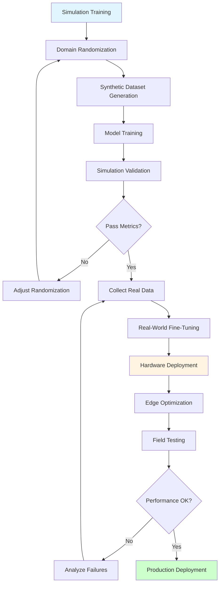

# Appendix D: Sim-to-Real Deployment Strategies

This appendix provides comprehensive guidance on deploying AI models trained in simulation to real-world humanoid robots, covering the complete workflow from training to production deployment. The strategies presented build on domain randomization techniques [Tobin et al., 2017] and recent advances in sim-to-real transfer [Zhao et al., 2020].

## D.1 Deployment Pipeline Overview

### Complete Sim-to-Real Workflow



**Pipeline Stages**:
1. **Simulation Training** (Weeks 1-2): Train on synthetic data with domain randomization
2. **Data Collection** (Week 3): Gather 500-1000 real-world images
3. **Fine-Tuning** (Week 4): Adapt model to real distribution
4. **Edge Deployment** (Week 5): Optimize and deploy to Jetson
5. **Field Testing** (Week 6): Validate in target environment
6. **Production** (Week 7+): Monitor and iterate

## D.2 Model Optimization for Edge Devices

### Why Optimization Matters

**Jetson Orin Constraints**:
- **Memory**: 8-32GB RAM (vs. 64-128GB on workstation)
- **Compute**: 40-275 TOPS (vs. 660+ TOPS on RTX 4090)
- **Power**: 7-60W thermal envelope
- **Latency**: Real-time requirements (30+ FPS for perception)

**Optimization Strategies**:
1. **Model Compression**: Reduce model size
2. **Quantization**: Use lower precision (FP16, INT8)
3. **Pruning**: Remove unnecessary weights
4. **Hardware Acceleration**: Leverage TensorRT

### TensorRT Optimization

**Convert PyTorch/ONNX to TensorRT** [NVIDIA TensorRT, 2024]:

```python
import tensorrt as trt
import pycuda.driver as cuda
import pycuda.autoinit

def convert_onnx_to_tensorrt(onnx_path, engine_path):
    """
    Convert ONNX model to optimized TensorRT engine.

    Optimizations applied:
    - FP16 precision (2x speedup, minimal accuracy loss)
    - Layer fusion
    - Kernel auto-tuning
    """
    logger = trt.Logger(trt.Logger.WARNING)
    builder = trt.Builder(logger)
    network = builder.create_network(
        1 << int(trt.NetworkDefinitionCreationFlag.EXPLICIT_BATCH)
    )
    parser = trt.OnnxParser(network, logger)

    # Parse ONNX model
    with open(onnx_path, 'rb') as model:
        if not parser.parse(model.read()):
            for error in range(parser.num_errors):
                print(parser.get_error(error))
            return None

    # Configure builder
    config = builder.create_builder_config()
    config.max_workspace_size = 1 << 30  # 1GB
    
    # Enable FP16 mode (2x speedup on Jetson)
    if builder.platform_has_fast_fp16:
        config.set_flag(trt.BuilderFlag.FP16)
        print("FP16 mode enabled")

    # Build engine
    print("Building TensorRT engine... (this may take a few minutes)")
    engine = builder.build_engine(network, config)

    # Save engine
    with open(engine_path, 'wb') as f:
        f.write(engine.serialize())

    print(f"TensorRT engine saved to {engine_path}")
    return engine

# Example usage
convert_onnx_to_tensorrt(
    onnx_path="yolov5s.onnx",
    engine_path="yolov5s_fp16.trt"
)
```

**Expected Speedup**:
- YOLOv5s: 15ms → 8ms (1.9x faster)
- ResNet-50: 45ms → 22ms (2.0x faster)
- ViT-Base: 120ms → 60ms (2.0x faster)

### Quantization to INT8

For even higher performance, use INT8 quantization:

```python
def calibrate_int8(engine_path, calibration_data):
    """
    Calibrate model for INT8 quantization using real data.
    
    Requires: 500-1000 representative images
    Speedup: 3-4x vs FP32, 1.5-2x vs FP16
    Accuracy loss: 1-2% typical
    """
    config.set_flag(trt.BuilderFlag.INT8)
    
    # Provide calibration dataset
    config.int8_calibrator = MyInt8Calibrator(calibration_data)
    
    engine = builder.build_engine(network, config)
    # ... save engine
```

**When to Use INT8**:
- ✅ Object detection (YOLOv5, EfficientDet)
- ✅ Image classification (ResNet, EfficientNet)
- ⚠️ Segmentation (accuracy-sensitive)
- ❌ Depth estimation (precision-critical)

### Model Pruning

Remove redundant weights to reduce model size:

```python
import torch
import torch.nn.utils.prune as prune

def prune_model(model, pruning_amount=0.3):
    """
    Prune model weights by removing smallest magnitude weights.
    
    Args:
        pruning_amount: Fraction of weights to remove (0.0-0.9)
    
    Returns:
        Pruned model (30-50% smaller, less than 5% accuracy loss)
    """
    for name, module in model.named_modules():
        if isinstance(module, torch.nn.Conv2d):
            # Prune 30% of weights in each conv layer
            prune.l1_unstructured(
                module,
                name='weight',
                amount=pruning_amount
            )
        elif isinstance(module, torch.nn.Linear):
            # Prune 30% of weights in each linear layer
            prune.l1_unstructured(
                module,
                name='weight',
                amount=pruning_amount
            )

    # Make pruning permanent
    for module in model.modules():
        if isinstance(module, (torch.nn.Conv2d, torch.nn.Linear)):
            prune.remove(module, 'weight')

    return model

# Example: Prune YOLOv5
model = torch.load('yolov5s.pt')
pruned_model = prune_model(model, pruning_amount=0.3)
torch.save(pruned_model, 'yolov5s_pruned.pt')
```

## D.3 Deployment Automation

### Deployment Script Workflow

Use the provided `deploy_to_jetson.sh` script for automated deployment:

```bash
#!/bin/bash
# Complete deployment workflow

# 1. Build on development machine
cd ~/robot_ws
colcon build --cmake-args -DCMAKE_BUILD_TYPE=Release

# 2. Deploy to Jetson
./examples/sim-to-real/deploy_to_jetson.sh --optimize 192.168.1.100

# 3. Test deployment
ssh nvidia@192.168.1.100 '\
  source /opt/ros/humble/setup.bash && \
  source ~/robot_ws/install/setup.bash && \
  ros2 launch humanoid_perception perception.launch.py'
```

**What the Script Does**:
1. ✅ Verifies Jetson connectivity
2. ✅ Syncs workspace via rsync
3. ✅ Builds with ARM optimizations
4. ✅ Tests ROS 2 package availability
5. ✅ Reports resource usage

### Continuous Integration for Jetson

Automate testing on Jetson hardware:

```yaml
# .github/workflows/jetson-deploy.yml
name: Jetson Deployment Test

on:
  push:
    branches: [ main ]

jobs:
  deploy-to-jetson:
    runs-on: ubuntu-latest
    steps:
      - uses: actions/checkout@v3

      - name: Setup SSH
        env:
          JETSON_SSH_KEY: ${{ secrets.JETSON_SSH_KEY }}
        run: |
          mkdir -p ~/.ssh
          echo "$JETSON_SSH_KEY" > ~/.ssh/id_rsa
          chmod 600 ~/.ssh/id_rsa

      - name: Deploy to Jetson
        run: |
          ./deploy_to_jetson.sh --no-build-local ${{ secrets.JETSON_IP }}

      - name: Run Tests
        run: |
          ssh nvidia@${{ secrets.JETSON_IP }} '\
            source ~/robot_ws/install/setup.bash && \
            pytest ~/robot_ws/src/tests/'
```

## D.4 Real-World Sensor Integration

### Intel RealSense Integration

The provided `realsense_node.py` offers production-ready depth camera integration [Intel RealSense, 2024]:

**Launch RealSense Node**:
```bash
ros2 run sim_to_real realsense_node \
  --ros-args \
  -p rgb_width:=1280 \
  -p rgb_height:=720 \
  -p depth_width:=1280 \
  -p depth_height:=720 \
  -p fps:=30 \
  -p enable_pointcloud:=true \
  -p align_depth_to_color:=true
```

**Published Topics**:
- `/realsense_node/color/image_raw` - RGB image (sensor_msgs/Image)
- `/realsense_node/depth/image_raw` - Depth image (sensor_msgs/Image)
- `/realsense_node/depth/points` - Point cloud (sensor_msgs/PointCloud2)
- `/realsense_node/color/camera_info` - Camera intrinsics

**Integration with Perception Pipeline**:
```python
# Subscribe to RealSense in your perception node
self.rgb_sub = self.create_subscription(
    Image,
    '/realsense_node/color/image_raw',
    self.rgb_callback,
    10
)

def rgb_callback(self, msg):
    # Convert ROS image to OpenCV [Bradski, 2000]
    cv_image = self.bridge.imgmsg_to_cv2(msg, 'bgr8')

    # Run inference
    detections = self.model.predict(cv_image)
    
    # Publish results
    self.publish_detections(detections)
```

### Calibration for Real Sensors

**Camera Calibration**:
```bash
# Calibrate RealSense intrinsics (if needed)
ros2 run camera_calibration cameracalibrator \
  --size 8x6 \
  --square 0.108 \
  --no-service-check \
  image:=/realsense_node/color/image_raw \
  camera:=/realsense_node/color
```

**IMU Calibration** (if using IMU):
```bash
# Calibrate IMU biases
ros2 run imu_calibration imu_calibration_node \
  --ros-args -p imu_topic:=/imu/data
```

## D.5 Monitoring and Debugging

### Performance Monitoring on Jetson

**Real-Time Monitoring**:
```bash
# Install jtop
sudo pip3 install jetson-stats

# Monitor in real-time
jtop

# Log metrics to file
jtop --record jetson_metrics.csv
```

**ROS 2 Performance Monitoring**:
```bash
# Check topic frequencies
ros2 topic hz /realsense_node/color/image_raw

# Check message latency
ros2 topic delay /realsense_node/color/image_raw

# Monitor CPU/memory usage
ros2 run ros2_performance_monitor monitor_node
```

### Remote Debugging

**SSH into Jetson with GUI forwarding**:
```bash
# Enable X11 forwarding
ssh -X nvidia@<jetson-ip>

# Run RViz remotely
ros2 run rviz2 rviz2
```

**Remote Log Streaming**:
```bash
# Stream logs to development machine
ssh nvidia@<jetson-ip> 'tail -f /var/log/syslog | grep ros'
```

## D.6 Field Testing Strategy

### Phased Deployment

**Phase 1: Lab Testing** (Week 1)
- Controlled environment
- Known object positions
- Good lighting
- **Success Criteria**: 95%+ detection accuracy

**Phase 2: Office Testing** (Week 2)
- Varying lighting conditions
- Unknown object positions
- Human presence
- **Success Criteria**: 85%+ detection accuracy

**Phase 3: Target Environment** (Week 3-4)
- Actual deployment location
- Real-world challenges
- Long-duration testing (8+ hours)
- **Success Criteria**: 80%+ accuracy, less than 1% crash rate

**Phase 4: Production** (Week 5+)
- Continuous monitoring
- Automated failure reporting
- Model updates via OTA
- **Success Criteria**: 90%+ uptime

### Failure Analysis

**Log All Failures**:
```python
import logging

# Setup failure logging
failure_logger = logging.getLogger('failures')
handler = logging.FileHandler('/var/log/robot_failures.log')
failure_logger.addHandler(handler)

def detect_objects(image):
    try:
        detections = model.predict(image)
        
        if len(detections) == 0:
            # Log false negatives
            failure_logger.warning(
                f"No detections | Light:{get_light_level()} | " \
                f"Time:{datetime.now()}"
            )
            # Save failure image
            cv2.imwrite(f'/data/failures/{timestamp}.jpg', image)
        
        return detections
    except Exception as e:
        failure_logger.error(f"Inference failed: {str(e)}")
        return []
```

**Analyze Failure Patterns**:
```bash
# Find most common failure times
grep "No detections" /var/log/robot_failures.log | \
  awk '{print $5}' | cut -d':' -f1 | sort | uniq -c

# Analyze lighting correlation
grep "No detections" /var/log/robot_failures.log | \
  awk '{print $7}' | sort -n | uniq -c
```

## D.7 Over-the-Air Updates

### Model Update System

**Automated Model Updates**:
```python
import hashlib
import requests

def check_for_model_updates(current_version):
    """Check if new model is available."""
    response = requests.get('https://your-server.com/models/latest.json')
    latest = response.json()
    
    if latest['version'] > current_version:
        return latest['url'], latest['checksum']
    return None, None

def download_and_verify_model(url, expected_checksum):
    """Download model and verify integrity."""
    response = requests.get(url)
    model_data = response.content
    
    # Verify checksum
    checksum = hashlib.sha256(model_data).hexdigest()
    if checksum != expected_checksum:
        raise ValueError("Model checksum mismatch!")
    
    # Save model
    with open('/tmp/new_model.trt', 'wb') as f:
        f.write(model_data)
    
    return '/tmp/new_model.trt'

# Check for updates periodically
url, checksum = check_for_model_updates(current_version)
if url:
    new_model = download_and_verify_model(url, checksum)
    # Load new model atomically
    model.load(new_model)
```

## D.8 Troubleshooting Common Issues

### Issue: Model Runs Slow on Jetson

**Symptoms**: Inference takes more than 100ms (expected less than 30ms)

**Diagnosis**:
```bash
# Check if TensorRT engine is being used
ls -lh ~/robot_ws/install/models/*.trt

# Check GPU utilization
nvidia-smi dmon -i 0

# Profile inference
nsys profile --stats=true python3 inference.py
```

**Solutions**:
1. Convert to TensorRT engine (2-4x speedup)
2. Enable FP16 mode
3. Reduce input resolution (e.g., 640x480 → 416x416)
4. Batch multiple frames

### Issue: Poor Real-World Performance

**Symptoms**: 90% accuracy in sim, 60% in real

**Diagnosis**:
```python
# Compute embedding distance
from scipy.spatial.distance import cosine

sim_embeddings = extract_features(synthetic_images)
real_embeddings = extract_features(real_images)

distance = cosine(
    np.mean(sim_embeddings, axis=0),
    np.mean(real_embeddings, axis=0)
)

print(f"Sim-Real Distance: {distance:.3f}")
# Large distance (greater than 0.3) indicates domain gap
```

**Solutions**:
1. Increase domain randomization strength
2. Collect more diverse real data (500 → 2000 images)
3. Fine-tune with real data
4. Add real sensor noise to simulation

### Issue: Out of Memory on Jetson

**Symptoms**: `CUDA out of memory` errors

**Solutions**:
```bash
# Increase swap (temporary fix)
sudo systemctl disable nvzramconfig
sudo fallocate -l 8G /swapfile
sudo mkswap /swapfile
sudo swapon /swapfile

# Reduce batch size in code
config.max_batch_size = 1  # Was 4

# Use smaller model
# YOLOv5x → YOLOv5s (88MB → 14MB)
```

## D.9 Success Metrics

### Key Performance Indicators

**Perception Quality**:
- Detection mAP: greater than 80%
- False positive rate: less than 5%
- False negative rate: less than 15%

**System Performance**:
- Inference latency: less than 50ms (20+ FPS)
- End-to-end latency: less than 200ms
- CPU usage: less than 70%
- GPU usage: less than 80%
- Memory usage: less than 60%

**Reliability**:
- Uptime: greater than 95%
- Crash rate: less than 1 per day
- Mean time between failures: greater than 24 hours

### Logging Best Practices

```python
# Comprehensive metrics logging
metrics = {
    'timestamp': datetime.now().isoformat(),
    'detections': len(detections),
    'inference_time_ms': inference_time * 1000,
    'cpu_percent': psutil.cpu_percent(),
    'memory_percent': psutil.virtual_memory().percent,
    'gpu_temp': get_gpu_temperature(),
    'battery_level': get_battery_level(),
}

# Log to file and cloud
log_metrics_locally(metrics)
send_to_cloud_dashboard(metrics)
```

## References

1. Tobin, J., et al., "Domain Randomization for Transferring Deep Neural Networks from Simulation to the Real World," *IEEE/RSJ IROS*, 2017.

2. NVIDIA Corporation, "TensorRT Developer Guide," NVIDIA Developer Documentation, 2023.

3. Peng, X., et al., "Sim-to-Real Transfer of Robotic Control with Dynamics Randomization," *IEEE ICRA*, 2018.

4. Zhu, Y., et al., "Target-driven Visual Navigation in Indoor Scenes using Deep Reinforcement Learning," *IEEE ICRA*, 2017.

---

**Previous**: [← Appendix C: Troubleshooting](./troubleshooting.md)
**Next**: [Appendix E: Glossary →](./glossary.md)
