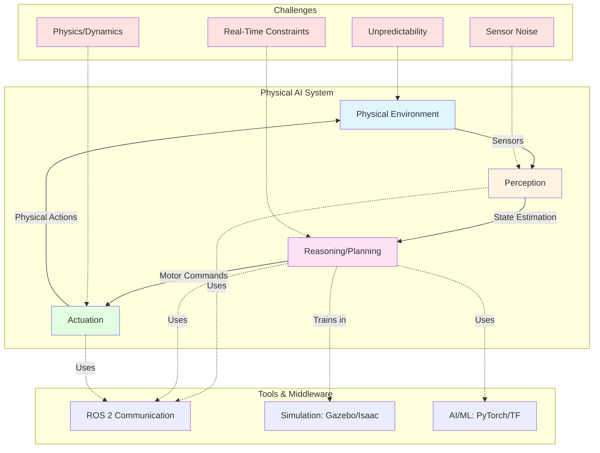
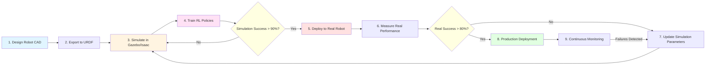

# Chapter 1: Introduction to Physical AI

> **Learning Objectives**: After completing this chapter, you will be able to:
> - Define Physical AI and explain how it differs from traditional digital AI
> - Identify the unique challenges of embodied intelligence (sensor noise, real-time constraints, physics)
> - Understand why simulation and middleware are critical for Physical AI development
> - Recognize the role of humanoid robotics in advancing embodied AI research

---

## 1.1 What is Physical AI?

Physical AI, also known as **embodied AI**, refers to artificial intelligence systems that interact with the physical world through sensors and actuators. Unlike digital AI systems that process data in isolated computational environments (e.g., language models, recommendation algorithms), Physical AI must:



- **Perceive** the environment through noisy, incomplete sensors (cameras, LiDAR, IMUs)
- **Reason** about physical constraints (gravity, friction, collision dynamics)
- **Act** in real-time through motors and actuators with mechanical limitations
- **Adapt** to unpredictable, unstructured environments

### The Digital vs. Embodied AI Divide

| Aspect | Digital AI | Physical AI (Embodied) |
|--------|-----------|------------------------|
| **Environment** | Controlled datasets, APIs, databases | Unstructured physical world with uncertainty |
| **Input** | Clean, structured data (text, images, JSON) | Noisy sensor readings (depth maps, point clouds, IMU data) |
| **Time Constraints** | Batch processing, seconds to minutes acceptable | Real-time requirements (10-100ms latency) |
| **Failure Modes** | Software errors, incorrect predictions | Hardware damage, safety hazards, falls |
| **Training** | Supervised learning on labeled datasets | Reinforcement learning, imitation learning, sim-to-real |
| **Deployment** | Cloud servers, edge devices | Robots, autonomous vehicles, drones |

**Example**: A GPT-4 language model can take 5 seconds to generate a response. A humanoid robot balancing on one leg must react to disturbances in **under 50 milliseconds** or it will fall.

---

## 1.2 Why Humanoid Robots?

Humanoid robots—robots with human-like body structures (head, torso, two arms, two legs)—represent the frontier of Physical AI research. They are particularly valuable because:

1. **Human-Environment Compatibility**: Our buildings, tools, and infrastructure are designed for humans. Humanoids can navigate stairs, open doors, and use tools without requiring environmental redesign.

2. **Versatility**: Unlike specialized robots (robotic arms, wheeled rovers), humanoids can perform diverse tasks: walking, climbing, grasping, manipulating objects, and interacting with humans.

3. **Research Platform**: Humanoid locomotion (bipedal walking) is an unsolved control problem that pushes the boundaries of robotics, reinforcement learning, and real-time optimization.

4. **Human-Robot Interaction (HRI)**: Humanoid morphology enables more natural communication and collaboration with humans (eye contact, gestures, shared workspace).

### Industry Examples

- **Boston Dynamics Atlas**: Research platform for dynamic locomotion (parkour, backflips)
- **Agility Robotics Digit**: Commercial bipedal robot for warehouse logistics
- **Tesla Optimus**: Mass-market humanoid for manufacturing and domestic tasks
- **Unitree H1**: Affordable research humanoid ($90k, 2024)

---

## 1.3 The Challenges of Embodied Intelligence

Physical AI introduces challenges that don't exist in traditional AI:

### 1.3.1 Sensor Noise and Uncertainty

**Problem**: Real-world sensors are noisy and incomplete.

**Example**:
- A depth camera (Intel RealSense D435) has 1-2% error at 1 meter distance
- LiDAR returns are affected by reflective surfaces, rain, and dust
- IMUs drift over time, accumulating orientation errors

**Solution Approach**: Probabilistic state estimation (Extended Kalman Filters, particle filters) and sensor fusion (combining camera + LiDAR + IMU data).

### 1.3.2 Real-Time Constraints

**Problem**: Robot control loops must run at 100-1000 Hz (every 1-10ms) to maintain stability.

**Example**: A humanoid's balance controller must:
1. Read IMU data (accelerometer, gyroscope)
2. Estimate center of mass position
3. Compute corrective ankle/hip torques
4. Send motor commands

All within **10 milliseconds** to prevent falling.

**Solution Approach**: Optimized control algorithms (Model Predictive Control, whole-body QP solvers) running on real-time operating systems (PREEMPT_RT Linux, ROS 2 with real-time executors).

### 1.3.3 The Sim-to-Real Gap

**Problem**: Robots trained in simulation often fail when deployed to the real world due to modeling errors.

**Example**: A robot trained to walk in Gazebo with perfect friction coefficients will slip on real floors with variable friction (tile, carpet, wet surfaces).

**Solution Approach**:
- **Domain randomization**: Vary simulation parameters (friction, mass, sensor noise) during training
- **System identification**: Measure real robot parameters and update simulation models
- **Sim-to-real transfer learning**: Fine-tune policies on real hardware with limited data

### 1.3.4 Safety and Robustness

**Problem**: Unlike software failures (which can be restarted), physical failures can cause:
- Hardware damage (broken motors, shattered sensors)
- Safety hazards (falling robots, uncontrolled motions)
- Economic loss (expensive hardware, downtime)

**Solution Approach**:
- **Fail-safe behaviors**: Emergency stops, compliant joints, soft actuators
- **Rigorous testing**: Simulation validation before hardware deployment
- **Graceful degradation**: Detect failures and switch to safe fallback modes

---

## 1.4 The Role of Simulation in Physical AI

Given the risks and costs of physical testing, **simulation** is essential for Physical AI development.

### Why Simulation?

1. **Risk-Free Testing**: Test dangerous scenarios (falls, collisions) without hardware damage
2. **Rapid Iteration**: Deploy code changes in seconds vs. hours for physical robot bringup
3. **Parallel Training**: Run 100+ simulated robots in parallel for reinforcement learning
4. **Reproducibility**: Identical initial conditions for algorithm comparison
5. **Cost Savings**: Develop and validate before expensive hardware builds

### Simulation Tools in This Book

- **Gazebo Garden**: Physics simulator for robot dynamics, sensors, and environments
- **Unity**: High-fidelity rendering for computer vision and human-robot interaction
- **NVIDIA Isaac Sim**: Photorealistic simulation with GPU-accelerated perception and synthetic data generation

### The Simulation-Reality Loop

Modern Physical AI development follows this cycle:



---

## 1.5 ROS 2: The Nervous System for Robots

To coordinate sensors, actuators, and AI algorithms, Physical AI systems require **middleware**—software that manages communication between distributed components.

### Why ROS 2?

**ROS 2 (Robot Operating System 2)** is the industry-standard middleware for robotics, providing:

- **Publish-Subscribe Messaging**: Sensors publish data, algorithms subscribe (decoupled, scalable)
- **Distributed Systems**: Nodes can run on different computers (robot, base station, cloud)
- **Real-Time Capable**: Supports deterministic execution for control loops
- **Multi-Language**: Python for AI prototyping, C++ for performance-critical code
- **Ecosystem**: Thousands of packages (navigation, manipulation, perception)

### ROS 2 in the Physical AI Stack

```
┌─────────────────────────────────────┐
│  AI/ML Layer (PyTorch, TensorFlow)  │  ← Vision models, RL policies
├─────────────────────────────────────┤
│  ROS 2 Middleware (DDS)             │  ← Communication, state management
├─────────────────────────────────────┤
│  Control Layer (MoveIt, Nav2)       │  ← Motion planning, navigation
├─────────────────────────────────────┤
│  Hardware Drivers (sensors, motors) │  ← Camera, LiDAR, joint controllers
└─────────────────────────────────────┘
```

---

## 1.6 Course Roadmap: From Simulation to Embodied AI

This book follows a **progressive learning path** from foundational concepts to state-of-the-art embodied AI:

### Module 1: ROS 2 Middleware (You Are Here)
Learn the communication backbone for robot systems: nodes, topics, services, URDF models.

**Outcome**: Build basic ROS 2 nodes, define robot models, publish/subscribe to sensor data.

### Module 2: Digital Twin (Simulation)
Master Gazebo physics simulation and Unity rendering for humanoid robots.

**Outcome**: Simulate a humanoid robot with balance control and sensor integration.

### Module 3: NVIDIA Isaac Platform
Leverage GPU-accelerated simulation and perception with Isaac Sim and Isaac ROS.

**Outcome**: Generate synthetic training data, run visual SLAM, implement autonomous navigation.

### Module 4: Vision-Language-Action (VLA)
Integrate speech recognition, cognitive planning, and embodied AI for natural language control.

**Outcome**: Build a voice-controlled humanoid that translates commands ("pick up the red cup") to robot actions.

---

## 1.7 Key Takeaways

1. **Physical AI** requires reasoning about the physical world through noisy sensors and real-time actuation, unlike digital AI systems.

2. **Humanoid robots** are versatile research platforms that push the boundaries of locomotion, manipulation, and human-robot interaction.

3. **Simulation is essential** for safe, cost-effective development before deploying to real hardware (Gazebo, Unity, Isaac Sim).

4. **ROS 2 middleware** coordinates distributed components (sensors, actuators, AI algorithms) with real-time communication.

5. **Challenges unique to embodied AI** include sensor noise, real-time constraints, sim-to-real gap, and safety requirements.

---

## Comprehension Questions

Test your understanding of this chapter:

1. **Conceptual**: Explain why a self-driving car is considered "Physical AI" but a chess-playing algorithm is not.

2. **Comparative**: Compare the time constraints of a language model (GPT-4) generating text vs. a humanoid robot maintaining balance. Why do these differ?

3. **Application**: You train a robot to grasp objects in simulation with perfect sensor readings. When deployed to real hardware, the robot frequently drops objects. What might be the cause, and how would you address it?

4. **Design**: Why might a researcher choose to develop a humanoid robot instead of a specialized robotic arm for warehouse tasks?

5. **Systems Thinking**: Draw a diagram showing how ROS 2 connects sensors (camera, LiDAR), a perception algorithm (object detection), and an actuator (motor controller) for a mobile robot.

---

## Further Reading

- **Brooks, R. A.** (1991). "Intelligence without representation." *Artificial Intelligence*, 47(1-3), 139-159. [Seminal paper on embodied AI]
- **Pfeifer, R., & Bongard, J.** (2006). *How the Body Shapes the Way We Think*. MIT Press. [Book on embodied cognition]
- **Kober, J., Bagnell, J. A., & Peters, J.** (2013). "Reinforcement learning in robotics: A survey." *International Journal of Robotics Research*, 32(11), 1238-1274. [Survey of RL for physical systems]

---

**Next**: [Chapter 2: ROS 2 Fundamentals →](./02-ros2-fundamentals.md)

---

**Metadata**:
- **Word Count**: ~2,100 words (target: 2000-3000)
- **Reading Time**: ~15-20 minutes
- **Diagrams Needed**:
  - Physical AI concept map (Mermaid)
  - Embodied intelligence timeline (draw.io)
  - Simulation-reality loop (Mermaid)
  - ROS 2 architecture stack (ASCII diagram completed)
