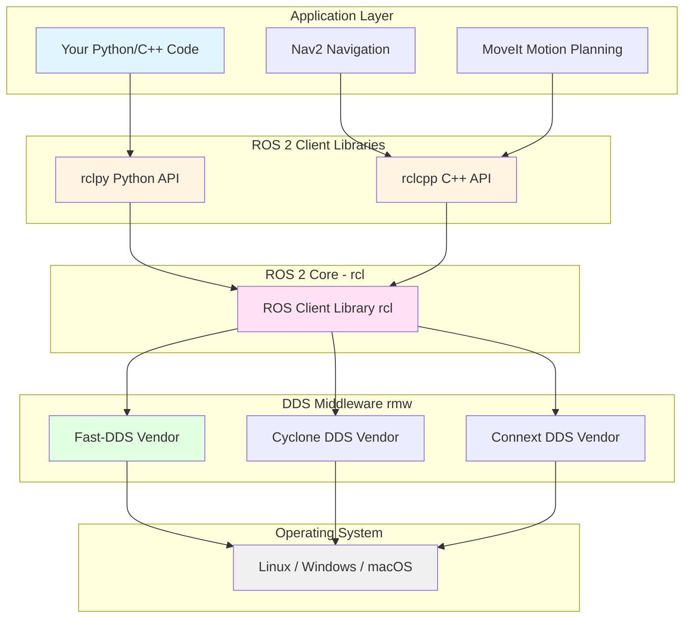
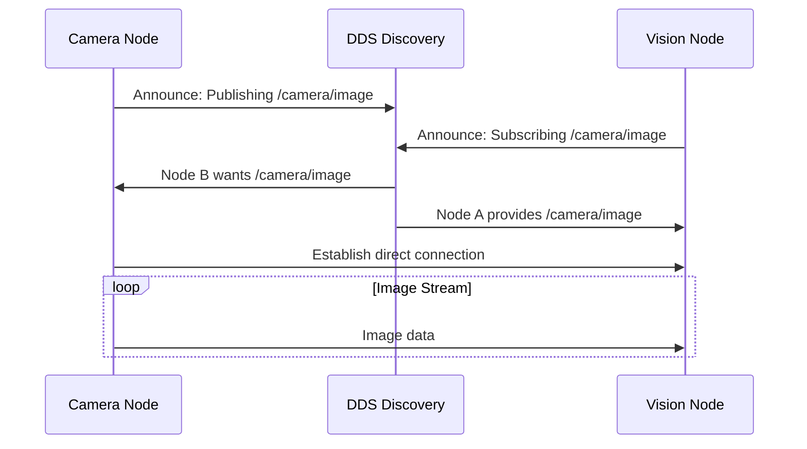

# Chapter 2: ROS 2 Fundamentals

> **Learning Objectives**: After completing this chapter, you will be able to:
> - Explain the ROS 2 architecture and how it differs from ROS 1
> - Understand the role of DDS (Data Distribution Service) middleware
> - Identify the key components: nodes, topics, services, actions, and parameters
> - Set up a ROS 2 workspace and configure your development environment
> - Navigate ROS 2 command-line tools for debugging and introspection

---

## 2.1 What is ROS 2?

**ROS 2 (Robot Operating System 2)** is not an operating system in the traditional sense. It's a **middleware framework**—a collection of libraries, tools, and conventions that facilitate building complex robot systems by handling:

- **Communication**: How different software components exchange data
- **Abstraction**: Standard interfaces for sensors, actuators, and algorithms
- **Tools**: Debugging, visualization, and simulation integration
- **Ecosystem**: Thousands of pre-built packages for common robotics tasks

### Why Not Just Use Python or C++ Directly?

Without ROS 2, building a robot system requires:

1. **Custom communication protocols** between sensors and algorithms
2. **Manual threading** for concurrent sensor reading and control
3. **Reinventing** standard interfaces for cameras, LiDAR, motors
4. **No introspection tools** to debug message flow or visualize data

**Example**: Reading data from a LiDAR sensor without ROS 2 requires:
- Writing low-level USB/Ethernet drivers
- Parsing binary data packets
- Managing buffering and timing
- Creating custom message formats

With ROS 2:
```bash
ros2 topic echo /scan
```
Instantly displays LiDAR data in a standard format, regardless of sensor brand.

---

## 2.2 ROS 1 vs. ROS 2: Why the Redesign?

ROS 1 (released 2007) served robotics research for over a decade but had fundamental limitations:

| Limitation | ROS 1 | ROS 2 |
|------------|-------|-------|
| **Architecture** | Master-based (single point of failure) | Fully distributed (no master node) |
| **Real-Time** | Not real-time capable | Real-time executors available |
| **Security** | No encryption, no authentication | DDS security (TLS, authentication) |
| **Multi-Robot** | Complex workarounds (namespaces, multiple masters) | Native multi-robot support |
| **Platform Support** | Linux-centric | Linux, Windows, macOS, RTOS |
| **Communication** | Custom TCPROS protocol | Industry-standard DDS |
| **QoS** | Best-effort only | Configurable reliability, durability, history |

**Key Insight**: ROS 2 was rebuilt from scratch to address **production deployment needs** (autonomous vehicles, industrial robots) while maintaining ROS 1's ease of use for research.

---

## 2.3 The ROS 2 Architecture

ROS 2 is structured in layers, separating concerns between middleware, client libraries, and application code.



### Layer Breakdown

1. **Application Layer**: Your robot code (perception, planning, control)
2. **Client Libraries** (`rclpy`, `rclcpp`): Language-specific APIs for nodes, topics, services
3. **ROS Client Library** (`rcl`): Language-agnostic core functionality
4. **RMW (ROS MiddleWare)**: Abstraction over DDS implementations
5. **DDS Vendors**: Actual communication layer (Fast-DDS, Cyclone DDS, etc.)

**Why this layering?**
- **Portability**: Switch DDS vendors without changing application code
- **Language Support**: Add new languages (Rust, Julia) by writing client libraries
- **Vendor Competition**: Multiple DDS implementations improve performance and features

---

## 2.4 DDS: The Communication Backbone

**Data Distribution Service (DDS)** is an **Object Management Group (OMG) standard** for real-time, distributed publish-subscribe systems. ROS 2 uses DDS for all inter-node communication.

### Key DDS Concepts

#### 2.4.1 Discovery

**Problem**: In a distributed system, how do nodes find each other without a central server?

**DDS Solution**: **Automatic discovery** via multicast announcements.

1. Node A starts and announces: "I publish `/camera/image` messages"
2. Node B hears announcement: "I subscribe to `/camera/image`"
3. DDS establishes direct peer-to-peer connection

**No master node required** → Nodes can join/leave dynamically without system restart.



#### 2.4.2 Quality of Service (QoS)

**Problem**: Different data has different delivery requirements.

**Examples**:
- **Sensor data** (LiDAR scans): High frequency, latest value matters, old data can be dropped
- **Map data**: Low frequency, must be reliably delivered, subscribers need history

**DDS QoS Policies**:

| Policy | Options | Use Case |
|--------|---------|----------|
| **Reliability** | Best-effort, Reliable | Sensor streams vs. commands |
| **Durability** | Volatile, Transient Local | Live data vs. persistent state |
| **History** | Keep Last N, Keep All | Latest value vs. full stream |
| **Deadline** | Time period | Detect missed sensor updates |
| **Lifespan** | Time period | Expire old map data |

**Example**:
```python
from rclpy.qos import QoSProfile, ReliabilityPolicy, HistoryPolicy

# For sensor data: best-effort, keep only latest
sensor_qos = QoSProfile(
    reliability=ReliabilityPolicy.BEST_EFFORT,
    history=HistoryPolicy.KEEP_LAST,
    depth=1
)

# For commands: reliable delivery, keep last 10
command_qos = QoSProfile(
    reliability=ReliabilityPolicy.RELIABLE,
    history=HistoryPolicy.KEEP_LAST,
    depth=10
)
```

---

## 2.5 ROS 2 Core Concepts

### 2.5.1 Nodes

A **node** is a single executable process that performs computation.

**Design Philosophy**: **Small, single-purpose nodes** that can be composed.

**Good Example**:
- `camera_driver` node: Reads from camera, publishes images
- `object_detector` node: Subscribes to images, publishes bounding boxes
- `robot_controller` node: Subscribes to detections, publishes motor commands

**Bad Example**:
- `monolithic_robot` node: Does everything (camera, detection, control) → Hard to test, debug, reuse

**Creating a Node** (Python):
```python
import rclpy
from rclpy.node import Node

class MinimalNode(Node):
    def __init__(self):
        super().__init__('minimal_node')  # Node name
        self.get_logger().info('Node started!')

def main():
    rclpy.init()
    node = MinimalNode()
    rclpy.spin(node)  # Keep node running
    node.destroy_node()
    rclpy.shutdown()
```

### 2.5.2 Topics (Publish-Subscribe)

**Topics** are named buses for **asynchronous, many-to-many** message passing.

**Characteristics**:
- **Decoupled**: Publishers don't know who subscribes
- **Scalable**: Multiple publishers and subscribers on same topic
- **Typed**: Each topic has a message type (e.g., `sensor_msgs/Image`)

**Use Cases**:
- Sensor data streams (camera, LiDAR, IMU)
- State broadcasts (robot pose, battery level)
- High-frequency control loops (joint commands)

```mermaid
graph LR
    P1[Camera Node] -->|sensor_msgs/Image| T[/camera/image Topic]
    P2[Depth Camera] -->|sensor_msgs/Image| T
    T -->|Subscribe| S1[Object Detector]
    T -->|Subscribe| S2[Visual SLAM]
    T -->|Subscribe| S3[Image Recorder]

    style T fill:#ffe1f5
    style P1 fill:#e1f5ff
    style P2 fill:#e1f5ff
    style S1 fill:#fff4e1
    style S2 fill:#fff4e1
    style S3 fill:#fff4e1
```

### 2.5.3 Services (Request-Reply)

**Services** provide **synchronous, one-to-one** remote procedure calls.

**Characteristics**:
- **Blocking**: Client waits for server response
- **Paired**: One client request → one server response
- **Typed**: Request and response have defined types

**Use Cases**:
- Trigger actions (start/stop recording, reset odometry)
- Query state (get current map, check battery level)
- Short operations (< 1 second)

**Example**:
```python
# Service client: Request current robot pose
from geometry_msgs.srv import GetPose

client = node.create_client(GetPose, '/get_robot_pose')
request = GetPose.Request()
future = client.call_async(request)
# ... wait for response ...
pose = future.result().pose
```

### 2.5.4 Actions (Long-Running Tasks)

**Actions** are for **goal-oriented, preemptable, feedback-enabled** tasks.

**Characteristics**:
- **Asynchronous**: Client sends goal, continues other work
- **Feedback**: Server sends progress updates
- **Preemptable**: Client can cancel goal mid-execution

**Use Cases**:
- Navigation to a goal (takes seconds/minutes, need progress updates)
- Grasping object (may fail, need status feedback)
- Trajectory execution (long motion, may need early termination)

**Action Lifecycle**:
```
Client: Send goal "Navigate to (10, 5)"
Server: Accept goal → Executing
Server: Feedback "50% complete, 2m remaining"
Server: Feedback "75% complete, 1m remaining"
Server: Result "SUCCESS: Reached goal"
```

### 2.5.5 Parameters

**Parameters** are **runtime configuration values** for nodes.

**Characteristics**:
- **Dynamic**: Can be changed without restarting node
- **Typed**: Integer, double, string, bool, array
- **Discoverable**: Can be listed and queried at runtime

**Use Cases**:
- Tuning control gains (PID parameters)
- Enabling debug modes
- Setting sensor calibration values

**Example**:
```bash
# Set parameter
ros2 param set /camera_node frame_rate 30

# Get parameter
ros2 param get /camera_node frame_rate

# List all parameters for a node
ros2 param list /camera_node
```

---

## 2.6 ROS 2 Workspace Structure

A **workspace** is a directory containing ROS 2 packages that you build together.

### Directory Structure

```
~/ros2_ws/                    # Workspace root
├── src/                      # Source code (your packages)
│   ├── my_robot_pkg/
│   │   ├── my_robot_pkg/     # Python package
│   │   │   ├── __init__.py
│   │   │   └── my_node.py
│   │   ├── package.xml       # Package metadata
│   │   ├── setup.py          # Python setup
│   │   └── setup.cfg
│   └── another_pkg/
├── build/                    # Build artifacts (auto-generated)
├── install/                  # Installed packages (auto-generated)
└── log/                      # Build logs (auto-generated)
```

### Building a Workspace

```bash
cd ~/ros2_ws
colcon build --symlink-install

# Source the workspace (add to ~/.bashrc)
source ~/ros2_ws/install/setup.bash
```

**`--symlink-install`**: Creates symlinks instead of copying Python files → Changes take effect without rebuild.

---

## 2.7 Essential ROS 2 Command-Line Tools

ROS 2 provides powerful CLI tools for introspection and debugging:

### Node Management

```bash
# List running nodes
ros2 node list

# Get info about a node (topics, services, actions, parameters)
ros2 node info /camera_node
```

### Topic Inspection

```bash
# List active topics
ros2 topic list

# Show topic type
ros2 topic info /camera/image

# Display messages in real-time
ros2 topic echo /camera/image

# Publish a message manually (for testing)
ros2 topic pub /cmd_vel geometry_msgs/Twist "{linear: {x: 0.5}}"

# Measure topic frequency
ros2 topic hz /scan
```

### Service Interaction

```bash
# List available services
ros2 service list

# Call a service
ros2 service call /reset_odometry std_srvs/Empty
```

### Parameter Management

```bash
# List parameters for a node
ros2 param list /robot_controller

# Get parameter value
ros2 param get /robot_controller max_speed

# Set parameter value
ros2 param set /robot_controller max_speed 1.5
```

### Package Tools

```bash
# List installed packages
ros2 pkg list

# Find package installation path
ros2 pkg prefix geometry_msgs

# Run an executable from a package
ros2 run my_robot_pkg my_node
```

---

## 2.8 ROS 2 Development Environment Setup

### Prerequisites

- **Ubuntu 22.04 LTS** (recommended) or Windows 10/11, macOS
- **Python 3.10+**
- **ROS 2 Humble Hawksbill** (LTS release, supported until 2027)

### Installation (Ubuntu 22.04)

Full installation instructions in [Appendix B: Software Installation](../appendices/software-installation.md).

**Quick verification**:
```bash
source /opt/ros/humble/setup.bash
ros2 --version
# Output: ros2 cli version: humble
```

### Recommended Tools

1. **Text Editor**: VS Code with ROS extensions
   ```bash
   code --install-extension ms-iot.vscode-ros
   ```

2. **Build Tool**: `colcon` (installed with ROS 2)

3. **Visualization**: RViz2 (included with `ros-humble-desktop`)
   ```bash
   rviz2
   ```

4. **Introspection**: `rqt` GUI tools
   ```bash
   rqt_graph  # Visualize node graph
   rqt_plot   # Plot topic data
   ```

---

## 2.9 Your First ROS 2 Package

Let's create a minimal package to understand the structure.

### Step 1: Create Workspace

```bash
mkdir -p ~/ros2_ws/src
cd ~/ros2_ws/src
```

### Step 2: Create Package

```bash
ros2 pkg create my_first_pkg --build-type ament_python --dependencies rclpy
```

**Generates**:
```
my_first_pkg/
├── my_first_pkg/
│   └── __init__.py
├── package.xml
├── setup.py
├── setup.cfg
└── test/
```

### Step 3: Add a Node

Create `my_first_pkg/my_first_pkg/talker.py`:
```python
import rclpy
from rclpy.node import Node
from std_msgs.msg import String

class TalkerNode(Node):
    def __init__(self):
        super().__init__('talker')
        self.publisher = self.create_publisher(String, 'chatter', 10)
        self.timer = self.create_timer(1.0, self.timer_callback)
        self.counter = 0

    def timer_callback(self):
        msg = String()
        msg.data = f'Hello ROS 2! Count: {self.counter}'
        self.publisher.publish(msg)
        self.get_logger().info(f'Publishing: {msg.data}')
        self.counter += 1

def main():
    rclpy.init()
    node = TalkerNode()
    rclpy.spin(node)
    node.destroy_node()
    rclpy.shutdown()
```

### Step 4: Register Executable

Edit `setup.py`, add to `entry_points`:
```python
entry_points={
    'console_scripts': [
        'talker = my_first_pkg.talker:main',
    ],
},
```

### Step 5: Build and Run

```bash
cd ~/ros2_ws
colcon build --packages-select my_first_pkg
source install/setup.bash

# Run the node
ros2 run my_first_pkg talker
```

**Output**:
```
[INFO] [talker]: Publishing: Hello ROS 2! Count: 0
[INFO] [talker]: Publishing: Hello ROS 2! Count: 1
...
```

**In another terminal**:
```bash
source ~/ros2_ws/install/setup.bash
ros2 topic echo /chatter
```

---

## 2.10 Key Takeaways

1. **ROS 2 is middleware**, not an OS—it handles communication, abstraction, and provides tools for robot development.

2. **DDS provides discovery and QoS**, enabling distributed, real-time communication without a central master.

3. **Nodes are single-purpose processes** that communicate via topics (pub/sub), services (req/rep), and actions (goal-based).

4. **Workspaces organize packages** built with `colcon` and sourced to make commands available.

5. **CLI tools** (`ros2 topic`, `ros2 node`, `ros2 param`) are essential for debugging and introspection.

6. **ROS 2 improves on ROS 1** with real-time support, security, multi-platform compatibility, and distributed architecture.

---

## Comprehension Questions

1. **Conceptual**: Explain why ROS 2 uses DDS instead of a custom protocol like ROS 1's TCPROS.

2. **Comparative**: When would you use a **service** vs. an **action** for robot navigation?

3. **Debugging**: A node is publishing to `/camera/image`, but a subscriber on the same topic receives no data. What are 3 possible causes and how would you diagnose them using ROS 2 CLI tools?

4. **Design**: You're building a robot with 5 sensors (2 cameras, LiDAR, IMU, GPS). Should you create 1 node or 5 nodes? Justify your answer.

5. **QoS**: For a humanoid robot's IMU publishing orientation data at 1000 Hz, what QoS settings (Reliability, History depth) would you choose and why?

---

## Further Reading

- **Macenski, S., et al.** (2022). "Robot Operating System 2: Design, architecture, and uses in the wild." *Science Robotics*, 7(66). [Official ROS 2 overview]
- **Object Management Group.** (2015). "Data Distribution Service (DDS) Version 1.4." [DDS standard specification]
- **Maruyama, Y., et al.** (2016). "Exploring the performance of ROS2." *EMSOFT*. [ROS 2 performance analysis]

---

**Previous**: [← Chapter 1: Introduction to Physical AI](./01-physical-ai-intro.md)
**Next**: [Chapter 3: Nodes, Topics, Services, Actions →](./03-nodes-topics-services.md)

---

**Metadata**:
- **Word Count**: ~2,700 words (target: 2500-3500)
- **Reading Time**: ~20-25 minutes
- **Diagrams**: 3 Mermaid diagrams (architecture, discovery, topic graph)
- **Code Examples**: 6 snippets (QoS, minimal node, talker, CLI commands)
