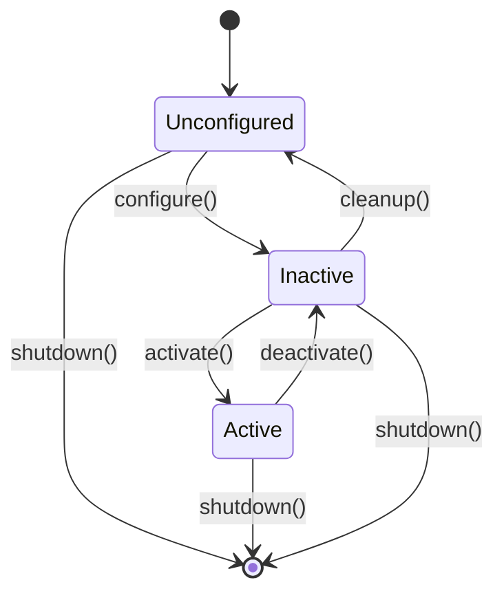
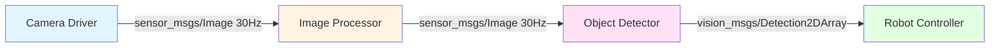
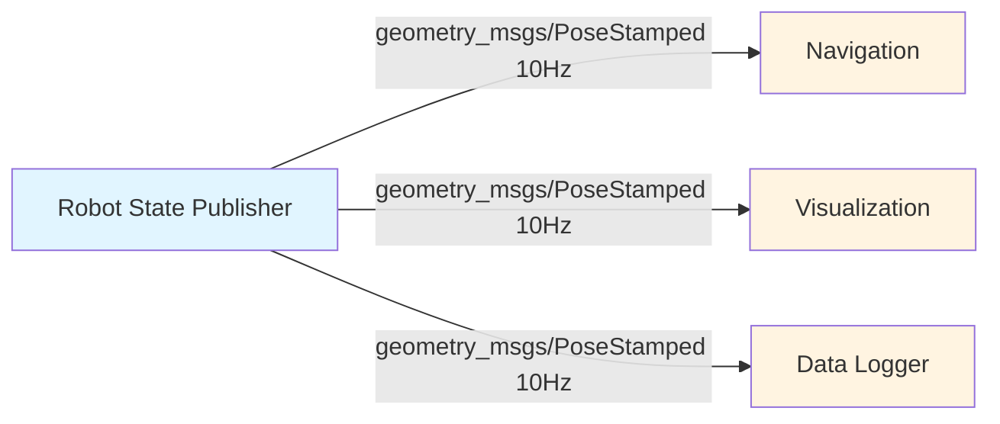
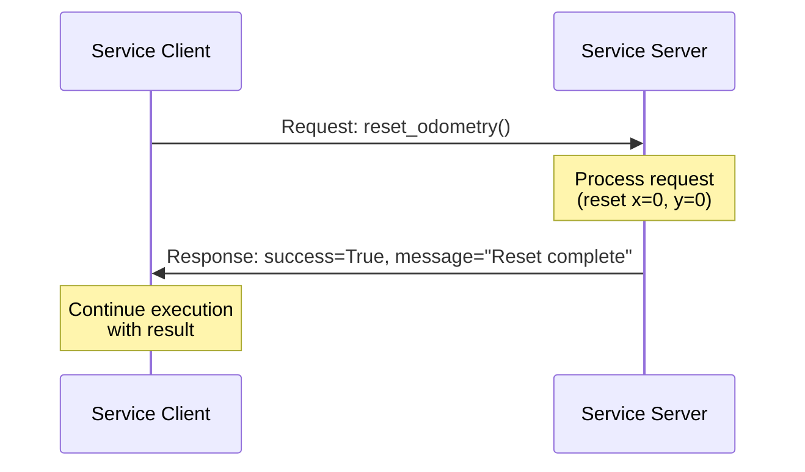
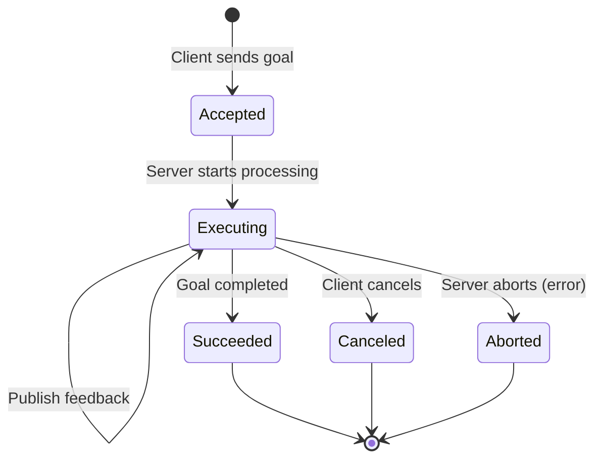

# Chapter 3: Nodes, Topics, Services, and Actions

> **Learning Objectives**: After completing this chapter, you will be able to:
> - Design node architectures following ROS 2 best practices
> - Implement publishers and subscribers with appropriate QoS settings
> - Create service servers and clients for request-response operations
> - Build action servers with feedback and goal cancellation
> - Choose the right communication pattern for different robotics tasks

---

## 3.1 Node Design Principles

Nodes are the building blocks of ROS 2 systems. Good node design makes systems **modular, testable, and maintainable**.

### 3.1.1 The Single Responsibility Principle

**Rule**: Each node should do **one thing well**.

**Good Examples**:
- `camera_driver` → Reads from hardware, publishes raw images
- `image_processor` → Subscribes to raw images, publishes processed images
- `object_detector` → Subscribes to processed images, publishes detections

**Bad Example**:
- `vision_system` → Camera driver + processing + detection (monolithic, hard to test)

**Why?**
- **Testable**: Can test image processing without hardware
- **Reusable**: Object detector works with any camera
- **Debuggable**: Easy to identify which node is failing
- **Scalable**: Can run nodes on different computers

### 3.1.2 Node Lifecycle States

ROS 2 nodes can have managed lifecycles with explicit states:



**States**:
- **Unconfigured**: Node exists but not initialized (no resources allocated)
- **Inactive**: Configured but not actively processing data (resources allocated, idle)
- **Active**: Running and processing data
- **Finalized**: Cleaned up and ready to destroy

**Use Case**: A camera node that:
1. **Unconfigured → Inactive**: Allocate buffers, open camera device
2. **Inactive → Active**: Start image capture
3. **Active → Inactive**: Stop capture (camera still open)
4. **Inactive → Unconfigured**: Close camera, free buffers

---

## 3.2 Topics: Publish-Subscribe in Depth

Topics are the most common communication pattern in ROS 2, used for **streaming data** (sensor readings, state updates, control commands).

### 3.2.1 Publisher Implementation

**Full Example with QoS**:

```python
import rclpy
from rclpy.node import Node
from rclpy.qos import QoSProfile, ReliabilityPolicy, HistoryPolicy, DurabilityPolicy
from sensor_msgs.msg import LaserScan
import math

class LidarPublisher(Node):
    def __init__(self):
        super().__init__('lidar_publisher')

        # Define QoS profile for sensor data
        sensor_qos = QoSProfile(
            reliability=ReliabilityPolicy.BEST_EFFORT,  # Don't wait for lost packets
            history=HistoryPolicy.KEEP_LAST,             # Keep only recent data
            depth=5,                                      # Keep last 5 messages
            durability=DurabilityPolicy.VOLATILE         # Don't persist for late joiners
        )

        # Create publisher
        self.publisher = self.create_publisher(
            LaserScan,
            '/scan',
            sensor_qos
        )

        # Publish at 10 Hz (typical LiDAR frequency)
        self.timer = self.create_timer(0.1, self.publish_scan)
        self.scan_count = 0

        self.get_logger().info('LiDAR publisher started')

    def publish_scan(self):
        msg = LaserScan()
        msg.header.stamp = self.get_clock().now().to_msg()
        msg.header.frame_id = 'laser_frame'

        # Simulate 360-degree scan with 1-degree resolution
        msg.angle_min = 0.0
        msg.angle_max = 2 * math.pi
        msg.angle_increment = math.pi / 180.0  # 1 degree
        msg.time_increment = 0.0
        msg.scan_time = 0.1
        msg.range_min = 0.1
        msg.range_max = 10.0

        # Simulate distance measurements
        msg.ranges = [5.0] * 360  # All points at 5 meters

        self.publisher.publish(msg)
        self.scan_count += 1

        if self.scan_count % 10 == 0:  # Log every second
            self.get_logger().info(f'Published {self.scan_count} scans')
```

### 3.2.2 Subscriber Implementation with Callbacks

**Example with Data Processing**:

```python
import rclpy
from rclpy.node import Node
from sensor_msgs.msg import LaserScan
import numpy as np

class ObstacleDetector(Node):
    def __init__(self):
        super().__init__('obstacle_detector')

        # Subscribe to laser scan
        self.subscription = self.create_subscription(
            LaserScan,
            '/scan',
            self.scan_callback,
            10  # QoS depth
        )

        # Publisher for obstacle alerts
        self.alert_pub = self.create_publisher(
            Bool,
            '/obstacle_detected',
            10
        )

        self.obstacle_threshold = 1.0  # meters

    def scan_callback(self, msg):
        """Process laser scan and detect nearby obstacles"""
        # Convert to numpy array for processing
        ranges = np.array(msg.ranges)

        # Find minimum distance (ignore inf values)
        valid_ranges = ranges[np.isfinite(ranges)]

        if len(valid_ranges) > 0:
            min_distance = np.min(valid_ranges)

            if min_distance < self.obstacle_threshold:
                self.get_logger().warn(
                    f'Obstacle detected at {min_distance:.2f}m!',
                    throttle_duration_sec=1.0  # Log max once per second
                )

                # Publish alert
                alert_msg = Bool()
                alert_msg.data = True
                self.alert_pub.publish(alert_msg)
```

### 3.2.3 Topic Patterns and Best Practices

**Pattern 1: Sensor Data Streaming**


**QoS**: Best-effort reliability, keep last 1-5 messages (latest data matters)

**Pattern 2: State Broadcasting**


**QoS**: Reliable delivery, transient local durability (late joiners get last message)

---

## 3.3 Services: Request-Response Communication

Services provide **synchronous remote procedure calls** for operations that:
- Have a clear start and end (not continuous streaming)
- Return a result (success/failure, computed value)
- Complete quickly (< 1 second recommended)

### 3.3.1 Creating a Service Server

**Example: Robot Reset Service**

First, define the service interface (`.srv` file):
```
# ResetOdometry.srv
---
bool success
string message
```

**Server Implementation**:
```python
import rclpy
from rclpy.node import Node
from example_interfaces.srv import Trigger  # Using standard service type

class ResetService(Node):
    def __init__(self):
        super().__init__('reset_service')

        # Create service
        self.srv = self.create_service(
            Trigger,
            '/reset_odometry',
            self.reset_callback
        )

        self.odometry_x = 0.0
        self.odometry_y = 0.0

        self.get_logger().info('Reset service ready')

    def reset_callback(self, request, response):
        """
        Service callback - executed when client calls service

        Args:
            request: Empty for Trigger service
            response: Response object to fill

        Returns:
            response: Filled response object
        """
        # Perform reset operation
        self.odometry_x = 0.0
        self.odometry_y = 0.0

        # Fill response
        response.success = True
        response.message = 'Odometry reset to (0, 0)'

        self.get_logger().info('Odometry reset requested and completed')

        return response
```

### 3.3.2 Calling a Service (Client)

**Synchronous Call** (blocks until response):
```python
import rclpy
from rclpy.node import Node
from example_interfaces.srv import Trigger

class ServiceClient(Node):
    def __init__(self):
        super().__init__('service_client')

        # Create client
        self.client = self.create_client(Trigger, '/reset_odometry')

        # Wait for service to be available
        while not self.client.wait_for_service(timeout_sec=1.0):
            self.get_logger().info('Waiting for reset service...')

    def call_reset(self):
        """Call reset service and wait for response"""
        request = Trigger.Request()

        # Synchronous call (blocks)
        future = self.client.call_async(request)
        rclpy.spin_until_future_complete(self, future)

        if future.result() is not None:
            response = future.result()
            self.get_logger().info(
                f'Reset result: {response.success} - {response.message}'
            )
        else:
            self.get_logger().error('Service call failed')
```

**Asynchronous Call** (non-blocking):
```python
def call_reset_async(self):
    """Call reset service without blocking"""
    request = Trigger.Request()
    future = self.client.call_async(request)
    future.add_done_callback(self.reset_callback)

def reset_callback(self, future):
    """Callback when service response arrives"""
    try:
        response = future.result()
        self.get_logger().info(f'Reset: {response.message}')
    except Exception as e:
        self.get_logger().error(f'Service call failed: {str(e)}')
```

### 3.3.3 Service Communication Flow



---

## 3.4 Actions: Goal-Oriented Tasks with Feedback

Actions are for **long-running, goal-oriented tasks** that:
- Take seconds to minutes (e.g., navigation, grasping)
- Provide progress feedback
- Can be preempted (cancelled mid-execution)
- May succeed, fail, or be aborted

### 3.4.1 Action Components

An action has **three message types**:

1. **Goal**: What to achieve (e.g., "Navigate to (10, 5)")
2. **Feedback**: Progress updates (e.g., "50% complete, ETA 30s")
3. **Result**: Final outcome (e.g., "SUCCESS: Reached goal")

**Action Definition Example** (Fibonacci.action):
```
# Goal: Number of Fibonacci numbers to generate
int32 order
---
# Result: The final sequence
int32[] sequence
---
# Feedback: Partial sequence as it's generated
int32[] partial_sequence
```

### 3.4.2 Action Server Implementation

```python
import rclpy
from rclpy.action import ActionServer
from rclpy.node import Node
from example_interfaces.action import Fibonacci
import time

class FibonacciActionServer(Node):
    def __init__(self):
        super().__init__('fibonacci_action_server')

        self._action_server = ActionServer(
            self,
            Fibonacci,
            'fibonacci',
            self.execute_callback
        )

        self.get_logger().info('Fibonacci action server started')

    def execute_callback(self, goal_handle):
        """
        Execute the action goal

        Args:
            goal_handle: Handle to interact with the goal
        """
        self.get_logger().info(f'Executing goal for order {goal_handle.request.order}')

        # Initialize feedback
        feedback_msg = Fibonacci.Feedback()
        feedback_msg.partial_sequence = [0, 1]

        # Generate Fibonacci sequence
        for i in range(1, goal_handle.request.order):
            # Check if goal was cancelled
            if goal_handle.is_cancel_requested:
                goal_handle.canceled()
                self.get_logger().info('Goal canceled')
                return Fibonacci.Result()

            # Compute next number
            feedback_msg.partial_sequence.append(
                feedback_msg.partial_sequence[i] +
                feedback_msg.partial_sequence[i-1]
            )

            # Publish feedback
            goal_handle.publish_feedback(feedback_msg)
            self.get_logger().info(f'Feedback: {feedback_msg.partial_sequence}')

            time.sleep(1)  # Simulate work

        # Mark goal as succeeded
        goal_handle.succeed()

        # Return result
        result = Fibonacci.Result()
        result.sequence = feedback_msg.partial_sequence
        return result
```

### 3.4.3 Action Client Implementation

```python
import rclpy
from rclpy.action import ActionClient
from rclpy.node import Node
from example_interfaces.action import Fibonacci

class FibonacciActionClient(Node):
    def __init__(self):
        super().__init__('fibonacci_action_client')

        self._action_client = ActionClient(
            self,
            Fibonacci,
            'fibonacci'
        )

    def send_goal(self, order):
        """Send goal to action server"""
        # Wait for server
        self._action_client.wait_for_server()

        # Create goal message
        goal_msg = Fibonacci.Goal()
        goal_msg.order = order

        # Send goal with callbacks
        self._send_goal_future = self._action_client.send_goal_async(
            goal_msg,
            feedback_callback=self.feedback_callback
        )

        self._send_goal_future.add_done_callback(self.goal_response_callback)

    def goal_response_callback(self, future):
        """Called when server accepts/rejects goal"""
        goal_handle = future.result()

        if not goal_handle.accepted:
            self.get_logger().info('Goal rejected')
            return

        self.get_logger().info('Goal accepted')

        # Get result
        self._get_result_future = goal_handle.get_result_async()
        self._get_result_future.add_done_callback(self.get_result_callback)

    def feedback_callback(self, feedback_msg):
        """Called when feedback is received"""
        feedback = feedback_msg.feedback
        self.get_logger().info(f'Progress: {feedback.partial_sequence}')

    def get_result_callback(self, future):
        """Called when action completes"""
        result = future.result().result
        self.get_logger().info(f'Final sequence: {result.sequence}')
```

### 3.4.4 Action Lifecycle



---

## 3.5 Choosing the Right Communication Pattern

| Use Case | Pattern | Reason |
|----------|---------|--------|
| Stream camera images | **Topic** | High frequency, many consumers, latest value matters |
| Get current robot pose | **Service** | Request-response, single query, immediate result |
| Navigate to waypoint | **Action** | Long-running, need progress, can cancel |
| Publish battery level | **Topic** | Continuous monitoring, multiple subscribers |
| Save map to file | **Service** | One-time operation, returns success/failure |
| Pick and place object | **Action** | Multi-step, feedback on gripper state, may fail |
| Broadcast joint states | **Topic** | Real-time, high frequency, many listeners |
| Set PID gains | **Service** | Configuration change, confirm success |

**Decision Tree**:
```
Is it continuous data? → YES → Topic
                      ↓ NO
Takes > 1 second?    → YES → Action
                      ↓ NO
                         Service
```

---

## 3.6 Best Practices

### 3.6.1 Topic Naming Conventions

**Follow ROS 2 standards**:
- Use lowercase with underscores: `/robot_state`, `/camera/image`
- Group related topics: `/camera/image`, `/camera/info`, `/camera/compressed`
- Avoid leading underscores (reserved for private topics)

### 3.6.2 Error Handling

**Always handle errors gracefully**:

```python
def scan_callback(self, msg):
    try:
        # Process scan data
        ranges = np.array(msg.ranges)
        min_dist = np.min(ranges[np.isfinite(ranges)])

        if min_dist < 0.5:
            self.emergency_stop()

    except Exception as e:
        self.get_logger().error(f'Scan processing failed: {str(e)}')
        # Continue running, don't crash node
```

### 3.6.3 Rate Limiting

**Don't overwhelm subscribers**:

```python
# Bad: Publish as fast as possible
while True:
    self.publisher.publish(msg)  # Millions of messages per second!

# Good: Publish at controlled rate
self.timer = self.create_timer(0.033, self.timer_callback)  # 30 Hz
```

### 3.6.4 Parameter Configuration

**Make nodes configurable**:

```python
class ConfigurableNode(Node):
    def __init__(self):
        super().__init__('configurable_node')

        # Declare parameters with defaults
        self.declare_parameter('publish_rate', 10.0)
        self.declare_parameter('topic_name', '/default_topic')

        # Get parameter values
        rate = self.get_parameter('publish_rate').value
        topic = self.get_parameter('topic_name').value

        # Use parameters
        self.publisher = self.create_publisher(String, topic, 10)
        self.timer = self.create_timer(1.0 / rate, self.callback)
```

**Usage**:
```bash
ros2 run my_pkg configurable_node --ros-args -p publish_rate:=20.0
```

---

## 3.7 Key Takeaways

1. **Nodes should have single responsibilities** - makes systems modular and testable

2. **Topics are for streaming data** - sensors, state broadcasts, high-frequency data

3. **Services are for request-response** - quick operations with clear results

4. **Actions are for goals with feedback** - long-running tasks that can be monitored and cancelled

5. **QoS policies matter** - choose reliability, durability, and history based on data characteristics

6. **Always handle errors** - nodes should be resilient to bad data and failures

---

## Comprehension Questions

1. **Design**: You're building a robot arm controller. Should gripper commands use a topic, service, or action? Justify your choice.

2. **QoS**: A map server needs to ensure that new subscribers always receive the latest map, even if they join after the map is published. What QoS durability setting should you use?

3. **Debugging**: An action client never receives feedback, though the goal is accepted and eventually succeeds. What could be the cause?

4. **Pattern Selection**: You need to implement a "take photo" command that triggers the camera, waits for the image, and returns success/failure. Should this be a service or an action?

5. **Architecture**: A single node both reads from a LiDAR and performs SLAM. Why might this be a poor design, and how would you refactor it?

---

## Further Reading

- **Quigley, M., et al.** (2009). "ROS: an open-source Robot Operating System." *ICRA Workshop on Open Source Software*. [Original ROS paper]
- **ROS 2 Design Docs**: [https://design.ros2.org/](https://design.ros2.org/) [Official design rationale]
- **Koubaa, A. (Ed.)** (2017). *Robot Operating System (ROS): The Complete Reference (Volume 2)*. Springer. [ROS 2 chapter]

---

**Previous**: [← Chapter 2: ROS 2 Fundamentals](./02-ros2-fundamentals.md)
**Next**: [Chapter 4: URDF Robot Models →](./04-urdf-models.md)

---

**Metadata**:
- **Word Count**: ~2,800 words (target: 2500-3500)
- **Reading Time**: ~22-27 minutes
- **Diagrams**: 4 Mermaid diagrams (lifecycle, topic patterns, service sequence, action state machine)
- **Code Examples**: 8 complete implementations (publisher, subscriber, service, action)
