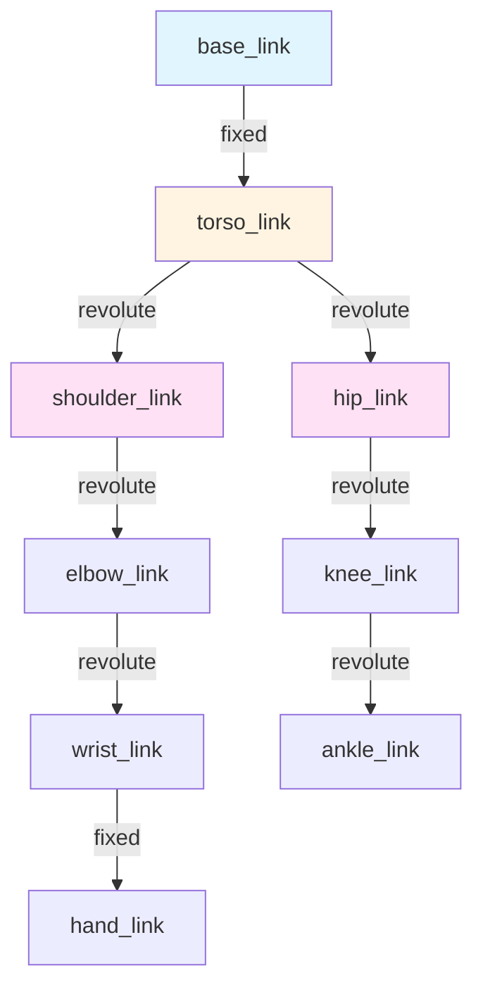
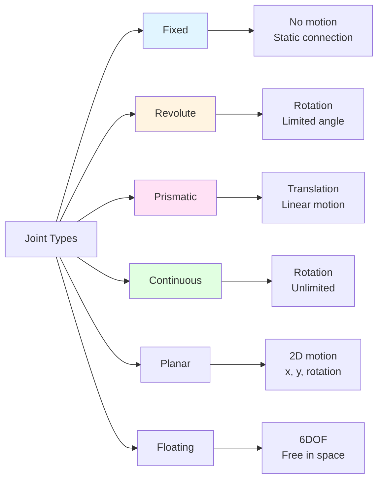

# Chapter 4: URDF Robot Models

> **Learning Objectives**: After completing this chapter, you will be able to:
> - Understand URDF (Unified Robot Description Format) structure and syntax
> - Define links and joints for humanoid robots
> - Create visual and collision geometries for simulation
> - Specify inertial properties for physics engines
> - Use XACRO macros to reduce URDF repetition
> - Visualize and debug URDF models with RViz2

---

## 4.1 What is URDF?

**URDF (Unified Robot Description Format)** is an XML-based format for describing robot kinematics, dynamics, and visual appearance. It's the standard way to define robots in ROS and simulators like Gazebo.

### Why URDF?

Without a standard format, every simulation or visualization tool would need custom robot definitions. URDF provides:

1. **Portability**: Same URDF works in RViz, Gazebo, MoveIt, Isaac Sim
2. **Kinematics**: Defines joint types, limits, and transformations
3. **Dynamics**: Specifies mass, inertia for physics simulation
4. **Visualization**: Meshes and colors for rendering
5. **Collision**: Simplified geometry for collision detection

**URDF Powers**:
- `robot_state_publisher`: Publishes TF transforms from joint states
- Simulators (Gazebo, Isaac): Physics and rendering
- Motion planning (MoveIt): Collision checking and IK
- Visualization (RViz): 3D robot model display

---

## 4.2 URDF Structure

A URDF file is an XML tree with a `<robot>` root containing `<link>` and `<joint>` elements.

### Basic Anatomy

```xml
<?xml version="1.0"?>
<robot name="my_robot">
  <!-- Links define rigid bodies -->
  <link name="base_link">
    <visual>...</visual>
    <collision>...</collision>
    <inertial>...</inertial>
  </link>

  <link name="arm_link">...</link>

  <!-- Joints connect links -->
  <joint name="base_to_arm" type="revolute">
    <parent link="base_link"/>
    <child link="arm_link"/>
    <axis xyz="0 0 1"/>
    <limit effort="100" velocity="1.0" lower="-1.57" upper="1.57"/>
  </joint>
</robot>
```

### Kinematic Tree Structure



**Key Principle**: URDF represents robots as **trees** (not graphs). Each link has exactly one parent joint (except the root).

---

## 4.3 Links: Rigid Bodies

Links represent **rigid bodies** in the robot. Each link can have three properties:

### 4.3.1 Visual: Appearance

Defines how the link looks in visualization tools (RViz, Gazebo rendering).

```xml
<link name="arm_link">
  <visual>
    <origin xyz="0 0 0.5" rpy="0 0 0"/>
    <geometry>
      <cylinder radius="0.05" length="1.0"/>
    </geometry>
    <material name="blue">
      <color rgba="0 0 1 1"/>
    </material>
  </visual>
</link>
```

**Geometry Types**:
- `<box size="x y z"/>` - Rectangular box
- `<cylinder radius="r" length="l"/>` - Cylinder
- `<sphere radius="r"/>` - Sphere
- `<mesh filename="package://pkg/meshes/arm.stl"/>` - Custom mesh (STL, DAE, OBJ)

**Origin**: Position and orientation relative to link frame
- `xyz`: Translation (meters)
- `rpy`: Roll, pitch, yaw (radians)

### 4.3.2 Collision: Physics

Simplified geometry for collision detection (should be faster than visual).

```xml
<collision>
  <origin xyz="0 0 0.5" rpy="0 0 0"/>
  <geometry>
    <cylinder radius="0.06" length="1.0"/>  <!-- Slightly larger than visual -->
  </geometry>
</collision>
```

**Best Practice**: Use simple primitives (boxes, cylinders, spheres) for collision, even if visual uses complex meshes.

**Why separate?**
- Visual: Detailed, aesthetic, can be slow
- Collision: Fast computation, safety margins

### 4.3.3 Inertial: Dynamics

Mass and inertia tensor for physics simulation.

```xml
<inertial>
  <origin xyz="0 0 0.5" rpy="0 0 0"/>  <!-- Center of mass -->
  <mass value="2.0"/>  <!-- kg -->
  <inertia
    ixx="0.05" ixy="0.0" ixz="0.0"
    iyy="0.05" iyz="0.0"
    izz="0.001"/>
</inertial>
```

**Inertia Tensor**: 3x3 symmetric matrix describing rotational resistance

```
I = | ixx ixy ixz |
    | ixy iyy iyz |
    | ixz iyz izz |
```

**Common Formulas**:

| Shape | Mass | Ixx, Iyy, Izz |
|-------|------|---------------|
| Solid cylinder (radius r, height h) | m | Ixx=Iyy = (1/12)m(3r²+h²), Izz = (1/2)mr² |
| Solid sphere (radius r) | m | Ixx=Iyy=Izz = (2/5)mr² |
| Box (width w, depth d, height h) | m | Ixx = (1/12)m(d²+h²), Iyy = (1/12)m(w²+h²), Izz = (1/12)m(w²+d²) |

**Critical**: Incorrect inertia causes simulation instability (robot explodes, falls through floor).

---

## 4.4 Joints: Connections

Joints define **how links move relative to each other**.

### 4.4.1 Joint Types



### 4.4.2 Revolute Joint (Hinge)

Most common for robot arms and legs. Rotates around a single axis with limits.

```xml
<joint name="shoulder_joint" type="revolute">
  <parent link="torso"/>
  <child link="upper_arm"/>

  <!-- Joint origin relative to parent frame -->
  <origin xyz="0.2 0 0.5" rpy="0 0 0"/>

  <!-- Rotation axis (in joint frame) -->
  <axis xyz="1 0 0"/>  <!-- Rotate around X-axis -->

  <!-- Limits -->
  <limit
    lower="-1.57"     <!-- -90 degrees (radians) -->
    upper="1.57"      <!-- +90 degrees -->
    effort="100.0"    <!-- Max torque (Nm) -->
    velocity="2.0"/>  <!-- Max angular velocity (rad/s) -->

  <!-- Dynamics (optional) -->
  <dynamics damping="0.1" friction="0.05"/>
</joint>
```

### 4.4.3 Prismatic Joint (Slider)

Linear motion along an axis (e.g., telescoping antenna, elevator).

```xml
<joint name="elevator_joint" type="prismatic">
  <parent link="base"/>
  <child link="platform"/>
  <origin xyz="0 0 0" rpy="0 0 0"/>
  <axis xyz="0 0 1"/>  <!-- Slide along Z-axis -->
  <limit
    lower="0.0"       <!-- 0 meters -->
    upper="2.0"       <!-- 2 meters -->
    effort="1000.0"   <!-- Max force (N) -->
    velocity="0.5"/>  <!-- Max linear velocity (m/s) -->
</joint>
```

### 4.4.4 Continuous Joint

Revolute joint without angle limits (e.g., wheels).

```xml
<joint name="wheel_joint" type="continuous">
  <parent link="chassis"/>
  <child link="wheel"/>
  <origin xyz="0.5 0 0" rpy="1.57 0 0"/>  <!-- Rotate 90° to horizontal -->
  <axis xyz="0 0 1"/>
  <!-- No <limit> needed for continuous -->
</joint>
```

### 4.4.5 Fixed Joint

Static connection (no motion). Used for sensors, camera mounts.

```xml
<joint name="camera_mount" type="fixed">
  <parent link="head"/>
  <child link="camera"/>
  <origin xyz="0.1 0 0.05" rpy="0 0 0"/>
</joint>
```

---

## 4.5 Humanoid Robot Example

Let's build a simplified humanoid with torso, arms, and legs.

### Kinematic Structure

```
                    base_link (floating)
                         |
                    torso_link
                    /    |    \
        left_shoulder  head  right_shoulder
               |               |
          left_elbow      right_elbow
               |               |
          left_hand       right_hand
```

### Simplified URDF

```xml
<?xml version="1.0"?>
<robot name="simple_humanoid">

  <!-- Base/Root Link -->
  <link name="base_link">
    <visual>
      <geometry>
        <box size="0.3 0.2 0.1"/>
      </geometry>
      <material name="gray">
        <color rgba="0.5 0.5 0.5 1"/>
      </material>
    </visual>
    <inertial>
      <mass value="5.0"/>
      <inertia ixx="0.05" iyy="0.05" izz="0.05" ixy="0" ixz="0" iyz="0"/>
    </inertial>
  </link>

  <!-- Torso -->
  <link name="torso">
    <visual>
      <origin xyz="0 0 0.3" rpy="0 0 0"/>
      <geometry>
        <box size="0.3 0.15 0.6"/>
      </geometry>
      <material name="blue">
        <color rgba="0 0 1 1"/>
      </material>
    </visual>
    <collision>
      <origin xyz="0 0 0.3" rpy="0 0 0"/>
      <geometry>
        <box size="0.3 0.15 0.6"/>
      </geometry>
    </collision>
    <inertial>
      <origin xyz="0 0 0.3" rpy="0 0 0"/>
      <mass value="10.0"/>
      <inertia ixx="0.3" iyy="0.3" izz="0.1" ixy="0" ixz="0" iyz="0"/>
    </inertial>
  </link>

  <joint name="base_to_torso" type="fixed">
    <parent link="base_link"/>
    <child link="torso"/>
    <origin xyz="0 0 0.1" rpy="0 0 0"/>
  </joint>

  <!-- Left Shoulder -->
  <link name="left_shoulder">
    <visual>
      <origin xyz="0 0 -0.2" rpy="0 0 0"/>
      <geometry>
        <cylinder radius="0.05" length="0.4"/>
      </geometry>
      <material name="red">
        <color rgba="1 0 0 1"/>
      </material>
    </visual>
    <collision>
      <origin xyz="0 0 -0.2" rpy="0 0 0"/>
      <geometry>
        <cylinder radius="0.06" length="0.4"/>
      </geometry>
    </collision>
    <inertial>
      <origin xyz="0 0 -0.2" rpy="0 0 0"/>
      <mass value="2.0"/>
      <inertia ixx="0.03" iyy="0.03" izz="0.005" ixy="0" ixz="0" iyz="0"/>
    </inertial>
  </link>

  <joint name="torso_to_left_shoulder" type="revolute">
    <parent link="torso"/>
    <child link="left_shoulder"/>
    <origin xyz="0 0.175 0.5" rpy="0 0 0"/>
    <axis xyz="1 0 0"/>  <!-- Rotate around X (forward/backward swing) -->
    <limit lower="-1.57" upper="1.57" effort="50.0" velocity="2.0"/>
  </joint>

  <!-- Right Shoulder (mirror of left) -->
  <link name="right_shoulder">
    <visual>
      <origin xyz="0 0 -0.2" rpy="0 0 0"/>
      <geometry>
        <cylinder radius="0.05" length="0.4"/>
      </geometry>
      <material name="red"/>
    </visual>
    <collision>
      <origin xyz="0 0 -0.2" rpy="0 0 0"/>
      <geometry>
        <cylinder radius="0.06" length="0.4"/>
      </geometry>
    </collision>
    <inertial>
      <origin xyz="0 0 -0.2" rpy="0 0 0"/>
      <mass value="2.0"/>
      <inertia ixx="0.03" iyy="0.03" izz="0.005" ixy="0" ixz="0" iyz="0"/>
    </inertial>
  </link>

  <joint name="torso_to_right_shoulder" type="revolute">
    <parent link="torso"/>
    <child link="right_shoulder"/>
    <origin xyz="0 -0.175 0.5" rpy="0 0 0"/>
    <axis xyz="1 0 0"/>
    <limit lower="-1.57" upper="1.57" effort="50.0" velocity="2.0"/>
  </joint>

</robot>
```

---

## 4.6 XACRO: Macros for URDF

**Problem**: Real robots have repetitive structure (arms, legs, fingers). Pure URDF becomes huge and hard to maintain.

**Solution**: **XACRO (XML Macros)** - preprocessor for URDF with variables, conditionals, and macros.

### XACRO Features

```xml
<?xml version="1.0"?>
<robot xmlns:xacro="http://www.ros.org/wiki/xacro" name="humanoid">

  <!-- Variables -->
  <xacro:property name="arm_length" value="0.4"/>
  <xacro:property name="arm_radius" value="0.05"/>
  <xacro:property name="arm_mass" value="2.0"/>

  <!-- Macro definition -->
  <xacro:macro name="arm_link" params="prefix">
    <link name="${prefix}_arm">
      <visual>
        <origin xyz="0 0 ${-arm_length/2}" rpy="0 0 0"/>
        <geometry>
          <cylinder radius="${arm_radius}" length="${arm_length}"/>
        </geometry>
        <material name="red">
          <color rgba="1 0 0 1"/>
        </material>
      </visual>
      <inertial>
        <mass value="${arm_mass}"/>
        <!-- Cylinder inertia formula -->
        <inertia
          ixx="${(1/12)*arm_mass*(3*arm_radius*arm_radius + arm_length*arm_length)}"
          iyy="${(1/12)*arm_mass*(3*arm_radius*arm_radius + arm_length*arm_length)}"
          izz="${(1/2)*arm_mass*arm_radius*arm_radius}"
          ixy="0" ixz="0" iyz="0"/>
      </inertial>
    </link>
  </xacro:macro>

  <!-- Use macro -->
  <xacro:arm_link prefix="left"/>
  <xacro:arm_link prefix="right"/>

</robot>
```

**Convert XACRO to URDF**:
```bash
xacro robot.urdf.xacro > robot.urdf
```

### Conditional Logic

```xml
<xacro:property name="use_gpu" value="true"/>

<xacro:if value="${use_gpu}">
  <sensor name="gpu_camera" type="camera">
    <!-- GPU-accelerated sensor -->
  </sensor>
</xacro:if>

<xacro:unless value="${use_gpu}">
  <sensor name="cpu_camera" type="camera">
    <!-- CPU-based sensor -->
  </sensor>
</xacro:unless>
```

---

## 4.7 Visualizing URDF with RViz2

**RViz2** is ROS 2's 3D visualization tool.

### Viewing a URDF

```bash
# Option 1: robot_state_publisher + joint_state_publisher
ros2 run robot_state_publisher robot_state_publisher \
  --ros-args -p robot_description:="$(cat robot.urdf)"

ros2 run joint_state_publisher_gui joint_state_publisher_gui

# Launch RViz
rviz2
```

**In RViz**:
1. Add **RobotModel** display
2. Set Fixed Frame to `base_link`
3. Use sliders in `joint_state_publisher_gui` to move joints

### Checking TF Tree

```bash
# View transform tree
ros2 run rqt_tf_tree rqt_tf_tree

# Echo specific transform
ros2 run tf2_ros tf2_echo base_link left_hand
```

---

## 4.8 Common URDF Pitfalls

### 1. Invalid Inertia Tensors

**Symptom**: Robot explodes or falls through floor in Gazebo

**Cause**: Inertia values too small, negative, or inconsistent

**Fix**: Use realistic values from formulas or CAD tools

```xml
<!-- BAD: All zeros -->
<inertia ixx="0" iyy="0" izz="0" ixy="0" ixz="0" iyz="0"/>

<!-- GOOD: Use formulas or CAD-derived values -->
<inertia ixx="0.05" iyy="0.05" izz="0.01" ixy="0" ixz="0" iyz="0"/>
```

### 2. Collision Geometry Too Complex

**Symptom**: Simulation runs slowly or crashes

**Cause**: Using high-poly meshes for collision

**Fix**: Use simple primitives (boxes, cylinders, spheres)

```xml
<!-- BAD: Complex mesh for collision -->
<collision>
  <geometry>
    <mesh filename="high_poly_arm.stl"/>  <!-- 100k triangles -->
  </geometry>
</collision>

<!-- GOOD: Simple approximation -->
<collision>
  <geometry>
    <cylinder radius="0.06" length="0.4"/>  <!-- Fast computation -->
  </geometry>
</collision>
```

### 3. Missing Mass/Inertia

**Symptom**: Link disappears in Gazebo or behaves strangely

**Cause**: Link without `<inertial>` tag

**Fix**: Always specify mass and inertia for movable links

### 4. Joint Limits Too Tight

**Symptom**: Robot cannot move or jitters

**Cause**: Position limits don't allow any motion

**Fix**: Check limits match expected range

```xml
<!-- BAD: Lower > Upper -->
<limit lower="1.57" upper="-1.57" .../>  <!-- Invalid! -->

<!-- GOOD: Lower < Upper -->
<limit lower="-1.57" upper="1.57" .../>  <!-- -90° to +90° -->
```

---

## 4.9 Best Practices

1. **Start Simple**: Begin with boxes/cylinders, add complex meshes later
2. **Test Incrementally**: Add one joint at a time, visualize in RViz
3. **Use XACRO**: Avoid repetition with macros and variables
4. **Validate**: Use `check_urdf` command-line tool
5. **Document**: Add comments explaining coordinate frames and conventions
6. **Version Control**: Keep URDF/XACRO files in Git

### Validation Command

```bash
# Check URDF syntax
check_urdf robot.urdf

# Output:
# robot name is: simple_humanoid
# ---------- Successfully Parsed XML ---------------
# root Link: base_link has 1 child(ren)
#     child(1):  torso
#         child(1):  left_shoulder
#         child(2):  right_shoulder
```

---

## 4.10 Key Takeaways

1. **URDF defines robot structure** - links (bodies), joints (connections), and properties (mass, inertia, appearance)

2. **Three geometries per link** - visual (rendering), collision (physics), and inertial (dynamics)

3. **Joint types matter** - revolute (hinge), prismatic (slider), continuous (wheel), fixed (static)

4. **Inertia must be realistic** - incorrect values cause simulation instability

5. **XACRO reduces repetition** - use macros for symmetric structures (arms, legs)

6. **RViz2 for visualization** - test URDF before simulation with `robot_state_publisher`

---

## Comprehension Questions

1. **Design**: You're modeling a humanoid robot's shoulder with 3 degrees of freedom (pitch, yaw, roll). Should you use one joint or three? How would you structure it?

2. **Debugging**: A robot arm's elbow joint in Gazebo vibrates violently and eventually explodes. What are 3 possible causes in the URDF?

3. **Optimization**: You have a detailed visual mesh with 50,000 triangles for a robot link. What should you use for the collision geometry and why?

4. **Kinematics**: Given a URDF with `base_link → torso → left_shoulder → left_elbow`, what is the transform chain from `base_link` to `left_elbow`?

5. **XACRO**: Write a XACRO macro that creates a leg with 3 joints (hip, knee, ankle) that can be instantiated for both left and right legs.

---

## Further Reading

- **Chitta, S., et al.** (2012). "MoveIt!: An introduction." *In Robot Operating System (ROS)*. Springer. [URDF in motion planning]
- **ROS URDF Tutorials**: [http://wiki.ros.org/urdf/Tutorials](http://wiki.ros.org/urdf/Tutorials) [Official documentation]
- **Canny, J.** (1986). "A computational approach to edge detection." *IEEE TPAMI*. [Collision detection foundations]

---

**Previous**: [← Chapter 3: Nodes, Topics, Services, Actions](./03-nodes-topics-services.md)
**Next**: Tutorial 1: ROS 2 Hello World (Coming Soon)

---

**Metadata**:
- **Word Count**: ~2,900 words (target: 2000-3000)
- **Reading Time**: ~22-27 minutes
- **Diagrams**: 2 Mermaid diagrams (kinematic tree, joint types)
- **Code Examples**: Complete humanoid URDF, XACRO macros, inertia formulas
