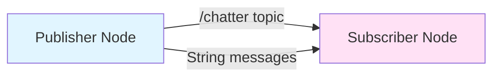

# Tutorial 1: ROS 2 Hello World

**Estimated Time**: 30-45 minutes
**Difficulty**: Beginner
**Prerequisites**: ROS 2 Humble installed (see [Software Installation](/docs/appendices/software-installation))

## Learning Objectives

By the end of this tutorial, you will be able to:

1. Create a ROS 2 workspace from scratch
2. Write a simple publisher node in Python
3. Write a corresponding subscriber node
4. Launch and verify communication between nodes
5. Use command-line tools to inspect the ROS 2 graph

## Overview

In this hands-on tutorial, you'll create your first ROS 2 application: a classic "Hello World" publisher-subscriber system. The publisher will send messages at regular intervals, and the subscriber will receive and display them. This simple example demonstrates the fundamental ROS 2 communication pattern you'll use throughout this book.



## What You'll Build

- **Publisher Node**: Sends "Hello, ROS 2!" messages every second
- **Subscriber Node**: Receives and prints messages
- **Topic**: `/chatter` for string communication

## Step 1: Set Up Your Workspace

First, create a ROS 2 workspace with the proper directory structure:

```bash
# Create workspace directory
mkdir -p ~/ros2_tutorial_ws/src
cd ~/ros2_tutorial_ws

# Source ROS 2 environment (do this in every new terminal)
source /opt/ros/humble/setup.bash
```

:::tip
Add `source /opt/ros/humble/setup.bash` to your `~/.bashrc` file to automatically source ROS 2 in every new terminal:
```bash
echo "source /opt/ros/humble/setup.bash" >> ~/.bashrc
```
:::

## Step 2: Create the Publisher Node

Create a new Python file for the publisher:

```bash
cd ~/ros2_tutorial_ws/src
touch hello_publisher.py
chmod +x hello_publisher.py
```

Now open `hello_publisher.py` in your favorite editor and add the following code:

```python title="hello_publisher.py"
#!/usr/bin/env python3
"""
ROS 2 Hello World Publisher

This node publishes "Hello, ROS 2!" messages to the /chatter topic
at a rate of 1 Hz (once per second).
"""

import rclpy
from rclpy.node import Node
from std_msgs.msg import String


class HelloPublisher(Node):
    """A simple publisher node that sends greeting messages."""

    def __init__(self):
        # Initialize the node with name 'hello_publisher'
        super().__init__('hello_publisher')

        # Create a publisher on topic '/chatter' with message type String
        # Queue size of 10 means it buffers up to 10 messages
        self.publisher_ = self.create_publisher(String, 'chatter', 10)

        # Create a timer that calls timer_callback every 1.0 seconds
        self.timer = self.create_timer(1.0, self.timer_callback)

        # Counter to track how many messages we've sent
        self.counter = 0

        self.get_logger().info('Hello Publisher started! Publishing to /chatter')

    def timer_callback(self):
        """This function is called every second by the timer."""
        # Create a new String message
        msg = String()
        msg.data = f'Hello, ROS 2! Message #{self.counter}'

        # Publish the message
        self.publisher_.publish(msg)

        # Log it so we can see what was sent
        self.get_logger().info(f'Publishing: "{msg.data}"')

        # Increment counter for next message
        self.counter += 1


def main(args=None):
    """Main entry point for the node."""
    # Initialize the ROS 2 Python client library
    rclpy.init(args=args)

    # Create an instance of our publisher node
    node = HelloPublisher()

    try:
        # Keep the node running (and calling timer_callback)
        rclpy.spin(node)
    except KeyboardInterrupt:
        # Ctrl+C was pressed
        node.get_logger().info('Keyboard interrupt, shutting down...')
    finally:
        # Clean shutdown
        node.destroy_node()
        rclpy.shutdown()


if __name__ == '__main__':
    main()
```

### Code Explanation

Let's break down what this code does:

1. **Import ROS 2 libraries**: `rclpy` is the Python client library for ROS 2
2. **Create a Node class**: Inherits from `Node` base class
3. **Initialize publisher**: `create_publisher()` sets up publishing on `/chatter` topic
4. **Create timer**: Calls `timer_callback()` every 1.0 seconds
5. **Timer callback**: Creates and publishes a String message
6. **Main function**: Initializes ROS 2, creates node, and keeps it running with `spin()`

## Step 3: Create the Subscriber Node

Now create the subscriber that will receive these messages:

```bash
cd ~/ros2_tutorial_ws/src
touch hello_subscriber.py
chmod +x hello_subscriber.py
```

Add the following code to `hello_subscriber.py`:

```python title="hello_subscriber.py"
#!/usr/bin/env python3
"""
ROS 2 Hello World Subscriber

This node subscribes to the /chatter topic and prints received messages.
"""

import rclpy
from rclpy.node import Node
from std_msgs.msg import String


class HelloSubscriber(Node):
    """A simple subscriber node that listens for greeting messages."""

    def __init__(self):
        # Initialize the node with name 'hello_subscriber'
        super().__init__('hello_subscriber')

        # Create a subscription to topic '/chatter' with message type String
        # listener_callback will be called whenever a message arrives
        # Queue size of 10 matches the publisher
        self.subscription = self.create_subscription(
            String,
            'chatter',
            self.listener_callback,
            10
        )

        # Counter to track how many messages we've received
        self.received_count = 0

        self.get_logger().info('Hello Subscriber started! Listening on /chatter')

    def listener_callback(self, msg):
        """This function is called every time a message is received."""
        self.received_count += 1

        # Print the received message with a counter
        self.get_logger().info(f'[{self.received_count}] Received: "{msg.data}"')


def main(args=None):
    """Main entry point for the node."""
    # Initialize the ROS 2 Python client library
    rclpy.init(args=args)

    # Create an instance of our subscriber node
    node = HelloSubscriber()

    try:
        # Keep the node running (and calling listener_callback when messages arrive)
        rclpy.spin(node)
    except KeyboardInterrupt:
        # Ctrl+C was pressed
        node.get_logger().info('Keyboard interrupt, shutting down...')
    finally:
        # Clean shutdown
        node.destroy_node()
        rclpy.shutdown()


if __name__ == '__main__':
    main()
```

### Code Explanation

The subscriber is similar to the publisher, but with key differences:

1. **Create subscription**: `create_subscription()` listens to `/chatter` topic
2. **Callback function**: `listener_callback()` is triggered for each message received
3. **No timer needed**: The callback is event-driven (runs when messages arrive)

## Step 4: Run Your First ROS 2 Application

Now comes the exciting part - running your nodes!

### Terminal 1: Start the Publisher

```bash
cd ~/ros2_tutorial_ws/src
source /opt/ros/humble/setup.bash
python3 hello_publisher.py
```

**Expected Output**:
```
[INFO] [hello_publisher]: Hello Publisher started! Publishing to /chatter
[INFO] [hello_publisher]: Publishing: "Hello, ROS 2! Message #0"
[INFO] [hello_publisher]: Publishing: "Hello, ROS 2! Message #1"
[INFO] [hello_publisher]: Publishing: "Hello, ROS 2! Message #2"
...
```

### Terminal 2: Start the Subscriber

Open a **new terminal** and run:

```bash
cd ~/ros2_tutorial_ws/src
source /opt/ros/humble/setup.bash
python3 hello_subscriber.py
```

**Expected Output**:
```
[INFO] [hello_subscriber]: Hello Subscriber started! Listening on /chatter
[INFO] [hello_subscriber]: [1] Received: "Hello, ROS 2! Message #5"
[INFO] [hello_subscriber]: [2] Received: "Hello, ROS 2! Message #6"
[INFO] [hello_subscriber]: [3] Received: "Hello, ROS 2! Message #7"
...
```

:::success Congratulations!
If you see both nodes exchanging messages, you've successfully created your first ROS 2 application! 🎉
:::

## Step 5: Inspect the ROS 2 Graph

ROS 2 provides powerful command-line tools to inspect running systems. Let's explore them.

### Terminal 3: Inspection Commands

Open a **third terminal** for running inspection commands:

```bash
source /opt/ros/humble/setup.bash
```

#### List Active Nodes

```bash
ros2 node list
```

**Output**:
```
/hello_publisher
/hello_subscriber
```

#### Show Node Information

```bash
ros2 node info /hello_publisher
```

**Output**:
```
/hello_publisher
  Subscribers:
  Publishers:
    /chatter: std_msgs/msg/String
  Service Servers:
  Service Clients:
  Action Servers:
  Action Clients:
```

#### List Active Topics

```bash
ros2 topic list
```

**Output**:
```
/chatter
/parameter_events
/rosout
```

#### Show Topic Information

```bash
ros2 topic info /chatter
```

**Output**:
```
Type: std_msgs/msg/String
Publisher count: 1
Subscription count: 1
```

#### Echo Topic Messages

```bash
ros2 topic echo /chatter
```

**Output** (live messages):
```
data: Hello, ROS 2! Message #15
---
data: Hello, ROS 2! Message #16
---
...
```

Press **Ctrl+C** to stop echoing.

#### Measure Message Rate

```bash
ros2 topic hz /chatter
```

**Output**:
```
average rate: 1.000
  min: 1.000s max: 1.000s std dev: 0.00001s window: 10
```

This confirms messages are being published at exactly 1 Hz (once per second).

## Visualizing the ROS 2 Graph

The ROS 2 graph shows nodes and their connections. Here's what your system looks like:

```mermaid
graph TB
    subgraph "ROS 2 Graph"
        HP[/hello_publisher<br/>Node]
        HS[/hello_subscriber<br/>Node]
        CT[/chatter<br/>Topic: std_msgs/String]

        HP -->|publishes| CT
        CT -->|subscribes| HS
    end

    style HP fill:#e1f5ff
    style HS fill:#ffe1f5
    style CT fill:#fff4e1
```

## Troubleshooting

### Problem: "No module named 'rclpy'"

**Solution**: ROS 2 environment not sourced. Run:
```bash
source /opt/ros/humble/setup.bash
```

### Problem: Subscriber doesn't receive messages

**Possible causes**:
1. **Publisher not running**: Check that publisher terminal is active
2. **Different topic names**: Verify both use `/chatter`
3. **ROS 2 not sourced in subscriber terminal**: Source environment again

**Debug with**:
```bash
ros2 topic list  # Should show /chatter
ros2 topic info /chatter  # Should show 1 publisher, 1 subscriber
```

### Problem: "Permission denied" when running Python files

**Solution**: Make files executable:
```bash
chmod +x hello_publisher.py hello_subscriber.py
```

### Problem: Messages appear delayed or batched

**Cause**: Network buffering or QoS mismatch
**Solution**: This tutorial uses default QoS settings which should work. For advanced QoS configuration, see [Chapter 2: ROS 2 Fundamentals](./ros2-fundamentals).

## Going Further

### Experiment 1: Change the Message Rate

Try modifying the publisher's timer interval:

```python
# Change from 1.0 to 0.5 for 2 Hz
self.timer = self.create_timer(0.5, self.timer_callback)
```

Restart the publisher and verify with:
```bash
ros2 topic hz /chatter
```

### Experiment 2: Multiple Subscribers

Start a second subscriber in a new terminal:
```bash
python3 hello_subscriber.py
```

Both subscribers will receive the same messages! Check with:
```bash
ros2 topic info /chatter  # Should show 1 publisher, 2 subscribers
```

### Experiment 3: Inspect Message Structure

```bash
ros2 interface show std_msgs/msg/String
```

**Output**:
```
# This is a message to hold a string value

string data
```

This shows that `String` messages have a single field called `data`.

## Verification Checklist

Use this checklist to confirm you've completed the tutorial successfully:

- [ ] Created workspace at `~/ros2_tutorial_ws/`
- [ ] Created `hello_publisher.py` with timer-based publishing
- [ ] Created `hello_subscriber.py` with callback subscription
- [ ] Both files are executable (`chmod +x`)
- [ ] Publisher runs and prints messages every second
- [ ] Subscriber receives and displays messages
- [ ] `ros2 node list` shows both nodes
- [ ] `ros2 topic info /chatter` shows 1 publisher, 1 subscriber
- [ ] `ros2 topic hz /chatter` reports ~1.0 Hz
- [ ] Successfully experimented with changing message rate

## What You Learned

In this tutorial, you:

1. ✅ Created a complete ROS 2 workspace
2. ✅ Wrote publisher and subscriber nodes in Python
3. ✅ Used ROS 2 command-line tools (`ros2 node`, `ros2 topic`)
4. ✅ Understood the publisher-subscriber communication pattern
5. ✅ Learned how to debug ROS 2 systems with inspection tools

## Next Steps

Now that you understand basic ROS 2 communication, you're ready to:

1. **Try the Advanced Examples**: See [ROS 2 code examples](https://github.com/yourusername/physical-ai-code/tree/main/examples/ros2-basics) for services and actions
2. **Learn URDF**: Continue to [Chapter 4: URDF Robot Models](./urdf-models) to model robots
3. **Build More Complex Systems**: Explore Module 2 for simulation with Gazebo

## Key Takeaways

:::info Remember
- **Nodes** are the basic units of computation in ROS 2
- **Topics** enable publish-subscribe communication (many-to-many)
- **Messages** carry data between nodes (like `std_msgs/String`)
- Always **source the ROS 2 environment** in every new terminal
- Use **`ros2` CLI tools** to inspect and debug your system
:::

## Additional Resources

- [Official ROS 2 Tutorials](https://docs.ros.org/en/humble/Tutorials.html)
- [rclpy API Documentation](https://docs.ros2.org/latest/api/rclpy/)
- [std_msgs Package](https://github.com/ros2/common_interfaces/tree/humble/std_msgs)

---

**Questions or Issues?** See [Troubleshooting](/docs/appendices/troubleshooting) or ask in the [ROS Discourse](https://discourse.ros.org/).
