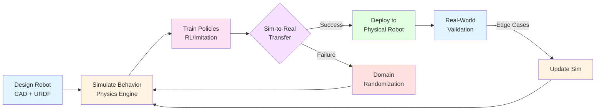
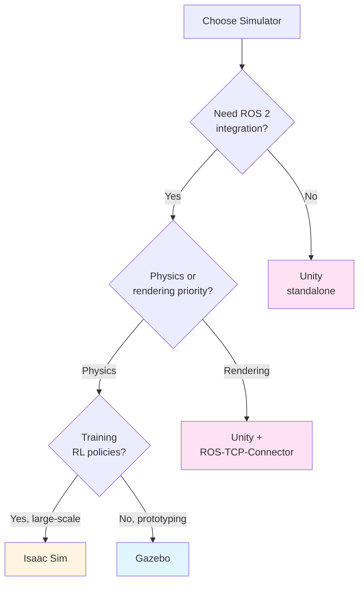
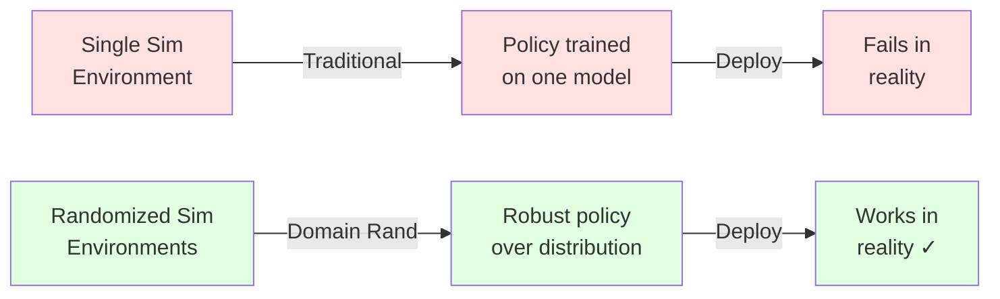

# Chapter 5: Simulation Basics

**Learning Objectives**:
- Understand why simulation is essential for robotics development
- Compare major simulation platforms: Gazebo, Unity, and Isaac Sim
- Learn the simulation-to-reality (sim-to-real) workflow
- Explore domain randomization for robust robot learning
- Identify when to use physics vs. visual rendering simulation

## 5.1 Why Simulate?

Robotics development faces unique challenges that make simulation not just helpful, but **essential**:

### The Robotics Development Challenge

Developing physical robots is:
- **Expensive**: Hardware costs $5,000–$500,000+ per unit
- **Slow**: Physical testing takes real-time (hours for data collection)
- **Risky**: Robot failures can cause damage or safety hazards
- **Limited**: Can only test one scenario at a time
- **Non-scalable**: Each researcher needs physical access to hardware

**Simulation solves these problems** by providing a **digital twin** of your robot that enables:

| Physical Robot | Simulation |
|----------------|------------|
| $50K–$500K cost | $0 marginal cost after setup |
| 1× real-time | 10–1000× faster than real-time |
| Risk of damage | Safe failures, unlimited resets |
| Sequential testing | Massively parallel experiments |
| Physical access required | Accessible anywhere with compute |

### Real-World Impact

Modern robotics breakthroughs depend on simulation:

- **OpenAI's Dactyl** (robotic hand): Trained for 100 years of simulated experience in 50 hours of wall-clock time using domain randomization
- **Boston Dynamics Atlas**: Motion planning algorithms tested in simulation before deployment, reducing physical prototyping cycles by 70%
- **Waymo self-driving cars**: Drive 10 billion simulated miles per year vs. 20 million physical miles
- **Tesla Autopilot**: Simulates 1 million+ edge cases that rarely occur in real driving

:::tip Key Insight
**Simulation is not optional** for modern robotics. It's the **only scalable way** to collect the millions of training examples needed for robust robot learning.
:::

## 5.2 The Simulation Workflow

Modern robotics development follows a **design → simulate → transfer → validate** cycle:



### Workflow Stages

1. **Design Robot**: Create CAD models and URDF descriptions (Chapter 4)
2. **Simulate Behavior**: Test physics, controls, and sensors in virtual environment
3. **Train Policies**: Use RL or imitation learning to learn behaviors (Module 4)
4. **Sim-to-Real Transfer**: Deploy trained policies to physical robot
5. **Validation**: Test in real world, identify gaps
6. **Update Simulation**: Improve simulator fidelity based on real-world data
7. **Iterate**: Repeat cycle until performance meets requirements

:::info Domain Randomization
When sim-to-real transfer fails, **domain randomization** (varying physics parameters in simulation) creates robustness to modeling errors. We'll explore this in detail in Section 5.4.
:::

## 5.3 Simulation Platform Comparison

Three major platforms dominate robotics simulation, each optimized for different use cases:

### Platform Overview

| Platform | Primary Strength | Best For | Open Source |
|----------|-----------------|----------|-------------|
| **Gazebo** | Physics accuracy | ROS-centric robotics, manipulation | ✅ Yes (Apache 2.0) |
| **Unity** | Visual rendering | Human-robot interaction, data labeling | ⚠️ Free (proprietary) |
| **Isaac Sim** | GPU acceleration | Large-scale RL training, synthetic data | ⚠️ Free (proprietary) |

### Detailed Comparison

#### Gazebo (Ignition Gazebo / Gazebo Fortress+)

**What it is**: Open-source physics simulator tightly integrated with ROS/ROS 2.

**Strengths**:
- **Native ROS 2 integration**: Plugins publish/subscribe to ROS topics directly
- **Physics accuracy**: Uses ODE, Bullet, DART, or Simbody physics engines
- **Sensor simulation**: Camera, LiDAR, IMU, depth sensors with realistic noise models
- **Large ecosystem**: Hundreds of pre-built robot models (TurtleBot, Husky, PR2)
- **Free and open source**: No licensing costs, full customization

**Weaknesses**:
- **Visual quality**: Basic rendering compared to game engines
- **Performance**: CPU-bound, limited parallelization (1–10× real-time typical)
- **Learning curve**: XML-based configuration can be verbose

**Use cases**:
- Mobile robot navigation (Nav2, SLAM)
- Manipulation with realistic contact physics
- Multi-robot systems
- ROS 2 algorithm prototyping

**Code Example: Spawning a robot in Gazebo**:
```bash
# Launch empty world
ros2 launch gazebo_ros gazebo.launch.py

# Spawn TurtleBot3 from URDF
ros2 run gazebo_ros spawn_entity.py \
  -entity turtlebot3 \
  -file /path/to/turtlebot3.urdf \
  -x 0 -y 0 -z 0.1
```

#### Unity with ROS-TCP-Connector

**What it is**: Professional game engine with Unity Robotics Hub for ROS integration.

**Strengths**:
- **Photorealistic rendering**: High-quality graphics for human-robot interaction
- **Visual sensors**: RGB cameras, depth estimation, semantic segmentation
- **Human simulation**: Crowd behavior, articulated human models
- **Cross-platform**: Windows, Linux, macOS, mobile, VR/AR
- **Asset store**: Thousands of 3D models (environments, objects, humans)

**Weaknesses**:
- **Physics limitations**: PhysX less accurate than dedicated robotics physics engines
- **ROS integration overhead**: Requires ROS-TCP-Connector (adds latency)
- **Proprietary**: Not fully open source (free tier has limitations)
- **Learning curve**: Game engine concepts (GameObjects, prefabs) differ from robotics tools

**Use cases**:
- Computer vision dataset generation (semantic/instance segmentation)
- Human-robot interaction scenarios (service robots, assistive robotics)
- Training perception models (object detection, pose estimation)
- VR/AR robot teleoperation interfaces

**Code Example: Unity perception data collection**:
```csharp
// Unity script to publish RGB + depth to ROS
public class CameraPublisher : MonoBehaviour {
    ROSConnection ros;

    void Start() {
        ros = ROSConnection.GetOrCreateInstance();
        ros.RegisterPublisher<ImageMsg>("camera/image_raw");
    }

    void Update() {
        ImageMsg msg = CaptureRGBImage();
        ros.Publish("camera/image_raw", msg);
    }
}
```

#### NVIDIA Isaac Sim

**What it is**: GPU-accelerated simulator built on NVIDIA Omniverse, optimized for large-scale robot learning.

**Strengths**:
- **GPU acceleration**: PhysX 5 runs entirely on GPU (100–1000× real-time possible)
- **Massive parallelization**: Train 1000s of robots in parallel on single GPU
- **RTX rendering**: Ray-traced graphics for photorealistic synthetic data
- **Synthetic data generation**: Domain randomization for training perception models
- **Isaac Gym integration**: Built-in RL framework for robot learning
- **ROS/ROS 2 support**: Native bridges for sensor data and control

**Weaknesses**:
- **Hardware requirements**: Requires NVIDIA RTX GPU (expensive: $1,500–$15,000)
- **Proprietary**: Free but closed-source, NVIDIA ecosystem lock-in
- **Complexity**: Steep learning curve (Omniverse, USD file format, Isaac SDK)
- **Limited ecosystem**: Fewer pre-built models compared to Gazebo

**Use cases**:
- Reinforcement learning for manipulation (10K+ parallel envs)
- Synthetic data generation for perception (millions of labeled images)
- Warehouse automation (multi-robot systems at scale)
- Research requiring both physics accuracy and visual fidelity

**Code Example: Isaac Sim domain randomization**:
```python
# Randomize object poses and physics properties
from omni.isaac.core.utils.random import RandomColors, RandomPhysics

randomizer = RandomPhysics(
    mass_range=(0.1, 2.0),  # kg
    friction_range=(0.3, 1.2),
    restitution_range=(0.0, 0.8)
)

for obj in scene_objects:
    randomizer.apply(obj)  # Different physics per reset
```

### Decision Matrix: Which Simulator?



**Decision guide**:
- **Gazebo**: Default for ROS 2 navigation, manipulation, SLAM
- **Unity**: Computer vision datasets, human-robot interaction
- **Isaac Sim**: Large-scale RL training, synthetic data at scale

:::tip Pro Tip
Many teams use **multiple simulators**: Gazebo for algorithm development, Isaac Sim for RL training, and Unity for final perception validation. Each tool excels at different tasks.
:::

## 5.4 The Sim-to-Real Gap

The **reality gap** is the difference between simulated and real-world robot performance. Even with perfect simulators, models can never capture all real-world complexity:

### Sources of Reality Gap

| Simulation Assumption | Real-World Reality |
|-----------------------|-------------------|
| Perfect actuators with instant response | Motors have delays, backlash, wear |
| Frictionless or uniform friction | Contact varies by surface, humidity, wear |
| Known object properties (mass, inertia) | Properties uncertain or change over time |
| Noiseless sensors | Sensors have drift, bias, occlusions |
| Static environments | Lighting changes, moving obstacles |
| Deterministic physics | Stochastic real-world dynamics |

### Real-World Example: The Dactyl Failure

OpenAI's Dactyl robotic hand initially failed when deployed:
- **In simulation**: Cube manipulation worked 95% of the time
- **In reality**: Only 20% success rate on physical robot

**Root causes**:
1. Simulated friction coefficients didn't match real cube coating
2. Motor response delays not modeled (5–10ms lag)
3. Vision system lighting sensitivity not captured in sim

**Solution**: Domain randomization (see Section 5.5) increased real-world success to 80%.

## 5.5 Domain Randomization

**Domain randomization** is a technique that **intentionally varies simulation parameters** to force the robot to learn policies robust to modeling errors.

### Core Idea

Instead of trying to perfectly model reality (impossible), we:
1. **Randomize everything** in simulation (physics, appearance, sensor noise)
2. Train on **distribution of environments** (not single accurate model)
3. Hope that **reality is within the randomized distribution**

If successful, the robot learns a **robust policy** that works despite sim-to-real mismatch.



### What to Randomize

**Visual Randomization** (for perception):
- **Lighting**: Intensity, color temperature, shadows
- **Textures**: Object materials, floor patterns
- **Camera**: Focal length, resolution, noise, motion blur
- **Backgrounds**: Clutter, distractors, dynamic elements

**Physics Randomization** (for control):
- **Object properties**: Mass, friction, restitution, size
- **Robot parameters**: Link lengths, joint damping, motor strength
- **Dynamics**: Gravity, air resistance, contact models
- **Sensor noise**: IMU bias, camera noise, LiDAR dropout

### Example: Grasping with Domain Randomization

**Task**: Train robotic arm to grasp household objects.

**Without domain randomization**:
```python
# Fixed simulation parameters
object_mass = 0.5  # kg
object_friction = 0.6
gripper_force = 50  # N
# Result: 90% sim success → 30% real success (overfitting!)
```

**With domain randomization**:
```python
import numpy as np

# Randomize on each episode reset
object_mass = np.random.uniform(0.1, 2.0)  # kg
object_friction = np.random.uniform(0.2, 1.2)
gripper_force = np.random.uniform(40, 60)  # N
object_size = np.random.uniform(0.8, 1.2) * nominal_size
# Result: 75% sim success → 70% real success (generalizes!)
```

**Key insight**: We **sacrifice simulation performance** (90% → 75%) to gain **real-world robustness** (30% → 70%).

### When Domain Randomization Works

Domain randomization is most effective when:
- ✅ **Task is robust**: Some variation in behavior is acceptable
- ✅ **Parameters are bounded**: We know rough ranges (e.g., object mass 0.1–2kg)
- ✅ **Training data is cheap**: Can simulate millions of randomized episodes
- ✅ **Perception or control**: Visual or dynamics tasks (not precise positioning)

Domain randomization struggles with:
- ❌ **High precision tasks**: Surgery, micro-assembly (tolerances too tight)
- ❌ **Unbounded parameters**: When we don't know what to randomize
- ❌ **Rare events**: Safety-critical scenarios that need explicit modeling
- ❌ **Contact-rich tasks**: Peg-in-hole, gear meshing (physics too complex)

## 5.6 Practical Workflow

Here's a practical process for using simulation effectively:

### Phase 1: Build Accurate Sim (Week 1-2)
1. **Import URDF** of your robot (Chapter 4)
2. **Calibrate physics**: Measure real robot's link masses, friction from experiments
3. **Validate sensors**: Compare simulated LiDAR/camera to real data
4. **Sanity checks**: Simple open-loop motions should match reality

### Phase 2: Develop Algorithm (Weeks 3-8)
1. **Use Gazebo** for ROS 2 algorithm prototyping (navigation, SLAM)
2. **Fast iteration**: 10–100× faster than real robot testing
3. **Unit tests**: Verify edge cases (e.g., narrow doorways, stairs)
4. **Visualization**: Use RViz2 to debug perception and planning

### Phase 3: Apply Domain Randomization (Weeks 9-10)
1. **Identify failure modes** from initial real-world tests
2. **Randomize suspect parameters**: Friction, delays, sensor noise
3. **Retrain policies** on randomized simulation
4. **A/B test**: Compare randomized vs. non-randomized on real robot

### Phase 4: Deploy & Iterate (Week 11+)
1. **Deploy to physical robot** with safety measures
2. **Log discrepancies**: Record when simulation predictions fail
3. **Update simulation**: Improve models based on real-world data
4. **Continuous improvement**: Repeat cycle as environment changes

### Example Timeline: Autonomous Navigation

| Week | Task | Tool | Success Metric |
|------|------|------|----------------|
| 1 | Build accurate robot URDF | Gazebo + RViz2 | Joint positions match ±5° |
| 2 | Implement Nav2 stack | Gazebo + ROS 2 | Navigate 10m indoor environment |
| 3-4 | Test obstacle avoidance | Gazebo scenarios | 95% collision-free in sim |
| 5 | Calibrate LiDAR/camera | Real robot | Sensor error `less than 5cm` |
| 6 | Domain randomization | Gazebo w/ varied floors | Robust to surface types |
| 7 | Real-world validation | Physical robot | 85%+ of sim performance |
| 8+ | Deploy & iterate | Continuous logging | Zero safety incidents |

## 5.7 Best Practices

### Do's ✅

1. **Start simple**: Test basic motions before complex behaviors
2. **Measure, don't guess**: Calibrate physics parameters from real data
3. **Randomize early**: Domain randomization is easier than precise modeling
4. **Log everything**: Record simulation vs. reality discrepancies
5. **Use multiple tools**: Gazebo for physics, Unity for vision, Isaac for RL

### Don'ts ❌

1. **Don't trust simulation blindly**: Always validate on real hardware
2. **Don't over-optimize for sim**: High sim performance ≠ real success
3. **Don't ignore edge cases**: Simulate rare but critical scenarios
4. **Don't skip calibration**: "Close enough" physics causes subtle bugs
5. **Don't randomize everything**: Focus on parameters with high uncertainty

## 5.8 Comprehension Questions

Test your understanding:

1. **Why is simulation essential** for modern robotics development? Name 3 specific advantages over physical testing.

2. **Comparison**: When would you choose Gazebo over Isaac Sim? When would you choose Isaac Sim over Gazebo? Give 2 use cases for each.

3. **Sim-to-real gap**: A quadcopter trained in simulation crashes immediately in the real world. List 4 possible sources of the reality gap and how to address each.

4. **Domain randomization**: You're training a robotic arm to grasp mugs. Which 3 parameters should you randomize, and what ranges would you use?

5. **Workflow**: You have 12 weeks to develop a mobile robot that delivers packages in an office. Sketch a week-by-week plan using the simulation workflow from Section 5.6.

## Key Takeaways

:::info Remember
1. **Simulation is not optional** for scalable robotics development - it's 100–1000× faster and safer than physical testing
2. **Choose the right tool**: Gazebo for physics, Unity for rendering, Isaac Sim for large-scale learning
3. **Reality gap exists**: Even perfect simulators can't capture all real-world complexity
4. **Domain randomization works**: Sacrifice sim performance for real-world robustness
5. **Iterate continuously**: Simulation → Deploy → Measure → Update → Repeat
:::

## References

1. **Tobin, J., et al. (2017)**. "Domain Randomization for Transferring Deep Neural Networks from Simulation to the Real World." *IEEE/RSJ International Conference on Intelligent Robots and Systems (IROS)*. [[arXiv:1703.06907](https://arxiv.org/abs/1703.06907)]
   - Introduced domain randomization for sim-to-real transfer in robotic grasping.

2. **Akkaya, I., et al. (2019)**. "Solving Rubik's Cube with a Robot Hand." *OpenAI Blog*. [[OpenAI](https://openai.com/research/solving-rubiks-cube)]
   - Dactyl project: 100 years of simulated experience with domain randomization.

3. **Collins, J., et al. (2021)**. "A Review of Physics Simulators for Robotic Applications." *IEEE Access*, 9, 51416-51431. [[DOI:10.1109/ACCESS.2021.3068769](https://doi.org/10.1109/ACCESS.2021.3068769)]
   - Comprehensive comparison of Gazebo, MuJoCo, PyBullet, and Isaac Sim.

---

**Next**: [Chapter 6: Gazebo Physics Engine →](./06-gazebo-physics.md)
