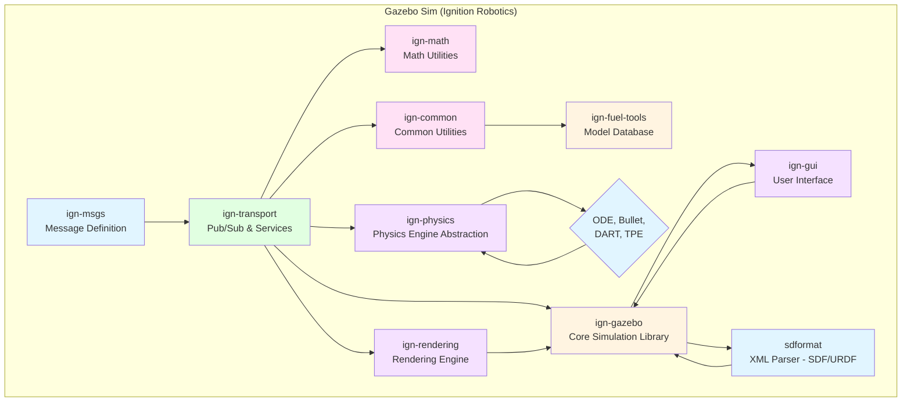
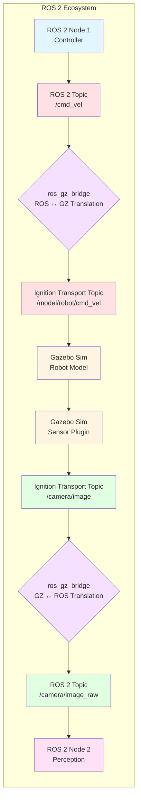

# Chapter 6: Gazebo Physics Engine

**Learning Objectives**:
- Understand the evolution of Gazebo (Classic vs. Garden)
- Grasp the core architecture of Gazebo and its components
- Learn to create and launch Gazebo worlds using SDF files
- Integrate ROS 2 with Gazebo for robot control and sensor data
- Configure realistic physics properties and sensors for simulated robots

## 6.1 Gazebo: A Tale of Two Simulators

Gazebo has been the de facto standard for robotics simulation in the ROS ecosystem for over a decade. However, with the transition from ROS 1 to ROS 2, Gazebo itself underwent a significant architectural overhaul, leading to two distinct versions:

### Gazebo Classic (Legacy)

**Gazebo Classic** (versions 7 through 11) was developed alongside ROS 1 and features tight integration with its middleware. It's still widely used for legacy ROS 1 projects and some simpler ROS 2 setups via a `ros1_bridge` or basic ROS 2 plugins.

**Key Characteristics**:
- **Monolithic architecture**: Core simulation, rendering, and UI were tightly coupled.
- **ROS 1 Native**: Primarily designed for ROS 1, with ROS 2 support being an add-on.
- **Older physics engines**: Limited to ODE, Bullet, Simbody.
- **Graphical User Interface (GUI)**: Rich, integrated GUI for direct interaction.
- **Plugin system**: C++ plugins for custom sensors, actuators, and behaviors.

### Gazebo Garden (Modern / Ignition Gazebo)

**Gazebo Garden** (and its successors like Fortress, Harmonic, etc., collectively known as **Ignition Gazebo**) represents a complete rewrite, designed from the ground up to be modular, scalable, and ROS-agnostic. It leverages the **Ignition Robotics (now Gazebo Sim)** suite of libraries, offering greater flexibility and performance, especially for ROS 2.

**Key Characteristics**:
- **Modular architecture**: Separates core simulation, rendering, and GUI into distinct libraries (`ign-gazebo`, `ign-rendering`, `ign-gui`).
- **ROS 2 Native**: Designed for seamless integration with ROS 2 using native bridges (e.g., `ros_gz_bridge`).
- **Modern physics engines**: Supports DART, TPE (Triton Physics Engine), and offers better integration for external physics libraries.
- **Flexible GUI**: The `ign-gui` is a separate component, allowing for custom UIs or headless simulation.
- **Distributed simulation**: Built for cloud and parallel simulation scenarios.

### Comparison Table: Gazebo Classic vs. Gazebo Garden

| Feature           | Gazebo Classic (e.g., Gazebo 11) | Gazebo Garden (e.g., Gazebo Sim 7+) |
|-------------------|----------------------------------|-------------------------------------|
| **Architecture**  | Monolithic                       | Modular (Ignition Libraries)        |
| **ROS Integration** | ROS 1 native, ROS 2 via bridge/plugins | ROS 2 native via `ros_gz_bridge`  |
| **Middleware**    | ROS 1, custom transport          | ROS 2, Ignition Transport           |
| **Physics Engines** | ODE, Bullet, Simbody           | DART, TPE, more flexible            |
| **GUI**           | Integrated, richer               | Modular `ign-gui`, customizable     |
| **Scalability**   | Limited                          | Designed for distribution, headless |
| **API**           | `libgazebo`, `sdformat` 1.x      | `ign-gazebo`, `sdformat` 9.x+       |
| **Current Status** | Maintenance mode                | Active development, future of Gazebo |

:::info Important Note
Throughout this book, when we refer to "Gazebo," we will primarily be using **Gazebo Garden (Ignition Gazebo)** due to its native ROS 2 support, modularity, and alignment with modern robotics development practices. While the principles of simulation often carry over, specific commands and configurations will follow the Garden syntax.
:::

## 6.2 Gazebo Architecture

Gazebo Garden's modular design is built upon a set of independent libraries from the **Ignition Robotics (Gazebo Sim)** project. Understanding this architecture is key to leveraging its full power.



### Core Components

1. **`ign-gazebo` (Core Simulation)**: The central library managing the simulation loop, world state, and entity interactions.
2. **`ign-rendering` (Rendering)**: Handles graphical visualization, supporting various render engines (OGRE, OptiX).
3. **`ign-physics` (Physics Abstraction)**: Provides a common interface for different physics engines (ODE, Bullet, DART, TPE), allowing you to swap them out.
4. **`ign-transport` (Communication)**: A high-performance, ROS-agnostic pub/sub and service framework for inter-process communication within the Ignition ecosystem.
5. **`ign-msgs` (Message Definitions)**: Standard messages used by `ign-transport`.
6. **`ign-gui` (Graphical User Interface)**: A modular GUI library that allows users to customize their simulation interface with drag-and-drop widgets.
7. **`sdformat` (Simulation Description Format)**: An XML file format (similar to URDF, but for entire worlds and environments) used to describe robots, environments, and simulation properties.

### ROS 2 Integration with `ros_gz_bridge`

The bridge library `ros_gz_bridge` is crucial for connecting ROS 2 with Gazebo Garden. It translates messages between `ign-transport` and ROS 2 topics, allowing your ROS 2 nodes to control robots in simulation and receive sensor data.



**How it works**:
1. **ROS 2 Node publishes command** (e.g., `/cmd_vel` to move robot).
2. **`ros_gz_bridge`** translates this ROS 2 message to an `ign-transport` message.
3. **Gazebo Sim receives command** and applies it to the robot model.
4. **Gazebo Sim sensor plugin publishes data** (e.g., camera image) to an `ign-transport` topic.
5. **`ros_gz_bridge`** translates this back to a ROS 2 message.
6. **ROS 2 Node receives sensor data** for perception or other processing.

## 6.3 Creating a Gazebo World (SDF)

Simulation Description Format (SDF) is the XML format used to describe everything in a Gazebo world: terrain, lights, static objects, and robots. While URDF (Chapter 4) describes a single robot, SDF describes the entire environment.

### Key SDF Elements

- `<sdf>`: Root element, specifies SDF version (always use latest stable).
- `<world>`: Defines a simulation environment, typically named `default`.
- `<physics>`: Configures the physics engine (type, step size, real-time factor).
  - `max_step_size`: Time step for physics calculations (smaller = more accurate, slower).
  - `real_time_factor`: Ratio of simulated time to real time (1.0 = real-time).
  - `real_time_update_rate`: Max frequency for GUI updates.
- `<light>`: Defines light sources (directional, point, spot).
- `<model>`: Represents an object in the world (can be a robot, a building, etc.).
  - `<static>true</static>`: Makes the model immovable (e.g., ground plane, walls).
  - `<link>`: A rigid body within the model (like in URDF).
  - `<collision>`: Defines the collision geometry for physics interactions.
  - `<visual>`: Defines the visual appearance for rendering.
  - `<include>`: Imports models from the Gazebo Fuel online model database.

**Example World File**: See [`simple_world.sdf`](https://github.com/your-repo/physical-ai-code/blob/main/examples/simulation/simple_world.sdf) for a complete example with ground plane, lighting, and a dynamic box object.

## 6.4 Spawning Robots and Objects

After defining your world, you'll want to add robots and other dynamic objects. In Gazebo Garden, you can insert URDF models into your SDF world or spawn them dynamically.

### Dynamic Spawning with ROS 2

For more flexible control, especially when working with multiple robots or starting a robot at a specific pose, you can dynamically spawn models using the `ros_gz_sim` package.

```bash
# Terminal 1: Launch Gazebo empty world
ros2 launch gazebo_ros_pkgs gazebo.launch.py

# Terminal 2: Spawn your URDF robot into the world
ros2 run ros_gz_sim create --topic /spawn_entity --entity my_humanoid \
  --file /path/to/humanoid.urdf --x 0 --y 0 --z 1.0
```

**Key parameters for `ros_gz_sim create`**:
- `--topic /spawn_entity`: The Gazebo topic to send the spawn request.
- `--entity <name>`: The unique name for your spawned model.
- `--file <path_to_urdf>`: Absolute path to your robot's URDF file.
- `--x, --y, --z`: Initial position (meters).
- `--R, --P, --Y`: Initial orientation (Roll, Pitch, Yaw in radians).

## 6.5 Gazebo Physics and Sensors

Gazebo's strength lies in its ability to simulate realistic physics and sensor data. This is crucial for developing robust control and perception algorithms.

### Physics Configuration

Within the `<physics>` tag of your SDF, you can adjust global parameters. For fine-grained control, individual `<link>` and `<joint>` elements in URDF (which Gazebo converts to SDF) support physics properties:

- **`<inertial>`**: (from URDF) Mass, inertia tensor for realistic dynamics.
- **`<surface>`**: Material properties for friction, restitution, contact parameters.
- **`<plugin>`**: Extend Gazebo's behavior with custom C++ code.

### Common Sensor Types

1. **Camera**: RGB, depth, and grayscale images.
   - **SDF Tag**: `<sensor name='camera' type='camera'>`
   - **Parameters**: Field of view, image resolution, update rate, noise model.
   - **ROS 2 Output**: `sensor_msgs/msg/Image`, `sensor_msgs/msg/CameraInfo`.

2. **LiDAR (Ray Sensor)**: Distance measurements using ray casting.
   - **SDF Tag**: `<sensor name='lidar' type='ray'>`
   - **Parameters**: Number of rays, min/max range, horizontal/vertical angles.
   - **ROS 2 Output**: `sensor_msgs/msg/LaserScan`, `sensor_msgs/msg/PointCloud2`.

3. **IMU (Inertial Measurement Unit)**: Orientation, angular velocity, linear acceleration.
   - **SDF Tag**: `<sensor name='imu' type='imu'>`
   - **Parameters**: Noise characteristics (gaussian, bias).
   - **ROS 2 Output**: `sensor_msgs/msg/Imu`.

4. **Contact Sensor**: Detects collisions.
   - **SDF Tag**: `<sensor name='contact' type='contact'>`
   - **Parameters**: Collision link.
   - **ROS 2 Output**: `gazebo_msgs/msg/ContactsState`.

## 6.6 Launching Gazebo with ROS 2

To integrate Gazebo with your ROS 2 system, you typically use a ROS 2 launch file to start Gazebo, spawn your robot, and bring up necessary bridges and controllers.

**Example Launch File**: See [`gazebo_spawn_humanoid.launch.py`](https://github.com/your-repo/physical-ai-code/blob/main/examples/simulation/gazebo_spawn_humanoid.launch.py) for a complete example that:
- Launches Gazebo with a custom SDF world
- Spawns a humanoid URDF robot at a specific pose
- Configures `ros_gz_bridge` to translate topics between ROS 2 and Gazebo

### Launch File Key Components

1. **`robot_description_path`**: Locates your robot's URDF using `ament_index_python`.
2. **`gazebo_launch`**: Uses `IncludeLaunchDescription` to launch the core `gz_sim.launch.py` from `ros_gz_sim`.
3. **`spawn_robot`**: A `Node` action that runs `ros_gz_sim create` to spawn your robot model.
4. **`ros_gz_bridge`**: Another `Node` action that runs `ros_gz_bridge parameter_bridge`.
   - `arguments`: A list of topic mappings in the format `ROS_TOPIC@ROS_TYPE@GZ_TYPE`.

## 6.7 Advanced Gazebo Features

### World Customization

- **Terrain Generation**: Create complex landscapes with heightmaps.
- **Plugins**: Extend Gazebo with custom behaviors, sensors, or communication interfaces.
- **Environment Manipulation**: Dynamically change lighting, add/remove objects at runtime via Gazebo's API.

### Debugging and Visualization

- **Ignition GUI**: The modern GUI for Gazebo Garden provides tools for inspecting models, viewing sensor data, and controlling simulation playback.
- **RViz2**: Still the primary visualization tool for ROS 2. `ros_gz_bridge` allows you to visualize Gazebo sensor data (e.g., camera images, LiDAR scans) directly in RViz2.
- **Logging and Playback**: Gazebo can record entire simulation sessions (`.log` files), which can be replayed for debugging or analysis.

### Performance Optimization

- **Headless Mode**: Run Gazebo without a GUI for maximum performance, especially for batch simulations or RL training.
- **Multi-threaded Physics**: Utilize multiple CPU cores for physics calculations.
- **GPU Rendering**: Leverage GPU for rendering if visual fidelity is important.
- **Reduced Fidelity**: Simplify collision meshes, reduce sensor update rates for faster simulations when high accuracy is not critical.

## 6.8 Comprehension Questions

1. **Gazebo Evolution**: What are the main architectural differences between Gazebo Classic and Gazebo Garden, and why is Garden preferred for ROS 2 development?

2. **SDF vs. URDF**: Explain the primary purpose of SDF and how it differs from URDF. Provide an example of what each file type would typically describe.

3. **ROS 2 Bridge**: Describe the role of `ros_gz_bridge` in a ROS 2 + Gazebo Garden setup. If your robot publishes `/tf` messages in Gazebo, what would the `parameter_bridge` argument look like to make them available in ROS 2?

4. **Physics & Sensors**: You are simulating a mobile robot with a forward-facing camera and a LiDAR sensor. How would you configure:
   - The ground plane to have a high friction coefficient?
   - The camera sensor to publish RGB images at 640x480 resolution with a 30Hz update rate?
   - The LiDAR sensor to cover a 180° field of view with 360 rays?

5. **Launch File**: Outline the key components of a ROS 2 launch file that starts an empty Gazebo world, spawns a URDF robot named `my_robot`, and bridges the `/cmd_vel` topic (Twist message) from ROS 2 to Gazebo, and `/scan` topic (LaserScan message) from Gazebo to ROS 2.

## Key Takeaways

:::info Remember
- **Gazebo Garden** (Ignition Gazebo) is the modern, modular simulator for ROS 2.
- **`sdformat` (SDF)** describes entire worlds, while **URDF** describes individual robots.
- **`ros_gz_bridge`** is essential for ROS 2 ↔ Gazebo communication.
- **Physics and sensor configuration** are key to realistic simulations.
- **ROS 2 launch files** orchestrate starting Gazebo, spawning robots, and bridging topics.
:::

## References

1. **Open Robotics**. *Gazebo Documentation*. [[Gazebo Docs](https://gazebosim.org/docs)]
   - Official documentation for Gazebo Classic and Gazebo Sim (Ignition).

2. **ROS 2 Documentation**. *ROS 2 Galactic Gazebo Bridge Tutorials*. [[ROS 2 Docs](https://docs.ros.org/en/galactic/Tutorials/Simulators/Gazebo/Gazebo-ROS2-Integration.html)]
   - Tutorials on integrating ROS 2 with Gazebo Classic (older) and Gazebo Garden.

3. **Koenig, N., & Howard, A. (2004)**. "Design and use paradigms for Gazebo, an open-source multi-robot simulator." *IEEE/RSJ International Conference on Intelligent Robots and Systems (IROS)*, 3, 2149-2154. [[DOI:10.1109/IROS.2004.1389727](https://doi.org/10.1109/IROS.2004.1389727)]
   - Original Gazebo paper describing its architecture and design philosophy.

4. **Open Robotics**. *Ignition Gazebo: Architecture and Design*. [[Ignition Docs](https://gazebosim.org/api/gazebo/7/architecture.html)]
   - Details the modular architecture and component design of Ignition Gazebo.

---

**Previous**: [← Chapter 5: Simulation Basics](./05-simulation-basics.md)
**Next**: [Chapter 7: Unity Rendering →](./07-unity-rendering.md)
