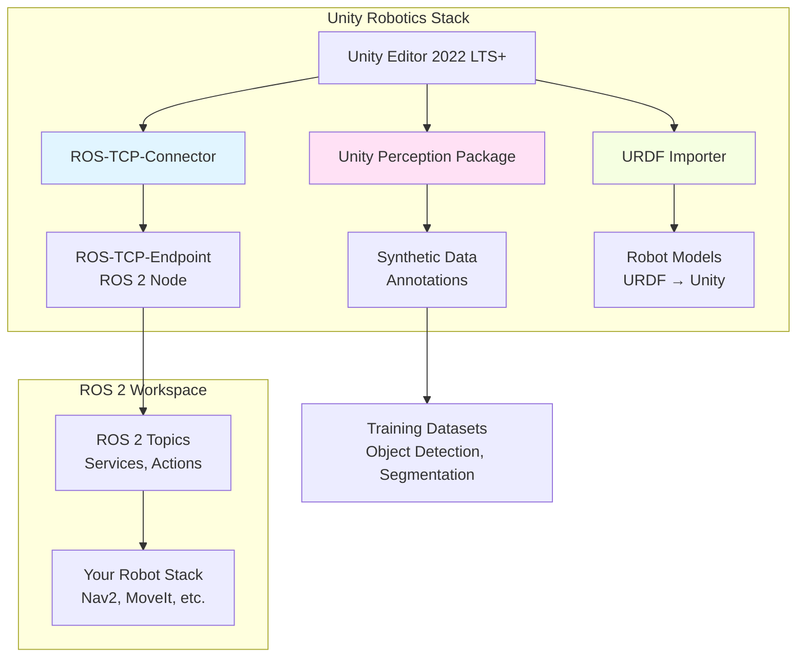
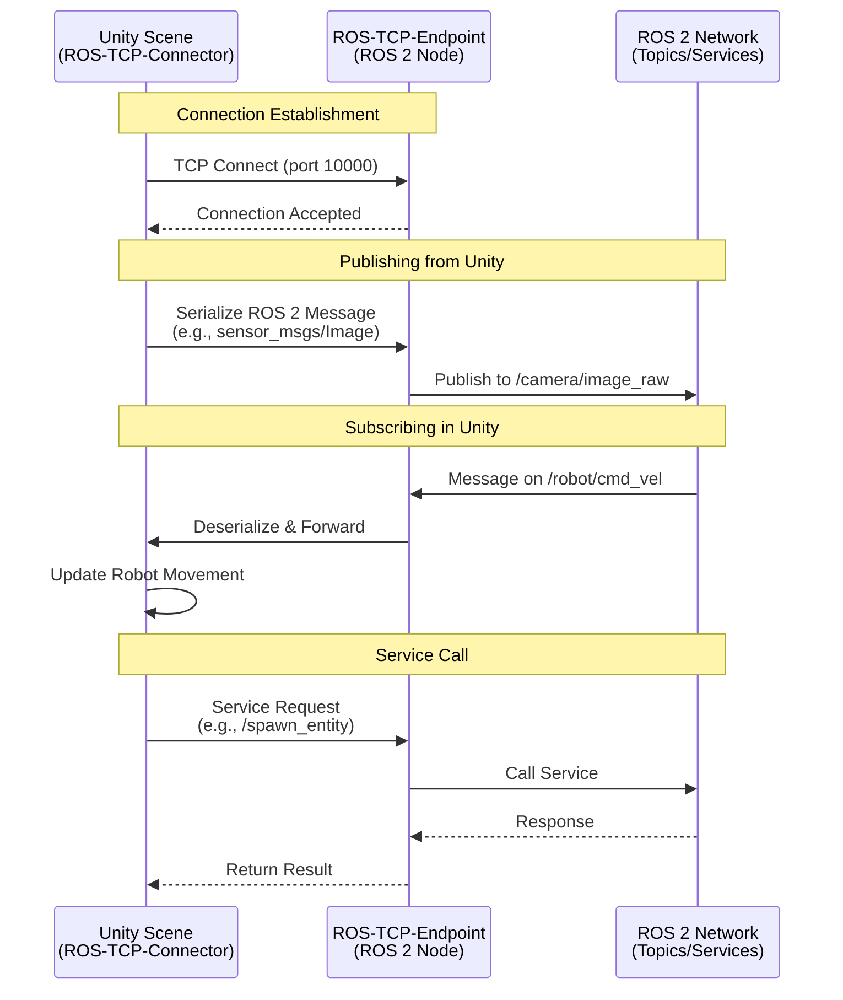
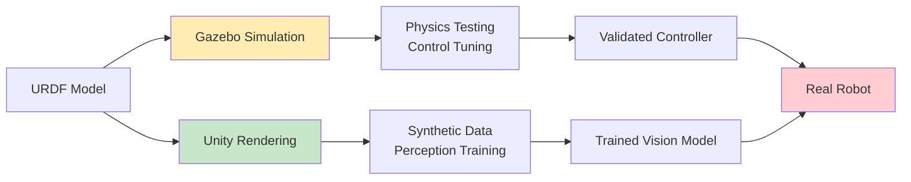

# Chapter 7: Unity Rendering for Robotics

:::info Learning Objectives
By the end of this chapter, you will:
- Understand Unity's role in robotics simulation and visualization
- Compare Unity's rendering capabilities with Gazebo
- Set up ROS-TCP-Connector for Unity-ROS 2 integration
- Generate synthetic training data using Unity Perception
- Implement realistic visual scenarios for human-robot interaction
:::

## Introduction

While Gazebo excels at physics simulation and sensor modeling, **Unity** offers photorealistic rendering, advanced graphics capabilities, and powerful tools for creating visually rich environments. This makes Unity an ideal complement to Gazebo for robotics applications requiring:

- **Photorealistic visualization** for demonstrations and presentations
- **Synthetic data generation** for computer vision training
- **Human-robot interaction (HRI)** scenarios with realistic avatars
- **AR/VR integration** for teleoperation and spatial computing

Unity is not a replacement for Gazebo—it's a specialized tool for visual fidelity and perception tasks. Many robotics teams use **both**: Gazebo for physics-accurate control development, and Unity for perception, synthetic data, and visualization.

---

## Unity vs. Gazebo: Complementary Tools

| Aspect | Gazebo (Garden/Classic) | Unity (2022 LTS+) |
|--------|-------------------------|-------------------|
| **Primary Strength** | Physics simulation, sensor accuracy | Photorealistic rendering, graphics |
| **Physics Engine** | ODE, Bullet, DART (highly accurate) | PhysX, Havok (game-oriented) |
| **Rendering** | Basic OGRE/custom (functional) | HDRP/URP pipelines (photorealistic) |
| **ROS Integration** | Native (`ros_gz_bridge`) | Via ROS-TCP-Connector |
| **Sensor Simulation** | Accurate noise models, validated | Perception package (synthetic data) |
| **Performance** | Optimized for robotics workloads | Optimized for graphics (GPU-heavy) |
| **Use Cases** | Control development, sensor testing | Perception training, HRI, demos |
| **Learning Curve** | Moderate (robotics background) | Steep (game engine concepts) |
| **License** | Open source (Apache 2.0) | Free (Personal), paid (Pro/Enterprise) |

**Best Practice**: Use Gazebo as your primary simulation environment for physics and control, then integrate Unity when you need:
- Training data for deep learning perception models
- High-quality visualization for stakeholders
- Human avatars and realistic environments for HRI research

---

## Unity Architecture for Robotics

Unity's robotics capabilities are built on three key packages:



### Key Components

1. **ROS-TCP-Connector** (Unity package)
   - Establishes TCP connection between Unity and ROS 2
   - Serializes/deserializes ROS messages in Unity
   - Supports publishers, subscribers, services, actions

2. **ROS-TCP-Endpoint** (ROS 2 package)
   - ROS 2 node that bridges TCP to ROS 2 topics
   - Runs on your robot/workstation
   - Handles message translation and routing

3. **Unity Perception Package**
   - Generates labeled synthetic data (bounding boxes, segmentation masks)
   - Configurable randomizers for domain randomization
   - Exports datasets in COCO, Pascal VOC formats

4. **URDF Importer**
   - Converts URDF files to Unity GameObjects
   - Preserves joint structure and collision geometry
   - Imports meshes and materials

---

## Setting Up Unity for ROS 2

### Prerequisites

```bash
# Unity Hub and Unity Editor 2022 LTS (install from unity.com)
# Ensure you have ROS 2 Humble installed

# Install ROS-TCP-Endpoint in your ROS 2 workspace
cd ~/ros2_ws/src
git clone https://github.com/Unity-Technologies/ROS-TCP-Endpoint.git
cd ~/ros2_ws
colcon build --packages-select ros_tcp_endpoint
source install/setup.bash
```

### Unity Project Setup

1. **Create Unity Project** (Unity Hub → New Project → 3D URP)
2. **Install Robotics Packages** (Window → Package Manager):
   - ROS-TCP-Connector
   - URDF Importer
   - Unity Perception (optional, for synthetic data)

3. **Configure ROS Settings** (Robotics → ROS Settings):
   ```
   ROS IP Address: 127.0.0.1  # Or your robot's IP
   ROS Port: 10000
   Protocol: ROS 2
   Serializer: Message Generation
   ```

### Communication Pipeline



---

## Unity Perception for Synthetic Data

One of Unity's most powerful features for robotics is **synthetic data generation**. Training deep learning models requires thousands of labeled images—Unity can generate these automatically.

### Perception Workflow

1. **Create Environment**: Design diverse scenes (warehouses, homes, outdoor)
2. **Add Randomizers**: Vary lighting, textures, object positions
3. **Configure Labelers**: Define what to capture (bounding boxes, semantic segmentation)
4. **Run Simulation**: Generate 10,000+ labeled images in minutes
5. **Export Dataset**: COCO/Pascal VOC format for YOLOv8, Mask R-CNN, etc.

### Example: Object Detection Dataset

```csharp
// PerceptionCamera.cs - Attach to Unity Camera
using UnityEngine;
using UnityEngine.Perception.GroundTruth;

public class DatasetGenerator : MonoBehaviour
{
    void Start()
    {
        var perceptionCamera = GetComponent&lt;PerceptionCamera&gt;();

        // Add 2D bounding box labeler
        var boundingBoxLabeler = new BoundingBox2DLabeler();
        perceptionCamera.AddLabeler(boundingBoxLabeler);

        // Add semantic segmentation labeler
        var segmentationLabeler = new SemanticSegmentationLabeler();
        perceptionCamera.AddLabeler(segmentationLabeler);
    }
}
```

**Domain Randomization** is critical for generalization. Unity's Perception package includes randomizers for:
- **Lighting**: HDR skyboxes, point lights, shadows
- **Textures**: Material properties, colors
- **Object Placement**: Position, rotation, scale
- **Camera**: FOV, resolution, post-processing

This creates diverse training data that helps models generalize to real-world conditions.

---

## Use Case: Humanoid Robot in Unity

Let's visualize our humanoid robot from Tutorial 2 in Unity with photorealistic rendering.

### Step 1: Import URDF

```bash
# In Unity Editor:
# 1. Assets → Import Robot from URDF
# 2. Select: ~/physical-ai-code/tutorials/module-2-simulation/01-gazebo-humanoid/urdf/humanoid_with_sensors.urdf
# 3. Import Settings:
#    - Axis: Y-Up (Unity standard)
#    - Mesh Decomposer: VHACD (for collision)
# 4. Click Import
```

Unity creates a GameObject hierarchy matching your URDF links and joints. The LiDAR, depth camera, and IMU appear as child objects.

### Step 2: Add ROS 2 Communication

```csharp
// HumanoidController.cs - Attach to Robot Root
using UnityEngine;
using Unity.Robotics.ROSTCPConnector;
using RosMessageTypes.Geometry;

public class HumanoidController : MonoBehaviour
{
    private ROSConnection ros;

    void Start()
    {
        // Connect to ROS-TCP-Endpoint
        ros = ROSConnection.GetOrCreateInstance();
        ros.RegisterPublisher&lt;TwistMsg&gt;("/robot/cmd_vel");
        ros.Subscribe&lt;TwistMsg&gt;("/robot/cmd_vel", MoveRobot);
    }

    void MoveRobot(TwistMsg twist)
    {
        // Apply velocity to robot (simplified)
        Vector3 linear = new Vector3(
            (float)twist.linear.x,
            (float)twist.linear.y,
            (float)twist.linear.z
        );
        transform.position += linear * Time.deltaTime;
    }

    void Update()
    {
        // Publish robot pose
        var pose = new TwistMsg
        {
            linear = new Vector3Msg {
                x = transform.position.x,
                y = transform.position.y,
                z = transform.position.z
            }
        };
        ros.Publish("/robot/pose", pose);
    }
}
```

### Step 3: Publish Camera Feed to ROS 2

```csharp
// RGBCameraPublisher.cs - Attach to Camera GameObject
using UnityEngine;
using Unity.Robotics.ROSTCPConnector;
using RosMessageTypes.Sensor;

public class RGBCameraPublisher : MonoBehaviour
{
    public Camera targetCamera;
    private ROSConnection ros;
    private float publishRate = 30f; // 30 Hz
    private float timer = 0f;

    void Start()
    {
        ros = ROSConnection.GetOrCreateInstance();
        ros.RegisterPublisher&lt;ImageMsg&gt;("/robot/camera/rgb/image_raw");
    }

    void Update()
    {
        timer += Time.deltaTime;
        if (timer &gt;= 1f / publishRate)
        {
            PublishCameraImage();
            timer = 0f;
        }
    }

    void PublishCameraImage()
    {
        RenderTexture rt = new RenderTexture(640, 480, 24);
        targetCamera.targetTexture = rt;
        targetCamera.Render();

        Texture2D image = new Texture2D(640, 480, TextureFormat.RGB24, false);
        RenderTexture.active = rt;
        image.ReadPixels(new Rect(0, 0, 640, 480), 0, 0);
        image.Apply();

        var imageMsg = new ImageMsg
        {
            header = new RosMessageTypes.Std.HeaderMsg
            {
                stamp = new RosMessageTypes.BuiltinInterfaces.TimeMsg(),
                frame_id = "camera_link"
            },
            height = 480,
            width = 640,
            encoding = "rgb8",
            step = 640 * 3,
            data = image.GetRawTextureData()
        };

        ros.Publish("/robot/camera/rgb/image_raw", imageMsg);

        targetCamera.targetTexture = null;
        RenderTexture.active = null;
        Destroy(rt);
    }
}
```

---

## Performance Optimization

Unity is GPU-intensive. For robotics applications:

### Graphics Settings
- **Use URP (Universal Render Pipeline)**: Lighter than HDRP, better for real-time
- **Reduce Shadow Quality**: Set to medium or disable dynamic shadows
- **Occlusion Culling**: Enable to skip rendering hidden objects
- **LOD (Level of Detail)**: Use simplified meshes at distance

### Frame Rate Management
```csharp
void Start()
{
    // Cap frame rate to save GPU (30-60 FPS sufficient for robotics)
    Application.targetFrameRate = 30;

    // Match ROS 2 sim time if needed
    Time.fixedDeltaTime = 0.01f; // 100 Hz physics
}
```

### Headless Mode
For synthetic data generation on servers without displays:
```bash
# Launch Unity in batch mode (no GUI)
unity-editor -batchmode -nographics -projectPath ~/MyRobotProject \
    -executeMethod DatasetGenerator.Generate -quit
```

---

## Human-Robot Interaction (HRI) in Unity

Unity's character animation tools make it ideal for HRI research:

### Example: Virtual Human Avatar

1. **Import Humanoid Avatar**: Use Unity Asset Store or create with Mixamo
2. **Add Animation Controller**: Walk, wave, point gestures
3. **Proximity Detection**: Trigger robot behaviors when human approaches

```csharp
// HumanProximityDetector.cs
using UnityEngine;

public class HumanProximityDetector : MonoBehaviour
{
    public Transform robot;
    public float safeDistance = 2.0f;

    void Update()
    {
        float distance = Vector3.Distance(transform.position, robot.position);

        if (distance &lt; safeDistance)
        {
            // Publish warning to ROS 2
            Debug.Log($"Human too close: {distance:F2}m");
            // ros.Publish("/robot/human_proximity", ...);
        }
    }
}
```

### VR Integration
Unity supports Meta Quest, HTC Vive, and other VR headsets for:
- **Teleoperation**: Control robot from first-person view
- **Spatial Planning**: Visualize navigation paths in 3D
- **Training**: Safe environment for operator training

---

## Example Unity Project Structure

```
UnityRoboticsProject/
├── Assets/
│   ├── Robots/
│   │   └── HumanoidURDF/          # Imported URDF
│   ├── Scenes/
│   │   ├── WarehouseScene.unity   # Simulation environment
│   │   └── DataGenScene.unity     # Perception dataset generation
│   ├── Scripts/
│   │   ├── HumanoidController.cs
│   │   ├── RGBCameraPublisher.cs
│   │   └── PerceptionRandomizer.cs
│   └── Prefabs/
│       └── SensorRig.prefab        # Camera + LiDAR prefab
├── Packages/
│   ├── com.unity.robotics.ros-tcp-connector
│   ├── com.unity.robotics.urdf-importer
│   └── com.unity.perception
└── ProjectSettings/
```

---

## Integration with Gazebo Workflow

A typical multi-tool pipeline:



**Workflow**:
1. Develop and test control algorithms in **Gazebo** (accurate physics)
2. Generate perception training data in **Unity** (photorealistic rendering)
3. Train vision models on Unity synthetic data
4. Deploy both control and perception to real robot

---

## When to Use Unity

**✅ Use Unity when you need:**
- Photorealistic visualization for demos/presentations
- Synthetic training data for computer vision (object detection, segmentation)
- Human avatars and realistic environments for HRI studies
- AR/VR integration for teleoperation or spatial interfaces
- High-quality rendering for publications/videos

**❌ Avoid Unity for:**
- Primary physics simulation (use Gazebo)
- Real-time control loop development (Gazebo is faster)
- Accurate sensor noise modeling (Gazebo plugins are validated)
- Open-source requirement (Unity has license restrictions)

---

## Summary

Unity complements Gazebo by providing:
- **Photorealistic rendering** for visualization and perception
- **Synthetic data generation** via Unity Perception package
- **Human-robot interaction** capabilities with character animation
- **Cross-platform deployment** including AR/VR headsets

**Key Takeaways**:
- Use **Gazebo for physics**, **Unity for perception and visualization**
- ROS-TCP-Connector bridges Unity to ROS 2 via TCP
- Unity Perception generates labeled datasets for deep learning
- Import URDF models directly into Unity with URDF Importer
- Optimize graphics settings for real-time performance

Unity is a powerful tool in the robotics simulation ecosystem—not a replacement for physics simulators, but a specialized solution for visual fidelity and synthetic data.

---

## Further Reading

1. **Unity Robotics Hub** - Official Unity documentation for robotics
   https://github.com/Unity-Technologies/Unity-Robotics-Hub
   *Comprehensive guides, tutorials, and sample projects*

2. **Tobin, J., et al. (2017).** "Domain randomization for transferring deep neural networks from simulation to the real world." *IEEE/RSJ International Conference on Intelligent Robots and Systems (IROS)*
   https://arxiv.org/abs/1703.06907
   *Foundational paper on using synthetic data with domain randomization*

3. **Unity Perception Package Documentation**
   https://github.com/Unity-Technologies/com.unity.perception
   *Technical reference for synthetic dataset generation*

---

## Navigation

**Previous**: [Chapter 6: Gazebo Physics Engine](./06-gazebo-physics.md)
**Next**: [Chapter 8: Sensor Simulation](./08-sensor-simulation.md)

---

*This chapter is part of the **Physical AI & Humanoid Robotics** educational series.*
