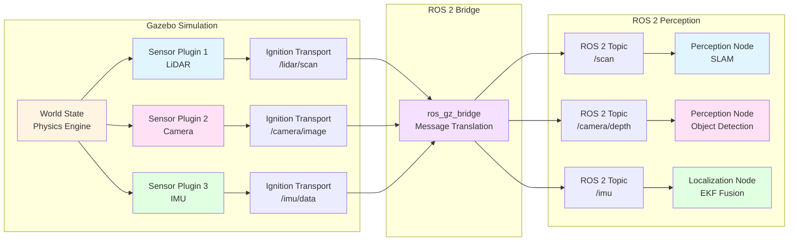

# Chapter 8: Sensor Simulation

**Learning Objectives**:
- Understand why realistic sensor simulation is critical for robot development
- Configure LiDAR, depth cameras, and IMU sensors in Gazebo
- Apply noise models to simulate real-world sensor imperfections
- Integrate simulated sensor data with ROS 2 perception pipelines
- Optimize sensor parameters for performance vs. accuracy trade-offs

## 8.1 Why Simulate Sensors?

Physical robots rely on sensors to perceive their environment. In simulation, we must accurately model these sensors to develop robust perception and control algorithms that transfer to real hardware.

### The Perception Challenge

Real-world sensors are:
- **Imperfect**: Subject to noise, drift, and measurement errors
- **Limited**: Finite range, resolution, and field of view
- **Environment-dependent**: Performance varies with lighting, weather, surface properties
- **Expensive**: LiDAR units cost $1,000-$75,000; stereo cameras $500-$5,000

**Simulation solves these problems** by providing:

| Physical Sensors | Simulated Sensors |
|------------------|-------------------|
| $1K-$75K per unit | $0 after initial setup |
| Fixed configuration | Instant reconfiguration |
| Real-time data only | Replay, slow-motion, fast-forward |
| Environmental constraints | Perfect control of conditions |
| Difficult to validate | Ground truth available |

### Sim-to-Real for Perception

Sensor simulation is particularly critical for perception tasks:

1. **Synthetic Data Generation**: Train vision models on millions of labeled images
2. **Edge Case Testing**: Simulate rare but critical scenarios (obstacles, sensor failures)
3. **Algorithm Validation**: Compare perception outputs against ground truth
4. **Parameter Tuning**: Optimize sensor placement, resolution, update rates

:::tip Key Insight
Modern perception models (object detection, SLAM) are often **trained entirely in simulation** using domain randomization, then deployed directly to physical robots with 70-90% of simulated performance.
:::

## 8.2 Sensor Data Flow in Gazebo

Understanding how sensor data flows from simulation to your ROS 2 nodes is essential for effective sensor configuration.



**Flow Explanation**:
1. **Physics Engine** updates world state (robot pose, object positions)
2. **Sensor Plugins** ray-cast or render to generate measurements
3. **Ignition Transport** publishes sensor data on Gazebo-internal topics
4. **`ros_gz_bridge`** translates Ignition messages to ROS 2 messages
5. **Perception Nodes** subscribe to ROS 2 topics and process sensor data

## 8.3 LiDAR Simulation

LiDAR (Light Detection and Ranging) sensors measure distances by emitting laser pulses and timing their return. They're essential for navigation, obstacle avoidance, and SLAM.

### LiDAR Types

1. **2D Planar LiDAR**: Single horizontal scan plane (e.g., SICK TiM, Hokuyo UTM)
   - **Range**: 0.1-30m typical
   - **Angular Resolution**: 0.25-1.0 degrees
   - **Scan Rate**: 10-40 Hz
   - **Use Case**: Indoor mobile robots, obstacle detection

2. **3D LiDAR**: Multiple vertical layers or rotating mechanism (e.g., Velodyne VLP-16, Ouster OS1)
   - **Range**: 1-200m depending on model
   - **Vertical FOV**: 30-40 degrees (16-128 channels)
   - **Horizontal FOV**: 360 degrees
   - **Use Case**: Autonomous vehicles, outdoor mapping

### Configuring 2D LiDAR in URDF

Add a `<sensor type="ray">` element to your robot's URDF:

```xml
<link name="lidar_link">
  <visual>
    <origin xyz="0 0 0" rpy="0 0 0"/>
    <geometry>
      <cylinder radius="0.05" length="0.07"/>
    </geometry>
    <material name="lidar_black">
      <color rgba="0.1 0.1 0.1 1.0"/>
    </material>
  </visual>

  <collision>
    <origin xyz="0 0 0" rpy="0 0 0"/>
    <geometry>
      <cylinder radius="0.05" length="0.07"/>
    </geometry>
  </collision>

  <inertial>
    <mass value="0.15"/>
    <inertia ixx="0.0001" iyy="0.0001" izz="0.0001" ixy="0" ixz="0" iyz="0"/>
  </inertial>
</link>

<sensor name="lidar_sensor" type="ray">
  <posegreater than 0 0 0 0 0 0</pose>
  <visualize>true</visualize>
  <update_rategreater than 10</update_rate>
  <ray>
    <scan>
      <horizontal>
        <samplesgreater than 360</samples>
        <resolutiongreater than 1.0</resolution>
        <min_angle>-3.14159</min_angle>  <!-- -180 degrees -->
        <max_anglegreater than 3.14159</max_angle>   <!-- +180 degrees -->
      </horizontal>
    </scan>
    <range>
      <mingreater than 0.12</min>
      <maxgreater than 10.0</max>
      <resolutiongreater than 0.01</resolution>
    </range>
    <noise>
      <type>gaussian</type>
      <meangreater than 0.0</mean>
      <stddevgreater than 0.01</stddev>  <!-- 1cm standard deviation -->
    </noise>
  </ray>

  <plugin filename="libgazebo_ros_ray_sensor.so" name="gazebo_ros_lidar">
    <ros>
      <namespace>/my_robot</namespace>
      <remapping>~/out:=scan</remapping>
    </ros>
    <output_type>sensor_msgs/LaserScan</output_type>
    <frame_name>lidar_link</frame_name>
  </plugin>
</sensor>
```

**Key Parameters**:
- `samples`: Number of laser rays per scan (higher = denser point cloud, slower)
- `update_rate`: Scan frequency in Hz (typical: 10-40 Hz)
- `min/max_angle`: Horizontal field of view (radians)
- `min/max range`: Detection distance limits
- `noise`: Gaussian noise model (mean, standard deviation)

**ROS 2 Output**: Publishes `sensor_msgs/msg/LaserScan` to `/my_robot/scan`

### 3D LiDAR (Velodyne-style)

For 3D point clouds, use a multi-layer configuration:

```xml
<scan>
  <horizontal>
    <samplesgreater than 1024</samples>
    <resolutiongreater than 1.0</resolution>
    <min_angle>-3.14159</min_angle>
    <max_anglegreater than 3.14159</max_angle>
  </horizontal>
  <vertical>
    <samplesgreater than 16</samples>  <!-- 16-channel LiDAR -->
    <resolutiongreater than 1.0</resolution>
    <min_angle>-0.2618</min_angle>  <!-- -15 degrees -->
    <max_anglegreater than 0.2618</max_angle>   <!-- +15 degrees -->
  </vertical>
</scan>
```

**ROS 2 Output**: Publishes `sensor_msgs/msg/PointCloud2` for 3D SLAM and perception.

**Example**: See [`lidar_sensor.urdf`](https://github.com/your-repo/physical-ai-code/blob/main/examples/simulation/lidar_sensor.urdf) for a complete 2D LiDAR configuration.

## 8.4 Depth Camera Simulation (RGB-D)

Depth cameras (e.g., Intel RealSense, Microsoft Kinect) provide both RGB images and per-pixel depth measurements. They're essential for manipulation, object detection, and indoor navigation.

### Depth Camera Technology

- **Structured Light**: Projects IR pattern, measures distortion (Kinect v1)
- **Time-of-Flight (ToF)**: Measures round-trip time of IR pulses (Kinect v2, RealSense D435)
- **Stereo Vision**: Computes depth from disparity between two cameras (RealSense D455)

**Typical Specifications**:
- **Range**: 0.3-10m (indoor), degraded outdoors
- **Resolution**: 640x480 to 1280x720
- **Frame Rate**: 15-90 FPS
- **FOV**: 70-90 degrees horizontal

### Configuring Depth Camera in URDF

```xml
<link name="camera_link">
  <visual>
    <origin xyz="0 0 0" rpy="0 0 0"/>
    <geometry>
      <box size="0.025 0.09 0.025"/>
    </geometry>
    <material name="camera_gray">
      <color rgba="0.5 0.5 0.5 1.0"/>
    </material>
  </visual>

  <collision>
    <origin xyz="0 0 0" rpy="0 0 0"/>
    <geometry>
      <box size="0.025 0.09 0.025"/>
    </geometry>
  </collision>

  <inertial>
    <mass value="0.072"/>
    <inertia ixx="0.0001" iyy="0.0001" izz="0.0001" ixy="0" ixz="0" iyz="0"/>
  </inertial>
</link>

<sensor name="depth_camera" type="depth">
  <posegreater than 0 0 0 0 0 0</pose>
  <visualize>true</visualize>
  <update_rategreater than 30</update_rate>
  <camera>
    <horizontal_fovgreater than 1.5708</horizontal_fov>  <!-- 90 degrees -->
    <image>
      <widthgreater than 640</width>
      <heightgreater than 480</height>
      <format>R8G8B8</format>
    </image>
    <clip>
      <neargreater than 0.3</near>
      <fargreater than 10.0</far>
    </clip>
    <noise>
      <type>gaussian</type>
      <meangreater than 0.0</mean>
      <stddevgreater than 0.007</stddev>  <!-- 7mm depth noise -->
    </noise>
  </camera>

  <plugin filename="libgazebo_ros_camera.so" name="depth_camera_controller">
    <ros>
      <namespace>/my_robot</namespace>
      <remapping>~/image_raw:=camera/rgb/image_raw</remapping>
      <remapping>~/depth/image_raw:=camera/depth/image_raw</remapping>
      <remapping>~/camera_info:=camera/rgb/camera_info</remapping>
      <remapping>~/depth/camera_info:=camera/depth/camera_info</remapping>
      <remapping>~/points:=camera/depth/points</remapping>
    </ros>
    <frame_name>camera_link</frame_name>
    <hack_baselinegreater than 0.07</hack_baseline>  <!-- Stereo baseline for disparity -->
    <min_depthgreater than 0.3</min_depth>
    <max_depthgreater than 10.0</max_depth>
  </plugin>
</sensor>
```

**Key Parameters**:
- `horizontal_fov`: Field of view in radians (1.5708 = 90°)
- `image width/height`: Resolution (higher = more detail, slower)
- `update_rate`: Frame rate (15-90 Hz typical)
- `clip near/far`: Valid depth range
- `noise stddev`: Depth measurement uncertainty

**ROS 2 Outputs**:
- `sensor_msgs/msg/Image` (RGB): `/my_robot/camera/rgb/image_raw`
- `sensor_msgs/msg/Image` (Depth): `/my_robot/camera/depth/image_raw`
- `sensor_msgs/msg/PointCloud2`: `/my_robot/camera/depth/points`
- `sensor_msgs/msg/CameraInfo`: Intrinsic parameters for both cameras

**Example**: See [`depth_camera.urdf`](https://github.com/your-repo/physical-ai-code/blob/main/examples/simulation/depth_camera.urdf) for a complete RGB-D configuration.

## 8.5 IMU Simulation

An Inertial Measurement Unit (IMU) measures linear acceleration and angular velocity using accelerometers and gyroscopes. IMUs are critical for:
- **Robot localization**: Fusing with wheel odometry or SLAM
- **Balance control**: Bipedal humanoid stabilization
- **Attitude estimation**: Drone orientation tracking

### IMU Components

1. **3-axis Accelerometer**: Measures specific force (m/s²)
   - Includes gravity (9.81 m/s² downward when stationary)
   - Typical range: ±2g to ±16g (where g = 9.81 m/s²)
   - Noise: ~0.01 m/s² (high-end MEMS)

2. **3-axis Gyroscope**: Measures angular velocity (rad/s)
   - Typical range: ±250°/s to ±2000°/s
   - Noise: ~0.01 rad/s
   - Drift: 0.1-1.0°/hour (cumulative error)

3. **3-axis Magnetometer** (optional): Measures magnetic field for heading
   - Often omitted in simulation due to complexity

### Configuring IMU in URDF

```xml
<link name="imu_link">
  <visual>
    <origin xyz="0 0 0" rpy="0 0 0"/>
    <geometry>
      <box size="0.02 0.02 0.01"/>
    </geometry>
    <material name="imu_blue">
      <color rgba="0.0 0.0 0.8 1.0"/>
    </material>
  </visual>

  <collision>
    <origin xyz="0 0 0" rpy="0 0 0"/>
    <geometry>
      <box size="0.02 0.02 0.01"/>
    </geometry>
  </collision>

  <inertial>
    <mass value="0.015"/>
    <inertia ixx="0.00001" iyy="0.00001" izz="0.00001" ixy="0" ixz="0" iyz="0"/>
  </inertial>
</link>

<sensor name="imu_sensor" type="imu">
  <posegreater than 0 0 0 0 0 0</pose>
  <always_on>true</always_on>
  <update_rategreater than 100</update_rate>
  <imu>
    <angular_velocity>
      <x>
        <noise type="gaussian">
          <meangreater than 0.0</mean>
          <stddevgreater than 0.009</stddev>  <!-- 0.009 rad/s noise -->
          <bias_meangreater than 0.00075</bias_mean>
          <bias_stddevgreater than 0.0000008</bias_stddev>
        </noise>
      </x>
      <y>
        <noise type="gaussian">
          <meangreater than 0.0</mean>
          <stddevgreater than 0.009</stddev>
          <bias_meangreater than 0.00075</bias_mean>
          <bias_stddevgreater than 0.0000008</bias_stddev>
        </noise>
      </y>
      <z>
        <noise type="gaussian">
          <meangreater than 0.0</mean>
          <stddevgreater than 0.009</stddev>
          <bias_meangreater than 0.00075</bias_mean>
          <bias_stddevgreater than 0.0000008</bias_stddev>
        </noise>
      </z>
    </angular_velocity>
    <linear_acceleration>
      <x>
        <noise type="gaussian">
          <meangreater than 0.0</mean>
          <stddevgreater than 0.017</stddev>  <!-- 0.017 m/s² noise -->
          <bias_meangreater than 0.1</bias_mean>
          <bias_stddevgreater than 0.001</bias_stddev>
        </noise>
      </x>
      <y>
        <noise type="gaussian">
          <meangreater than 0.0</mean>
          <stddevgreater than 0.017</stddev>
          <bias_meangreater than 0.1</bias_mean>
          <bias_stddevgreater than 0.001</bias_stddev>
        </noise>
      </y>
      <z>
        <noise type="gaussian">
          <meangreater than 0.0</mean>
          <stddevgreater than 0.017</stddev>
          <bias_meangreater than 0.1</bias_mean>
          <bias_stddevgreater than 0.001</bias_stddev>
        </noise>
      </z>
    </linear_acceleration>
  </imu>

  <plugin filename="libgazebo_ros_imu_sensor.so" name="imu_plugin">
    <ros>
      <namespace>/my_robot</namespace>
      <remapping>~/out:=imu</remapping>
    </ros>
    <frame_name>imu_link</frame_name>
    <initial_orientation_as_reference>false</initial_orientation_as_reference>
  </plugin>
</sensor>
```

**Key Parameters**:
- `update_rate`: Sample frequency (50-1000 Hz typical, 100 Hz common)
- `noise stddev`: White noise on measurements
- `bias_mean`: Constant offset (simulates calibration error)
- `bias_stddev`: Slowly varying bias (simulates drift)

**ROS 2 Output**: Publishes `sensor_msgs/msg/Imu` to `/my_robot/imu` containing:
- `orientation`: Quaternion (computed by Gazebo from physics)
- `angular_velocity`: Gyroscope readings (rad/s)
- `linear_acceleration`: Accelerometer readings (m/s²)

**Example**: See [`imu_sensor.urdf`](https://github.com/your-repo/physical-ai-code/blob/main/examples/simulation/imu_sensor.urdf) for a complete IMU configuration.

## 8.6 Sensor Noise Models

Real sensors exhibit various noise characteristics. Gazebo supports several noise types to simulate sensor imperfections.

### Gaussian Noise

The most common model: measurements deviate from true value according to a normal distribution.

```xml
<noise>
  <type>gaussian</type>
  <meangreater than 0.0</mean>
  <stddevgreater than 0.01</stddev>
</noise>
```

**When to use**: General sensor noise (LiDAR, depth cameras, IMU)

**Example**: LiDAR with 1cm standard deviation will report 10.00m ± 1cm for a 10m distance.

### Bias (Constant Offset)

Simulates calibration errors or manufacturing imperfections.

```xml
<noise>
  <type>gaussian</type>
  <meangreater than 0.0</mean>
  <stddevgreater than 0.01</stddev>
  <bias_meangreater than 0.05</bias_mean>      <!-- Constant 5cm offset -->
  <bias_stddevgreater than 0.001</bias_stddev> <!-- Slowly varying -->
</noise>
```

**When to use**: IMU drift, camera lens distortion, GPS errors

### Realistic Noise Parameters

Based on commercial sensors:

| Sensor Type | Noise Type | Typical Values |
|-------------|-----------|----------------|
| 2D LiDAR (SICK TiM) | Gaussian | stddev = 0.015m (1.5cm) |
| 3D LiDAR (Velodyne VLP-16) | Gaussian | stddev = 0.03m (3cm) |
| Depth Camera (RealSense D435) | Gaussian | stddev = 0.007m (7mm) @ 1m, increases with distance |
| IMU Gyroscope (MPU6050) | Gaussian + Bias | stddev = 0.009 rad/s, bias_mean = 0.00075 rad/s |
| IMU Accelerometer (MPU6050) | Gaussian + Bias | stddev = 0.017 m/s², bias_mean = 0.1 m/s² |

:::tip Calibration
For sim-to-real transfer, measure noise on your **physical sensors** and match simulation parameters. Collect 1000+ stationary samples, compute standard deviation, and use that value in `<stddev>`.
:::

## 8.7 Sensor Performance Optimization

Sensor simulation can be computationally expensive. Balance accuracy vs. performance with these strategies:

### Trade-offs Matrix

| Parameter | Increase → | Impact on Accuracy | Impact on Performance |
|-----------|------------|-------------------|----------------------|
| **Update Rate** | 10 Hz → 100 Hz | ↑ Temporal resolution | ↓ Slower (linear) |
| **LiDAR Samples** | 360 → 1080 | ↑ Angular resolution | ↓ Slower (linear) |
| **Camera Resolution** | 640x480 → 1920x1080 | ↑ Spatial detail | ↓ Much slower (quadratic) |
| **Depth Range** | 10m → 100m | ↑ Detection distance | ↓ Slightly slower |
| **Noise Complexity** | None → Gaussian+Bias | ↑ Realism | ≈ Negligible |

### Optimization Strategies

1. **Match Real Sensors**: Don't exceed physical sensor specs
   - If your real LiDAR is 10 Hz, don't simulate at 100 Hz
   - Match resolution: 640x480 depth camera in sim if that's what you'll deploy

2. **Reduce Unnecessary Precision**:
   - Indoor navigation: 2D LiDAR at 10 Hz with 360 samples is sufficient
   - Object detection: 640x480 RGB camera at 30 FPS (not 1080p at 60 FPS)

3. **Headless Mode**: Disable Gazebo GUI for batch simulations
   ```bash
   ros2 launch my_pkg gazebo.launch.py gui:=false
   ```

4. **GPU Acceleration**: Use GPU-based sensors when available
   - Gazebo Garden supports GPU ray-tracing for LiDAR
   - Enable with `<ray><use_gpu>true</use_gpu></ray>`

5. **Selective Activation**: Only enable sensors when needed
   ```xml
   <always_on>false</always_on>
   <update_rategreater than 0</update_rate>  <!-- Activate via ROS service -->
   ```

### Performance Benchmarks

Typical Gazebo Garden performance on Intel i7-12700K, RTX 3080:

| Sensor Configuration | Real-Time Factor |
|----------------------|------------------|
| 2D LiDAR (10 Hz, 360 samples) | 10× real-time |
| RGB Camera (640x480, 30 FPS) | 5× real-time |
| Depth Camera (640x480, 30 FPS) | 3× real-time |
| 3D LiDAR (10 Hz, 16 channels, 1024 samples/layer) | 2× real-time |
| All 4 sensors + physics | 1-2× real-time |

## 8.8 ROS 2 Integration Examples

### Subscribing to LiDAR Data

```python
import rclpy
from rclpy.node import Node
from sensor_msgs.msg import LaserScan

class LidarSubscriber(Node):
    def __init__(self):
        super().__init__('lidar_subscriber')
        self.subscription = self.create_subscription(
            LaserScan,
            '/my_robot/scan',
            self.lidar_callback,
            10)

    def lidar_callback(self, msg):
        # Extract range measurements
        ranges = msg.ranges  # List of distances (meters)
        min_range = msg.range_min
        max_range = msg.range_max
        angle_increment = msg.angle_increment

        # Find closest obstacle
        valid_ranges = [r for r in ranges if r > min_range and r < max_range]
        if valid_ranges:
            closest_distance = min(valid_ranges)
            closest_index = ranges.index(closest_distance)
            closest_angle = msg.angle_min + (closest_index * angle_increment)

            self.get_logger().info(f'Closest obstacle: {closest_distance:.2f}m at {closest_angle:.2f} rad')

def main():
    rclpy.init()
    node = LidarSubscriber()
    rclpy.spin(node)
    node.destroy_node()
    rclpy.shutdown()
```

### Processing Depth Images

```python
import rclpy
from rclpy.node import Node
from sensor_msgs.msg import Image
from cv_bridge import CvBridge
import cv2
import numpy as np

class DepthProcessor(Node):
    def __init__(self):
        super().__init__('depth_processor')
        self.bridge = CvBridge()
        self.subscription = self.create_subscription(
            Image,
            '/my_robot/camera/depth/image_raw',
            self.depth_callback,
            10)

    def depth_callback(self, msg):
        # Convert ROS Image to OpenCV format
        depth_image = self.bridge.imgmsg_to_cv2(msg, desired_encoding='32FC1')

        # Compute statistics
        valid_depths = depth_image[depth_image > 0]  # Filter out invalid (0) pixels
        if len(valid_depths) > 0:
            mean_depth = np.mean(valid_depths)
            min_depth = np.min(valid_depths)

            self.get_logger().info(f'Mean depth: {mean_depth:.2f}m, Min depth: {min_depth:.2f}m')

            # Visualize (optional)
            depth_normalized = cv2.normalize(depth_image, None, 0, 255, cv2.NORM_MINMAX)
            depth_colormap = cv2.applyColorMap(depth_normalized.astype(np.uint8), cv2.COLORMAP_JET)
            cv2.imshow('Depth Camera', depth_colormap)
            cv2.waitKey(1)

def main():
    rclpy.init()
    node = DepthProcessor()
    rclpy.spin(node)
    node.destroy_node()
    rclpy.shutdown()
```

### Fusing IMU with Odometry

```python
import rclpy
from rclpy.node import Node
from sensor_msgs.msg import Imu
from nav_msgs.msg import Odometry

class IMUFusion(Node):
    def __init__(self):
        super().__init__('imu_fusion')
        self.imu_sub = self.create_subscription(Imu, '/my_robot/imu', self.imu_callback, 10)
        self.odom_sub = self.create_subscription(Odometry, '/odom', self.odom_callback, 10)

        self.latest_imu = None
        self.latest_odom = None

    def imu_callback(self, msg):
        self.latest_imu = msg
        # Extract orientation (quaternion)
        orientation = msg.orientation
        # Extract angular velocity
        angular_vel = msg.angular_velocity
        # Extract linear acceleration
        linear_acc = msg.linear_acceleration

        self.get_logger().info(f'IMU: acc_z={linear_acc.z:.2f} m/s², gyro_z={angular_vel.z:.2f} rad/s')

    def odom_callback(self, msg):
        self.latest_odom = msg
        # Fuse with IMU for more accurate localization
        # (In practice, use robot_localization package EKF node)

def main():
    rclpy.init()
    node = IMUFusion()
    rclpy.spin(node)
    node.destroy_node()
    rclpy.shutdown()
```

## 8.9 Best Practices

### Sensor Placement

1. **LiDAR**: Mount high on robot (above obstacles), tilted 0-5° downward
   - Avoid occlusion by robot body parts
   - Consider 360° coverage vs. front-facing (180°) based on use case

2. **Depth Camera**: Mount at "eye level" for manipulation tasks
   - Face forward for navigation, downward for grasping
   - Avoid direct sunlight or IR interference

3. **IMU**: Mount at center of mass (CoM)
   - Minimize vibration effects
   - Align axes with robot frame (X forward, Z up)

### Validation Against Real Sensors

Before trusting your simulation:

1. **Record Real Data**: Collect sensor logs from physical robot in known environment
2. **Replicate in Sim**: Create identical Gazebo world
3. **Compare Statistics**: Match mean, stddev, min/max values
4. **Tune Noise Models**: Adjust `<noise>` parameters until distributions match
5. **Iterate**: Refine world models (surface materials, lighting) for better accuracy

### Common Pitfalls

❌ **Don't**:
- Use perfect sensors (zero noise) - algorithms won't transfer to real robots
- Exceed physical sensor specs (e.g., 200 Hz IMU when real sensor is 50 Hz)
- Ignore occlusions - test sensor visibility with robot body

✅ **Do**:
- Add realistic noise based on manufacturer datasheets
- Test edge cases (sensor failures, max range, occlusions)
- Validate sensor fusion pipelines (EKF, particle filters) in simulation

## 8.10 Comprehension Questions

1. **Sensor Selection**: You're building an indoor delivery robot. Would you choose 2D LiDAR, 3D LiDAR, or depth camera for navigation? Justify your choice considering cost, range, and computational requirements.

2. **Noise Modeling**: Your simulated LiDAR has `<stddevgreater than 0.01</stddev>` (1cm noise), but the real sensor's datasheet specifies ±3cm accuracy. How would you adjust the simulation to match reality?

3. **IMU Interpretation**: An IMU reports `linear_acceleration.z = 9.81 m/s²` when the robot is stationary. Is this an error? Explain what this measurement represents.

4. **Performance Optimization**: Your simulation runs at 0.5× real-time with a 1080p depth camera at 60 FPS. Suggest 3 parameter changes to achieve 2× real-time while maintaining adequate perception quality.

5. **Sensor Fusion**: Why is an IMU alone insufficient for robot localization? What complementary sensors would you fuse with IMU data, and what information does each provide?

## Key Takeaways

:::info Remember
- **Realistic noise is critical**: Perfect sensors lead to brittle algorithms that fail on real robots.
- **Match physical specs**: Simulation should replicate your actual hardware configuration.
- **LiDAR for structure**, **cameras for semantics**, **IMU for dynamics**: Each sensor type serves distinct purposes.
- **Validate early**: Compare simulated vs. real sensor data before deploying algorithms.
- **Optimize aggressively**: Sensor simulation is expensive - reduce resolution/rate where possible.
:::

## References

1. **Gazebo Sensor Plugins Documentation**. *Open Robotics*. [[Gazebo Sensors](https://gazebosim.org/api/gazebo/7/sensors.html)]
   - Comprehensive guide to configuring LiDAR, cameras, and IMU in Gazebo.

2. **Koenig, N., & Howard, A. (2004)**. "Design and use paradigms for Gazebo, an open-source multi-robot simulator." *IEEE/RSJ International Conference on Intelligent Robots and Systems (IROS)*, 3, 2149-2154. [[DOI:10.1109/IROS.2004.1389727](https://doi.org/10.1109/IROS.2004.1389727)]
   - Original Gazebo paper describing sensor simulation architecture.

3. **Hening, S., et al. (2020)**. "Characterization and Modeling of RGB-D Camera Noise for Applications in Robotics." *IEEE Sensors Journal*, 20(14), 7795-7804. [[DOI:10.1109/JSEN.2020.2980407](https://doi.org/10.1109/JSEN.2020.2980407)]
   - Empirical study of depth camera noise characteristics (RealSense, Kinect).

4. **Woodman, O. J. (2007)**. "An introduction to inertial navigation." *University of Cambridge Technical Report*, UCAM-CL-TR-696. [[PDF](https://www.cl.cam.ac.uk/techreports/UCAM-CL-TR-696.pdf)]
   - Foundational reference on IMU error models and sensor fusion.

---

**Previous**: [← Chapter 7: Unity Rendering](./07-unity-rendering.md)
**Next**: [Tutorial 2: Gazebo Humanoid Spawn →](./tutorial-02-gazebo-humanoid.md)
