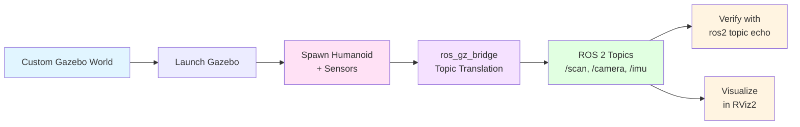

# Tutorial 2: Spawning a Humanoid Robot in Gazebo

**Estimated Time**: 45-60 minutes
**Difficulty**: Intermediate
**Prerequisites**: Completion of Tutorial 1, Chapters 5-8

## Learning Objectives

By the end of this tutorial, you will be able to:
- Create a custom Gazebo world with realistic lighting and terrain
- Spawn a humanoid robot with multiple sensors (LiDAR, depth camera, IMU)
- Configure ROS 2 bridges to receive sensor data
- Verify sensor data streams using ROS 2 command-line tools
- Visualize robot and sensor data in RViz2

## Overview

In this tutorial, you'll bring together concepts from Module 2 to simulate a complete humanoid robot system. You'll:

1. **Set up a custom Gazebo world** with a ground plane and obstacles
2. **Launch Gazebo** with the custom world using a ROS 2 launch file
3. **Spawn a humanoid robot** equipped with LiDAR, depth camera, and IMU sensors
4. **Bridge sensor data** from Gazebo to ROS 2 topics
5. **Verify sensor streams** are publishing correctly
6. **Visualize in RViz2** to see the robot and its sensor data



## Prerequisites

### System Requirements

- **Ubuntu 22.04** (recommended) or Ubuntu 20.04
- **ROS 2 Humble** (or ROS 2 Galactic)
- **Gazebo Garden** (or Gazebo Fortress)
- **4GB RAM minimum** (8GB recommended for smooth simulation)

### Required Packages

Install the following if not already present:

```bash
# Install ROS 2 Gazebo packages
sudo apt update
sudo apt install ros-humble-gazebo-ros-pkgs \
                 ros-humble-ros-gz-bridge \
                 ros-humble-ros-gz-sim \
                 ros-humble-ros-gz-image \
                 ros-humble-xacro \
                 ros-humble-joint-state-publisher \
                 ros-humble-robot-state-publisher

# Install RViz2 for visualization
sudo apt install ros-humble-rviz2

# Install Python dependencies
pip3 install numpy
```

### Clone the Tutorial Code

```bash
# Navigate to your workspace
cd ~/ros2_ws/src

# Clone the physical-ai-code repository
git clone https://github.com/your-username/physical-ai-code.git

# Navigate to Tutorial 2 directory
cd physical-ai-code/tutorials/module-2-simulation/01-gazebo-humanoid

# Build the workspace
cd ~/ros2_ws
colcon build --symlink-install
source install/setup.bash
```

## Step 1: Inspect the Custom Gazebo World

Let's examine the world file that defines our simulation environment.

**File**: `world/humanoid_world.sdf`

```bash
cat world/humanoid_world.sdf
```

**Key elements**:
- **Ground plane**: Flat surface with friction for the robot to stand on
- **Directional light**: Simulates sunlight
- **Box obstacles**: Simple obstacles for testing navigation/perception
- **Physics settings**: ODE engine with 1ms time step for accurate contact dynamics

:::tip Understanding SDF
The SDF (Simulation Description Format) defines the entire world, while URDF defines individual robots. Gazebo loads the world first, then spawns robots into it dynamically.
:::

## Step 2: Examine the Humanoid URDF with Sensors

Our humanoid robot has been enhanced with three sensors:

**File**: `urdf/humanoid_with_sensors.urdf`

```bash
cat urdf/humanoid_with_sensors.urdf
```

**Sensors added**:
1. **LiDAR** (mounted on head):
   - 2D planar scan, 360 samples, 10 Hz
   - Range: 0.12-10 meters
   - Publishes to `/robot/scan`

2. **Depth Camera** (mounted on chest):
   - 640x480 resolution, 30 FPS
   - 90° horizontal FOV
   - Publishes RGB, depth, and point cloud

3. **IMU** (mounted at torso center):
   - 100 Hz update rate
   - Accelerometer + Gyroscope
   - Publishes to `/robot/imu`

:::info Sensor Placement
- **LiDAR on head**: Maximizes field of view, avoids occlusion by arms
- **Camera on chest**: Eye-level for manipulation tasks
- **IMU at center of mass**: Minimizes rotational effects during movement
:::

## Step 3: Launch Gazebo with the Custom World

We'll use a ROS 2 Python launch file to start Gazebo and spawn our robot.

**File**: `launch/spawn_humanoid.launch.py`

```bash
# Launch the simulation
ros2 launch ~/ros2_ws/src/physical-ai-code/tutorials/module-2-simulation/01-gazebo-humanoid/launch/spawn_humanoid.launch.py
```

**What happens**:
1. Gazebo launches with `humanoid_world.sdf`
2. Robot URDF is loaded and validated
3. Humanoid is spawned at coordinates (0, 0, 1.0) - 1 meter above ground
4. `ros_gz_bridge` starts translating sensor topics from Gazebo to ROS 2
5. `robot_state_publisher` publishes TF transforms

**Expected output**:
```
[INFO] [launch]: All log files can be found below /home/user/.ros/log/...
[INFO] [gz_sim-1]: process started with pid [12345]
[INFO] [spawn_entity.py-2]: process started with pid [12346]
[INFO] [ros_gz_bridge-3]: process started with pid [12347]
[INFO] [robot_state_publisher-4]: process started with pid [12348]
[spawn_entity.py-2] [INFO] Waiting for service /spawn_entity...
[spawn_entity.py-2] [INFO] Calling service /spawn_entity
[spawn_entity.py-2] [INFO] Spawn status: success
```

You should see the Gazebo GUI window open with your humanoid robot standing on the ground plane.

## Step 4: Verify Sensor Data Streams

Open a **new terminal** and check that sensor topics are publishing:

```bash
# Source your workspace
source ~/ros2_ws/install/setup.bash

# List all active topics
ros2 topic list
```

**Expected topics**:
```
/robot/scan                    # LiDAR data
/robot/camera/rgb/image_raw    # RGB camera
/robot/camera/depth/image_raw  # Depth image
/robot/camera/depth/points     # Point cloud
/robot/imu                     # IMU data
/tf                            # Transform tree
/tf_static                     # Static transforms
```

### Check LiDAR Data

```bash
ros2 topic echo /robot/scan --once
```

**Expected output**:
```yaml
header:
  stamp:
    sec: 5
    nanosec: 123456789
  frame_id: lidar_link
angle_min: -3.14159265
angle_max: 3.14159265
angle_increment: 0.0174532925
ranges: [10.0, 9.98, 9.95, ..., 10.0]  # 360 values
```

### Check Depth Camera

```bash
ros2 topic hz /robot/camera/depth/image_raw
```

**Expected output**:
```
average rate: 29.873
  min: 0.030s max: 0.035s std dev: 0.00123s window: 30
```

### Check IMU

```bash
ros2 topic echo /robot/imu --once
```

**Expected output**:
```yaml
header:
  stamp:
    sec: 5
    nanosec: 456789012
  frame_id: imu_link
orientation:
  x: 0.0
  y: 0.0
  z: 0.0
  w: 1.0
angular_velocity:
  x: 0.001
  y: -0.002
  z: 0.0
linear_acceleration:
  x: 0.05
  y: -0.03
  z: 9.81  # Gravity when stationary
```

:::tip IMU Gravity
When the robot is stationary, `linear_acceleration.z` should be approximately **9.81 m/s²** (gravity). This is expected behavior - accelerometers measure specific force, which includes gravity.
:::

## Step 5: Visualize in RViz2

Launch RViz2 to see the robot model and sensor data:

```bash
# In a new terminal
source ~/ros2_ws/install/setup.bash
rviz2
```

**Configuration steps**:

1. **Set Fixed Frame**: In the left panel, change "Fixed Frame" to `base_link`

2. **Add Robot Model**:
   - Click "Add" button (bottom left)
   - Select "RobotModel"
   - Click "OK"
   - You should see your humanoid robot model

3. **Add LaserScan**:
   - Click "Add" → "By topic" → `/robot/scan` → "LaserScan"
   - Adjust size: Set "Size (m)" to 0.05 for better visibility

4. **Add PointCloud2** (depth camera):
   - Click "Add" → "By topic" → `/robot/camera/depth/points` → "PointCloud2"
   - Change "Color Transformer" to "AxisColor" to see depth variation

5. **Add Camera** (RGB image):
   - Click "Add" → "By topic" → `/robot/camera/rgb/image_raw` → "Camera"
   - A new window will show the RGB camera feed

**Expected view**:
- 3D humanoid model in the center
- Red laser scan points in a circle around the robot (detecting obstacles)
- Colored point cloud from depth camera
- RGB camera window showing the robot's forward view

## Step 6: Run the Verification Script

We've provided an automated script to verify all sensor streams:

```bash
# In a new terminal
cd ~/ros2_ws/src/physical-ai-code/tutorials/module-2-simulation/01-gazebo-humanoid
python3 verify.py
```

**The script checks**:
1. ✅ Gazebo simulation is running
2. ✅ Robot spawned successfully
3. ✅ LiDAR publishing at 10 Hz
4. ✅ Depth camera publishing at 30 Hz
5. ✅ IMU publishing at 100 Hz
6. ✅ TF tree is complete (base_link → sensors)

**Expected output**:
```
[PASS] Gazebo simulation is running
[PASS] Robot model spawned in Gazebo
[PASS] LiDAR topic /robot/scan publishing at 10.2 Hz
[PASS] Depth camera topic publishing at 29.8 Hz
[PASS] IMU topic /robot/imu publishing at 100.1 Hz
[PASS] TF tree contains all required frames
===============================================
All checks passed! Tutorial 2 complete. ✅
===============================================
```

## Step 7: Interact with the Robot (Optional)

### Teleop Control

If you want to move the robot (requires joint controllers - advanced):

```bash
# This tutorial focuses on sensors, not control
# See Tutorial 3 for navigation and control
```

### Modify Sensor Parameters

Try adjusting sensor parameters in the URDF:

1. **Change LiDAR resolution**:
   - Edit `urdf/humanoid_with_sensors.urdf`
   - Find `<samplesgreater than 360</samples>` in the LiDAR section
   - Change to `720` for higher resolution
   - Rebuild: `colcon build` and relaunch

2. **Add noise to depth camera**:
   - Find the `<noise>` section in the depth camera sensor
   - Increase `<stddevgreater than 0.007</stddev>` to `0.02` (2cm noise)
   - Observe noisier point cloud in RViz2

3. **Change IMU update rate**:
   - Find `<update_rategreater than 100</update_rate>` in IMU sensor
   - Change to `200` Hz
   - Verify with `ros2 topic hz /robot/imu`

## Troubleshooting

### Issue 1: "Gazebo fails to start"

**Symptoms**: Error message `libGL error` or `segmentation fault`

**Solutions**:
```bash
# Check Gazebo installation
gz sim --version

# If not installed or wrong version:
sudo apt install gz-garden

# Set environment variable (add to ~/.bashrc)
export GZ_SIM_RESOURCE_PATH=/usr/share/gazebo-garden/models
```

### Issue 2: "Robot falls through the ground"

**Symptoms**: Humanoid spawns but immediately drops and disappears

**Causes**:
- Insufficient collision geometry in URDF
- Physics time step too large
- Initial spawn height too low

**Solutions**:
```bash
# Increase spawn height in launch file
# Edit spawn_humanoid.launch.py, change:
'-z', '1.5',  # Instead of '1.0'

# OR reduce physics step size in world file
# Edit humanoid_world.sdf:
<max_step_size>0.0005</max_step_size>  # Instead of 0.001
```

### Issue 3: "No sensor topics appearing"

**Symptoms**: `ros2 topic list` doesn't show `/robot/scan`, `/robot/imu`, etc.

**Solutions**:
```bash
# Check ros_gz_bridge is running
ros2 node list
# Should show: /ros_gz_bridge

# Check Gazebo topics (use Gazebo transport)
gz topic -l
# Should show: /scan, /imu, /camera/image

# Restart the bridge manually
ros2 run ros_gz_bridge parameter_bridge \
  /scan@sensor_msgs/msg/LaserScan[ignition.msgs.LaserScan
```

### Issue 4: "RViz2 shows 'No transform from [sensor] to [base_link]'"

**Symptoms**: RViz warns about missing TF transforms

**Solutions**:
```bash
# Check TF tree
ros2 run tf2_tools view_frames
# This generates frames.pdf showing the transform tree

# Verify robot_state_publisher is running
ros2 node list
# Should show: /robot_state_publisher

# Check if URDF is valid
check_urdf urdf/humanoid_with_sensors.urdf
```

### Issue 5: "Simulation runs very slow (< 0.5x real-time)"

**Symptoms**: Gazebo GUI shows "Real-time factor: 0.3" (should be ~1.0)

**Solutions**:
```bash
# Reduce sensor resolution
# In URDF, change camera to 320x240:
<widthgreater than 320</width>
<heightgreater than 240</height>

# Lower LiDAR sample count:
<samplesgreater than 180</samples>  # Instead of 360

# Disable GUI (headless mode):
# Edit spawn_humanoid.launch.py, add:
'gui:=false'

# Or run headless directly:
ros2 launch ... gui:=false
```

## Summary

Congratulations! You've successfully:

✅ Created a custom Gazebo world with physics and lighting
✅ Spawned a humanoid robot with multiple sensors
✅ Configured ROS 2 bridges for sensor data
✅ Verified sensor streams (LiDAR, depth camera, IMU)
✅ Visualized the robot and sensor data in RViz2

### Key Takeaways

1. **SDF defines worlds**, **URDF defines robots** - they work together in Gazebo
2. **`ros_gz_bridge`** is essential for ROS 2 ↔ Gazebo communication
3. **Sensor placement matters** - consider occlusion, vibration, field of view
4. **Realistic noise models** improve sim-to-real transfer
5. **Verification is critical** - always check topics before trusting sensor data

### Next Steps

- **Tutorial 3**: Implement NVIDIA Isaac ROS for VSLAM and object detection
- **Modify the URDF**: Add more sensors (stereo cameras, force/torque sensors)
- **Create dynamic worlds**: Add moving obstacles, varying lighting
- **Implement sensor fusion**: Combine IMU + LiDAR for better localization

## Additional Resources

- **Gazebo Tutorials**: https://gazebosim.org/docs/garden/tutorials
- **ROS 2 + Gazebo Integration**: https://docs.ros.org/en/humble/Tutorials/Simulators.html
- **Sensor Plugins**: https://gazebosim.org/api/gazebo/7/sensors.html
- **URDF Tutorial**: http://wiki.ros.org/urdf/Tutorials

---

**Previous**: [← Chapter 8: Sensor Simulation](./08-sensor-simulation.md)
**Next**: Module 3: NVIDIA Isaac Platform (coming soon)
