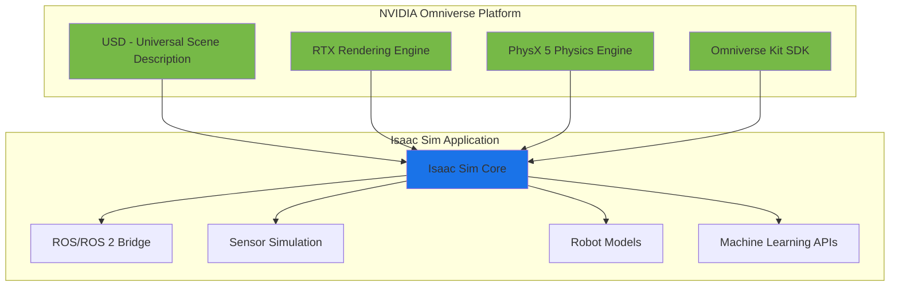
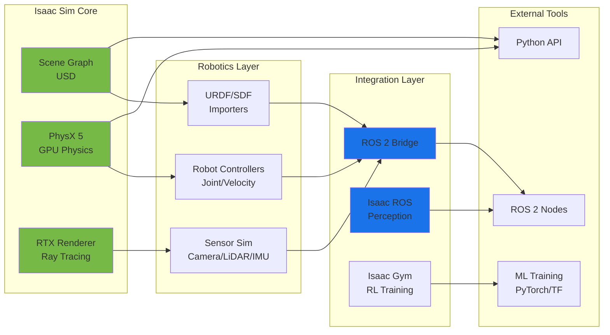
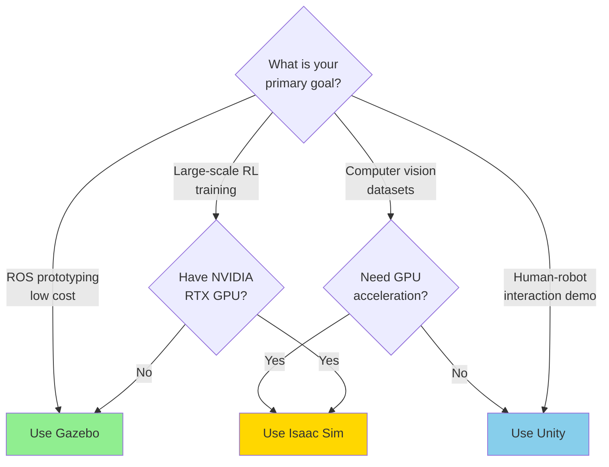

# Chapter 9: Isaac Sim Introduction

**Learning Objectives**:
- Understand what NVIDIA Isaac Sim is and why it's revolutionary for robotics
- Learn Isaac Sim's architecture built on NVIDIA Omniverse
- Explore GPU-accelerated physics and photorealistic rendering capabilities
- Identify when to use Isaac Sim vs. traditional simulators like Gazebo
- Set up Isaac Sim and navigate the interface
- Create your first Isaac Sim scene with a robot

## 9.1 What is NVIDIA Isaac Sim?

**NVIDIA Isaac Sim** is a GPU-accelerated robotics simulator built on the NVIDIA Omniverse platform [1]. It represents a paradigm shift in robot simulation by leveraging modern GPU architectures to achieve:

- **Massive parallelization**: Run 1,000+ robot instances simultaneously on a single GPU
- **Photorealistic rendering**: RTX ray tracing for cinema-quality visualization
- **Physics accuracy**: NVIDIA PhysX 5 with tensor core acceleration
- **Synthetic data generation**: Automatically labeled datasets for training AI models
- **Real-time performance**: Simulate complex scenes 100-1000× faster than real-time

:::tip Why Isaac Sim Matters
Traditional CPU-based simulators (like Gazebo) run at 1-10× real-time. Isaac Sim can run 1000× real-time, meaning **1 hour of computation = 1000 hours of simulated robot experience**. This makes large-scale reinforcement learning practical.
:::

### The Omniverse Foundation

Isaac Sim is built on **NVIDIA Omniverse**, a platform for 3D collaboration and simulation [2]:



**Key Technologies**:
- **USD (Universal Scene Description)**: Pixar's open-source 3D file format for representing complex scenes [3]
- **RTX Rendering**: Hardware ray tracing for realistic lighting, shadows, and reflections
- **PhysX 5**: NVIDIA's GPU-accelerated physics engine with tensor core support [4]
- **Omniverse Kit**: Development framework for building custom simulation tools

## 9.2 Core Capabilities

### GPU-Accelerated Physics

Isaac Sim's physics engine runs entirely on the GPU, enabling massive parallelization:

**Traditional CPU Physics (Gazebo)**:
```
Single-threaded physics loop:
1. Update robot state (CPU)
2. Compute collisions (CPU)
3. Solve constraints (CPU)
4. Integrate forward (CPU)

Bottleneck: ~10× real-time maximum
```

**Isaac Sim GPU Physics**:
```
Massively parallel physics:
1. Launch 10,000 physics kernels (GPU)
2. Parallel collision detection (GPU)
3. Parallel constraint solving (tensor cores)
4. Parallel integration (GPU)

Result: 100-1000× real-time
```

:::info Hardware Requirements
To leverage GPU physics, you need an **NVIDIA RTX GPU** (RTX 2060 or higher). The GPU must support:
- CUDA compute capability 7.0+
- At least 8GB VRAM (12GB+ recommended for complex scenes)
- RTX ray tracing cores (for rendering)
:::

### Photorealistic Rendering

Isaac Sim uses **RTX ray tracing** to produce images indistinguishable from real cameras:

**Ray Tracing vs. Rasterization**:

| Feature | Rasterization (Gazebo) | Ray Tracing (Isaac Sim) |
|---------|------------------------|-------------------------|
| **Lighting** | Approximated (Phong/Blinn) | Physically accurate global illumination |
| **Shadows** | Shadow maps (artifacts) | Perfect soft shadows |
| **Reflections** | Screen-space only | True mirror reflections |
| **Materials** | Simple textures | Realistic PBR materials |
| **Performance** | Fast (greater than 60 FPS) | Variable (1-30 FPS depending on quality) |

**Why Photorealism Matters**:
- **Domain Randomization**: Train perception models on realistic variations
- **Sim-to-Real Transfer**: Reduce visual gap between simulation and real cameras
- **Human-Robot Interaction**: Visualize robots in realistic environments for stakeholder demos
- **Synthetic Data**: Generate training data cheaper than real-world collection

### Synthetic Data Generation

One of Isaac Sim's killer features is **automatic data labeling** for computer vision:

**Available Annotations**:
- **Bounding Boxes (2D/3D)**: Object detection datasets
- **Semantic Segmentation**: Pixel-level class labels
- **Instance Segmentation**: Individual object masks
- **Depth Maps**: Distance to camera for each pixel
- **Normals**: Surface orientation for each pixel
- **Optical Flow**: Motion between frames

**Example Workflow**:
```python
# Isaac Sim Synthetic Data Replicator API
import omni.replicator.core as rep

# Define camera
camera = rep.create.camera(position=(0, 2, 1))

# Define randomization
with rep.trigger.on_frame(num_frames=1000):
    rep.randomizer.scatter_2d(
        objects=rep.get.prims(semantics=[("class", "robot")]),
        surface=rep.get.prims(semantics=[("class", "floor")]),
        distance_range=(0.5, 2.0)
    )
    rep.randomizer.color(
        objects=rep.get.prims(semantics=[("class", "object")]),
        colors=rep.distribution.uniform((0, 0, 0), (1, 1, 1))
    )

# Collect annotations
writer = rep.WriterRegistry.get("BasicWriter")
writer.initialize(
    output_dir="./synthetic_data",
    rgb=True,
    bounding_box_2d=True,
    semantic_segmentation=True,
    instance_segmentation=True
)

# Run replicator
rep.orchestrator.run()
```

This generates 1,000 images with automatic labels in minutes—something that would cost thousands of dollars and weeks of manual work with real data collection.

## 9.3 Isaac Sim Architecture

Isaac Sim is composed of several integrated modules:



### Component Details

**Scene Graph (USD)**:
- Represents 3D world using Pixar's Universal Scene Description
- Supports nested hierarchies (robot → links → joints → sensors)
- Enables real-time collaboration (multiple users editing same scene)
- Interoperable with 3D tools (Blender, Maya, Houdini)

**Physics Engine (PhysX 5)**:
- GPU-accelerated rigid body dynamics
- Soft body simulation (cloth, deformable objects)
- Articulation solver for robots (optimized for kinematic chains)
- Contact resolution with friction models

**RTX Renderer**:
- Path-traced global illumination
- Denoising for real-time rendering
- Multi-GPU support for large scenes
- Material system (MDL - Material Definition Language)

**ROS 2 Bridge**:
- Native publish/subscribe to ROS 2 topics
- Service and action client/server support
- Transform tree (TF) broadcasting
- Clock synchronization (simulated time)

## 9.4 Isaac Sim vs. Other Simulators

When should you choose Isaac Sim over Gazebo or Unity?

### Comparison Matrix

| Criterion | Gazebo Classic/Garden | Unity | Isaac Sim |
|-----------|----------------------|-------|-----------|
| **Physics Accuracy** | ⭐⭐⭐⭐⭐ Excellent | ⭐⭐⭐ Good | ⭐⭐⭐⭐⭐ Excellent |
| **Visual Quality** | ⭐⭐ Basic | ⭐⭐⭐⭐⭐ Photorealistic | ⭐⭐⭐⭐⭐ Photorealistic |
| **ROS Integration** | ⭐⭐⭐⭐⭐ Native | ⭐⭐⭐ ROS-TCP | ⭐⭐⭐⭐ Native Bridge |
| **Performance (CPU)** | ⭐⭐⭐ 1-10× RT | ⭐⭐⭐⭐ 10-60 FPS | ⭐⭐ Variable |
| **Performance (GPU)** | ⭐ N/A | ⭐⭐⭐ PhysX | ⭐⭐⭐⭐⭐ 100-1000× RT |
| **Synthetic Data** | ⭐⭐ Manual | ⭐⭐⭐⭐ Perception Pkg | ⭐⭐⭐⭐⭐ Replicator |
| **Open Source** | ✅ Yes | ❌ No | ❌ No |
| **Cost** | Free | Free (with limits) | Free |
| **Hardware Req.** | Any CPU | Mid GPU | NVIDIA RTX GPU |
| **Learning Curve** | ⭐⭐⭐ Moderate | ⭐⭐⭐⭐ Steep | ⭐⭐⭐⭐⭐ Very Steep |

### Use Case Decision Tree



**When to Use Isaac Sim**:
- ✅ Training perception models (object detection, segmentation, depth estimation)
- ✅ Large-scale reinforcement learning (1000+ parallel environments)
- ✅ Sim-to-real transfer with photorealistic rendering
- ✅ Multi-robot warehouse/fleet simulation
- ✅ Generating synthetic datasets (millions of labeled images)

**When NOT to Use Isaac Sim**:
- ❌ No NVIDIA RTX GPU available
- ❌ Simple ROS 2 prototyping (Gazebo faster to set up)
- ❌ Need full open-source stack (licensing constraints)
- ❌ CPU-only workflows
- ❌ Educational use without GPU resources

## 9.5 Getting Started with Isaac Sim

### Installation Options

Isaac Sim offers three installation methods:

**Option 1: Omniverse Launcher (Recommended)**
```bash
# 1. Download Omniverse Launcher
wget https://install.launcher.omniverse.nvidia.com/installers/omniverse-launcher-linux.AppImage

# 2. Make executable and run
chmod +x omniverse-launcher-linux.AppImage
./omniverse-launcher-linux.AppImage

# 3. Install Isaac Sim from Exchange tab
# Select "Isaac Sim" → Install (50GB download)
```

**Option 2: Docker Container**
```bash
# Pull Isaac Sim container
docker pull nvcr.io/nvidia/isaac-sim:2023.1.1

# Run with GPU support
docker run --gpus all -it \
  -v ~/docker/isaac-sim/cache:/root/.cache \
  -v ~/docker/isaac-sim/documents:/root/Documents \
  nvcr.io/nvidia/isaac-sim:2023.1.1
```

**Option 3: Native Installation (Advanced)**
```bash
# Download standalone package
wget https://developer.nvidia.com/isaac-sim/download

# Extract and setup environment
tar -xvf isaac_sim-2023.1.1-linux.tar.gz
cd isaac_sim-2023.1.1
./setup_conda_env.sh
```

:::warning System Requirements
Before installing, verify you have:
- **OS**: Ubuntu 22.04 LTS (20.04 also supported)
- **GPU**: NVIDIA RTX 2060 or higher
- **Driver**: NVIDIA 525.60.11 or later
- **VRAM**: 8GB minimum, 12GB recommended
- **RAM**: 16GB minimum, 32GB recommended
- **Disk**: 50GB free space

Check GPU driver: `nvidia-smi`
:::

### First Launch and Interface Tour

After installation, launch Isaac Sim from the Omniverse Launcher:

**Key Interface Elements**:

1. **Viewport**: 3D scene visualization with camera controls
2. **Stage Panel**: Hierarchical tree of all objects (USD prims)
3. **Property Panel**: Edit selected object properties
4. **Content Browser**: Browse assets and environments
5. **Simulation Toolbar**: Play/pause, step, physics settings

**Creating Your First Scene**:

```python
# Script: create_first_scene.py
from isaacsim import SimulationApp

# Launch Isaac Sim
simulation_app = SimulationApp({"headless": False})

import omni.usd
from pxr import UsdGeom, Gf

# Get stage (current scene)
stage = omni.usd.get_context().get_stage()

# Create ground plane
UsdGeom.Mesh.Define(stage, "/World/GroundPlane")
plane = stage.GetPrimAtPath("/World/GroundPlane")
plane.GetAttribute("points").Set([
    Gf.Vec3f(-10, -10, 0), Gf.Vec3f(10, -10, 0),
    Gf.Vec3f(10, 10, 0), Gf.Vec3f(-10, 10, 0)
])

# Add cube
cube = UsdGeom.Cube.Define(stage, "/World/Cube")
cube.AddTranslateOp().Set(Gf.Vec3d(0, 0, 1))

# Add physics (make cube fall)
from pxr import UsdPhysics
UsdPhysics.Scene.Define(stage, "/World/PhysicsScene")
UsdPhysics.RigidBodyAPI.Apply(cube.GetPrim())

# Run simulation
simulation_app.update()  # Render one frame

# Keep running
while simulation_app.is_running():
    simulation_app.update()

simulation_app.close()
```

Run the script:
```bash
cd ~/.local/share/ov/pkg/isaac_sim-2023.1.1
./python.sh create_first_scene.py
```

You'll see a cube falling onto a plane due to gravity—your first physics simulation in Isaac Sim!

## 9.6 Isaac Sim for Humanoid Robots

### Loading a Humanoid URDF

Isaac Sim supports importing URDF files (Chapter 4) with automatic conversion to USD:

```python
# Import humanoid robot from URDF
from omni.isaac.core.utils.extensions import enable_extension
enable_extension("omni.importer.urdf")

import omni.kit.commands
from pxr import Gf

# Import URDF
omni.kit.commands.execute(
    "URDFParseAndImportFile",
    urdf_path="/path/to/humanoid.urdf",
    import_config=omni.importer.urdf.ImportConfig(
        merge_fixed_joints=False,
        fix_base=False,
        import_inertia_tensor=True,
        self_collision=True
    ),
    dest_path="/World/Humanoid"
)

# Get robot prim
from omni.isaac.core import World
world = World()
robot = world.scene.add(
    "/World/Humanoid",
    name="humanoid_robot"
)

# Set initial pose
robot.set_world_pose(
    position=np.array([0, 0, 1.0]),
    orientation=np.array([1, 0, 0, 0])  # Quaternion (w, x, y, z)
)
```

### Controlling Joints

Control humanoid joints using velocity or position targets:

```python
# Get joint indices
joint_names = [
    "left_hip_pitch", "left_knee", "left_ankle",
    "right_hip_pitch", "right_knee", "right_ankle"
]

# Set joint position targets (standing pose)
joint_positions = np.array([0.0, 0.1, -0.1, 0.0, 0.1, -0.1])
robot.set_joint_position_targets(
    positions=joint_positions,
    joint_indices=robot.get_joint_indices(joint_names)
)

# Or use velocity control for dynamic walking
joint_velocities = np.array([0.5, -0.5, 0.3, -0.5, 0.5, -0.3])
robot.set_joint_velocity_targets(
    velocities=joint_velocities,
    joint_indices=robot.get_joint_indices(joint_names)
)

# Step simulation
world.step(render=True)
```

### Adding Sensors

Attach cameras and other sensors to the humanoid:

```python
from omni.isaac.sensor import Camera

# Create RGB camera at robot head
camera = Camera(
    prim_path="/World/Humanoid/head/camera",
    position=np.array([0.1, 0, 0.15]),  # 15cm above head
    orientation=np.array([1, 0, 0, 0]),
    resolution=(640, 480),
    frequency=30  # 30 Hz
)

# Initialize camera
camera.initialize()

# Capture frame
rgb_data = camera.get_rgba()[:, :, :3]  # Shape: (480, 640, 3)
depth_data = camera.get_depth()  # Shape: (480, 640)

# Visualize
import matplotlib.pyplot as plt
plt.imshow(rgb_data)
plt.title("Humanoid Camera View")
plt.show()
```

## 9.7 Real-World Use Cases

### Industry Applications

**Warehouse Automation (Amazon Robotics)**:
- Simulate 100+ robots navigating warehouse
- Test collision avoidance algorithms
- Optimize pick-and-place trajectories
- Train perception for package detection

**Autonomous Vehicles (NVIDIA DRIVE Sim)**:
- Generate edge-case scenarios (pedestrians, weather)
- Test sensor fusion (camera + LiDAR + radar)
- Validate perception models before road testing
- Simulate millions of miles in days

**Manufacturing (BMW)**:
- Digital twin of factory floor
- Test collaborative robot safety systems
- Optimize assembly line workflows
- Train workers in VR before physical deployment

### Research Applications

**Reinforcement Learning**:
- Train humanoid locomotion policies (10K parallel envs)
- Learn manipulation skills (object grasping, tool use)
- Multi-agent coordination (swarm robotics)

**Computer Vision**:
- Generate datasets for object detection
- Train depth estimation models
- Semantic segmentation for navigation
- Visual odometry and SLAM

## 9.8 Summary

NVIDIA Isaac Sim represents the **state-of-the-art** in robotics simulation:

**Key Takeaways**:
- ✅ **GPU acceleration** enables 100-1000× real-time simulation
- ✅ **Photorealistic rendering** reduces sim-to-real gap
- ✅ **Synthetic data generation** replaces expensive real-world data collection
- ✅ **ROS 2 integration** allows drop-in replacement for Gazebo workflows
- ⚠️ **Requires NVIDIA RTX GPU** (barrier to entry)
- ⚠️ **Steep learning curve** (Omniverse, USD, Python APIs)

**When to Use Isaac Sim**:
- Large-scale RL training
- Perception model training with synthetic data
- Multi-robot fleet simulation
- Photorealistic visualization

**When to Use Gazebo Instead**:
- No NVIDIA GPU available
- Simple ROS 2 prototyping
- Educational settings
- Open-source requirement

In the next chapter, we'll explore **synthetic data generation** using Isaac Sim's Replicator tool to create training datasets for computer vision models.

## References

[1] NVIDIA Corporation, "Isaac Sim: Robotics Simulation and Synthetic Data Generation Platform," NVIDIA Omniverse Documentation, 2023. [Online]. Available: https://docs.omniverse.nvidia.com/isaacsim/latest/

[2] NVIDIA Corporation, "NVIDIA Omniverse Platform for 3D Collaboration and Simulation," Technical White Paper, 2023. [Online]. Available: https://docs.omniverse.nvidia.com/

[3] Pixar Animation Studios, "Universal Scene Description (USD)," Academy Software Foundation, 2023. [Online]. Available: https://graphics.pixar.com/usd/docs/index.html

[4] NVIDIA Corporation, "PhysX SDK 5.1 Documentation: GPU-Accelerated Physics Simulation," 2023. [Online]. Available: https://nvidia-omniverse.github.io/PhysX/physx/5.1.3/

## Further Reading

- [Isaac Sim Documentation](https://docs.omniverse.nvidia.com/isaacsim/latest/index.html)
- [Omniverse Platform Overview](https://docs.omniverse.nvidia.com/)
- [USD Introduction](https://graphics.pixar.com/usd/docs/index.html)
- [PhysX SDK](https://nvidia-omniverse.github.io/PhysX/physx/5.1.3/index.html)
- [Isaac ROS Documentation](https://nvidia-isaac-ros.github.io/)

---

**Next**: [Chapter 10: Synthetic Data Generation →](./10-synthetic-data.md)
**Previous**: [← Module 3 Overview](./index.md)
