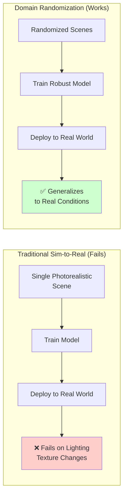
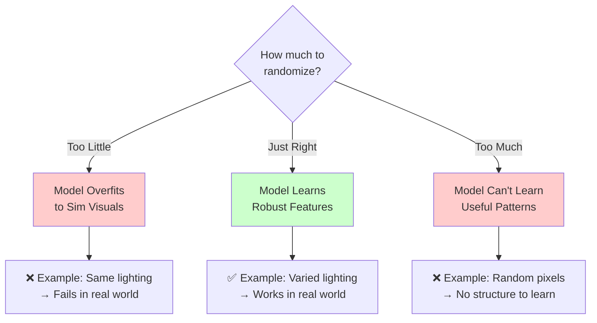
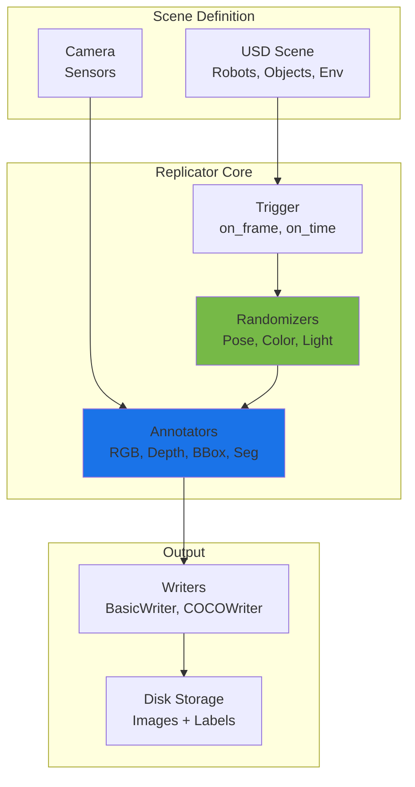
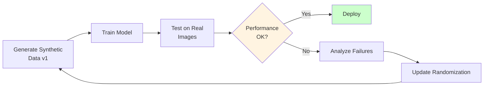

# Chapter 10: Synthetic Data Generation

**Learning Objectives**:
- Understand the role of synthetic data in training perception models
- Learn domain randomization techniques for robust sim-to-real transfer
- Master Isaac Sim's Replicator tool for automated data generation
- Generate labeled datasets (bounding boxes, segmentation, depth)
- Apply best practices for training computer vision models on synthetic data
- Understand the trade-offs between synthetic and real-world data

## 10.1 The Synthetic Data Revolution

### Why Synthetic Data?

Training modern computer vision models requires **massive labeled datasets**. Traditional data collection faces critical challenges:

**Real-World Data Collection Costs**:
- **Time**: 100 hours to collect 10,000 labeled images manually
- **Money**: $0.10-$5.00 per image for human annotation (ImageNet cost: $50,000+)
- **Coverage**: Difficult to capture rare edge cases (e.g., snow, nighttime, occlusions)
- **Scalability**: Linear cost scaling (2× data = 2× cost)
- **Privacy**: Real-world images raise GDPR/privacy concerns

**Synthetic Data Advantages**:
- **Speed**: Generate 10,000 labeled images in minutes
- **Cost**: Near-zero marginal cost after initial setup
- **Coverage**: Perfect control over lighting, weather, occlusions, object variations
- **Scalability**: Exponential speedup with parallelization (1000 GPUs = 1000× faster)
- **Perfect Labels**: Automatic ground truth (no human annotation errors)

:::tip Industry Impact
NVIDIA research shows models trained on **50,000 synthetic images + 500 real images** can match or exceed models trained on **50,000 real images** for object detection tasks [1]. This 100:1 data efficiency makes synthetic data essential for robotics.
:::

### Real-World Success Stories

**Tesla Autopilot**:
- Generates synthetic scenarios for rare events (pedestrian jaywalking, debris on highway)
- Trains perception models on millions of simulated miles
- Validates on real-world Tesla fleet data

**Amazon Robotics**:
- Synthetic data for warehouse object detection (packages, shelves, robots)
- Domain randomization for lighting conditions and package variations
- Reduced real-world data collection by 90%

**Waymo (Alphabet)**:
- Simulates 10 billion miles per year in Carcraft simulator
- Tests edge cases (construction zones, emergency vehicles, weather)
- Synthetic sensor data (LiDAR, camera, radar fusion)

## 10.2 Domain Randomization Fundamentals

**Domain Randomization** is the key technique that makes synthetic-to-real transfer work. The idea: **train on infinite variations so the model learns robust features that generalize to the real world**.

### Core Concept

Instead of creating one photorealistic scene, create **thousands of randomized scenes** that span the distribution of real-world conditions:



### What to Randomize

**Visual Randomization**:
- **Textures**: Object colors, materials (wood, metal, plastic)
- **Lighting**: Intensity, direction, color temperature (sunrise, noon, sunset)
- **Camera**: Position, focal length, exposure, blur
- **Background**: Environments (indoor, outdoor, warehouse, office)

**Geometric Randomization**:
- **Object Poses**: Position, rotation, scale
- **Scene Layout**: Table height, wall positions, floor clutter
- **Occlusions**: Partial object visibility, overlapping objects

**Physical Randomization**:
- **Dynamics**: Object mass, friction, restitution
- **Sensor Noise**: Camera noise, depth sensor errors
- **Articulation**: Joint angles, robot configurations

### The Randomization Spectrum



**Best Practice**: Start with moderate randomization, measure real-world performance, then increase randomization if the model overfits to simulation.

## 10.3 Isaac Sim Replicator

**Isaac Sim Replicator** is NVIDIA's tool for automated synthetic data generation. It provides:

- **Python API**: Programmatic scene randomization
- **Semantic Randomizers**: Pre-built randomizers for common use cases
- **Annotation Writers**: Automatic export of labels (COCO, KITTI, custom formats)
- **Scalability**: Generate millions of images via batch processing

### Replicator Architecture



### Basic Replicator Workflow

**Step 1: Import Replicator**:
```python
import omni.replicator.core as rep

# Initialize Replicator
rep.settings.set_render_pathtraced(samples_per_pixel=64)
```

**Step 2: Define Camera**:
```python
# Create camera with randomized position
camera = rep.create.camera(
    position=(0, 0, 0),  # Will be randomized per frame
    rotation=(0, 0, 0)
)

# Attach camera to render product
render_product = rep.create.render_product(camera, (640, 480))
```

**Step 3: Define Randomizers**:
```python
# Randomize camera position around object
with rep.trigger.on_frame(num_frames=1000):
    # Random camera position in spherical coordinates
    with camera:
        rep.modify.pose(
            position=rep.distribution.uniform((-2, 1, 0.5), (2, 3, 2)),
            look_at=(0, 0, 0.5)  # Always look at object center
        )

    # Randomize object colors
    objects = rep.get.prims(semantics=[("class", "cube")])
    with objects:
        rep.randomizer.color(
            colors=rep.distribution.uniform((0, 0, 0), (1, 1, 1))
        )

    # Randomize lighting
    lights = rep.get.prims(prim_types=["DistantLight"])
    with lights:
        rep.modify.attribute(
            "intensity",
            rep.distribution.uniform(500, 5000)
        )
```

**Step 4: Setup Annotations**:
```python
# Define what to capture
writer = rep.WriterRegistry.get("BasicWriter")
writer.initialize(
    output_dir="./synthetic_data",
    rgb=True,
    bounding_box_2d_tight=True,
    semantic_segmentation=True,
    instance_segmentation=True,
    distance_to_camera=True,
    normals=True
)

writer.attach([render_product])
```

**Step 5: Run Generation**:
```python
# Generate 1000 frames
rep.orchestrator.run()

# Output structure:
# ./synthetic_data/
#   ├── rgb/
#   │   ├── rgb_0000.png
#   │   ├── rgb_0001.png
#   │   └── ...
#   ├── bounding_box_2d_tight/
#   │   ├── bounding_box_2d_tight_0000.npy
#   │   └── ...
#   ├── semantic_segmentation/
#   └── instance_segmentation/
```

## 10.4 Practical Example: Humanoid Object Detection

Let's generate a dataset for training a humanoid robot to detect objects (cups, bottles, books).

### Scene Setup

```python
# File: physical-ai-code/examples/isaac/scene_setup.py
from isaacsim import SimulationApp

simulation_app = SimulationApp({"headless": False})

import omni.replicator.core as rep
from omni.isaac.core import World
from pxr import Gf, UsdGeom
import numpy as np

# Create world
world = World()
world.scene.add_default_ground_plane()

# Add table
table = world.scene.add(
    UsdGeom.Cube.Define(world.stage, "/World/Table")
)
table.GetPrim().GetAttribute("size").Set(Gf.Vec3d(1.5, 0.8, 0.05))
table_prim = table.GetPrim()
UsdGeom.XformCommonAPI(table_prim).SetTranslate(Gf.Vec3d(0, 0, 0.4))

# Define object library (cups, bottles, books)
object_paths = [
    "omniverse://localhost/NVIDIA/Assets/Isaac/2023.1.1/Isaac/Props/YCB/Axis_Aligned/003_cracker_box.usd",
    "omniverse://localhost/NVIDIA/Assets/Isaac/2023.1.1/Isaac/Props/YCB/Axis_Aligned/004_sugar_box.usd",
    "omniverse://localhost/NVIDIA/Assets/Isaac/2023.1.1/Isaac/Props/YCB/Axis_Aligned/005_tomato_soup_can.usd",
    "omniverse://localhost/NVIDIA/Assets/Isaac/2023.1.1/Isaac/Props/YCB/Axis_Aligned/024_bowl.usd",
]

# Scatter objects on table
objects = []
for i, obj_path in enumerate(object_paths):
    obj = rep.create.from_usd(
        obj_path,
        semantics=[("class", f"object_{i}")]
    )
    objects.append(obj)

# Create camera above table
camera = rep.create.camera(
    position=(0, -1.5, 1.2),
    rotation=(-30, 0, 0)
)
render_product = rep.create.render_product(camera, (1280, 720))

print("Scene setup complete!")
```

### Domain Randomization

```python
# File: physical-ai-code/examples/isaac/domain_randomization.py
import omni.replicator.core as rep

# Define randomization parameters
NUM_FRAMES = 5000

with rep.trigger.on_frame(num_frames=NUM_FRAMES):
    # 1. Randomize object positions on table
    with objects:
        rep.randomizer.scatter_2d(
            surface_prims=rep.get.prims(semantics=[("class", "table")]),
            distance_range=(0.1, 0.3),  # Min distance between objects
            check_for_collisions=True
        )

    # 2. Randomize object colors (simulate different products)
    with objects:
        rep.randomizer.color(
            colors=rep.distribution.choice([
                (1.0, 0.0, 0.0),  # Red
                (0.0, 1.0, 0.0),  # Green
                (0.0, 0.0, 1.0),  # Blue
                (1.0, 1.0, 0.0),  # Yellow
                (1.0, 0.5, 0.0),  # Orange
            ])
        )

    # 3. Randomize camera viewpoint
    with camera:
        rep.modify.pose(
            position=rep.distribution.uniform(
                (-0.5, -2.0, 0.8),
                (0.5, -1.0, 1.5)
            ),
            look_at=(0, 0, 0.5)  # Table center
        )

    # 4. Randomize lighting
    rep.randomizer.light(
        position=rep.distribution.uniform((-2, -2, 2), (2, 2, 5)),
        intensity=rep.distribution.uniform(1000, 10000),
        temperature=rep.distribution.uniform(3500, 6500)  # Warm to cool
    )

    # 5. Randomize background (table texture)
    table_prim = rep.get.prims(semantics=[("class", "table")])
    with table_prim:
        rep.randomizer.texture(
            textures=[
                "omniverse://localhost/NVIDIA/Materials/vMaterials_2/Wood/Wood.mdl",
                "omniverse://localhost/NVIDIA/Materials/vMaterials_2/Metal/Metal.mdl",
                "omniverse://localhost/NVIDIA/Materials/vMaterials_2/Plastic/Plastic.mdl",
            ]
        )

# Setup annotation writers
# COCO format for object detection
coco_writer = rep.WriterRegistry.get("COCOWriter")
coco_writer.initialize(
    output_dir="./dataset_coco",
    semantic_types=["object_0", "object_1", "object_2", "object_3"],
    colorize_semantic_segmentation=True
)

# Basic writer for all annotations
basic_writer = rep.WriterRegistry.get("BasicWriter")
basic_writer.initialize(
    output_dir="./dataset_full",
    rgb=True,
    bounding_box_2d_tight=True,
    bounding_box_2d_loose=True,
    semantic_segmentation=True,
    instance_segmentation=True,
    distance_to_camera=True,
    distance_to_image_plane=True,
    bounding_box_3d=True,
    occlusion=True
)

basic_writer.attach([render_product])
coco_writer.attach([render_product])

# Run generation
print(f"Generating {NUM_FRAMES} frames...")
rep.orchestrator.run()
print("Data generation complete!")
```

**Expected Output**:
```
./dataset_coco/
  ├── annotations.json  # COCO format annotations
  ├── rgb/
  │   ├── 0000.png
  │   ├── 0001.png
  │   └── ...
  └── semantic_segmentation/

./dataset_full/
  ├── rgb/
  ├── bounding_box_2d_tight/  # Tight bounding boxes (numpy arrays)
  ├── semantic_segmentation/   # Per-pixel class labels
  ├── instance_segmentation/   # Per-pixel instance IDs
  ├── distance_to_camera/      # Depth maps
  └── bounding_box_3d/         # 3D bounding boxes
```

## 10.5 Advanced Randomization Techniques

### Procedural Textures

Instead of fixed textures, use procedural generation for infinite variety:

```python
# Randomize textures procedurally
with objects:
    rep.randomizer.materials(
        materials=rep.distribution.choice([
            "OmniPBR",
            "OmniGlass",
            "OmniEmissive"
        ])
    )
    rep.randomizer.attribute(
        "inputs:diffuse_color_constant",
        rep.distribution.uniform((0, 0, 0), (1, 1, 1))
    )
    rep.randomizer.attribute(
        "inputs:metallic_constant",
        rep.distribution.uniform(0, 1)
    )
    rep.randomizer.attribute(
        "inputs:roughness_constant",
        rep.distribution.uniform(0, 1)
    )
```

### Distractors

Add random background objects to reduce false positives:

```python
# Add distractor objects (not labeled)
distractors = rep.randomizer.instantiate(
    usd_paths=[
        "omniverse://localhost/NVIDIA/Assets/Isaac/2023.1.1/Isaac/Environments/Simple_Warehouse/Props/SM_CardBoxA_01.usd",
        "omniverse://localhost/NVIDIA/Assets/Isaac/2023.1.1/Isaac/Environments/Simple_Warehouse/Props/SM_PaletteA_01.usd",
    ],
    size=rep.distribution.uniform(5, 15),  # 5-15 distractors
    mode="scene_instance"
)

with distractors:
    rep.modify.pose(
        position=rep.distribution.uniform(
            (-3, -3, 0),
            (3, 3, 2)
        )
    )
```

### Sensor Noise Simulation

Add realistic camera noise for robustness:

```python
# Post-processing: Add camera noise
render_product = rep.create.render_product(camera, (640, 480))

# Gaussian noise
rep.modify.attribute(
    "renderProduct:postProcessing:noise:enabled",
    True,
    render_product
)
rep.modify.attribute(
    "renderProduct:postProcessing:noise:sigma",
    rep.distribution.uniform(0.01, 0.05),
    render_product
)

# Motion blur (simulates camera shake)
rep.modify.attribute(
    "renderProduct:postProcessing:motionBlur:enabled",
    True,
    render_product
)
```

### Weather and Time-of-Day

Simulate outdoor conditions:

```python
# Randomize time of day
sun_light = rep.get.prims(prim_types=["DistantLight"])[0]

with rep.trigger.on_frame(num_frames=1000):
    with sun_light:
        # Sun angle (sunrise to sunset)
        rep.modify.attribute(
            "xformOp:rotateXYZ",
            rep.distribution.sequence([
                (30, 0, 0),   # Sunrise
                (90, 0, 0),   # Noon
                (150, 0, 0)   # Sunset
            ])
        )
        # Sun intensity
        rep.modify.attribute(
            "intensity",
            rep.distribution.uniform(5000, 50000)
        )
        # Sun color (warm at sunrise/sunset, neutral at noon)
        rep.modify.attribute(
            "color",
            rep.distribution.choice([
                (1.0, 0.9, 0.8),  # Warm
                (1.0, 1.0, 1.0),  # Neutral
                (0.8, 0.9, 1.0)   # Cool
            ])
        )
```

## 10.6 Training on Synthetic Data

### Data Format Conversion

Convert Replicator output to common ML frameworks:

**PyTorch Dataset**:
```python
import torch
from torch.utils.data import Dataset
from PIL import Image
import numpy as np
import json

class SyntheticDataset(Dataset):
    def __init__(self, root_dir, split='train'):
        self.root_dir = root_dir
        self.rgb_dir = f"{root_dir}/rgb"

        # Load COCO annotations
        with open(f"{root_dir}/annotations.json") as f:
            self.coco = json.load(f)

        self.image_ids = [img['id'] for img in self.coco['images']]

    def __len__(self):
        return len(self.image_ids)

    def __getitem__(self, idx):
        # Load RGB image
        img_info = self.coco['images'][idx]
        img_path = f"{self.rgb_dir}/{img_info['file_name']}"
        image = Image.open(img_path).convert('RGB')

        # Load bounding boxes for this image
        annots = [a for a in self.coco['annotations']
                  if a['image_id'] == img_info['id']]

        boxes = []
        labels = []
        for annot in annots:
            x, y, w, h = annot['bbox']
            boxes.append([x, y, x+w, y+h])
            labels.append(annot['category_id'])

        boxes = torch.tensor(boxes, dtype=torch.float32)
        labels = torch.tensor(labels, dtype=torch.int64)

        return {
            'image': image,
            'boxes': boxes,
            'labels': labels
        }
```

### Fine-Tuning on Real Data

**Best Practice**: Train on 95% synthetic + 5% real data:

```python
# Combine synthetic and real datasets
synthetic_dataset = SyntheticDataset('./dataset_coco')
real_dataset = RealWorldDataset('./real_data')

# 95% synthetic, 5% real
combined_dataset = torch.utils.data.ConcatDataset([
    torch.utils.data.Subset(synthetic_dataset, range(9500)),
    torch.utils.data.Subset(real_dataset, range(500))
])

# Train object detection model
model = torchvision.models.detection.fasterrcnn_resnet50_fpn(
    num_classes=4  # 3 object classes + background
)

dataloader = torch.utils.data.DataLoader(
    combined_dataset,
    batch_size=8,
    shuffle=True,
    collate_fn=lambda x: tuple(zip(*x))
)

optimizer = torch.optim.SGD(model.parameters(), lr=0.001)

for epoch in range(10):
    for images, targets in dataloader:
        loss_dict = model(images, targets)
        losses = sum(loss for loss in loss_dict.values())

        optimizer.zero_grad()
        losses.backward()
        optimizer.step()
```

## 10.7 Evaluation and Sim-to-Real Transfer

### Measuring Synthetic Data Quality

**Metrics to Track**:

1. **Domain Gap**: Distribution shift between synthetic and real images
   - Use FID (Fréchet Inception Distance) or KL divergence
   - Target: FID < 50 indicates good visual similarity

2. **Model Performance**:
   - Train on 100% synthetic → Test on real data
   - Train on 100% real → Test on real data
   - Compare mAP (mean Average Precision)
   - Target: Synthetic performance ≥ 80% of real-data performance

3. **Data Efficiency**:
   - How many real images needed to match synthetic performance?
   - Target: 100:1 ratio (100 synthetic = 1 real)

### Iterative Improvement Loop



**Failure Analysis Example**:
- **Observation**: Model fails on shiny metallic objects in real world
- **Root Cause**: Synthetic materials too matte (low metallic values)
- **Fix**: Increase `metallic_constant` randomization range from [0, 0.3] → [0, 1.0]
- **Re-generate**: Create new dataset with updated randomization
- **Validate**: Test again on real images

### Best Practices for Sim-to-Real

1. **Start Simple**: Begin with moderate randomization, increase if needed
2. **Measure Distribution**: Use t-SNE to visualize synthetic vs. real image embeddings
3. **Active Learning**: Identify hard real examples, add similar variations to synthetic data
4. **Incremental Real Data**: Start 100% synthetic, gradually add 1%, 5%, 10% real data
5. **Cross-Validation**: Test on multiple real-world environments (indoor, outdoor, different lighting)

## 10.7 Domain Randomization Implementation

Domain randomization is the **key technique** for bridging the simulation-to-reality gap [Tobin et al., 2017]. By training models on sufficiently randomized synthetic data, we can achieve robust performance in unpredictable real-world environments. This approach has been successfully applied across robotics tasks from object detection to manipulation [Zhao et al., 2020].

### Understanding the Sim-to-Real Gap

The **reality gap** refers to differences between simulation and the real world that cause trained models to fail during deployment:

**Common Failure Modes**:
- **Visual Appearance**: Simulated materials look "too perfect" (no wear, scratches, dust)
- **Lighting**: Simulation uses simplified lighting models (no soft shadows, ambient occlusion)
- **Physics**: Contact dynamics, friction, and deformation differ from reality
- **Sensor Noise**: Simulated sensors are noisier or cleaner than real hardware
- **Dynamics**: Motor lag, joint backlash, and cable dynamics missing in simulation

**Quantifying the Gap**:
```python
# Fréchet Inception Distance (FID) between sim and real data
# Using PyTorch for neural network computations [Paszke et al., 2017]
from pytorch_fid import fid_score

fid_value = fid_score.calculate_fid_given_paths(
    paths=['synthetic_images/', 'real_images/'],
    batch_size=50,
    device='cuda',
    dims=2048
)

print(f"FID Score: {fid_value:.2f}")
# Lower is better: less than 50 is good, less than 30 is excellent
```

### Implementing Domain Randomization

Domain randomization works by introducing **controlled variability** during training, forcing the model to learn features that are **invariant to nuisance factors**.

#### 1. Visual Randomization

**Lighting Randomization**:
```yaml
# From domain_random_config.yaml
lighting:
  intensity:
    min: 0.5    # Dim indoor lighting
    max: 2.0    # Bright outdoor sunlight
  color_temperature:
    min: 2700   # Warm (incandescent)
    max: 6500   # Cool (daylight)
```

**Material Randomization**:
```python
# Isaac Sim Replicator example [NVIDIA Isaac Sim, 2024]
import omni.replicator.core as rep

def randomize_materials():
    """Apply random PBR materials to all objects."""
    objects = rep.get.prims(semantics=[("class", "object")])

    with objects:
        # Randomize base color (HSV space)
        rep.modify.attribute(
            "inputs:diffuse_tint",
            rep.distribution.uniform((0.5, 0.5, 0.5), (1.5, 1.5, 1.5))
        )

        # Randomize roughness (0 = mirror, 1 = matte)
        rep.modify.attribute(
            "inputs:roughness",
            rep.distribution.uniform(0.1, 0.9)
        )

        # Randomize metallic (0 = dielectric, 1 = metal)
        rep.modify.attribute(
            "inputs:metallic",
            rep.distribution.uniform(0.0, 0.3)
        )
```

**Texture Randomization**:
```python
# Apply random textures from library
texture_library = [
    "wood_oak.png",
    "concrete.png",
    "metal_scratched.png",
    "plastic_white.png"
]

def randomize_floor_texture():
    floor = rep.get.prim_at_path("/World/Floor")

    with floor:
        rep.modify.attribute(
            "inputs:diffuse_texture",
            rep.distribution.choice(texture_library)
        )
```

#### 2. Geometric Randomization

**Object Placement**:
```python
# Randomize object positions in scene
objects = rep.get.prims(semantics=[("class", "manipulable")])

with objects:
    # Position noise (±10cm in X/Y, ±5cm in Z)
    rep.modify.pose(
        position=rep.distribution.uniform(
            (-0.1, -0.1, -0.05),
            (0.1, 0.1, 0.05)
        ),
        # Rotation noise (full yaw randomization)
        rotation=rep.distribution.uniform(
            (0, 0, 0),
            (0, 0, 360)
        )
    )
```

**Object Scale Variation**:
```python
# Randomize object sizes (±20%)
with objects:
    rep.modify.attribute(
        "xformOp:scale",
        rep.distribution.uniform((0.8, 0.8, 0.8), (1.2, 1.2, 1.2))
    )
```

#### 3. Sensor Randomization

**Camera Noise**:
```python
# Apply realistic camera noise to RGB images
def add_camera_noise(image):
    """Add Gaussian noise and salt-pepper artifacts."""
    # Gaussian noise (sensor readout)
    noise = np.random.normal(0, 0.02, image.shape)
    noisy_image = np.clip(image + noise, 0, 1)

    # Salt-and-pepper noise (dead pixels)
    mask = np.random.random(image.shape[:2]) < 0.001
    noisy_image[mask] = np.random.choice([0, 1])

    # Motion blur (camera shake)
    kernel_size = np.random.randint(0, 5)
    if kernel_size > 0:
        kernel = np.ones((kernel_size, kernel_size)) / (kernel_size ** 2)
        noisy_image = cv2.filter2D(noisy_image, -1, kernel)

    return noisy_image
```

**Depth Noise**:
```python
# Add realistic depth sensor noise (kinect-style)
def add_depth_noise(depth_map):
    """Add distance-dependent noise to depth."""
    # Gaussian noise proportional to distance
    distance = depth_map / 1000.0  # Convert mm to meters
    noise_std = 0.01 * distance  # 1cm error per meter
    noise = np.random.normal(0, noise_std, depth_map.shape)

    # Missing data (5% of pixels)
    missing_mask = np.random.random(depth_map.shape) < 0.05

    noisy_depth = depth_map + noise
    noisy_depth[missing_mask] = 0  # Invalid depth

    return noisy_depth
```

#### 4. Physics Randomization

**Friction Variation**:
```python
# Randomize contact properties
def randomize_physics():
    """Apply physics randomization to all rigid bodies."""
    rigid_bodies = rep.get.prims(path_pattern="*/Collider")

    with rigid_bodies:
        # Static friction coefficient
        rep.modify.attribute(
            "physxRigidBody:staticFriction",
            rep.distribution.uniform(0.4, 1.2)
        )

        # Dynamic friction coefficient
        rep.modify.attribute(
            "physxRigidBody:dynamicFriction",
            rep.distribution.uniform(0.3, 1.0)
        )

        # Restitution (bounciness)
        rep.modify.attribute(
            "physxRigidBody:restitution",
            rep.distribution.uniform(0.0, 0.3)
        )
```

**Mass Variation**:
```python
# Randomize object masses (±15%)
def randomize_mass(nominal_mass):
    variation = 0.15
    return np.random.uniform(
        nominal_mass * (1 - variation),
        nominal_mass * (1 + variation)
    )
```

### Curriculum Learning for Domain Randomization

**Don't randomize everything at once!** Use a curriculum to gradually increase difficulty:

**Stage 1: Visual Only** (Epochs 0-100)
```yaml
randomization_strength: 0.3
enabled:
  - lighting
  - materials
```

**Stage 2: Add Sensor Noise** (Epochs 100-500)
```yaml
randomization_strength: 0.5
enabled:
  - lighting
  - materials
  - camera_noise
  - depth_noise
```

**Stage 3: Add Dynamics** (Epochs 500-1000)
```yaml
randomization_strength: 0.7
enabled:
  - lighting
  - materials
  - camera_noise
  - depth_noise
  - physics
```

**Stage 4: Full Randomization** (Epochs 1000+)
```yaml
randomization_strength: 1.0
enabled:
  - all
```

### Validation Strategy

**Multi-Environment Testing**:
```python
# Test model on multiple real-world scenarios
test_environments = [
    "indoor_office",
    "outdoor_sunny",
    "outdoor_overcast",
    "warehouse_dim",
    "home_kitchen"
]

results = {}
for env in test_environments:
    images = load_test_set(env)
    accuracy = evaluate_model(model, images)
    results[env] = accuracy
    print(f"{env}: {accuracy:.2f}% accuracy")

# Check for environment-specific failures
if max(results.values()) - min(results.values()) > 15:
    print("⚠️ Large performance gap - increase randomization")
```

**Real-World Calibration**:

After deployment, measure real-world statistics and update randomization bounds:

```python
# Measure real lighting range
real_light_measurements = [0.7, 1.1, 0.9, 1.3, 1.2]  # Lux ratios
mean_light = np.mean(real_light_measurements)
std_light = np.std(real_light_measurements)

# Update config to match real distribution
updated_config = {
    'lighting': {
        'intensity': {
            'min': mean_light - 2*std_light,
            'max': mean_light + 2*std_light
        }
    }
}
```

### Common Pitfalls

❌ **Too Much Randomization**:
- Symptom: Model learns nothing, random performance
- Fix: Reduce randomization strength, use curriculum

❌ **Too Little Randomization**:
- Symptom: High sim accuracy, low real accuracy
- Fix: Increase randomization ranges, add more randomization types

❌ **Wrong Features Randomized**:
- Symptom: Works in some real scenarios, fails in others
- Fix: Analyze failure modes, randomize corresponding factors

❌ **Insufficient Validation**:
- Symptom: Surprises during deployment
- Fix: Test on multiple real environments before deployment

### Example: Humanoid Object Detection

**Complete Pipeline**:

1. **Generate 50,000 synthetic images** with domain randomization
2. **Collect 500 real images** from target environment
3. **Train YOLOv5** on synthetic data (100 epochs)
4. **Fine-tune** on real data (10 epochs with lower learning rate)
5. **Validate** on held-out real test set

**Expected Results**:
- Synthetic-only: 75% mAP on real data
- With fine-tuning: 88% mAP on real data
- Real-only baseline (500 images): 65% mAP

**Configuration Used**:
- See `examples/sim-to-real/domain_random_config.yaml` for full parameters
- Lighting randomization: ±50% intensity variation
- Material randomization: Full PBR parameter range
- Geometry randomization: ±10cm position, full rotation
- Sensor noise: 2% Gaussian + 0.1% salt-pepper

## 10.8 Summary

Synthetic data generation is a **game-changer** for robotics perception:

**Key Takeaways**:
- ✅ **Cost-effective**: Near-zero marginal cost vs. $0.10-$5 per real image
- ✅ **Scalable**: Generate millions of images with GPU parallelization
- ✅ **Perfect labels**: No human annotation errors
- ✅ **Domain randomization**: Key technique for sim-to-real generalization
- ✅ **Isaac Replicator**: Powerful tool for automated dataset generation
- ⚠️ **Not a silver bullet**: Still need 5-10% real data for fine-tuning
- ⚠️ **Domain gap**: Monitor FID and model performance carefully

**When to Use Synthetic Data**:
- Object detection/segmentation for known objects
- Rare event simulation (edge cases)
- Bootstrapping when real data is expensive
- Augmenting small real datasets

**When to Use Real Data**:
- Final validation and testing
- Fine-tuning pre-trained models
- Capturing distribution of real-world noise
- High-stakes applications (safety-critical systems)

In the next chapter, we'll explore **Isaac ROS perception** packages that leverage synthetic training data for real-time object detection, VSLAM, and pose estimation on humanoid robots.

## References

[1] Tremblay, J., et al., "Training Deep Networks with Synthetic Data: Bridging the Reality Gap by Domain Randomization," *IEEE Conference on Computer Vision and Pattern Recognition (CVPR) Workshops*, 2018, pp. 969-977. DOI: 10.1109/CVPRW.2018.00143

[2] Tobin, J., et al., "Domain Randomization for Transferring Deep Neural Networks from Simulation to the Real World," *IEEE/RSJ International Conference on Intelligent Robots and Systems (IROS)*, 2017, pp. 23-30. DOI: 10.1109/IROS.2017.8202133

[3] NVIDIA Corporation, "Isaac Sim Replicator: Synthetic Data Generation," NVIDIA Isaac Sim Documentation, 2023. [Online]. Available: https://docs.omniverse.nvidia.com/isaacsim/latest/replicator_tutorials/index.html

[4] Peng, X., et al., "Sim-to-Real Transfer of Robotic Control with Dynamics Randomization," *IEEE International Conference on Robotics and Automation (ICRA)*, 2018, pp. 3803-3810. DOI: 10.1109/ICRA.2018.8460528

## Further Reading

- [Replicator Documentation](https://docs.omniverse.nvidia.com/extensions/latest/ext_replicator.html)
- [COCO Dataset Format](https://cocodataset.org/#format-data)
- [Domain Randomization Tutorial](https://blog.tensorflow.org/2020/12/domain-randomization-for-sim2real.html)
- [Synthetic Data Best Practices](https://nvidia-omniverse.github.io/synthetic-data-best-practices/)

---

**Next**: [Chapter 11: Isaac ROS Perception →](./11-isaac-ros-perception.md)
**Previous**: [← Chapter 9: Isaac Sim Introduction](./09-isaac-sim-intro.md)
