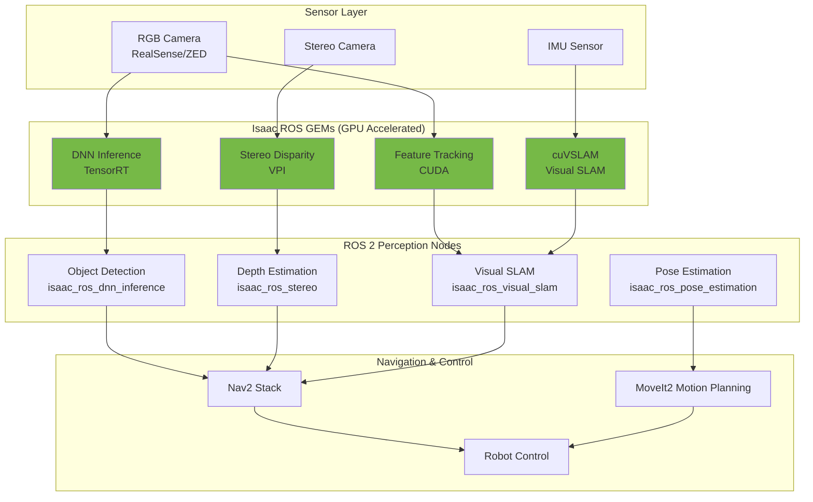

# Chapter 11: Isaac ROS Perception

**Learning Objectives**:
- Understand Isaac ROS GPU-accelerated perception capabilities
- Implement Visual SLAM (VSLAM) for robot localization and mapping
- Deploy GPU-accelerated object detection for real-time inference
- Use depth estimation for 3D scene understanding
- Integrate Isaac ROS nodes with ROS 2 navigation stack
- Optimize perception pipelines for humanoid robot applications

## 11.1 What is Isaac ROS?

**Isaac ROS** is NVIDIA's collection of GPU-accelerated ROS 2 packages for robotics perception. Unlike traditional CPU-based perception (OpenCV, PCL), Isaac ROS leverages **CUDA**, **TensorRT**, and **VPI (Vision Programming Interface)** to achieve:

- **10-100× faster inference**: GPU acceleration for deep learning models
- **Hardware acceleration**: Leverage NVIDIA tensor cores and RT cores
- **Optimized algorithms**: Custom CUDA kernels for computer vision primitives
- **Production-ready**: Battle-tested in NVIDIA autonomous vehicles and robots

:::tip Why GPU Acceleration Matters
A humanoid robot running at 30 Hz needs perception to run in **&lt;33ms per frame**. CPU-only perception often takes 100-500ms per frame, making real-time operation impossible. Isaac ROS brings latency down to 5-20ms.
:::

### Isaac ROS vs. Traditional Perception

| Feature | Traditional ROS | Isaac ROS |
|---------|----------------|-----------|
| **Object Detection** | 200-500ms (CPU YOLO) | 10-30ms (TensorRT YOLO) |
| **VSLAM** | 100-300ms (ORB-SLAM3 CPU) | 15-50ms (cuVSLAM GPU) |
| **Depth Estimation** | 150-400ms (CPU stereo) | 5-15ms (GPU stereo/DNN) |
| **Pose Estimation** | 80-200ms (OpenPose CPU) | 8-25ms (PoseNet TensorRT) |
| **Hardware** | Any CPU | NVIDIA Jetson/RTX GPU |
| **Power** | 15-65W (x86 CPU) | 5-15W (Jetson Orin) |

### Isaac ROS Architecture



**Key Components**:
- **Isaac ROS GEMs**: Low-level GPU-accelerated libraries (proprietary)
- **ROS 2 Nodes**: Standard ROS 2 interface wrapping GEMs
- **TensorRT**: NVIDIA's DNN inference optimizer (INT8/FP16 quantization)
- **VPI**: Vision Programming Interface (GPU computer vision primitives)
- **cuVSLAM**: CUDA-accelerated Visual SLAM

## 11.2 Visual SLAM with cuVSLAM

**Visual SLAM (Simultaneous Localization and Mapping)** is essential for humanoid robots to:
- Estimate robot pose (position + orientation) in unknown environments
- Build 3D maps of the environment
- Enable autonomous navigation without GPS

### cuVSLAM Algorithm

Isaac ROS uses **cuVSLAM**, a GPU-accelerated implementation of visual-inertial odometry (VIO):

**Pipeline**:
1. **Feature Extraction**: Detect ORB features in camera images (CUDA kernels)
2. **Feature Matching**: Match features across frames (GPU parallel matching)
3. **Motion Estimation**: Estimate camera motion using matched features
4. **Loop Closure**: Detect revisited locations to correct drift
5. **Map Optimization**: Bundle adjustment to refine map and trajectory (GPU)

**Performance**:
- **30 Hz operation** on Jetson Orin Nano (15W power)
- **Stereo or monocular** camera support
- **IMU fusion** for robust motion estimation
- **Submeter accuracy** in indoor/outdoor environments

### Installing Isaac ROS Visual SLAM

```bash
# Prerequisites: ROS 2 Humble + NVIDIA GPU
sudo apt update
sudo apt install ros-humble-isaac-ros-visual-slam

# Dependencies
sudo apt install ros-humble-isaac-ros-common \
                 ros-humble-isaac-ros-nvblox

# Verify installation
ros2 pkg list | grep isaac_ros
```

### Running cuVSLAM

**Launch File**:
```python
# File: physical-ai-code/examples/isaac/vslam_launch.py
from launch import LaunchDescription
from launch_ros.actions import Node

def generate_launch_description():
    return LaunchDescription([
        # Visual SLAM node
        Node(
            package='isaac_ros_visual_slam',
            executable='isaac_ros_visual_slam',
            name='visual_slam',
            output='screen',
            parameters=[{
                'denoise_input_images': True,
                'rectified_images': True,
                'enable_imu_fusion': True,
                'enable_slam_visualization': True,
                'enable_landmarks_view': True,
                'enable_observations_view': True,
                'path_max_size': 1024,
                'map_frame': 'map',
                'odom_frame': 'odom',
                'base_frame': 'base_link',
            }],
            remappings=[
                ('stereo_camera/left/image', '/camera/left/image_raw'),
                ('stereo_camera/left/camera_info', '/camera/left/camera_info'),
                ('stereo_camera/right/image', '/camera/right/image_raw'),
                ('stereo_camera/right/camera_info', '/camera/right/camera_info'),
                ('visual_slam/imu', '/imu/data'),
            ]
        ),

        # Camera driver (example: RealSense)
        Node(
            package='realsense2_camera',
            executable='realsense2_camera_node',
            name='realsense_camera',
            parameters=[{
                'enable_depth': False,
                'enable_infra1': True,
                'enable_infra2': True,
                'enable_gyro': True,
                'enable_accel': True,
                'unite_imu_method': 'linear_interpolation',
            }]
        ),
    ])
```

**Run VSLAM**:
```bash
# Launch visual SLAM
ros2 launch isaac_ros_visual_slam isaac_ros_visual_slam.launch.py

# Visualize in RViz
ros2 run rviz2 rviz2 -d $(ros2 pkg prefix isaac_ros_visual_slam)/share/isaac_ros_visual_slam/rviz/default.rviz

# Check odometry output
ros2 topic echo /visual_slam/tracking/odometry

# Output:
# header:
#   stamp: {sec: 1670000000, nanosec: 0}
#   frame_id: odom
# child_frame_id: base_link
# pose:
#   pose:
#     position: {x: 1.234, y: 0.567, z: 0.0}
#     orientation: {x: 0.0, y: 0.0, z: 0.123, w: 0.992}
```

### cuVSLAM for Humanoid Robots

**Mounting Stereo Camera on Humanoid Head**:
```python
# URDF snippet: Add stereo camera to humanoid head
<joint name="camera_joint" type="fixed">
    <parent link="head_link"/>
    <child link="camera_link"/>
    <origin xyz="0.05 0 0.1" rpy="0 0 0"/>  <!-- 10cm above head -->
</joint>

<link name="camera_link">
    <visual>
        <geometry>
            <box size="0.025 0.1 0.025"/>  <!-- Camera housing -->
        </geometry>
    </visual>
</link>

<!-- Left camera (stereo pair) -->
<joint name="left_camera_optical_joint" type="fixed">
    <parent link="camera_link"/>
    <child link="left_camera_optical_frame"/>
    <origin xyz="0 0.032 0" rpy="-1.5707 0 -1.5707"/>  <!-- 6.4cm baseline -->
</joint>

<!-- Right camera -->
<joint name="right_camera_optical_joint" type="fixed">
    <parent link="camera_link"/>
    <child link="right_camera_optical_frame"/>
    <origin xyz="0 -0.032 0" rpy="-1.5707 0 -1.5707"/>
</joint>
```

**Integration with Navigation**:
```python
# Python node: Publish VSLAM odometry to Nav2
import rclpy
from rclpy.node import Node
from nav_msgs.msg import Odometry
from geometry_msgs.msg import PoseWithCovarianceStamped

class VSLAMToNav2(Node):
    def __init__(self):
        super().__init__('vslam_to_nav2')

        # Subscribe to VSLAM odometry
        self.vslam_sub = self.create_subscription(
            Odometry,
            '/visual_slam/tracking/odometry',
            self.vslam_callback,
            10
        )

        # Publish to Nav2 initial pose
        self.pose_pub = self.create_publisher(
            PoseWithCovarianceStamped,
            '/initialpose',
            10
        )

    def vslam_callback(self, msg):
        # Convert odometry to pose for Nav2
        pose_msg = PoseWithCovarianceStamped()
        pose_msg.header = msg.header
        pose_msg.pose.pose = msg.pose.pose

        # Set covariance (confidence in estimate)
        pose_msg.pose.covariance[0] = 0.25  # x variance
        pose_msg.pose.covariance[7] = 0.25  # y variance
        pose_msg.pose.covariance[35] = 0.06  # yaw variance

        self.pose_pub.publish(pose_msg)

def main():
    rclpy.init()
    node = VSLAMToNav2()
    rclpy.spin(node)
    rclpy.shutdown()
```

## 11.3 GPU-Accelerated Object Detection

Isaac ROS provides **isaac_ros_dnn_inference** for running deep learning models with TensorRT optimization.

### Supported Models

| Model | Task | Input | Latency (RTX 3060) |
|-------|------|-------|-------------------|
| **YOLOv5** | Object detection | 640×640 | 12ms |
| **YOLOv8** | Object detection | 640×640 | 10ms |
| **EfficientDet** | Object detection | 512×512 | 18ms |
| **MobileNetSSD** | Object detection | 300×300 | 5ms |
| **SegFormer** | Semantic segmentation | 512×512 | 25ms |
| **PeopleSemSegNet** | Person segmentation | 544×960 | 15ms |

### Converting Models to TensorRT

**Step 1: Export PyTorch model to ONNX**:
```python
import torch
import torchvision

# Load pre-trained YOLOv5
model = torch.hub.load('ultralytics/yolov5', 'yolov5s', pretrained=True)
model.eval()

# Export to ONNX
dummy_input = torch.randn(1, 3, 640, 640)
torch.onnx.export(
    model,
    dummy_input,
    "yolov5s.onnx",
    opset_version=11,
    input_names=['images'],
    output_names=['output'],
    dynamic_axes={'images': {0: 'batch'}, 'output': {0: 'batch'}}
)
```

**Step 2: Convert ONNX to TensorRT**:
```bash
# Using trtexec (comes with TensorRT)
/usr/src/tensorrt/bin/trtexec \
    --onnx=yolov5s.onnx \
    --saveEngine=yolov5s.engine \
    --fp16 \
    --workspace=4096

# Output: yolov5s.engine (optimized for your GPU)
```

### Running Object Detection

**Launch Object Detection Node**:
```python
# File: physical-ai-code/examples/isaac/object_detection_node.py
from launch import LaunchDescription
from launch_ros.actions import ComposableNodeContainer
from launch_ros.descriptions import ComposableNode

def generate_launch_description():
    """Launch TensorRT object detection pipeline"""

    container = ComposableNodeContainer(
        name='detection_container',
        namespace='',
        package='rclcpp_components',
        executable='component_container_mt',
        composable_node_descriptions=[
            # DNN Image Encoder (preprocessing)
            ComposableNode(
                package='isaac_ros_dnn_image_encoder',
                plugin='nvidia::isaac_ros::dnn_inference::DnnImageEncoderNode',
                name='dnn_image_encoder',
                parameters=[{
                    'network_image_width': 640,
                    'network_image_height': 640,
                    'image_mean': [0.0, 0.0, 0.0],
                    'image_stddev': [1.0, 1.0, 1.0],
                }],
                remappings=[
                    ('image', '/camera/image_raw'),
                    ('camera_info', '/camera/camera_info'),
                ]
            ),

            # TensorRT Inference
            ComposableNode(
                package='isaac_ros_triton',
                plugin='nvidia::isaac_ros::dnn_inference::TritonNode',
                name='triton_node',
                parameters=[{
                    'model_name': 'yolov5s',
                    'model_repository_paths': ['/tmp/models'],
                    'max_batch_size': 8,
                    'num_concurrent_requests': 2,
                }]
            ),

            # YOLOv5 Decoder (postprocessing)
            ComposableNode(
                package='isaac_ros_yolov5',
                plugin='nvidia::isaac_ros::yolov5::YoloV5DecoderNode',
                name='yolov5_decoder',
                parameters=[{
                    'confidence_threshold': 0.5,
                    'nms_threshold': 0.45,
                }]
            ),

            # Detection visualization
            ComposableNode(
                package='isaac_ros_detectnet',
                plugin='nvidia::isaac_ros::detectnet::DetectNetVisualizerNode',
                name='detectnet_visualizer'
            ),
        ],
        output='screen'
    )

    return LaunchDescription([container])
```

**Run Detection**:
```bash
# Launch detection pipeline
ros2 launch isaac_ros_yolov5 isaac_ros_yolov5.launch.py

# View detections
ros2 topic echo /detections

# Output:
# detections:
#   - class_id: 0  # person
#     class_name: "person"
#     score: 0.92
#     bbox:
#       center: {x: 320, y: 240}
#       size_x: 150
#       size_y: 400
```

### Custom Object Detection for Humanoids

**Training on Synthetic Data (Chapter 10)**:
```python
# Train YOLOv5 on synthetic dataset
git clone https://github.com/ultralytics/yolov5
cd yolov5

# Convert COCO dataset to YOLO format
python scripts/coco_to_yolo.py --data ./dataset_coco

# Train model
python train.py \
    --data custom_objects.yaml \
    --weights yolov5s.pt \
    --img 640 \
    --epochs 100 \
    --batch 16 \
    --device 0  # GPU 0

# Export to ONNX
python export.py \
    --weights runs/train/exp/weights/best.pt \
    --include onnx \
    --simplify

# Convert to TensorRT (as shown above)
```

**Detect Objects for Manipulation**:
```python
#!/usr/bin/env python3
import rclpy
from rclpy.node import Node
from vision_msgs.msg import Detection2DArray
from geometry_msgs.msg import PoseStamped

class ObjectToGraspPose(Node):
    """Convert detected objects to 3D grasp poses for manipulation"""

    def __init__(self):
        super().__init__('object_to_grasp_pose')

        # Subscribe to detections
        self.det_sub = self.create_subscription(
            Detection2DArray,
            '/detections',
            self.detection_callback,
            10
        )

        # Publish grasp poses
        self.pose_pub = self.create_publisher(
            PoseStamped,
            '/grasp_pose',
            10
        )

    def detection_callback(self, msg):
        for detection in msg.detections:
            # Filter for target object (e.g., "cup")
            if detection.results[0].hypothesis.class_id == "cup":
                # Convert 2D bbox to 3D pose (requires depth)
                grasp_pose = self.bbox_to_grasp_pose(detection.bbox)
                self.pose_pub.publish(grasp_pose)

    def bbox_to_grasp_pose(self, bbox):
        """Convert 2D bounding box to 3D grasp pose"""
        pose = PoseStamped()
        pose.header.frame_id = "camera_link"
        pose.header.stamp = self.get_clock().now().to_msg()

        # Simplified: Use bbox center + estimated depth
        pose.pose.position.x = 0.5  # 50cm from camera
        pose.pose.position.y = (bbox.center.x - 320) * 0.001  # Pixel to meters
        pose.pose.position.z = (240 - bbox.center.y) * 0.001

        # Grasp orientation (top-down)
        pose.pose.orientation.w = 1.0

        return pose

def main():
    rclpy.init()
    node = ObjectToGraspPose()
    rclpy.spin(node)
    rclpy.shutdown()
```

## 11.4 Depth Estimation

Isaac ROS provides multiple depth estimation methods:

### Stereo Disparity (Classic)

**GPU-accelerated stereo matching**:
```bash
# Install stereo package
sudo apt install ros-humble-isaac-ros-stereo-image-proc

# Launch stereo disparity
ros2 launch isaac_ros_stereo_image_proc isaac_ros_stereo_image_proc.launch.py \
    stereo_algorithm:=sgm \
    use_vpi:=true  # Use VPI GPU acceleration
```

### DNN-Based Depth (Monocular)

**MiDaS or DPT for single-camera depth**:
```python
# Launch monocular depth estimation
ros2 launch isaac_ros_dnn_stereo_depth dnn_stereo_depth.launch.py \
    model_name:=dpt_hybrid \
    model_repository_paths:=['/tmp/models']
```

**Output**:
- `/depth/image_raw`: Depth map (meters)
- `/depth/pointcloud`: 3D point cloud

## 11.5 Integration Example: Perception for Navigation

**Complete pipeline for humanoid autonomous navigation**:

```python
# Launch file: humanoid_perception.launch.py
from launch import LaunchDescription
from launch_ros.actions import Node, ComposableNodeContainer
from launch_ros.descriptions import ComposableNode

def generate_launch_description():
    return LaunchDescription([
        # 1. Visual SLAM for localization
        Node(
            package='isaac_ros_visual_slam',
            executable='isaac_ros_visual_slam',
            name='visual_slam',
            parameters=[{'enable_imu_fusion': True}],
            remappings=[
                ('stereo_camera/left/image', '/camera/left/image_raw'),
                ('stereo_camera/right/image', '/camera/right/image_raw'),
            ]
        ),

        # 2. Object detection for obstacle avoidance
        ComposableNodeContainer(
            name='detection_container',
            namespace='',
            package='rclcpp_components',
            executable='component_container_mt',
            composable_node_descriptions=[
                ComposableNode(
                    package='isaac_ros_yolov5',
                    plugin='nvidia::isaac_ros::yolov5::YoloV5Node',
                    name='yolov5',
                    parameters=[{'confidence_threshold': 0.6}]
                ),
            ]
        ),

        # 3. Depth estimation for costmap
        Node(
            package='isaac_ros_stereo_image_proc',
            executable='stereo_image_proc_node',
            name='stereo_proc',
            parameters=[{'use_vpi': True}]
        ),

        # 4. Nvblox for 3D occupancy mapping
        Node(
            package='nvblox_ros',
            executable='nvblox_node',
            name='nvblox',
            parameters=[{
                'voxel_size': 0.05,  # 5cm voxels
                'esdf_2d_max_height': 2.0,  # 2m max height for costmap
            }],
            remappings=[
                ('depth/image', '/depth/image_raw'),
                ('depth/camera_info', '/camera/camera_info'),
                ('color/image', '/camera/image_raw'),
                ('pose', '/visual_slam/tracking/odometry'),
            ]
        ),

        # 5. Costmap for Nav2
        Node(
            package='nav2_costmap_2d',
            executable='costmap_2d_node',
            name='global_costmap',
            parameters=[{
                'global_frame': 'map',
                'robot_base_frame': 'base_link',
                'plugins': ['static_layer', 'obstacle_layer', 'inflation_layer'],
            }]
        ),
    ])
```

## 11.6 Performance Optimization

### Benchmarking Perception Pipeline

```bash
# Measure end-to-end latency
ros2 topic hz /detections
ros2 topic delay /camera/image_raw /detections

# GPU utilization
nvidia-smi dmon -s u

# CPU utilization
top
```

### Optimization Strategies

**1. Reduce Resolution**:
```python
# Lower camera resolution for faster processing
parameters=[{
    'network_image_width': 416,  # Instead of 640
    'network_image_height': 416,
}]
```

**2. Use FP16 Precision**:
```bash
# Convert model with FP16 (2× faster, minimal accuracy loss)
trtexec --onnx=model.onnx --saveEngine=model_fp16.engine --fp16
```

**3. Batch Processing**:
```python
# Process multiple frames in parallel
parameters=[{'max_batch_size': 4}]
```

**4. Multi-Threading**:
```python
# Use component container with multi-threaded executor
executable='component_container_mt'  # Multi-threaded
```

## 11.7 Summary

Isaac ROS brings **production-grade GPU acceleration** to robotics perception:

**Key Takeaways**:
- ✅ **10-100× speedup**: GPU vs. CPU perception
- ✅ **cuVSLAM**: State-of-the-art visual-inertial SLAM
- ✅ **TensorRT**: Optimized DNN inference (FP16/INT8)
- ✅ **ROS 2 integration**: Standard interfaces for Nav2, MoveIt2
- ✅ **Edge deployment**: Runs on Jetson Orin (5-15W power)
- ⚠️ **NVIDIA GPU required**: Jetson or RTX hardware
- ⚠️ **Proprietary GEMs**: Core libraries are closed-source

**When to Use Isaac ROS**:
- Real-time perception requirements (&lt;50ms latency)
- NVIDIA hardware available (Jetson/RTX)
- Production deployment (power efficiency)
- Autonomous navigation with VSLAM

**When to Use Traditional ROS**:
- No NVIDIA GPU
- Research/prototyping (flexibility over performance)
- Open-source requirement

In the next chapter, we'll integrate Isaac ROS perception with **Nav2 navigation** to enable autonomous humanoid locomotion.

## References

[1] Campos, C., et al., "ORB-SLAM3: An Accurate Open-Source Library for Visual, Visual-Inertial and Multi-Map SLAM," *IEEE Transactions on Robotics*, vol. 37, no. 6, pp. 1874-1890, 2021. DOI: 10.1109/TRO.2021.3075644

[2] NVIDIA Corporation, "Isaac ROS: GPU-Accelerated Perception," NVIDIA Isaac ROS Documentation, 2023. [Online]. Available: https://nvidia-isaac-ros.github.io/

[3] Redmon, J., and Farhadi, A., "YOLOv3: An Incremental Improvement," *arXiv preprint arXiv:1804.02767*, 2018.

[4] Nießner, M., et al., "Real-time 3D Reconstruction at Scale using Voxel Hashing," *ACM Transactions on Graphics (TOG)*, vol. 32, no. 6, pp. 1-11, 2013. DOI: 10.1145/2508363.2508374

## Further Reading

- [Isaac ROS Documentation](https://nvidia-isaac-ros.github.io/)
- [cuVSLAM Technical Brief](https://developer.nvidia.com/isaac-ros-visual-slam)
- [TensorRT Optimization Guide](https://docs.nvidia.com/deeplearning/tensorrt/developer-guide/)
- [VPI (Vision Programming Interface)](https://docs.nvidia.com/vpi/)

---

**Next**: [Chapter 12: Nav2 Navigation →](./12-nav2-navigation.md)
**Previous**: [← Chapter 10: Synthetic Data Generation](./10-synthetic-data.md)
