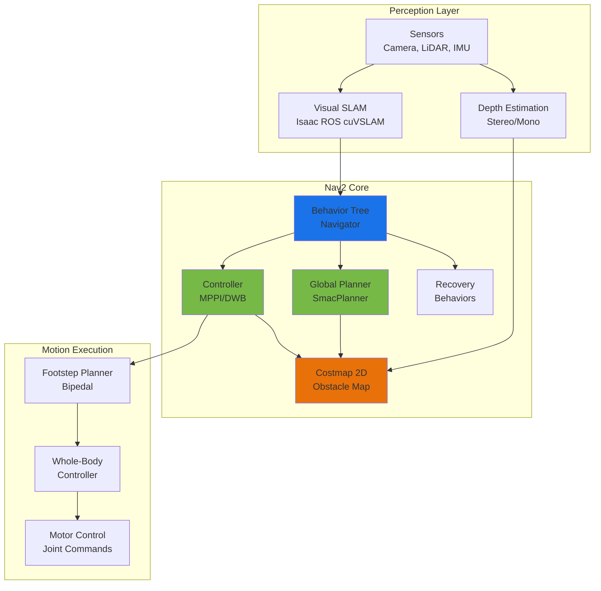
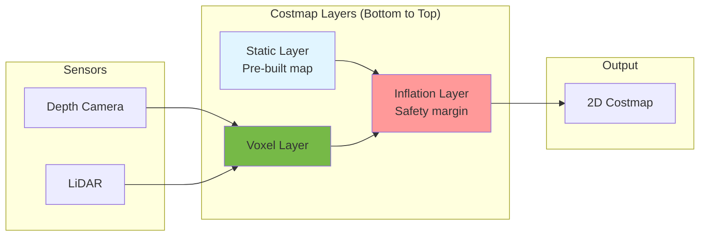

# Chapter 12: Nav2 Navigation for Humanoid Robots

**Learning Objectives**:
- Understand the Nav2 navigation stack architecture
- Configure Nav2 for bipedal humanoid robots (vs. wheeled robots)
- Set up costmaps for obstacle avoidance
- Implement path planning with humanoid constraints
- Integrate Nav2 with Isaac ROS perception (VSLAM, depth)
- Tune navigation parameters for stable bipedal locomotion
- Handle navigation failures and recovery behaviors

## 12.1 What is Nav2?

**Nav2 (Navigation2)** is the ROS 2 successor to the ROS 1 Navigation Stack, providing a complete framework for autonomous mobile robot navigation [1]. It handles:

- **Localization**: Where am I? (via AMCL or VSLAM)
- **Mapping**: What's around me? (via SLAM or static maps)
- **Path Planning**: How do I get there? (global planner)
- **Local Control**: How do I move safely? (local planner + controller)
- **Recovery**: What if I get stuck? (recovery behaviors)

:::tip Why Nav2 for Humanoids?
While Nav2 was designed for wheeled robots, it's **highly configurable** and can be adapted for bipedal locomotion by:
- Adjusting footprint geometry (narrow for bipeds)
- Tuning velocity constraints (slower, stability-aware)
- Customizing recovery behaviors (step back instead of rotate-in-place)
- Integrating whole-body controllers
:::

### Nav2 vs. Traditional Navigation

| Feature | ROS 1 Navigation | Nav2 (ROS 2) |
|---------|-----------------|--------------|
| **Architecture** | Monolithic nodes | Behavior Tree plugins |
| **Localization** | AMCL only | AMCL, SLAM Toolbox, custom |
| **Planners** | Navfn, DWA | Navfn, SmacPlanner, TEB, custom |
| **Controllers** | DWA, TEB | DWB, MPPI, RPP, custom |
| **Recovery** | Fixed behaviors | Configurable behavior trees |
| **Lifecycle** | None | Managed lifecycle nodes |
| **Performance** | Single-threaded | Multi-threaded, composable |

## 12.2 Nav2 Architecture

Nav2 uses a **behavior tree architecture** where navigation is a composition of reusable behaviors:



**Key Components**:

1. **Behavior Tree Navigator**: Orchestrates navigation actions (navigate to pose, follow waypoints, etc.)
2. **Planner Server**: Computes collision-free global path from start to goal
3. **Controller Server**: Generates velocity commands to follow path
4. **Costmap 2D**: Builds occupancy grid from sensor data
5. **Lifecycle Manager**: Manages node startup, shutdown, and error recovery

## 12.3 Bipedal vs. Wheeled Navigation

Humanoid navigation has unique challenges compared to wheeled robots:

### Key Differences

| Aspect | Wheeled Robot | Bipedal Humanoid |
|--------|--------------|------------------|
| **Stability** | Statically stable | Dynamically stable (requires ZMP/CP control) |
| **Footprint** | Large (0.5-1m circle) | Narrow (0.2-0.3m rectangle) |
| **Turning** | Rotate in place | Must step/pivot |
| **Speed** | 0.5-2 m/s typical | 0.3-0.8 m/s (stability-limited) |
| **Obstacle Clearance** | Low ground clearance | Can step over small obstacles |
| **Recovery** | Rotate, backup | Step backward, side-step |
| **Energy** | Efficient | High energy cost |

### Humanoid-Specific Constraints

**Footprint Shape**:
```yaml
# Wheeled robot: Circular footprint
footprint: [[0.5, 0.5], [0.5, -0.5], [-0.5, -0.5], [-0.5, 0.5]]

# Humanoid: Narrow rectangular footprint
footprint: [[0.15, 0.1], [0.15, -0.1], [-0.15, -0.1], [-0.15, 0.1]]
```

**Velocity Constraints**:
```yaml
# Wheeled robot: Fast, omni-directional
max_vel_x: 2.0
max_vel_theta: 3.0
min_turning_radius: 0.0  # Can rotate in place

# Humanoid: Slower, non-holonomic
max_vel_x: 0.5  # Slower for stability
max_vel_theta: 0.8  # Limited turning rate
min_turning_radius: 0.3  # Cannot rotate in place
```

**Recovery Behaviors**:
```yaml
# Wheeled robot
recovery_behaviors: [rotate_recovery, backup_recovery, clear_costmap_recovery]

# Humanoid
recovery_behaviors: [step_back_recovery, sidestep_recovery, replanning_recovery]
```

## 12.4 Setting Up Nav2 for Humanoids

### Installation

```bash
# Install Nav2 (ROS 2 Humble)
sudo apt update
sudo apt install ros-humble-navigation2 \
                 ros-humble-nav2-bringup \
                 ros-humble-slam-toolbox

# Install dependencies
sudo apt install ros-humble-robot-localization \
                 ros-humble-twist-mux
```

### Configuration Structure

Nav2 configuration is organized into parameter files:

```
config/
├── nav2_params.yaml          # Main Nav2 configuration
├── costmap_common.yaml       # Shared costmap settings
├── global_costmap.yaml       # Global costmap (planning)
├── local_costmap.yaml        # Local costmap (control)
└── behavior_tree.xml         # Navigation behavior tree
```

### Main Nav2 Parameters

```yaml
# File: nav2_params.yaml (Humanoid Configuration)
bt_navigator:
  ros__parameters:
    use_sim_time: False
    global_frame: map
    robot_base_frame: base_link
    odom_topic: /odometry/visual  # From Isaac ROS VSLAM
    bt_loop_duration: 10
    default_server_timeout: 20
    enable_groot_monitoring: True
    groot_zmq_publisher_port: 1666
    groot_zmq_server_port: 1667

    # Behavior tree for navigation
    default_nav_to_pose_bt_xml: "$(find-pkg-share nav2_bt_navigator)/behavior_trees/navigate_to_pose_w_replanning_and_recovery.xml"

    plugin_lib_names:
      - nav2_compute_path_to_pose_action_bt_node
      - nav2_follow_path_action_bt_node
      - nav2_back_up_action_bt_node
      - nav2_spin_action_bt_node
      - nav2_wait_action_bt_node
      - nav2_clear_costmap_service_bt_node

planner_server:
  ros__parameters:
    expected_planner_frequency: 1.0  # Replan every 1 second
    planner_plugins: ["GridBased"]

    GridBased:
      plugin: "nav2_smac_planner/SmacPlannerHybrid"  # For non-holonomic
      tolerance: 0.25  # 25cm goal tolerance (wider for bipeds)
      downsample_costmap: false
      downsampling_factor: 1
      allow_unknown: false
      max_iterations: 1000000
      max_on_approach_iterations: 1000
      max_planning_time: 5.0  # seconds

      # Humanoid motion model
      motion_model_for_search: "REEDS_SHEPP"  # Non-holonomic
      angle_quantization_bins: 72  # 5-degree resolution
      minimum_turning_radius: 0.3  # meters (humanoid constraint)

      # Cost penalties
      reverse_penalty: 2.0  # Prefer forward walking
      change_penalty: 0.1  # Penalize direction changes
      non_straight_penalty: 1.2  # Prefer straight paths
      cost_penalty: 2.0  # Obstacle avoidance weight

controller_server:
  ros__parameters:
    controller_frequency: 20.0  # 20 Hz control loop
    min_x_velocity_threshold: 0.001
    min_y_velocity_threshold: 0.001
    min_theta_velocity_threshold: 0.001
    failure_tolerance: 0.3
    progress_checker_plugin: "progress_checker"
    goal_checker_plugins: ["general_goal_checker"]
    controller_plugins: ["FollowPath"]

    # Progress checker (stuck detection)
    progress_checker:
      plugin: "nav2_controller::SimpleProgressChecker"
      required_movement_radius: 0.3  # Must move 30cm in 10 seconds
      movement_time_allowance: 10.0

    # Goal checker
    general_goal_checker:
      plugin: "nav2_controller::SimpleGoalChecker"
      xy_goal_tolerance: 0.25  # 25cm position tolerance
      yaw_goal_tolerance: 0.25  # ~14 degrees orientation tolerance
      stateful: True

    # MPPI Controller (Model Predictive Path Integral)
    FollowPath:
      plugin: "nav2_mppi_controller::MPPIController"
      time_steps: 56  # Prediction horizon
      model_dt: 0.05  # 50ms timestep
      batch_size: 2000  # Number of trajectories to sample
      vx_std: 0.2  # Forward velocity noise
      vy_std: 0.0  # Lateral velocity (no strafing for bipeds)
      wz_std: 0.4  # Angular velocity noise
      vx_max: 0.5  # Max forward speed (m/s)
      vx_min: -0.2  # Max backward speed
      vy_max: 0.0  # No lateral motion
      wz_max: 0.8  # Max turn rate (rad/s)

      # Trajectory scoring
      critics: ["ConstraintCritic", "ObstaclesCritic", "GoalCritic", "GoalAngleCritic", "PathAlignCritic", "PathFollowCritic", "PathAngleCritic"]

      ConstraintCritic:
        enabled: true
        cost_power: 1
        cost_weight: 4.0

      ObstaclesCritic:
        enabled: true
        cost_power: 1
        cost_weight: 50.0  # High weight for obstacle avoidance
        consider_footprint: true
        collision_cost: 10000.0
        near_goal_distance: 0.5

      GoalCritic:
        enabled: true
        cost_power: 1
        cost_weight: 5.0

      PathAlignCritic:
        enabled: true
        cost_power: 1
        cost_weight: 14.0
        max_path_occupancy_ratio: 0.05

      PathFollowCritic:
        enabled: true
        cost_power: 1
        cost_weight: 10.0

local_costmap:
  local_costmap:
    ros__parameters:
      update_frequency: 5.0  # Hz
      publish_frequency: 2.0
      global_frame: odom
      robot_base_frame: base_link
      use_sim_time: False
      rolling_window: true
      width: 3
      height: 3
      resolution: 0.05  # 5cm resolution
      robot_radius: 0.15  # Humanoid radius (conservative)

      plugins: ["voxel_layer", "inflation_layer"]

      voxel_layer:
        plugin: "nav2_costmap_2d::VoxelLayer"
        enabled: True
        publish_voxel_map: True
        origin_z: 0.0
        z_resolution: 0.05
        z_voxels: 16
        max_obstacle_height: 2.0
        mark_threshold: 0
        observation_sources: depth_camera

        depth_camera:
          topic: /camera/depth/points
          sensor_frame: camera_link
          observation_persistence: 0.0
          expected_update_rate: 0.0
          data_type: "PointCloud2"
          min_obstacle_height: 0.1  # Ignore ground plane
          max_obstacle_height: 2.0
          inf_is_valid: false
          clearing: True
          marking: True

      inflation_layer:
        plugin: "nav2_costmap_2d::InflationLayer"
        cost_scaling_factor: 3.0
        inflation_radius: 0.35  # 35cm safety margin

global_costmap:
  global_costmap:
    ros__parameters:
      update_frequency: 1.0
      publish_frequency: 1.0
      global_frame: map
      robot_base_frame: base_link
      use_sim_time: False
      robot_radius: 0.15
      resolution: 0.05
      track_unknown_space: true

      plugins: ["static_layer", "obstacle_layer", "inflation_layer"]

      static_layer:
        plugin: "nav2_costmap_2d::StaticLayer"
        map_subscribe_transient_local: True

      obstacle_layer:
        plugin: "nav2_costmap_2d::VoxelLayer"
        enabled: True
        observation_sources: depth_camera

        depth_camera:
          topic: /camera/depth/points
          sensor_frame: camera_link
          data_type: "PointCloud2"
          min_obstacle_height: 0.1
          max_obstacle_height: 2.0
          clearing: True
          marking: True

      inflation_layer:
        plugin: "nav2_costmap_2d::InflationLayer"
        cost_scaling_factor: 3.0
        inflation_radius: 0.55
```

## 12.5 Costmap Configuration for Humanoids

The **costmap** represents obstacles and free space for navigation. For humanoids, we need special considerations:

### Layer Types



**Cost Values**:
- `0`: Free space (safe to navigate)
- `1-252`: Inflated cost (distance to obstacle)
- `253`: Inscribed obstacle (within robot footprint)
- `254`: Lethal obstacle (collision)
- `255`: Unknown space

### Humanoid-Specific Tuning

**Small Footprint**:
```yaml
# Tight footprint for narrow spaces
footprint: [[0.15, 0.1], [0.15, -0.1], [-0.15, -0.1], [-0.15, 0.1]]

# Or use circular approximation
robot_radius: 0.15  # meters
```

**Step-Over Height**:
```yaml
# Humanoids can step over low obstacles
voxel_layer:
  min_obstacle_height: 0.15  # Ignore obstacles < 15cm (can step over)
  max_obstacle_height: 2.0   # Ignore obstacles > 2m (overhead clearance)
```

**Conservative Inflation**:
```yaml
# Larger safety margin due to dynamic instability
inflation_layer:
  inflation_radius: 0.35  # 35cm buffer (vs. 20cm for wheeled)
  cost_scaling_factor: 3.0  # Exponential cost increase
```

## 12.6 Integration with Isaac ROS

### Complete Navigation Stack

```python
# File: physical-ai-code/examples/navigation/humanoid_navigation.launch.py
from launch import LaunchDescription
from launch_ros.actions import Node
from launch.actions import IncludeLaunchDescription
from launch.launch_description_sources import PythonLaunchDescriptionSource
from ament_index_python.packages import get_package_share_directory
import os

def generate_launch_description():
    """Complete navigation stack for humanoid robot"""

    # Paths
    nav2_bringup_dir = get_package_share_directory('nav2_bringup')
    params_file = os.path.join(
        get_package_share_directory('humanoid_navigation'),
        'config',
        'nav2_humanoid_params.yaml'
    )

    return LaunchDescription([
        # 1. Isaac ROS Visual SLAM (from Chapter 11)
        IncludeLaunchDescription(
            PythonLaunchDescriptionSource(
                os.path.join(get_package_share_directory('isaac_ros_visual_slam'),
                             'launch', 'isaac_ros_visual_slam.launch.py')
            )
        ),

        # 2. Isaac ROS Depth Estimation
        Node(
            package='isaac_ros_stereo_image_proc',
            executable='stereo_image_proc_node',
            name='stereo_proc',
            parameters=[{'use_vpi': True}],
            remappings=[
                ('left/image_raw', '/camera/left/image_raw'),
                ('right/image_raw', '/camera/right/image_raw'),
                ('depth/image_raw', '/camera/depth/image_raw'),
            ]
        ),

        # 3. Point cloud generation (for costmap)
        Node(
            package='depth_image_proc',
            executable='point_cloud_xyz',
            name='point_cloud_xyz',
            remappings=[
                ('image_rect', '/camera/depth/image_raw'),
                ('camera_info', '/camera/camera_info'),
                ('points', '/camera/depth/points'),
            ]
        ),

        # 4. Nav2 Stack
        IncludeLaunchDescription(
            PythonLaunchDescriptionSource(
                os.path.join(nav2_bringup_dir, 'launch', 'navigation_launch.py')
            ),
            launch_arguments={
                'params_file': params_file,
                'use_sim_time': 'false',
            }.items()
        ),

        # 5. RViz Visualization
        Node(
            package='rviz2',
            executable='rviz2',
            name='rviz2',
            arguments=['-d', os.path.join(nav2_bringup_dir, 'rviz', 'nav2_default_view.rviz')]
        ),
    ])
```

### Sending Navigation Goals

**Command Line**:
```bash
# Send navigation goal via CLI
ros2 topic pub /goal_pose geometry_msgs/PoseStamped "
header:
  frame_id: 'map'
pose:
  position:
    x: 2.0
    y: 1.0
    z: 0.0
  orientation:
    w: 1.0
"
```

**Python Node**:
```python
#!/usr/bin/env python3
import rclpy
from rclpy.node import Node
from nav2_simple_commander.robot_navigator import BasicNavigator
from geometry_msgs.msg import PoseStamped

class HumanoidNavigator(Node):
    def __init__(self):
        super().__init__('humanoid_navigator')
        self.navigator = BasicNavigator()

        # Wait for Nav2 to be ready
        self.navigator.waitUntilNav2Active()
        self.get_logger().info("Nav2 is ready!")

    def navigate_to_pose(self, x, y, yaw):
        """Navigate humanoid to target pose"""
        goal_pose = PoseStamped()
        goal_pose.header.frame_id = 'map'
        goal_pose.header.stamp = self.navigator.get_clock().now().to_msg()

        goal_pose.pose.position.x = x
        goal_pose.pose.position.y = y
        goal_pose.pose.position.z = 0.0

        # Convert yaw to quaternion
        from tf_transformations import quaternion_from_euler
        quat = quaternion_from_euler(0, 0, yaw)
        goal_pose.pose.orientation.x = quat[0]
        goal_pose.pose.orientation.y = quat[1]
        goal_pose.pose.orientation.z = quat[2]
        goal_pose.pose.orientation.w = quat[3]

        self.get_logger().info(f"Navigating to ({x}, {y}, {yaw})")
        self.navigator.goToPose(goal_pose)

        # Wait for navigation to complete
        while not self.navigator.isTaskComplete():
            feedback = self.navigator.getFeedback()
            if feedback:
                self.get_logger().info(
                    f"Distance to goal: {feedback.distance_remaining:.2f}m"
                )

        result = self.navigator.getResult()
        if result == 3:  # SUCCEEDED
            self.get_logger().info("Goal reached!")
        elif result == 4:  # CANCELED
            self.get_logger().warn("Navigation canceled")
        elif result == 5:  # ABORTED
            self.get_logger().error("Navigation failed")

def main():
    rclpy.init()
    navigator = HumanoidNavigator()

    # Navigate to waypoints
    waypoints = [
        (2.0, 1.0, 0.0),    # Forward
        (2.0, -1.0, -1.57), # Turn left
        (0.0, 0.0, 3.14),   # Return to start
    ]

    for x, y, yaw in waypoints:
        navigator.navigate_to_pose(x, y, yaw)

    rclpy.shutdown()

if __name__ == '__main__':
    main()
```

## 12.7 Footstep Planning for Bipeds

Nav2 generates **velocity commands** (`cmd_vel`), but humanoids need **footstep plans**. We need a **footstep planner** to convert velocity commands to discrete foot placements.

### Footstep Planner Interface

```python
#!/usr/bin/env python3
"""Footstep Planner: Convert Nav2 cmd_vel to humanoid footsteps"""
import rclpy
from rclpy.node import Node
from geometry_msgs.msg import Twist
from humanoid_msgs.msg import FootstepArray, Footstep  # Custom message

class FootstepPlanner(Node):
    def __init__(self):
        super().__init__('footstep_planner')

        # Subscribe to Nav2 velocity commands
        self.vel_sub = self.create_subscription(
            Twist,
            '/cmd_vel',
            self.velocity_callback,
            10
        )

        # Publish footstep plan
        self.footstep_pub = self.create_publisher(
            FootstepArray,
            '/footsteps',
            10
        )

        # Footstep parameters
        self.step_length = 0.2  # meters
        self.step_width = 0.1   # meters
        self.step_height = 0.05 # meters
        self.step_duration = 0.5  # seconds

    def velocity_callback(self, msg):
        """Convert velocity command to footstep sequence"""
        vx = msg.linear.x
        vy = msg.linear.y
        wz = msg.angular.z

        # Generate footstep plan
        footsteps = self.generate_footsteps(vx, vy, wz)

        # Publish footstep array
        self.footstep_pub.publish(footsteps)

    def generate_footsteps(self, vx, vy, wz):
        """Generate footstep array from velocity"""
        footsteps = FootstepArray()
        footsteps.header.stamp = self.get_clock().now().to_msg()
        footsteps.header.frame_id = 'base_link'

        # Simple alternating footstep pattern
        num_steps = 4
        for i in range(num_steps):
            step = Footstep()
            step.leg = 'left' if i % 2 == 0 else 'right'

            # Forward/backward motion
            step.pose.position.x = vx * self.step_length

            # Lateral motion + step width
            lateral_offset = self.step_width / 2 * (-1 if step.leg == 'left' else 1)
            step.pose.position.y = vy * 0.1 + lateral_offset

            # Step height (swing phase)
            step.pose.position.z = self.step_height

            # Turning (yaw)
            step.pose.orientation.z = wz * 0.1 * i

            step.duration = self.step_duration
            footsteps.footsteps.append(step)

        return footsteps

def main():
    rclpy.init()
    node = FootstepPlanner()
    rclpy.spin(node)
    rclpy.shutdown()
```

## 12.8 Tuning and Debugging

### Visualization in RViz

```bash
# Launch Nav2 with visualization
ros2 launch nav2_bringup navigation_launch.py use_sim_time:=false

# In RViz, add these displays:
# - Map (topic: /map)
# - Global Costmap (topic: /global_costmap/costmap)
# - Local Costmap (topic: /local_costmap/costmap)
# - Global Plan (topic: /plan)
# - Local Plan (topic: /local_plan)
# - Robot Footprint (topic: /local_costmap/published_footprint)
# - TF (frames: map, odom, base_link)
```

### Common Issues and Solutions

**Issue 1: Robot gets stuck near obstacles**
```yaml
# Solution: Increase inflation radius
inflation_layer:
  inflation_radius: 0.45  # Increase from 0.35
```

**Issue 2: Planner fails to find paths in narrow spaces**
```yaml
# Solution: Reduce footprint size or increase tolerance
planner_server:
  GridBased:
    tolerance: 0.35  # Increase from 0.25
```

**Issue 3: Controller oscillates**
```yaml
# Solution: Reduce angular velocity and increase damping
controller_server:
  FollowPath:
    wz_std: 0.2  # Reduce from 0.4
    cost_weight: 60.0  # Increase obstacle cost
```

**Issue 4: VSLAM drift causes navigation failures**
```yaml
# Solution: Enable loop closure and increase map update rate
visual_slam:
  enable_loop_closure: true
  loop_closure_frequency: 5.0  # Hz
```

### Performance Benchmarks

**Target Metrics** (for real-time operation):
- **Planner frequency**: 1 Hz (replan every second)
- **Controller frequency**: 20 Hz (50ms control loop)
- **Costmap update**: 5 Hz local, 1 Hz global
- **End-to-end latency**: &lt;100ms (perception → command)

**Measure Performance**:
```bash
# Controller latency
ros2 topic delay /cmd_vel

# Planning time
ros2 topic echo /plan --field header.stamp

# Costmap update rate
ros2 topic hz /local_costmap/costmap
```

## 12.9 Summary

Nav2 provides a **powerful and flexible** framework for humanoid robot navigation:

**Key Takeaways**:
- ✅ **Behavior tree architecture**: Composable, extensible navigation
- ✅ **Bipedal adaptations**: Narrow footprint, stability constraints, custom recovery
- ✅ **Isaac ROS integration**: VSLAM localization, depth-based costmaps
- ✅ **MPPI controller**: Sample-based control for non-holonomic motion
- ✅ **Footstep planning**: Convert velocity commands to discrete steps
- ⚠️ **Complexity**: Many parameters to tune (start with defaults)
- ⚠️ **Stability**: Humanoid controllers must ensure dynamic balance

**When to Use Nav2**:
- Autonomous indoor/outdoor navigation
- Goal-directed locomotion
- Obstacle avoidance in dynamic environments
- Multi-waypoint missions

**Limitations**:
- Does not handle whole-body balance (needs external controller)
- Assumes flat terrain (stairs/slopes require custom planners)
- Recovery behaviors may not preserve balance

In the next chapter (Tutorial 3), we'll **implement a complete Isaac VSLAM demo** combining visual SLAM, object detection, and autonomous navigation on a simulated humanoid robot.

## References

[1] Macenski, S., et al., "The Marathon 2: A Navigation System," *IEEE/RSJ International Conference on Intelligent Robots and Systems (IROS)*, 2020, pp. 2718-2725. DOI: 10.1109/IROS45743.2020.9341207

[2] Lu, D. V., et al., "Layered Costmaps for Context-Sensitive Navigation," *IEEE/RSJ International Conference on Intelligent Robots and Systems (IROS)*, 2014, pp. 709-715. DOI: 10.1109/IROS.2014.6942636

[3] Williams, G., et al., "Model Predictive Path Integral Control: From Theory to Parallel Computation," *Journal of Guidance, Control, and Dynamics*, vol. 40, no. 2, pp. 344-357, 2017. DOI: 10.2514/1.G001921

[4] Kuffner, J., et al., "Footstep Planning for the Honda ASIMO Humanoid," *IEEE International Conference on Robotics and Automation (ICRA)*, vol. 1, pp. 629-634, 2005. DOI: 10.1109/ROBOT.2005.1570188

## Further Reading

- [Nav2 Documentation](https://navigation.ros.org/)
- [Behavior Trees for Robotics](https://arxiv.org/abs/1709.00084)
- [MPPI Controller Deep Dive](https://github.com/ros-planning/navigation2/tree/main/nav2_mppi_controller)
- [Humanoid Footstep Planning Survey](https://ieeexplore.ieee.org/document/7989162)

---

**Next**: [Tutorial 3: Isaac VSLAM Demo →](./tutorial-03-isaac-vslam.md)
**Previous**: [← Chapter 11: Isaac ROS Perception](./11-isaac-ros-perception.md)
