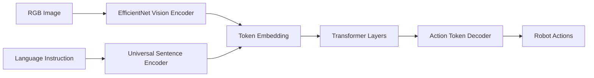
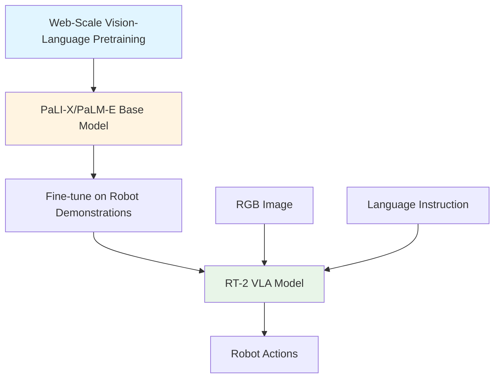
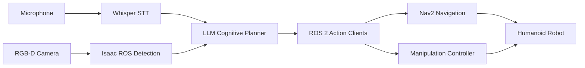

# Chapter 13: Vision-Language-Action (VLA) Models Overview

## Introduction

The field of robotics has long grappled with the challenge of creating systems that can understand and execute tasks in the natural, unstructured environments where humans live and work. Traditional robotic systems require extensive explicit programming for each task, making them brittle and difficult to adapt to new situations. **Vision-Language-Action (VLA) models** represent a paradigm shift in robotic control, enabling robots to understand natural language commands, perceive their environment through vision, and generate appropriate actions—all through end-to-end learned models.

VLA models leverage recent breakthroughs in computer vision (Vision Transformers), natural language processing (Large Language Models), and reinforcement learning to create robots that can generalize to novel tasks and objects without task-specific programming. This chapter explores the architecture, capabilities, and research landscape of VLA models, preparing you to integrate these cutting-edge AI systems with the ROS 2, simulation, and Isaac platform skills you've developed in previous modules.

## What are Vision-Language-Action Models?

### Definition and Core Concept

A **Vision-Language-Action (VLA) model** is an end-to-end neural network that takes multimodal inputs—visual observations from cameras and natural language task descriptions—and directly outputs low-level robot actions (joint positions, velocities, or torques). Unlike traditional robotics pipelines that decompose tasks into separate perception, planning, and control modules, VLA models learn a direct mapping from sensory inputs to motor commands through large-scale imitation learning or reinforcement learning.

**Key Characteristics**:

1. **Multimodal Input**: Processes both visual data (RGB images, depth maps) and linguistic data (natural language instructions)
2. **End-to-End Learning**: Trained directly on task demonstrations, bypassing manual feature engineering
3. **Generalization**: Can handle novel objects, scenes, and linguistic variations not seen during training
4. **Data-Driven**: Performance scales with the size and diversity of training data

The fundamental insight behind VLA models is that with sufficient training data, a single neural network can learn the complex associations between language, vision, and action that enable flexible task execution. This approach mirrors how humans learn manipulation skills—through observation, language instruction, and practice—rather than through explicit procedural programming.

### The Traditional Robotics Pipeline vs. VLA

To appreciate the innovation of VLA models, it's helpful to contrast them with traditional robotic control architectures:

**Traditional Modular Pipeline**:
```
Natural Language → NLP Parser → Task Planner → Motion Planner → Controller → Robot Actions
      ↓                           ↓                ↓
  Semantic Parser         Symbolic Planner    Trajectory Optimization
  (hand-crafted)          (STRIPS, PDDL)      (RRT, MPC)
```

This approach requires:
- Manual semantic parsing rules for language understanding
- Explicit symbolic representations of tasks and objects
- Hard-coded motion primitives and constraints
- Separate engineering for each module

**VLA End-to-End Approach**:
```
[Vision Input + Language Input] → VLA Neural Network → Robot Actions
       (RGB-D images, text)              (Transformer)        (joint commands)
```

This approach learns:
- Implicit semantic understanding from language-action pairs
- Task representations directly from demonstration data
- Motion generation from observed trajectories
- Unified model trained jointly on all components

The VLA approach trades interpretability and explicit control for generalization and data efficiency. When provided with diverse training data (thousands to millions of demonstrations), VLA models can exhibit emergent capabilities like zero-shot generalization to new objects and compositional understanding of task instructions.

## Key VLA Model Architectures

### RT-1: Robotics Transformer 1

**RT-1 (Robotics Transformer 1)**, introduced by Google Research in 2022, was one of the first large-scale VLA models to demonstrate real-world manipulation capabilities across diverse tasks and objects.

#### Architecture

RT-1 uses a **Transformer-based architecture** that processes visual and linguistic inputs through separate encoders before fusing them for action prediction:



**Key Components**:

1. **Vision Encoder**: EfficientNet-B3 pretrained on ImageNet, producing spatial feature maps
2. **Language Encoder**: Universal Sentence Encoder (USE) converting text to 512-dim embeddings
3. **Token Embedding**: Combines visual tokens (spatial patches) with language token
4. **Transformer**: 8-layer, 8-head architecture processing combined tokens
5. **Action Decoder**: Outputs discretized actions for 7-DOF robot arm (x, y, z, roll, pitch, yaw, gripper)

#### Training Data and Performance

RT-1 was trained on **130,000 demonstrations** collected across 700+ tasks in real-world office kitchen environments. Tasks included:
- Object manipulation: "pick up the apple", "move the can to the left"
- Drawer opening/closing
- Object rearrangement and sorting
- Language-conditioned navigation

**Performance Metrics**:
- **97% success rate** on training distribution tasks
- **76% success rate** on unseen objects (generalization)
- **Emergent capabilities**: Could combine concepts not seen together during training (e.g., "move the Coke can" when trained separately on "move X" and "Coke can" recognition)

#### Limitations

- **Action Space**: Discretizes continuous actions into 256 bins, potentially limiting precision
- **Observation Space**: Single RGB camera view, no depth or tactile sensing
- **Task Horizon**: Primarily short-horizon manipulation (< 30 seconds)
- **Computational Requirements**: ~300M parameters, requires GPU inference

### RT-2: Robotics Transformer with Vision-Language Models

**RT-2**, released in 2023, extends RT-1 by incorporating pretrained **Vision-Language Models (VLMs)** as the foundation, enabling better generalization and reasoning capabilities.

#### Architecture

RT-2 leverages **PaLI-X** or **PaLM-E** vision-language models, fine-tuning them on robot demonstration data:



**Key Innovation**: Instead of training vision and language encoders from scratch on robot data, RT-2 starts with models pretrained on billions of web images and text (ImageNet, COCO, web-crawled data). This provides:

1. **Richer Semantic Understanding**: Pretrained on diverse visual concepts
2. **Commonsense Reasoning**: Language model trained on internet-scale text
3. **Few-Shot Generalization**: Can handle novel objects/instructions with minimal robot data

#### Performance Improvements over RT-1

| Capability | RT-1 | RT-2 |
|------------|------|------|
| Training Tasks | 700 | 700 |
| Unseen Object Success | 76% | **84%** |
| Novel Category Success | 13% | **47%** |
| Symbol Understanding | Limited | **62%** (e.g., "move the bag with the recycling symbol") |
| Reasoning Tasks | 10% | **36%** (e.g., "move the extinct animal") |

The dramatic improvement in novel category and reasoning tasks demonstrates the power of leveraging web-scale pretraining. RT-2 can understand high-level concepts like "extinct animal" (identifying a toy dinosaur) or "recycling symbol" without being explicitly trained on these labels in the robot domain.

### PaLM-E: Embodied Multimodal Language Model

**PaLM-E (Pathways Language Model - Embodied)**, introduced by Google and TU Berlin in 2023, takes a different approach by creating a **general-purpose embodied reasoning model** that combines language, vision, and continuous sensor data (robot state, proprioception).

#### Architecture

PaLM-E integrates multimodal inputs directly into a large language model architecture:

```
┌─────────────────────────────────────────────────────────┐
│                    PaLM-E (562B parameters)             │
│  ┌──────────────────────────────────────────────────┐  │
│  │  PaLM Language Model (540B)                       │  │
│  │  + Vision Encoder (ViT-22B)                       │  │
│  │  + Sensor Encoders (Proprioception, State)        │  │
│  └──────────────────────────────────────────────────┘  │
└─────────────────────────────────────────────────────────┘
         ↓                    ↓                  ↓
  [Natural Language]   [Image Patches]   [Robot State Vector]
         ↓                    ↓                  ↓
  Text Tokens          Image Tokens      Sensor Tokens
         └────────────────┬────────────────┘
                          ↓
              Transformer Processing
                          ↓
              Generated Text Response
              (includes action sequences)
```

**Key Features**:

1. **Massive Scale**: 562 billion parameters (largest embodied model to date)
2. **Multimodal Integration**: Processes images, text, and continuous sensor data as unified token sequences
3. **Task-Agnostic**: Same model handles manipulation, navigation, visual question answering, and general language tasks
4. **Chain-of-Thought Reasoning**: Can generate explanations for decisions before acting

#### Novel Capabilities

PaLM-E demonstrates several emergent capabilities not seen in smaller VLA models:

**Affordance Prediction**: "What can I do with this object?" → Generates action possibilities
**Physical Reasoning**: "Will the tower fall if I remove the bottom block?" → Predicts outcomes
**Multimodal Planning**: Combines visual scene understanding with language-based task decomposition
**Transfer Learning**: Knowledge from language tasks (e.g., analogies, math) transfers to robot tasks

**Example Task**:
```
Input: [Image of kitchen table], "Bring me something to cut the apple"
PaLM-E Reasoning:
1. Identifies apple on table (vision)
2. Recalls that knives cut apples (language knowledge)
3. Locates knife in drawer (visual search)
4. Plans navigation and grasp sequence (embodied reasoning)
Output: Action sequence to retrieve knife
```

#### Limitations

- **Computational Cost**: 562B parameters require distributed inference across multiple GPUs
- **Latency**: Slower inference than specialized VLA models (~5-10 seconds per decision)
- **Action Granularity**: Outputs high-level action plans, requires lower-level controller for execution
- **Availability**: Not publicly released (research demonstrations only)

## The VLA Training Pipeline

Understanding how VLA models are trained is crucial for appreciating their capabilities and limitations. The typical training pipeline involves three phases:

### Phase 1: Pretraining (for RT-2/PaLM-E)

**Data**: Billions of image-text pairs from web sources (COCO, ImageNet, Conceptual Captions)

**Objective**: Learn general visual and linguistic representations

**Methods**:
- **Contrastive Learning**: CLIP-style image-text matching
- **Masked Language Modeling**: Predict missing words in text
- **Image Captioning**: Generate descriptions for images

**Duration**: Weeks to months on large GPU clusters

### Phase 2: Robot Demonstration Collection

**Data**: Human teleoperation demonstrations in target environment

**Collection Methods**:

1. **Kinesthetic Teaching**: Human guides robot arm through task
2. **VR Teleoperation**: Human controls robot using VR headset and controllers
3. **Motion Capture**: Human performs task, robot mimics through retargeting

**Dataset Scale**:
- RT-1: 130,000 trajectories across 700 tasks
- RT-2: Similar scale but leverages pretraining for better sample efficiency
- Open-X Embodiment: 1M+ trajectories from 22 robot types (multi-robot dataset)

**Data Diversity is Critical**: Models trained on narrow task distributions fail to generalize. Successful VLA models are trained on:
- Multiple object categories (fruits, tools, containers, toys)
- Varied environments (office, kitchen, warehouse)
- Linguistic diversity (synonyms, paraphrases, compositional instructions)

### Phase 3: Behavioral Cloning and Fine-Tuning

**Objective**: Learn mapping from (visual observation, language instruction) → robot actions

**Loss Function** (simplified):
```
L = Σ ||a_predicted - a_human||²
```
Where `a_predicted` is the model's predicted action and `a_human` is the demonstrated action.

**Techniques**:
- **Action Chunking**: Predict sequences of actions rather than single timesteps
- **Diffusion Policies**: Model action distribution using diffusion models for multi-modal behaviors
- **Temporal Ensembling**: Average predictions across recent frames for stability

**Training Duration**: Days to weeks on GPU clusters

## Vision-Language-Action vs. Traditional Approaches

### Advantages of VLA Models

1. **Generalization to Novel Objects**
   - Traditional: Requires explicit object models and grasping heuristics
   - VLA: Learns grasping strategies from visual similarity to training objects

2. **Natural Language Flexibility**
   - Traditional: Fixed command vocabulary, brittle parsing
   - VLA: Handles paraphrasing, synonyms, compositional instructions

3. **Rapid Task Acquisition**
   - Traditional: Weeks of engineering per new task
   - VLA: Additional demonstrations added to training set, model retrained

4. **Sim-to-Real Transfer (with modifications)**
   - Traditional: Simulation parameters must precisely match reality
   - VLA: Visual representation learning bridges domain gap

### Limitations and Challenges

1. **Data Hunger**: Requires thousands of demonstrations for reasonable performance
2. **Long-Horizon Tasks**: Struggles with multi-stage tasks requiring persistent memory
3. **Safety and Interpretability**: Black-box nature makes verification difficult
4. **Computational Requirements**: Large models require expensive GPU infrastructure
5. **Dynamic Environments**: Limited ability to handle moving objects or changing scenes

### Hybrid Approaches

Many practical systems combine VLA models with traditional robotics methods:

- **VLA for High-Level Planning** + Classical Controllers for Execution
- **VLA for Perception** + Symbolic Planner for Task Decomposition
- **VLA for Manipulation** + Nav2 for Navigation (approach we'll use in Tutorial 4)

## State of the Art (2023-2024)

### Recent Developments

**Open-Source Initiatives**:
- **Open-X Embodiment Dataset**: 1M+ trajectories from 22 robot platforms
- **OpenVLA**: Open-source 7B parameter VLA model trained on Open-X
- **RoboAgent**: Multi-task VLA with 1,500 tasks, released by CMU

**Architectural Innovations**:
- **Diffusion Policies**: Using diffusion models for multi-modal action distributions
- **Hierarchical VLAs**: Separate models for high-level planning and low-level control
- **Memory-Augmented VLAs**: Transformers with external memory for long-horizon tasks

**Performance Benchmarks**:
- **CALVIN**: Multi-task long-horizon benchmark (success rate: 40-60% for SOTA models)
- **RLBench**: 100-task simulation benchmark (success rate: 70-85% for SOTA)
- **Real-World Kitchens**: Unstructured environments (success rate: 60-80% for domain-specific models)

### Commercial Applications

While most VLA research remains in academic labs, early commercial applications are emerging:

- **Covariant**: Pick-and-place robots for warehouse automation
- **Vicarious** (acquired by Intrinsic): Object recognition and manipulation for manufacturing
- **Physical Intelligence**: General-purpose manipulation robots for household tasks (in development)

## Integrating VLA with ROS 2 and Isaac

In Tutorial 4, you'll build a hybrid VLA system that combines:

**Speech Input**: Whisper for natural language transcription
**Cognitive Planning**: LLM (GPT-4 or open-source alternative) for task decomposition
**Visual Grounding**: Isaac ROS object detection to identify targets
**Action Execution**: ROS 2 Action servers for manipulation and Nav2 for navigation

This architecture represents a **practical compromise** between pure end-to-end VLA (computationally expensive, requires extensive robot-specific training data) and modular classical robotics (brittle, limited generalization). By using off-the-shelf vision and language models, we achieve robust natural language understanding and visual perception without requiring massive robot demonstration datasets.

**System Architecture Preview**:


## Summary

Vision-Language-Action models represent a fundamental shift in robotics, moving from hand-crafted task-specific systems to data-driven general-purpose controllers. Key takeaways:

1. **VLA models** learn end-to-end mappings from vision + language to actions through imitation learning
2. **RT-1** demonstrated real-world manipulation with 130K demonstrations and Transformer architecture
3. **RT-2** improved generalization by leveraging web-scale vision-language pretraining
4. **PaLM-E** showed that massive language models can be embodied for multimodal reasoning
5. **Practical systems** often hybrid VLA models with classical robotics for reliability and efficiency

The field is rapidly evolving, with open-source models and datasets democratizing access to VLA capabilities. In the following chapters, we'll build the components of a VLA system: speech recognition (Chapter 14), cognitive planning (Chapter 15), and integrate them in a capstone project (Chapter 16).

## Comprehension Questions

1. **Architecture**: Explain the key differences between RT-1's architecture and RT-2's approach. Why does RT-2 achieve better generalization on novel categories?

2. **Training Data**: Why is data diversity critical for VLA model generalization? Provide three specific types of diversity that improve performance.

3. **Hybrid Systems**: Describe a scenario where a hybrid VLA + classical robotics approach would be preferable to a pure end-to-end VLA model. Justify your reasoning.

4. **Multimodal Fusion**: In PaLM-E, how are visual, linguistic, and sensor inputs combined? What advantage does this unified representation provide?

5. **Practical Limitations**: You're deploying a VLA model for a warehouse pick-and-place task. Identify three practical challenges you would face and propose mitigation strategies.

## Further Reading

- Brohan, A., et al. (2022). "RT-1: Robotics Transformer for Real-World Control at Scale." *arXiv preprint arXiv:2212.06817*.
- Brohan, A., et al. (2023). "RT-2: Vision-Language-Action Models Transfer Web Knowledge to Robotic Control." *arXiv preprint arXiv:2307.15818*.
- Driess, D., et al. (2023). "PaLM-E: An Embodied Multimodal Language Model." *arXiv preprint arXiv:2303.03378*.
- Open X-Embodiment Collaboration. (2023). "Open X-Embodiment: Robotic Learning Datasets and RT-X Models." *arXiv preprint arXiv:2310.08864*.

---

**Next**: [Chapter 14: Speech Recognition with Whisper →](./14-speech-recognition.md)
