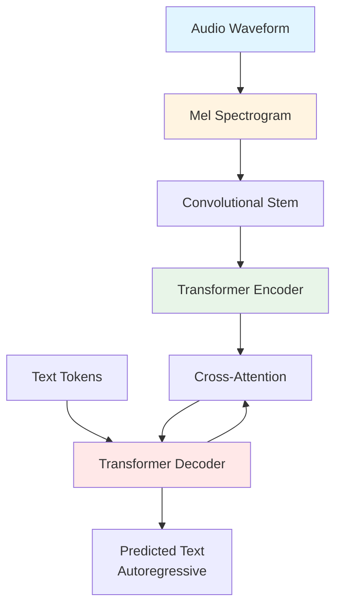

# Chapter 14: Speech Recognition with Whisper

## Introduction

Natural language interfaces represent the most intuitive way for humans to interact with robots. Rather than learning specialized command syntax or operating joysticks, users can simply speak their intentions: "Go to the kitchen and bring me a water bottle." Enabling robots to understand spoken language requires **Automatic Speech Recognition (ASR)** systems that convert audio waveforms into text transcriptions. In this chapter, we'll explore OpenAI's **Whisper**, a state-of-the-art ASR model, and integrate it with ROS 2 to create a voice-controlled humanoid robot system.

**Learning Objectives**:

- Understand Whisper's architecture and capabilities
- Set up audio capture pipeline in ROS 2
- Implement real-time speech-to-text node using Whisper
- Handle audio streaming, buffering, and Voice Activity Detection (VAD)
- Integrate speech input with downstream VLA components

## Why Whisper for Robotics?

### The Speech Recognition Landscape

Traditional ASR systems like Kaldi, CMU Sphinx, and commercial APIs (Google Speech-to-Text, Amazon Transcribe) have been available for years. Why has Whisper, released in 2022, become the preferred choice for robotics applications?

**Key Advantages**:

1. **Robustness to Noise**: Trained on 680,000 hours of diverse audio including noisy environments, accents, and background sounds—conditions common in real-world robotics deployments
2. **Multilingual Support**: Supports 99 languages out-of-the-box, crucial for international robotics research
3. **Zero-Shot Performance**: Works without fine-tuning on domain-specific data (unlike Kaldi which requires acoustic model training)
4. **Open-Source and Local**: Runs entirely on local hardware without cloud API dependencies
5. **Timestamp Precision**: Provides word-level timestamps for temporal grounding of commands

### Whisper Model Variants

Whisper comes in five model sizes, trading accuracy for inference speed:

| Model | Parameters | English-only Relative Speed | Multilingual Relative Speed | Required VRAM |
|-------|-----------|------------------------|------------------------|---------------|
| tiny | 39 M | ~32x | ~32x | ~1 GB |
| base | 74 M | ~16x | ~16x | ~1 GB |
| small | 244 M | ~6x | ~6x | ~2 GB |
| medium | 769 M | ~2x | ~2x | ~5 GB |
| large | 1550 M | 1x | 1x | ~10 GB |

**Recommendation for Robotics**:
- **Development/Testing**: `base` model (real-time on CPU, low latency)
- **Production (with GPU)**: `small` or `medium` (best accuracy/speed tradeoff)
- **Offline Processing**: `large` (maximum accuracy for logged demonstrations)

For our tutorial, we'll use `base` to ensure accessibility for users without GPU hardware.

## Whisper Architecture

### Encoder-Decoder Transformer

Whisper uses a standard **sequence-to-sequence Transformer** architecture similar to neural machine translation models:



**Processing Steps**:

1. **Audio Preprocessing**: 16 kHz audio is converted to **log-Mel spectrogram** (80 frequency bins, 30 ms windows)
2. **Encoder**: Processes spectrogram through multi-layer Transformer, producing contextual representations
3. **Decoder**: Autoregressively generates text tokens using cross-attention to encoder outputs
4. **Output**: Text transcription with optional timestamps and language detection

### Training Methodology

Whisper's robustness comes from its training approach:

**Training Data**: 680,000 hours from:
- Web-scraped video subtitles (majority)
- Audiobooks and podcasts
- Clean speech datasets (LibriSpeech, Common Voice)
- Noisy, real-world recordings

**Multitask Learning**: Single model trained jointly on:
- Speech recognition (English and multilingual)
- Speech translation (transcribe non-English audio to English text)
- Language identification
- Voice activity detection

This multitask approach creates robust learned representations that generalize well to challenging conditions like accented speech, background noise (machinery, conversations), and domain-specific terminology (robotics jargon).

## ROS 2 Audio Pipeline

### Architecture Overview

Integrating Whisper with ROS 2 requires several components working together:

```mermaid
graph LR
    A[Microphone] --> B[audio_capture Node<br/>PyAudio/ALSA]
    B --> C[/audio/raw<br/>Audio topic]
    C --> D[whisper_stt Node<br/>Speech-to-Text]
    D --> E[/speech/transcription<br/>String topic]
    E --> F[cognitive_planner Node]

    G[VAD<br/>Voice Activity Detection] -.-> D
    H[Audio Buffer<br/greater than 3-5 seconds] -.-> D

    style B fill:#e1f5ff
    style D fill:#e8f5e8
    style F fill:#fff4e1
```

**Data Flow**:

1. **Audio Capture**: Microphone input sampled at 16 kHz, published as raw PCM data
2. **Voice Activity Detection (Optional)**: Filters silence, publishes only speech segments
3. **Speech-to-Text**: Whisper processes audio buffers, publishes text transcriptions
4. **Downstream Processing**: Cognitive planner consumes text commands

### Component 1: Audio Capture Node

This node handles microphone input using PyAudio (cross-platform audio I/O library):

```python
import rclpy
from rclpy.node import Node
from audio_common_msgs.msg import AudioData
import pyaudio
import numpy as np

class AudioCaptureNode(Node):
    def __init__(self):
        super().__init__('audio_capture_node')

        # Audio configuration
        self.sample_rate = 16000  # Whisper requires 16 kHz
        self.chunk_size = 1024    # Samples per buffer
        self.format = pyaudio.paInt16

        # Publisher for raw audio
        self.publisher = self.create_publisher(
            AudioData,
            '/audio/raw',
            10
        )

        # Initialize PyAudio
        self.audio = pyaudio.PyAudio()
        self.stream = self.audio.open(
            format=self.format,
            channels=1,
            rate=self.sample_rate,
            input=True,
            frames_per_buffer=self.chunk_size,
            stream_callback=self.audio_callback
        )

        self.get_logger().info('Audio capture started')
        self.stream.start_stream()

    def audio_callback(self, in_data, frame_count, time_info, status):
        """Callback for PyAudio stream"""
        # Publish raw audio data
        msg = AudioData()
        msg.data = list(in_data)
        self.publisher.publish(msg)
        return (in_data, pyaudio.paContinue)

    def destroy_node(self):
        self.stream.stop_stream()
        self.stream.close()
        self.audio.terminate()
        super().destroy_node()
```

**Key Design Choices**:

- **16 kHz Sample Rate**: Whisper's expected input rate (higher rates are downsampled)
- **Streaming Callback**: Continuous audio capture without blocking ROS event loop
- **Raw PCM Format**: Uncompressed 16-bit integers for minimal latency

### Component 2: Voice Activity Detection (VAD)

To avoid processing silence and reduce computational load, we add VAD using `webrtcvad`:

```python
import webrtcvad

class VADNode(Node):
    def __init__(self):
        super().__init__('vad_node')

        # WebRTC VAD (mode 3 = most aggressive filtering)
        self.vad = webrtcvad.Vad(3)

        # Sliding window for smoothing
        self.window_size = 30  # Number of frames
        self.speech_frames = []

        self.subscription = self.create_subscription(
            AudioData,
            '/audio/raw',
            self.audio_callback,
            10
        )

        self.publisher = self.create_publisher(
            AudioData,
            '/audio/speech',
            10
        )

    def audio_callback(self, msg):
        # Check if frame contains speech (16 kHz, 20ms frame)
        is_speech = self.vad.is_speech(
            bytes(msg.data),
            sample_rate=16000
        )

        # Add to sliding window
        self.speech_frames.append(is_speech)
        if len(self.speech_frames) > self.window_size:
            self.speech_frames.pop(0)

        # Publish if majority of recent frames are speech
        if sum(self.speech_frames) > self.window_size * 0.5:
            self.publisher.publish(msg)
```

**VAD Benefits**:
- Reduces Whisper API calls by ~70-90% (saves GPU/CPU resources)
- Improves transcript quality by avoiding "blank" transcriptions
- Enables phrase-level segmentation for better buffering

### Component 3: Whisper Speech-to-Text Node

This is the core component that runs Whisper inference:

```python
import whisper
from collections import deque
from std_msgs.msg import String

class WhisperSTTNode(Node):
    def __init__(self):
        super().__init__('whisper_stt_node')

        # Load Whisper model
        self.declare_parameter('model_size', 'base')
        model_size = self.get_parameter('model_size').value

        self.get_logger().info(f'Loading Whisper {model_size} model...')
        self.model = whisper.load_model(model_size)
        self.get_logger().info('Whisper model loaded')

        # Audio buffer (3 seconds of 16kHz audio)
        self.buffer_duration = 3.0  # seconds
        self.sample_rate = 16000
        self.buffer_size = int(self.buffer_duration * self.sample_rate)
        self.audio_buffer = deque(maxlen=self.buffer_size)

        # Subscription and publisher
        self.subscription = self.create_subscription(
            AudioData,
            '/audio/speech',  # VAD-filtered audio
            self.audio_callback,
            10
        )

        self.publisher = self.create_publisher(
            String,
            '/speech/transcription',
            10
        )

        # Timer for periodic transcription
        self.create_timer(1.0, self.transcribe_callback)

    def audio_callback(self, msg):
        """Accumulate audio in buffer"""
        audio_data = np.frombuffer(bytes(msg.data), dtype=np.int16)
        self.audio_buffer.extend(audio_data)

    def transcribe_callback(self):
        """Periodic transcription of buffered audio"""
        if len(self.audio_buffer) < self.sample_rate * 0.5:
            return  # Need at least 0.5s of audio

        # Convert buffer to numpy array and normalize
        audio_np = np.array(self.audio_buffer, dtype=np.float32) / 32768.0

        # Run Whisper inference
        result = self.model.transcribe(
            audio_np,
            language='en',  # Force English (faster than auto-detect)
            fp16=False,     # Use FP32 for CPU compatibility
            task='transcribe'
        )

        # Publish transcription
        text = result['text'].strip()
        if text and len(text) > 3:  # Filter very short transcripts
            msg = String()
            msg.data = text
            self.publisher.publish(msg)
            self.get_logger().info(f'Transcription: {text}')

            # Clear buffer after successful transcription
            self.audio_buffer.clear()
```

**Implementation Details**:

1. **Buffering Strategy**: Accumulates 3 seconds of audio before transcription (Whisper performs better on complete phrases than short fragments)
2. **Periodic Transcription**: Timer-based callback every 1 second checks if buffer has sufficient audio
3. **Normalization**: Converts int16 PCM to float32 in range [-1.0, 1.0] as expected by Whisper
4. **Language Parameter**: Forcing English avoids ~100ms language detection overhead

## Advanced: Streaming vs. Buffered Transcription

The implementation above uses **buffered transcription** (accumulate audio, then process). For lower latency, **streaming transcription** is possible using `whisper-streaming`:

```python
from whisper_streaming import WhisperStreamingTranscriber

class StreamingWhisperNode(Node):
    def __init__(self):
        super().__init__('streaming_whisper_node')

        # Initialize streaming transcriber
        self.transcriber = WhisperStreamingTranscriber(
            model='base',
            language='en',
            chunk_length_s=1.0  # Process 1-second chunks
        )

        # ... (same subscription setup) ...

    def audio_callback(self, msg):
        audio_chunk = np.frombuffer(bytes(msg.data), dtype=np.int16).astype(np.float32) / 32768.0

        # Get streaming result
        result = self.transcriber.process_chunk(audio_chunk)

        if result['is_final']:
            # Full phrase completed
            text = result['text']
            self.publish_transcription(text)
        else:
            # Partial transcription (optional: publish for UI feedback)
            partial_text = result['partial_text']
            self.publish_partial(partial_text)
```

**Trade-offs**:

| Approach | Latency | Accuracy | CPU Usage |
|----------|---------|----------|-----------|
| Buffered (3s) | ~3.5s | High | Low (periodic) |
| Streaming (1s chunks) | ~1.2s | Medium | High (continuous) |

For robotics, buffered transcription is often sufficient (humans pause between commands), while streaming is valuable for conversational interactions.

## Handling Real-World Challenges

### Challenge 1: Overlapping Speech

When multiple people speak simultaneously, Whisper may merge transcriptions:

**Solution**: Use speaker diarization with `pyannote.audio` to separate speakers before transcription:

```python
from pyannote.audio import Pipeline

pipeline = Pipeline.from_pretrained("pyannote/speaker-diarization")
diarization = pipeline(audio_file)

for turn, _, speaker in diarization.itertracks(yield_label=True):
    segment_audio = audio_file.crop(turn)
    transcription = model.transcribe(segment_audio)
    print(f"Speaker {speaker}: {transcription['text']}")
```

### Challenge 2: Domain-Specific Vocabulary

Whisper may misrecognize robotics terminology ("Nav2" → "navigate to", "URDF" → "word F"):

**Solution**: Post-processing with domain lexicon:

```python
ROBOTICS_CORRECTIONS = {
    'navigate to': 'Nav2',
    'word f': 'URDF',
    'gazebo': 'Gazebo',
    'i sack': 'Isaac',
}

def correct_transcription(text):
    for wrong, correct in ROBOTICS_CORRECTIONS.items():
        text = text.replace(wrong, correct)
    return text
```

### Challenge 3: Latency Budget

End-to-end latency from speech to robot action must be < 2 seconds for natural interaction:

```
Audio Buffer (1-3s) + Whisper Inference (0.1-0.5s) + Planning (0.2-1s) + Execution (0.5-2s)
```

**Optimization Strategies**:

1. **Model Quantization**: Use `whisper.cpp` for 4x faster CPU inference
2. **GPU Acceleration**: FP16 mode on NVIDIA GPUs reduces inference to 50-100ms
3. **Batching**: Process multiple audio chunks in parallel for high-throughput scenarios
4. **Wake-Word Activation**: Only run Whisper after detecting "Hey Robot" (saves 90% of compute)

## Integration with ROS 2 Launch Files

To launch the complete audio pipeline:

```python
from launch import LaunchDescription
from launch_ros.actions import Node

def generate_launch_description():
    return LaunchDescription([
        Node(
            package='audio_pipeline',
            executable='audio_capture_node',
            name='audio_capture',
            output='screen'
        ),
        Node(
            package='audio_pipeline',
            executable='vad_node',
            name='voice_activity_detector',
            output='screen'
        ),
        Node(
            package='audio_pipeline',
            executable='whisper_stt_node',
            name='speech_to_text',
            parameters=[{'model_size': 'base'}],
            output='screen'
        ),
    ])
```

Launch with:
```bash
ros2 launch audio_pipeline speech_recognition.launch.py
```

## Testing and Validation

### Unit Testing Audio Nodes

Test audio capture without microphone using pre-recorded WAV files:

```python
import wave

class AudioCaptureMock(Node):
    def __init__(self, wav_file):
        super().__init__('audio_capture_mock')
        # ... (same publisher setup) ...

        # Load WAV file
        with wave.open(wav_file, 'rb') as wf:
            self.sample_rate = wf.getframerate()
            self.audio_data = wf.readframes(wf.getnframes())

        # Stream at real-time rate
        self.create_timer(
            self.chunk_size / self.sample_rate,
            self.stream_chunk
        )

    def stream_chunk(self):
        # Publish next chunk...
```

### Transcription Accuracy Metrics

Measure **Word Error Rate (WER)** on test phrases:

```python
from jiwer import wer

ground_truth = "navigate to the kitchen and pick up the red cup"
hypothesis = "navigate to the kitchen and pick up the red cap"

error_rate = wer(ground_truth, hypothesis)
print(f"WER: {error_rate:.2%}")  # 5.56% (1 substitution error)
```

Target WER < 10% for acceptable robotics performance.

## Summary

In this chapter, we've built a complete speech recognition pipeline for ROS 2 using OpenAI Whisper:

1. **Architecture**: Whisper's encoder-decoder Transformer provides robust multilingual ASR
2. **Audio Pipeline**: Microphone → VAD → Buffering → Whisper → Transcription topic
3. **ROS 2 Integration**: Modular nodes for capture, filtering, and transcription
4. **Optimization**: Buffering strategies, model selection, and latency minimization
5. **Real-World Challenges**: Handling noise, domain vocabulary, and overlapping speech

With speech-to-text operational, the next component is **cognitive planning**: translating natural language commands into executable robot actions using Large Language Models.

## Comprehension Questions

1. **Model Selection**: You're deploying a voice-controlled robot on a NVIDIA Jetson Orin (8GB RAM, GPU). Which Whisper model size would you choose and why?

2. **Latency Analysis**: Your current pipeline has 4-second end-to-end latency. Using the latency budget breakdown, identify two specific optimizations that would reduce this to < 2 seconds.

3. **VAD Configuration**: Explain why Voice Activity Detection uses a sliding window approach rather than frame-by-frame thresholding. What problem does this solve?

4. **Domain Adaptation**: Your robot consistently mis-transcribes "NavTwo" as "navigate to". Propose two solutions beyond post-processing text replacement.

5. **Testing**: Design a test procedure to validate your speech recognition pipeline's performance on 10 common robot commands. What metrics would you measure?

## Code Repository

Full implementations available at:
- `physical-ai-code/examples/vla/whisper_node.py` - Complete Whisper STT node
- `physical-ai-code/examples/vla/audio_capture.py` - Audio capture with PyAudio
- `physical-ai-code/examples/vla/vad_node.py` - Voice activity detection

## Further Reading

- Radford, A., et al. (2022). "Robust Speech Recognition via Large-Scale Weak Supervision." *arXiv preprint arXiv:2212.04356*.
- OpenAI Whisper Documentation: https://github.com/openai/whisper
- ROS 2 Audio Common: https://github.com/ros2/audio_common
- WebRTC VAD: https://github.com/wiseman/py-webrtcvad

---

**Next**: [Chapter 15: Cognitive Planning with LLMs →](./15-cognitive-planning.md)
