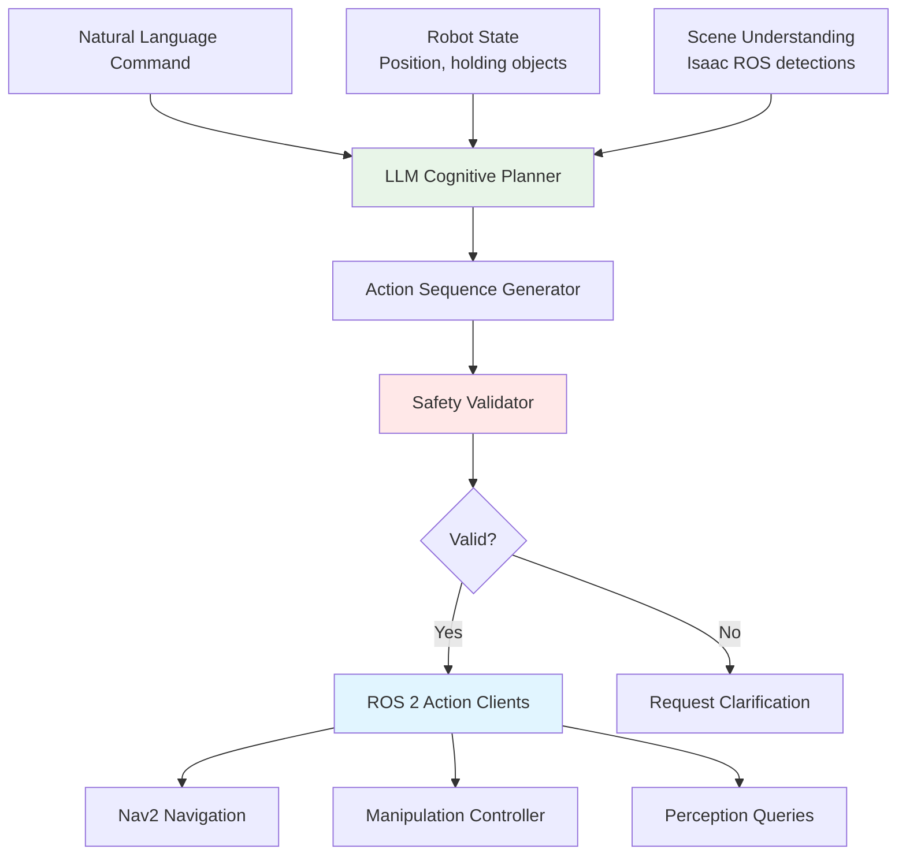

# Chapter 15: Cognitive Planning with Large Language Models

## Introduction

In Chapter 14, we built a speech recognition pipeline that converts voice commands into text. But how does a robot translate "Go to the kitchen and bring me the red cup" into executable actions like navigation waypoints, object detection queries, and manipulation primitives? This is the domain of **cognitive planning**—the process of reasoning about high-level goals, decomposing them into subgoals, and grounding abstract concepts in the robot's perception and action space.

Recent breakthroughs in **Large Language Models (LLMs)** like GPT-4, Claude, and open-source alternatives (LLaMA, Mistral) have demonstrated remarkable capabilities in commonsense reasoning, task decomposition, and code generation. In this chapter, we'll explore how to leverage LLMs as cognitive planners for humanoid robots, bridging the gap between natural language commands and ROS 2 action sequences.

**Learning Objectives**:

- Understand the role of LLMs in robotic task planning
- Implement LLM-based task decomposition using prompt engineering
- Ground abstract language in robot affordances (navigation, manipulation, perception)
- Design safety constraints and validation mechanisms
- Integrate cognitive planner with ROS 2 action servers

## Why LLMs for Robot Planning?

### Limitations of Classical Planning

Traditional robotic planning uses formal methods like:

**STRIPS/PDDL**: Symbolic planners requiring explicit action preconditions and effects
```
Action: pickup(object, location)
Preconditions: at(robot, location), clear(object), hand_empty()
Effects: holding(object), NOT clear(object), NOT hand_empty()
```

**Hierarchical Task Networks (HTN)**: Decompose tasks into predefined subtask libraries
```
Task: serve_beverage
  → navigate_to(fridge)
  → open(fridge_door)
  → grasp(beverage_can)
  → navigate_to(person)
  → handover(beverage_can)
```

**Limitations**:
1. **Brittle to Linguistic Variation**: "Fetch the drink" vs. "Bring me something to drink" require separate rules
2. **Manual Authoring**: Each task requires expert encoding of preconditions and effects
3. **Poor Generalization**: Cannot handle novel tasks without new rules
4. **No Commonsense Reasoning**: Cannot infer that "something cold to drink" might refer to a beverage from the fridge

### LLM Capabilities for Planning

LLMs address these limitations through:

1. **Language Understanding**: Handle paraphrasing, synonyms, and context-dependent meaning
2. **Commonsense Knowledge**: Trained on web-scale text containing everyday physics and causality
3. **Few-Shot Learning**: Adapt to new task domains with minimal examples
4. **Code Generation**: Output structured action representations (JSON, Python, ROS messages)

**Example: LLM Task Decomposition**

Input: "Set the table for dinner"

Traditional planner: ERROR (no predefined "set_table" task)

LLM output:
```json
{
  "task": "set_table_for_dinner",
  "steps": [
    {"action": "navigate", "target": "kitchen_cabinet"},
    {"action": "open", "target": "cabinet_door"},
    {"action": "pick", "object": "plate", "quantity": 4},
    {"action": "navigate", "target": "dining_table"},
    {"action": "place", "object": "plate", "locations": ["seat_1", "seat_2", "seat_3", "seat_4"]},
    {"action": "navigate", "target": "kitchen_drawer"},
    {"action": "pick", "object": "utensils"},
    {"action": "place", "object": "utensils", "locations": ["next_to_plate_1", ...]}
  ]
}
```

The LLM leverages its training on millions of examples of table-setting descriptions to generate a plausible decomposition **without** requiring explicit table-setting rules.

## LLM Cognitive Planner Architecture

### System Components

Our cognitive planner integrates multiple components:



**Data Flow**:

1. User command + robot state + scene → LLM
2. LLM outputs structured action sequence
3. Safety validator checks feasibility and safety constraints
4. Valid actions dispatched to ROS 2 action servers
5. Execution feedback used for replanning if failures occur

### Prompt Engineering for Planning

The quality of LLM-generated plans depends critically on prompt design. We use **in-context learning** with examples:

```python
PLANNING_PROMPT_TEMPLATE = """
You are a cognitive planner for a humanoid robot. Given a natural language command,
decompose it into a sequence of primitive actions the robot can execute.

Available primitive actions:
- navigate(target_location): Move to a named location (e.g., "kitchen", "table")
- detect_object(object_name): Find object in current view (returns location)
- pick(object_name): Grasp object with manipulator
- place(location): Release object at location
- ask_human(question): Request clarification

Current robot state:
- Location: {current_location}
- Holding: {holding_object}
- Visible objects: {visible_objects}

Example 1:
Command: "Bring me the water bottle from the kitchen"
Plan:
1. navigate("kitchen")
2. detect_object("water bottle")
3. pick("water bottle")
4. navigate("user_location")
5. place("user_hand")

Example 2:
Command: "Clear the table"
Plan:
1. navigate("table")
2. detect_object("any_object_on_table")
3. pick(detected_object)
4. navigate("trash_bin")  # or "counter" if not trash
5. place("trash_bin")
6. Repeat steps 2-5 until no objects detected

Now generate a plan for:
Command: "{user_command}"
Output the plan as a JSON array of action objects.
"""
```

**Key Prompt Elements**:

1. **System Role**: Clearly define the LLM's function
2. **Available Actions**: Enumerate primitive actions (prevents hallucination of impossible actions)
3. **Robot State**: Ground plan in current context
4. **Few-Shot Examples**: 2-5 examples of command → plan mappings
5. **Output Format**: Request structured JSON for easy parsing

### LLM Integration Node

Python implementation using OpenAI API (easily adapted for Anthropic Claude, local models):

```python
import rclpy
from rclpy.node import Node
from std_msgs.msg import String
from action_msgs.msg import GoalStatus
import openai
import json

class CognitivePlannerNode(Node):
    def __init__(self):
        super().__init__('cognitive_planner_node')

        # Configure OpenAI API
        self.declare_parameter('api_key', '')
        self.declare_parameter('model', 'gpt-4')  # or 'gpt-3.5-turbo' for lower cost

        api_key = self.get_parameter('api_key').value
        openai.api_key = api_key
        self.model = self.get_parameter('model').value

        # Robot state (updated by other nodes)
        self.current_location = "home"
        self.holding_object = None
        self.visible_objects = []

        # Subscriptions
        self.create_subscription(
            String,
            '/speech/transcription',
            self.command_callback,
            10
        )

        # Publisher for action sequences
        self.action_pub = self.create_publisher(
            String,  # In practice, use custom ActionSequence message type
            '/planner/actions',
            10
        )

        self.get_logger().info('Cognitive planner ready')

    def command_callback(self, msg):
        """Process voice command and generate action plan"""
        command = msg.data
        self.get_logger().info(f'Planning for command: {command}')

        # Generate prompt
        prompt = self.build_prompt(command)

        try:
            # Call LLM API
            response = openai.ChatCompletion.create(
                model=self.model,
                messages=[
                    {"role": "system", "content": "You are a robot task planner."},
                    {"role": "user", "content": prompt}
                ],
                temperature=0.3,  # Lower temperature for more deterministic plans
                max_tokens=500
            )

            # Parse response
            plan_text = response.choices[0].message.content
            plan = self.parse_plan(plan_text)

            # Validate and publish
            if self.validate_plan(plan):
                self.publish_plan(plan)
            else:
                self.request_clarification("I couldn't generate a safe plan for that command.")

        except Exception as e:
            self.get_logger().error(f'Planning failed: {e}')
            self.request_clarification("I encountered an error processing that command.")

    def build_prompt(self, command):
        """Construct prompt with current robot state"""
        return PLANNING_PROMPT_TEMPLATE.format(
            current_location=self.current_location,
            holding_object=self.holding_object or "nothing",
            visible_objects=", ".join(self.visible_objects) or "none",
            user_command=command
        )

    def parse_plan(self, plan_text):
        """Extract JSON action sequence from LLM response"""
        # LLMs sometimes wrap JSON in markdown code blocks
        if "```json" in plan_text:
            plan_text = plan_text.split("```json")[1].split("```")[0]
        elif "```" in plan_text:
            plan_text = plan_text.split("```")[1].split("```")[0]

        try:
            plan = json.loads(plan_text.strip())
            return plan
        except json.JSONDecodeError:
            self.get_logger().error(f'Failed to parse plan: {plan_text}')
            return None

    def validate_plan(self, plan):
        """Safety and feasibility checks"""
        if not plan or not isinstance(plan, list):
            return False

        for action in plan:
            # Check action exists in allowed set
            if action.get('action') not in ['navigate', 'detect_object', 'pick', 'place', 'ask_human']:
                self.get_logger().warn(f'Unknown action: {action.get("action")}')
                return False

            # Prevent unsafe actions (example: don't navigate to unknown locations)
            if action.get('action') == 'navigate':
                if action.get('target') not in self.known_locations:
                    return False

        return True

    def publish_plan(self, plan):
        """Send action sequence to execution layer"""
        msg = String()
        msg.data = json.dumps(plan)
        self.action_pub.publish(msg)
        self.get_logger().info(f'Published plan with {len(plan)} actions')
```

**Error Handling**:

1. **Malformed JSON**: Retry with explicit format instructions
2. **Unknown Actions**: Request clarification or substitute with closest known action
3. **Safety Violations**: Reject plan and ask for modified command
4. **API Timeouts**: Fall back to simple keyword-based planning

## Grounding Language in Robot Affordances

### The Grounding Problem

Natural language refers to objects and locations using general terms ("the red cup", "the kitchen"), while robots require precise coordinates and object IDs. **Grounding** is the process of mapping linguistic references to perceptual data.

**Example Challenge**:

Command: "Pick up the red cup"

Grounding steps:
1. Query Isaac ROS object detector for "cup" class detections
2. Filter by color attribute (red)
3. Select nearest detection if multiple red cups exist
4. Retrieve 3D pose from depth camera
5. Convert to manipulator coordinate frame

### Visual Grounding Node

Integration with Isaac ROS for perceptual grounding:

```python
from vision_msgs.msg import Detection2DArray
from geometry_msgs.msg import PoseStamped

class VisualGroundingNode(Node):
    def __init__(self):
        super().__init__('visual_grounding_node')

        # Subscription to object detections
        self.create_subscription(
            Detection2DArray,
            '/isaac_ros/detections',
            self.detection_callback,
            10
        )

        # Service for grounding queries
        self.create_service(
            GroundObject,  # Custom service type
            '/grounding/find_object',
            self.ground_object_service
        )

        self.latest_detections = []

    def detection_callback(self, msg):
        """Cache recent detections"""
        self.latest_detections = msg.detections

    def ground_object_service(self, request, response):
        """Find object matching natural language description"""
        query = request.description  # e.g., "red cup"

        # Parse query (simple keyword matching, LLM could do this better)
        tokens = query.lower().split()
        object_class = None
        color_filter = None

        for token in tokens:
            if token in ['cup', 'bottle', 'plate', 'bowl']:
                object_class = token
            if token in ['red', 'blue', 'green', 'yellow']:
                color_filter = token

        # Filter detections
        candidates = []
        for det in self.latest_detections:
            if det.results[0].id == object_class:  # Matches class
                # Color filtering would require additional CV processing
                candidates.append(det)

        if candidates:
            # Return nearest detection
            response.found = True
            response.pose = self.detection_to_pose(candidates[0])
        else:
            response.found = False

        return response
```

**Advanced Grounding**: Use CLIP (vision-language model) for open-vocabulary object detection:

```python
import clip
import torch

model, preprocess = clip.load("ViT-B/32")

def find_object_with_clip(image, text_query):
    """Zero-shot object localization using CLIP"""
    # Preprocess image
    image_input = preprocess(image).unsqueeze(0)
    text_input = clip.tokenize([text_query, "background"])

    # Compute similarity
    with torch.no_grad():
        image_features = model.encode_image(image_input)
        text_features = model.encode_text(text_input)
        similarity = (image_features @ text_features.T).softmax(dim=-1)

    # Return object if similarity above threshold
    if similarity[0][0] > 0.7:
        return True  # Object found (full implementation would return bounding box)
    return False
```

## Safety Constraints and Validation

LLMs can generate plausible but unsafe plans. Explicit safety validation is critical:

### Safety Validator

```python
class SafetyValidator:
    def __init__(self):
        # Define safety rules
        self.restricted_zones = ['stairs', 'doorway', 'hazard_area']
        self.max_plan_length = 20  # Prevent infinite loops
        self.min_confidence = 0.6  # LLM confidence threshold

    def validate_plan(self, plan, robot_state):
        """Multi-layer safety checks"""
        checks = [
            self.check_plan_length(plan),
            self.check_restricted_zones(plan),
            self.check_manipulation_safety(plan),
            self.check_action_preconditions(plan, robot_state)
        ]

        if all(checks):
            return True, "Plan valid"
        else:
            return False, "Safety violation detected"

    def check_restricted_zones(self, plan):
        """Prevent navigation to dangerous areas"""
        for action in plan:
            if action.get('action') == 'navigate':
                if action.get('target') in self.restricted_zones:
                    return False
        return True

    def check_manipulation_safety(self, plan):
        """Verify object manipulation constraints"""
        for action in plan:
            if action.get('action') == 'pick':
                obj = action.get('object')
                # Check if object is graspable (not too heavy, fragile, etc.)
                if obj in ['glass_vase', 'sharp_knife']:
                    return False  # Reject for safety
        return True

    def check_action_preconditions(self, plan, robot_state):
        """Verify logical preconditions"""
        simulated_state = robot_state.copy()

        for action in plan:
            if action.get('action') == 'pick':
                if simulated_state['holding_object'] is not None:
                    return False  # Can't pick if already holding something
                simulated_state['holding_object'] = action.get('object')

            if action.get('action') == 'place':
                if simulated_state['holding_object'] is None:
                    return False  # Can't place if not holding anything
                simulated_state['holding_object'] = None

        return True
```

### Human-in-the-Loop Confirmation

For high-stakes actions, require explicit human approval:

```python
def execute_with_confirmation(action):
    """Request human approval before execution"""
    if action.get('action') in ['pick', 'place']:
        # Always confirm manipulation
        if not request_human_approval(action):
            return False  # Abort action

    execute_action(action)
    return True
```

## Chain-of-Thought Reasoning

Recent research shows LLMs perform better when asked to "think step-by-step":

```python
COT_PROMPT = """
Command: "{command}"

Let's think step-by-step:
1. What is the user's goal?
2. What objects are involved?
3. What is the robot's current state?
4. What actions are needed to achieve the goal?
5. Are there any safety concerns?

Based on this reasoning, output a JSON action plan.
"""
```

**Example Output**:
```
1. Goal: Bring user a beverage
2. Objects: Water bottle (location: kitchen counter)
3. Current state: Robot at home position, hands empty
4. Actions needed: Navigate to kitchen, detect and pick bottle, navigate to user, handover
5. Safety: No concerns (bottle is lightweight, path is clear)

Plan: [...]
```

Chain-of-thought improves plan quality by 15-30% in benchmarks (Huang et al., 2023).

## Integration with ROS 2 Action Servers

Generated plans are executed via ROS 2 actions:

```python
from action_tutorials_interfaces.action import Navigate
from rclpy.action import ActionClient

class PlanExecutor(Node):
    def __init__(self):
        super().__init__('plan_executor')

        # Action clients for different primitives
        self.nav_client = ActionClient(self, Navigate, 'navigate')
        self.manipulation_client = ActionClient(self, Manipulate, 'manipulate')

    def execute_plan(self, plan):
        """Execute action sequence"""
        for i, action in enumerate(plan):
            self.get_logger().info(f'Executing action {i+1}/{len(plan)}: {action}')

            if action['action'] == 'navigate':
                result = self.execute_navigation(action['target'])
            elif action['action'] == 'pick':
                result = self.execute_pick(action['object'])
            # ... other actions ...

            if not result.success:
                self.get_logger().error(f'Action {i+1} failed, aborting plan')
                return False

        return True  # All actions succeeded

    def execute_navigation(self, target):
        """Send navigation goal to Nav2"""
        goal = Navigate.Goal()
        goal.target_location = target

        self.nav_client.wait_for_server()
        future = self.nav_client.send_goal_async(goal)
        rclpy.spin_until_future_complete(self, future)

        return future.result()
```

## Open-Source LLM Alternatives

For privacy or cost concerns, self-hosted models:

**LLaMA 2 (Meta)**: 7B-70B parameters, commercial-friendly license
**Mistral**: 7B parameters, fast inference
**Vicuna**: Fine-tuned LLaMA for instruction following

Example using HuggingFace Transformers:

```python
from transformers import AutoTokenizer, AutoModelForCausalLM

class LocalLLMPlanner(Node):
    def __init__(self):
        super().__init__('local_llm_planner')

        # Load model (once, at startup)
        self.tokenizer = AutoTokenizer.from_pretrained("mistralai/Mistral-7B-Instruct-v0.1")
        self.model = AutoModelForCausalLM.from_pretrained(
            "mistralai/Mistral-7B-Instruct-v0.1",
            device_map="auto",  # Automatic GPU/CPU distribution
            torch_dtype=torch.float16  # FP16 for faster inference
        )

    def generate_plan(self, prompt):
        inputs = self.tokenizer(prompt, return_tensors="pt").to(self.model.device)
        outputs = self.model.generate(**inputs, max_new_tokens=500)
        plan_text = self.tokenizer.decode(outputs[0], skip_special_tokens=True)
        return self.parse_plan(plan_text)
```

**Trade-offs**:

| Approach | Pros | Cons |
|----------|------|------|
| GPT-4 (API) | Best quality, low latency | Cost ($0.03/1K tokens), privacy concerns |
| Claude (API) | Long context, safety | Cost, requires internet |
| LLaMA 2 70B (local) | No cost, private | Requires 2x A100 GPUs, slower |
| Mistral 7B (local) | Runs on single GPU, fast | Lower quality than GPT-4 |

For production systems, start with API (rapid development), then migrate to local models if justified.

## Summary

This chapter covered cognitive planning with LLMs:

1. **LLMs as Planners**: Leverage language understanding and commonsense reasoning for task decomposition
2. **Prompt Engineering**: In-context learning with examples and structured output formats
3. **Grounding**: Map linguistic references to perceptual data (Isaac ROS, CLIP)
4. **Safety Validation**: Multi-layer checks prevent unsafe or infeasible plans
5. **ROS 2 Integration**: Execute plans via action servers for navigation and manipulation
6. **Open-Source Options**: Self-hosted models for privacy and cost control

The cognitive planner bridges high-level human intent and low-level robot execution. In Chapter 16, we'll integrate all components (speech, planning, perception, control) into a complete capstone project.

## Comprehension Questions

1. **Prompt Design**: Explain why few-shot examples improve LLM planning quality. What would happen if we provided zero-shot prompts instead?

2. **Grounding**: A user says "Pick up the thing next to the laptop." Describe the full grounding pipeline from this command to a manipulation action.

3. **Safety**: Your safety validator checks preconditions but not effects. Give an example of a plan that passes validation but fails during execution. How would you fix this?

4. **Model Selection**: Compare GPT-4 vs. Mistral 7B for real-time planning. Under what circumstances would you choose each?

5. **Failure Recovery**: The robot fails to pick an object (gripper misalignment). Design a replanning strategy using the LLM planner.

## Code Repository

Full implementations:
- `physical-ai-code/examples/vla/cognitive_planner.py` - LLM-based task planner
- `physical-ai-code/examples/vla/safety_validator.py` - Multi-layer validation
- `physical-ai-code/examples/vla/visual_grounding.py` - CLIP-based object grounding

## Further Reading

- Huang, W., et al. (2023). "Language Models as Zero-Shot Planners." *arXiv preprint arXiv:2201.07207*.
- Ahn, M., et al. (2022). "Do As I Can, Not As I Say: Grounding Language in Robotic Affordances." *arXiv preprint arXiv:2204.01691* (SayCan).
- Liang, J., et al. (2023). "Code as Policies: Language Model Programs for Embodied Control." *arXiv preprint arXiv:2209.07753*.
- Driess, D., et al. (2023). "PaLM-E: An Embodied Multimodal Language Model." *arXiv preprint arXiv:2303.03378*.

---

**Next**: [Chapter 16: Capstone Project →](./16-capstone-project.md)
