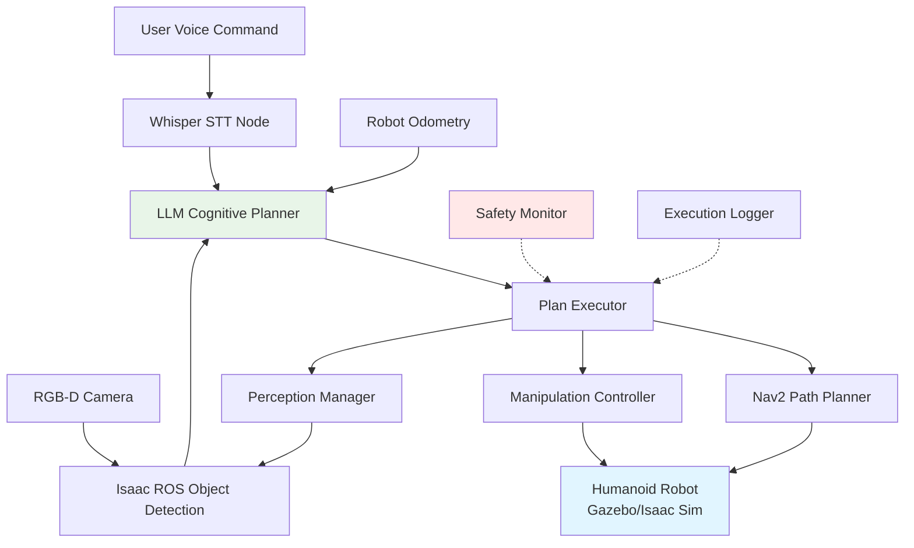

# Chapter 16: Capstone Project - Voice-Controlled Humanoid Assistant

## Introduction

Congratulations on reaching the culmination of your Physical AI journey! This capstone project synthesizes everything you've learned across four modules: ROS 2 middleware (Module 1), physics simulation (Module 2), NVIDIA Isaac perception and navigation (Module 3), and vision-language-action integration (Module 4). You'll build a **voice-controlled humanoid assistant** capable of understanding natural language commands, navigating indoor environments, detecting objects, and executing multi-step tasks.

This is not a tutorial with step-by-step instructions—it's a specification. You'll design, implement, test, and evaluate your solution independently, demonstrating mastery of Physical AI systems engineering.

**Project Goal**: Create an autonomous humanoid robot that can complete household assistance tasks through voice commands, achieving **≥80% success rate** across 5 defined scenarios.

## Project Overview

### System Architecture

Your capstone system integrates these components:



**Required Capabilities**:

1. **Speech Interface**: Real-time voice command recognition with wake-word activation
2. **Task Planning**: Decompose natural language into primitive action sequences
3. **Visual Perception**: Detect and localize objects in 3D space
4. **Navigation**: Autonomous movement to goal locations with obstacle avoidance
5. **Manipulation**: Pick-and-place actions for household objects (simulated)
6. **Safety**: Validate plans and monitor execution for failures
7. **Logging**: Record all commands, plans, and outcomes for evaluation

### Hardware and Software Requirements

**Simulation Platform** (choose one):
- **Gazebo Garden**: Humanoid model (e.g., Nao, iCub, custom URDF) with RGB-D camera, IMU
- **NVIDIA Isaac Sim**: Carter/Jetbot with articulated arm, or import custom humanoid USD

**Computing Requirements**:
- **Minimum**: Intel i5/AMD Ryzen 5, 16GB RAM, 50GB storage
- **Recommended**: Intel i7/AMD Ryzen 7, 32GB RAM, NVIDIA RTX 3060 (8GB VRAM)
- **OS**: Ubuntu 22.04 LTS with ROS 2 Humble

**Software Stack**:
- ROS 2 Humble Hawksbill
- Gazebo Garden OR Isaac Sim 2023.1+
- Isaac ROS (cuDNN, TensorRT) OR YOLOv8 for object detection
- Nav2 navigation stack
- Whisper (base or small model)
- LLM access (OpenAI API OR local Mistral/LLaMA)

**Estimated Development Time**: 30-40 hours over 3-4 weeks

## Capstone Task Scenarios

You must implement **all 5 scenarios** and achieve ≥80% success rate across 10 trials (2 per scenario).

### Scenario 1: Object Fetching

**Command**: "Bring me the [object] from the [location]"

**Example**: "Bring me the water bottle from the kitchen table"

**Action Sequence** (reference):
1. Navigate to specified location (e.g., kitchen)
2. Detect target object using vision (RGB-D + object detector)
3. Approach object within manipulation range (< 0.5m)
4. Execute grasp action (simulated gripper closure)
5. Navigate to user's current location
6. Release object (simulated handover)

**Success Criteria**:
- Robot reaches target location within 1m
- Object correctly identified (visual detection confidence > 0.7)
- Grasp succeeds (collision detection confirms contact)
- Returns to user within 2m
- Total execution time < 120 seconds

**Failure Modes to Handle**:
- Object not found → Ask "I don't see [object], should I search elsewhere?"
- Navigation blocked → Replan path or ask for manual intervention
- Grasp failure → Retry up to 3 times before reporting failure

### Scenario 2: Multi-Object Collection

**Command**: "Clear the [location]" OR "Collect all [object_type] from [location]"

**Example**: "Clear the dining table" OR "Collect all cups from the counter"

**Action Sequence**:
1. Navigate to target location
2. Perform 360° visual scan (rotate in place, capture images)
3. Detect all objects on surface using segmentation (plane detection + object detector)
4. For each detected object:
   a. Navigate to object
   b. Grasp object
   c. Navigate to designated drop-off (counter or bin)
   d. Release object
5. Return to start location
6. Report completion: "I found and moved X objects"

**Success Criteria**:
- Detects ≥80% of objects present (based on ground truth labels)
- Successfully moves ≥75% of detected objects
- No collisions with furniture or walls
- Total time < 180 seconds for 3-5 objects

**Challenge**: Requires iterative detection after each object removal (scene changes).

### Scenario 3: Spatial Reasoning Task

**Command**: "Put the [object] next to/on top of/inside [reference_object]"

**Example**: "Put the book on the shelf" OR "Place the apple next to the laptop"

**Action Sequence**:
1. Detect and localize source object (e.g., book)
2. Detect and localize reference object (e.g., shelf)
3. Plan placement pose based on spatial relation:
   - "next to" → 10-20cm horizontal offset
   - "on top of" → vertical offset + check surface planarity
   - "inside" → detect container opening, position above center
4. Navigate to source object
5. Grasp source object
6. Navigate to reference object
7. Execute placement with calculated pose
8. Verify placement (visual confirmation)

**Success Criteria**:
- Both objects correctly identified
- Placement pose within 15cm of correct position
- Object remains stable (no falling/rolling)
- Spatial relation verbally confirmed: "I placed [object] [relation] [reference]"

**Advanced**: Handle ambiguity (multiple books/shelves → ask "Which book/shelf?")

### Scenario 4: Navigation with Dynamic Obstacle Avoidance

**Command**: "Go to [location] and tell me what you see"

**Example**: "Go to the living room and tell me what you see"

**Action Sequence**:
1. Plan path to target location using Nav2
2. Execute navigation while avoiding obstacles (furniture, people simulacra)
3. Upon arrival, perform visual survey:
   - Capture panoramic RGB-D images
   - Run object detection on images
   - Generate natural language description using LLM
4. Report findings: "I see a couch, two chairs, a coffee table, and a television"

**Success Criteria**:
- Reaches destination within 0.5m of goal
- No collisions during navigation
- Detects ≥70% of visible objects (greater than 50cm tall, within 3m)
- Description includes at least 3 objects

**Challenge**: Inject dynamic obstacle (simulated person walking) mid-navigation—robot must replan.

### Scenario 5: Multi-Step Conditional Task

**Command**: "If there's a [object1] on the [location1], move it to [location2], otherwise go to [location3]"

**Example**: "If there's a cup on the table, move it to the counter, otherwise go to the kitchen"

**Action Sequence**:
1. Navigate to location1 (table)
2. Scan for object1 (cup)
3. **If object found**:
   a. Grasp object
   b. Navigate to location2 (counter)
   c. Place object
   d. Report: "I moved the cup to the counter"
4. **Else**:
   a. Navigate to location3 (kitchen)
   b. Report: "I didn't find a cup on the table, now at kitchen"

**Success Criteria**:
- Correctly evaluates conditional (object presence)
- Executes appropriate branch (if/else)
- Reaches final location (location2 or location3)
- Verbal report matches actions taken

**Cognitive Challenge**: Tests LLM's ability to generate conditional plans, not just linear sequences.

## Implementation Milestones

### Phase 1: Environment Setup (Week 1)

**Deliverables**:
- Simulation world with 3+ rooms (kitchen, living room, bedroom)
- Humanoid robot with RGB-D camera, 7-DOF arm, mobile base
- Static obstacles (furniture) and 10+ manipulable objects (cups, books, bottles)
- URDF/USD models with proper collision geometries

**Validation**:
- Robot spawns successfully in Gazebo/Isaac
- Camera publishes RGB-D topics at 10+ Hz
- Manual teleoperation works (keyboard or joystick)
- Object grasping plugin functional (simulated suction gripper acceptable)

### Phase 2: Perception and Navigation (Week 1-2)

**Deliverables**:
- Object detection node (Isaac ROS OR YOLOv8) trained/configured for target objects
- Nav2 configured with costmaps, behavior trees, and planners
- Localization working (AMCL or Isaac ROS Visual SLAM)
- TF tree properly configured (map → odom → base_link → camera)

**Validation**:
- Object detection achieves greater than 80% precision on test images
- Navigation completes 10/10 point-to-point goals without collision
- Localization drift < 10cm over 5-minute run

### Phase 3: Speech and Planning Integration (Week 2-3)

**Deliverables**:
- Whisper STT node publishing transcriptions to `/speech/transcription`
- LLM cognitive planner generating JSON action sequences
- Visual grounding service mapping object names to detections
- Safety validator rejecting infeasible/unsafe plans

**Validation**:
- Speech recognition WER < 15% on 20 test commands
- Planner generates syntactically correct plans for 90% of commands
- Grounding finds correct object in 80% of queries (when present)
- Safety validator catches ≥95% of impossible actions (e.g., pick when holding object)

### Phase 4: End-to-End Integration and Testing (Week 3-4)

**Deliverables**:
- Plan executor dispatching actions to Nav2/manipulation controllers
- Execution monitor detecting failures and triggering replanning
- Logging system recording (command, plan, actions, outcome, duration)
- Evaluation script computing success rate per scenario

**Validation**:
- Complete pipeline tested on all 5 scenarios
- ≥80% success rate across 10 trials (2 per scenario)
- Failure analysis document identifying root causes

## Evaluation Rubric

Your capstone is graded on **four dimensions**:

### 1. Functional Correctness (40 points)

| Criteria | Points | Description |
|----------|--------|-------------|
| Scenario 1 Success | 8 | ≥80% success rate on object fetching |
| Scenario 2 Success | 8 | ≥80% success rate on multi-object collection |
| Scenario 3 Success | 8 | ≥80% success rate on spatial reasoning |
| Scenario 4 Success | 8 | ≥80% success rate on dynamic navigation |
| Scenario 5 Success | 8 | ≥80% success rate on conditional tasks |

**Success Measurement**: Run each scenario twice, record pass/fail based on criteria. 2/2 = full points, 1/2 = half points, 0/2 = zero points.

### 2. Code Quality and Architecture (25 points)

| Criteria | Points | Description |
|----------|--------|-------------|
| Modularity | 5 | Separate nodes for perception, planning, control (≥5 nodes) |
| ROS 2 Best Practices | 5 | Proper use of topics, services, actions, parameters, launch files |
| Error Handling | 5 | Graceful failure recovery, no crashes on invalid input |
| Documentation | 5 | README with setup instructions, code comments, architecture diagram |
| Testing | 5 | Unit tests for ≥3 core functions (parsing, grounding, validation) |

### 3. Innovation and Advanced Features (20 points)

Choose **2+ advanced features** (10 points each):

- **Learning from Demonstration**: Record human teleoperation for new tasks, add to training data
- **Multimodal Confirmation**: Show detected objects on screen, ask "Is this the correct cup?"
- **Failure Explanation**: When task fails, LLM generates natural language explanation
- **Sim-to-Real Transfer**: Implement one scenario on real robot (TurtleBot, Jetbot) with video proof
- **Multi-Robot Coordination**: Two robots cooperate on Scenario 2 (divide labor)
- **Voice Feedback**: Text-to-speech for robot responses (PyTTSx3 or AWS Polly)
- **Web Dashboard**: Real-time visualization of detections, plans, and robot status (RViz + custom UI)

### 4. Evaluation and Analysis (15 points)

**Written Report** (5-7 pages) including:

| Section | Points | Requirements |
|---------|--------|------------|
| System Overview | 3 | Architecture diagram, component descriptions |
| Results | 5 | Success rate per scenario, execution time statistics, failure analysis |
| Challenges | 3 | Technical difficulties encountered, how you solved them |
| Limitations | 2 | Known weaknesses, what didn't work well |
| Future Work | 2 | 3+ concrete improvements you would make with more time |

**Video Demonstration** (5-10 minutes):
- Show 1 successful run of each scenario
- Narrate system behavior (what's happening and why)
- Demonstrate 1 failure case and explain the cause

**Total: 100 points**

## Success Rate Calculation

For each scenario, run 2 trials. A trial is **successful** if:

1. All success criteria met (per scenario specification)
2. No manual intervention required
3. Execution completes within time limit

**Formula**:
```
Success Rate = (Successful Trials / Total Trials) × 100%
Overall Success Rate = Average across all 5 scenarios
```

**Passing Threshold**: 80% overall (4/5 scenarios passing, OR 8/10 total trials successful)

## Common Pitfalls and How to Avoid Them

### Pitfall 1: Over-Reliance on Perfect Perception

**Symptom**: System works in controlled lighting but fails with shadows/reflections.

**Solution**:
- Test detection under varied lighting conditions
- Use depth information (RGB-D) to filter false positives
- Implement confidence thresholds (reject detections < 0.6)

### Pitfall 2: Brittle LLM Prompts

**Symptom**: Planner generates correct plans for training examples but fails on paraphrased commands.

**Solution**:
- Add 5+ diverse examples per task type in prompt
- Test with synonym variations ("fetch" vs. "bring" vs. "get")
- Use GPT-4 instead of GPT-3.5 if available (better instruction following)

### Pitfall 3: Navigation in Simulation ≠ Reality

**Symptom**: Robot navigates perfectly in empty world but collides with furniture.

**Solution**:
- Configure conservative costmap parameters (inflation_radius = 0.5m)
- Add static obstacles to URDF/USD world file
- Test navigation with dynamic obstacles (moving objects)

### Pitfall 4: Ignoring Execution Failures

**Symptom**: Planner continues to next action even when previous action failed.

**Solution**:
- Check action server result status (SUCCEEDED vs. ABORTED)
- Implement replanning trigger on failure (send updated state to LLM)
- Add maximum retry limit to prevent infinite loops

### Pitfall 5: Poor Time Management

**Symptom**: Spending 80% of time on Phase 1, rushing Phases 3-4.

**Solution**:
- **Week 1 Deadline**: Phases 1-2 complete (environment + perception/navigation working)
- **Week 2 Deadline**: Phase 3 complete (speech + planning tested independently)
- **Week 3-4**: Integration, testing, iteration

Use simple placeholder implementations early (e.g., keyword-based planner before LLM) to test integration.

## Submission Requirements

**Code Repository** (GitHub/GitLab):
```
capstone-project/
├── README.md                    # Setup instructions, system overview
├── src/                         # ROS 2 package source code
│   ├── speech_interface/
│   ├── cognitive_planner/
│   ├── perception_manager/
│   ├── plan_executor/
│   └── safety_validator/
├── launch/                      # Launch files for each scenario
│   ├── scenario_1.launch.py
│   └── ...
├── config/                      # Parameter YAML files
│   ├── nav2_params.yaml
│   ├── detection_params.yaml
│   └── ...
├── worlds/                      # Gazebo/Isaac world files and models
│   ├── household.world (Gazebo)
│   └── household.usd (Isaac)
├── tests/                       # Unit tests (pytest)
├── evaluation/                  # Evaluation scripts and logs
│   ├── run_evaluation.py
│   └── results.json
├── docs/
│   ├── architecture.pdf         # System diagram
│   └── report.pdf               # Written evaluation report
└── videos/
    └── demonstration.mp4        # 5-10 min video
```

**Submission Checklist**:
- [ ] All 5 scenarios implemented and tested
- [ ] README with setup instructions (dependencies, build, launch)
- [ ] Evaluation results (success rate ≥80%)
- [ ] Written report (5-7 pages PDF)
- [ ] Video demonstration (5-10 minutes)
- [ ] Code comments and docstrings for key functions
- [ ] No hardcoded API keys (use environment variables)

## Grading Timeline

1. **Submit repository link** (Week 4, Day 1)
2. **Instructor clones and runs evaluation** (Week 4, Days 2-3)
3. **Feedback and grade released** (Week 4, Day 5)

**Re-submission**: If overall success rate < 80%, you may fix bugs and resubmit once within 1 week (10% grade penalty).

## Inspiration: Real-World VLA Systems

Your capstone mirrors industry/research systems:

- **TidyBot** (Princeton, 2023): Personalizable household cleanup robot using LLM planning
- **SayCan** (Google, 2022): Mobile manipulator executing open-ended language commands
- **ALFRED Challenge**: Benchmark for embodied AI agents in household tasks (your scenarios adapted from ALFRED)
- **Boston Dynamics Spot**: Commercial robot with voice interface for industrial inspection

While these systems use custom hardware and months of engineering, your simulation-based capstone demonstrates the same core capabilities: multimodal perception, language-driven planning, and autonomous execution.

## Extensions for Future Work

After completing the capstone, consider these directions:

**Academic Research**:
- Compare LLM planners (GPT-4 vs. Claude vs. LLaMA 2) on success rate and latency
- Investigate sim-to-real transfer techniques (domain randomization, fine-tuning on real images)
- Benchmark against classical planners (PDDL) on execution time and plan optimality

**Practical Applications**:
- Deploy on physical humanoid robot (NAO, Pepper) or mobile manipulator (TurtleBot + arm)
- Add object manipulation with force/torque sensing (compliant grasping)
- Integrate with smart home APIs (control lights, appliances via voice)

**Open-Source Contribution**:
- Publish your code as ROS 2 package on GitHub
- Create tutorial blog post or YouTube walkthrough
- Contribute to Open-X Embodiment dataset (record your demonstrations)

## Summary

The capstone project integrates:

1. **Speech recognition** (Whisper) for natural interaction
2. **Cognitive planning** (LLMs) for task decomposition
3. **Visual perception** (Isaac ROS/YOLO) for object detection
4. **Navigation** (Nav2) for autonomous movement
5. **Manipulation** (simulated) for object interaction
6. **Safety validation** and failure recovery

Success requires strong systems integration skills, debugging across hardware/software layers, and iterative testing. The 80% success threshold is intentionally challenging—real-world robotics is hard! But by reaching this milestone, you'll have built a system comparable to cutting-edge research prototypes.

**Good luck, and welcome to the frontier of Physical AI!**

## Resources and Support

**Technical Help**:
- ROS 2 Answers: https://answers.ros.org
- Isaac ROS Documentation: https://nvidia-isaac-ros.github.io
- Gazebo Community: https://community.gazebosim.org

**Debugging Tools**:
- `ros2 topic echo /speech/transcription` - Monitor speech input
- `ros2 topic echo /planner/actions` - Inspect generated plans
- `rviz2` - Visualize detections, costmaps, paths
- `rqt_graph` - Visualize node connections

**Office Hours**: [Your instructor will specify]

**Capstone Showcase**: Top 3 projects will present at final class session!

---

**Congratulations on completing Module 4!** You now possess the skills to build state-of-the-art voice-controlled autonomous robots. Go build something amazing.

---

**Previous**: [← Chapter 15: Cognitive Planning](./15-cognitive-planning.md) | **Next**: [Tutorial 4: Implementation Guide →](./tutorial-04-voice-control.md)
