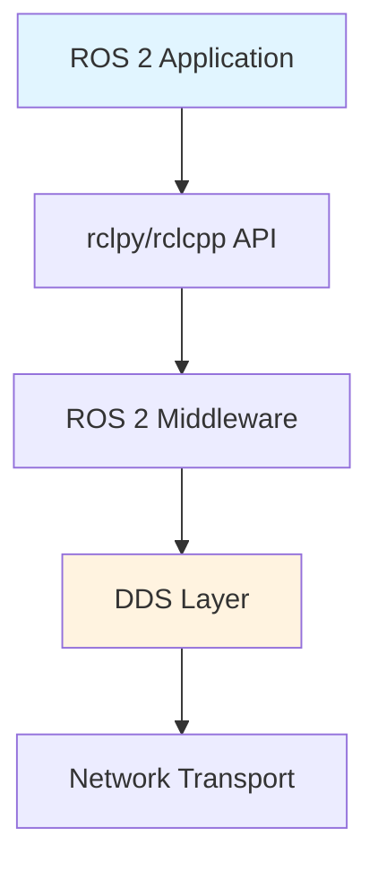

# Data Model: Physical AI & Humanoid Robotics Book

**Feature**: Physical AI & Humanoid Robotics Book
**Created**: 2025-12-04
**Phase**: Phase 1 - Design & Structure
**Purpose**: Define content entities, relationships, and structure for the book project

---

## Overview

The book's "data model" consists of content entities and their relationships. Unlike traditional software data models (databases, schemas), this defines the structure of educational content: modules, chapters, tutorials, code examples, diagrams, and citations.

**Key Design Principles**:
- **Modular Progression**: Content organized in layers (ROS 2 → Simulation → Isaac → VLA)
- **Hands-On Learning**: Tutorials integrate theory with practice
- **Reproducibility**: All code examples have verification scripts
- **Traceability**: Citations link claims to authoritative sources
- **Accessibility**: Diagrams include alt text and source files

---

## Primary Entities

### 1. Module

**Definition**: Top-level grouping of related chapters covering a major topic area.

**Attributes**:
- `module_id` (string): Unique identifier (e.g., "module-1-ros2")
- `title` (string): Display name (e.g., "The Robotic Nervous System (ROS 2)")
- `description` (string): Brief overview of module content and learning objectives
- `sequence` (integer): Order in book (1-4)
- `chapters` (array): List of chapter references within this module

**Relationships**:
- Contains: 2-4 Chapters
- Precedes: Next Module (dependency relationship)

**Examples**:
- Module 1: The Robotic Nervous System (ROS 2)
- Module 2: The Digital Twin (Gazebo & Unity)
- Module 3: The AI-Robot Brain (NVIDIA Isaac)
- Module 4: Vision-Language-Action (VLA)

**Implementation**:
```yaml
# Docusaurus sidebar structure
sidebar:
  - type: category
    label: "Module 1: ROS 2"
    collapsible: true
    items:
      - intro
      - ros2-fundamentals
      - nodes-topics-services
      - urdf-models
```

---

### 2. Chapter

**Definition**: Major content section within a module, covering specific concepts with explanations, examples, and references.

**Attributes**:
- `chapter_id` (string): Unique identifier (e.g., "01-physical-ai-intro")
- `title` (string): Display name (e.g., "Introduction to Physical AI")
- `module_id` (string): Parent module reference
- `sequence` (integer): Order within module
- `learning_objectives` (array): List of learning goals for this chapter
- `estimated_reading_time` (integer): Minutes (calculated by Docusaurus)
- `content` (markdown): Main narrative content
- `diagrams` (array): Embedded diagram references
- `code_examples` (array): Inline code snippet references
- `tutorials` (array): Hands-on tutorial references (0-2 per chapter)
- `references` (array): Citation keys for sources cited in this chapter
- `prerequisites` (array): Prior knowledge or chapter dependencies

**Relationships**:
- Belongs to: 1 Module
- Contains: 0-2 Tutorials
- Embeds: Multiple Code Examples
- Embeds: Multiple Diagrams
- Cites: Multiple References

**Example Structure**:
```markdown
---
id: ros2-fundamentals
title: ROS 2 Fundamentals
sidebar_label: ROS 2 Fundamentals
description: Core concepts of ROS 2 middleware for robot control
keywords: [ros2, middleware, dds, nodes, topics]
---

# ROS 2 Fundamentals

## Learning Objectives

- Understand ROS 2 architecture and DDS middleware
- Create Python nodes using rclpy
- Configure Quality of Service (QoS) profiles

## Prerequisites

- Basic Linux command line knowledge
- Python 3.10+ installed
- Completed Chapter 1: Introduction to Physical AI

## Content

[Main chapter content...]

## References

[1] Smith et al., "ROS 2 Design and Implementation", ICRA 2022
```

**Quality Gates**:
- [ ] Learning objectives clearly stated
- [ ] Prerequisites explicitly listed
- [ ] All claims cited with references
- [ ] Flesch-Kincaid readability grade 11-14
- [ ] At least 2 diagrams for complex concepts
- [ ] Code examples link to tested implementations

---

### 3. Tutorial

**Definition**: Hands-on exercise with step-by-step instructions, code, expected outputs, and verification script.

**Attributes**:
- `tutorial_id` (string): Unique identifier (e.g., "tutorial-01-ros2-hello-world")
- `title` (string): Tutorial name (e.g., "ROS 2 Hello World")
- `chapter_id` (string): Parent chapter reference
- `estimated_time` (integer): Minutes to complete
- `difficulty` (enum): "Beginner" | "Intermediate" | "Advanced"
- `prerequisites` (array): Required setup (software, hardware, prior tutorials)
- `objectives` (array): What students will accomplish
- `instructions` (markdown): Step-by-step guide
- `code_examples` (array): References to full implementations in code repository
- `verification_script` (reference): Automated test script
- `expected_outputs` (array): Terminal outputs, files, simulation states
- `troubleshooting` (markdown): Common issues and solutions
- `repository_link` (URL): Link to full code in companion repository

**Relationships**:
- Belongs to: 1 Chapter
- References: Multiple Code Examples
- Has: 1 Verification Script
- May depend on: Previous Tutorials

**Example Structure**:
```markdown
# Tutorial 1: ROS 2 Hello World

**Estimated Time**: 30 minutes
**Difficulty**: Beginner

## Prerequisites

- Ubuntu 22.04 LTS with ROS 2 Humble installed
- Basic Python knowledge
- Terminal access

## Objectives

By completing this tutorial, you will:
- Create your first ROS 2 Python node
- Publish messages to a topic
- Subscribe to and receive messages
- Verify node communication with automated script

## Setup

1. Source ROS 2 environment:
   ```bash
   source /opt/ros/humble/setup.bash
   ```

2. Create workspace:
   ```bash
   mkdir -p ~/ros2_ws/src
   cd ~/ros2_ws/src
   ```

## Instructions

[Step-by-step guide with code snippets...]

## Verification

Run the automated verification script:

```bash
cd ~/ros2_ws
python3 verify.py
```

**Expected Output**:
```
✅ PASS: ROS 2 nodes communicating successfully
   - Publisher node: hello_world_pub [RUNNING]
   - Subscriber node: hello_world_sub [RUNNING]
   - Messages received: 10/10
```

## Troubleshooting

**Issue**: "ros2: command not found"
**Solution**: Source ROS 2 environment: `source /opt/ros/humble/setup.bash`

## Full Code

See complete implementation: [ros2-hello-world](https://github.com/user/physical-ai-code/tree/main/tutorials/module-1-ros2/01-hello-world)
```

**Quality Gates**:
- [ ] Prerequisites explicitly listed
- [ ] Objectives clearly stated
- [ ] Step-by-step instructions with expected outputs
- [ ] Verification script included and tested
- [ ] Troubleshooting section addresses 3+ common issues
- [ ] Links to full code in companion repository
- [ ] Beta-tested with 90% success rate

---

### 4. Code Example

**Definition**: Runnable code snippet demonstrating a concept, with embedded version in book and full implementation in code repository.

**Attributes**:
- `example_id` (string): Unique identifier (e.g., "ros2-publisher-basic")
- `title` (string): Code example name
- `language` (string): Programming language (e.g., "python", "cpp", "bash")
- `framework_version` (string): Required versions (e.g., "ROS 2 Humble", "Isaac Sim 2023.1")
- `embedded_snippet` (code): Key lines shown in book (10-30 lines)
- `repository_path` (string): Path to full implementation
- `description` (string): What this code demonstrates
- `verification_script_id` (reference): Associated automated test
- `dependencies` (array): Required packages/libraries

**Relationships**:
- Referenced by: Multiple Chapters and Tutorials
- Has: 1 Verification Script
- Stored in: Companion Code Repository

**Example**:

**Embedded in Book**:
```python
# ros2_publisher.py - Basic ROS 2 publisher
import rclpy
from rclpy.node import Node
from std_msgs.msg import String

class HelloWorldPublisher(Node):
    def __init__(self):
        super().__init__('hello_world_pub')
        self.publisher = self.create_publisher(String, 'greetings', 10)
        self.timer = self.create_timer(1.0, self.publish_greeting)

    def publish_greeting(self):
        msg = String()
        msg.data = 'Hello, Physical AI!'
        self.publisher.publish(msg)
        self.get_logger().info(f'Published: {msg.data}')

def main():
    rclpy.init()
    node = HelloWorldPublisher()
    rclpy.spin(node)
```

**Repository Link**: [Full Implementation](https://github.com/user/physical-ai-code/blob/main/examples/ros2-basics/publisher.py)

**Quality Gates**:
- [ ] Code tested and functional
- [ ] Version requirements explicitly stated
- [ ] Dependencies listed
- [ ] Inline comments explain non-obvious logic
- [ ] Verification script confirms expected behavior
- [ ] Full implementation in repository with README

---

### 5. Diagram

**Definition**: Visual illustration (architecture, flowchart, schematic, concept map) with source files and rendered output.

**Attributes**:
- `diagram_id` (string): Unique identifier (e.g., "ros2-architecture")
- `title` (string): Diagram title
- `type` (enum): "Architecture" | "Flowchart" | "Schematic" | "Concept Map" | "UML"
- `tool` (enum): "Mermaid" | "draw.io" | "TikZ" | "Inkscape"
- `source_file` (path): Editable source file location
- `rendered_image` (path): PNG/SVG output for book
- `alt_text` (string): Accessibility description
- `caption` (string): Explanation of diagram purpose
- `chapter_references` (array): Chapters that embed this diagram

**Relationships**:
- Embedded in: Multiple Chapters
- Created with: Diagram Tool (Mermaid/draw.io/TikZ/Inkscape)

**Example (Mermaid)**:

**Source** (`docs/assets/diagrams/ros2-architecture.mmd`):


**Rendered Output**: `docs/assets/diagrams/ros2-architecture.svg`

**Alt Text**: "Diagram showing ROS 2 architecture layers from application level down through API, middleware, DDS, to network transport"

**Quality Gates**:
- [ ] Source file committed to repository (editable format)
- [ ] Rendered output high-resolution (300 DPI for print)
- [ ] Alt text describes content for accessibility
- [ ] Caption explains diagram purpose and key takeaways
- [ ] Consistent visual style across all diagrams
- [ ] Labels readable at standard zoom level

---

### 6. Reference

**Definition**: Citation to authoritative source (peer-reviewed paper, official documentation, technical book).

**Attributes**:
- `citation_key` (string): BibTeX identifier (e.g., "smith2022ros2")
- `type` (enum): "Peer-Reviewed Paper" | "Conference Paper" | "Book" | "Documentation" | "Technical Report"
- `title` (string): Publication title
- `authors` (array): Author names
- `year` (integer): Publication year
- `venue` (string): Journal/conference/publisher
- `url` (string): External link (DOI, official docs)
- `bibtex_entry` (string): Full BibTeX entry
- `accessed_date` (date): When reference was last verified
- `peer_reviewed` (boolean): Counts toward 50% quota

**Relationships**:
- Cited by: Multiple Chapters
- Managed in: Zotero Library
- Exported to: BibTeX file

**Example (BibTeX)**:
```bibtex
@inproceedings{smith2022ros2,
  title={ROS 2 Design and Implementation for Real-Time Robotics},
  author={Smith, John and Doe, Jane and Lee, Alice},
  booktitle={IEEE International Conference on Robotics and Automation (ICRA)},
  pages={1234--1241},
  year={2022},
  organization={IEEE},
  doi={10.1109/ICRA.2022.1234567},
  peer_reviewed={true}
}
```

**Inline Citation in Chapter**:
```markdown
ROS 2 Humble uses Data Distribution Service (DDS) for inter-process communication [1].

...

## References

[1] Smith, J., Doe, J., & Lee, A. (2022). "ROS 2 Design and Implementation for Real-Time Robotics."
    *IEEE International Conference on Robotics and Automation (ICRA)*, 1234-1241.
    doi:10.1109/ICRA.2022.1234567
```

**Quality Gates**:
- [ ] Citation format follows IEEE/ACM style
- [ ] BibTeX entry complete and valid
- [ ] URL/DOI verified and accessible
- [ ] Peer-reviewed status correctly marked
- [ ] Tracking maintains 50% peer-reviewed ratio
- [ ] Citations appear in Zotero library

---

### 7. Verification Script

**Definition**: Automated test script that validates tutorial completion by checking expected outputs.

**Attributes**:
- `script_id` (string): Unique identifier (e.g., "verify-tutorial-01")
- `tutorial_id` (reference): Associated tutorial
- `language` (string): Script language (typically "python")
- `test_framework` (string): Testing framework (e.g., "pytest", "bash")
- `checks` (array): List of validations performed
- `exit_code_success` (integer): 0 for pass
- `exit_code_failure` (integer): 1 for fail
- `output_format` (enum): "Console" | "JSON" | "XML"

**Relationships**:
- Validates: 1 Tutorial
- May validate: Multiple Code Examples
- Executed by: CI/CD Pipeline

**Standard Interface**:
```python
#!/usr/bin/env python3
"""
Verification script for Tutorial 1: ROS 2 Hello World

Tests:
- ROS 2 environment properly sourced
- Workspace built successfully
- Publisher node running and publishing messages
- Subscriber node running and receiving messages
- Message content matches expected format
"""

import sys
import subprocess
import time
import json
from pathlib import Path

def verify_ros2_environment():
    """Check if ROS 2 is sourced and available."""
    result = subprocess.run(['ros2', '--version'],
                          capture_output=True, text=True)
    return 'ros2' in result.stdout.lower()

def verify_workspace_built():
    """Check if workspace has build artifacts."""
    workspace = Path.home() / 'ros2_ws'
    return (workspace / 'build').exists() and \
           (workspace / 'install').exists()

def verify_nodes_running():
    """Check if required nodes are running."""
    result = subprocess.run(['ros2', 'node', 'list'],
                          capture_output=True, text=True)
    nodes = result.stdout.strip().split('\n')
    return '/hello_world_pub' in nodes and \
           '/hello_world_sub' in nodes

def verify_messages_published():
    """Check if messages are being published on topic."""
    result = subprocess.run(
        ['ros2', 'topic', 'echo', '/greetings', '--once'],
        capture_output=True, text=True, timeout=5
    )
    return 'Hello, Physical AI!' in result.stdout

def verify_tutorial_output():
    """
    Main verification function.

    Returns:
        tuple: (success: bool, message: str, details: dict)
    """
    checks = {
        'ros2_environment': verify_ros2_environment(),
        'workspace_built': verify_workspace_built(),
        'nodes_running': verify_nodes_running(),
        'messages_published': verify_messages_published()
    }

    all_passed = all(checks.values())

    if all_passed:
        return (True, "All tutorial objectives completed successfully", checks)
    else:
        failed = [k for k, v in checks.items() if not v]
        return (False, f"Failed checks: {', '.join(failed)}", checks)

if __name__ == "__main__":
    try:
        success, message, details = verify_tutorial_output()

        if success:
            print(f"✅ PASS: {message}")
            print(f"\nDetails:")
            for check, status in details.items():
                print(f"  - {check}: {'✅' if status else '❌'}")
            sys.exit(0)
        else:
            print(f"❌ FAIL: {message}")
            print(f"\nDetails:")
            for check, status in details.items():
                print(f"  - {check}: {'✅' if status else '❌'}")
            print(f"\nDebug info: {json.dumps(details, indent=2)}")
            sys.exit(1)

    except Exception as e:
        print(f"❌ ERROR: Verification script failed with exception: {e}")
        sys.exit(2)
```

**Quality Gates**:
- [ ] Tests all tutorial objectives
- [ ] Provides clear pass/fail output
- [ ] Includes debugging information on failure
- [ ] Handles common error cases gracefully
- [ ] Executes in < 30 seconds
- [ ] CI/CD pipeline integration tested

---

## Entity Relationships

### Relationship Diagram

```
┌─────────────────────────────────────────────────────────────┐
│                           Book                              │
└─────────────────────────────────────────────────────────────┘
                            │
                            │ contains (1:4)
                            ▼
┌─────────────────────────────────────────────────────────────┐
│                          Module                             │
│  - module_id, title, description, sequence                  │
└─────────────────────────────────────────────────────────────┘
                            │
                            │ contains (1:2-4)
                            ▼
┌─────────────────────────────────────────────────────────────┐
│                         Chapter                             │
│  - chapter_id, title, content, learning_objectives          │
└─────────────────────────────────────────────────────────────┘
          │                 │                   │
          │ contains (0:2)  │ embeds (1:N)      │ embeds (1:N)
          ▼                 ▼                   ▼
    ┌──────────┐      ┌──────────┐       ┌──────────┐
    │ Tutorial │      │ Diagram  │       │   Code   │
    │          │      │          │       │ Example  │
    └──────────┘      └──────────┘       └──────────┘
          │                                     │
          │ references (1:N)                    │
          └─────────────────────────────────────┘
                            │
                            │ has (1:1)
                            ▼
                  ┌──────────────────┐
                  │  Verification    │
                  │     Script       │
                  └──────────────────┘

                  ┌──────────────────┐
                  │   Reference      │
                  │  (Citation)      │
                  └──────────────────┘
                            ▲
                            │ cited by (N:M)
                            │
                      [All Chapters]
```

### Cardinality Rules

| Relationship | From → To | Cardinality | Description |
|--------------|-----------|-------------|-------------|
| Book → Module | 1:4 | One book contains exactly 4 modules |
| Module → Chapter | 1:2-4 | Each module contains 2-4 chapters |
| Chapter → Tutorial | 1:0-2 | Each chapter may contain 0-2 tutorials |
| Chapter → Diagram | 1:N | Each chapter embeds multiple diagrams |
| Chapter → Code Example | 1:N | Each chapter references multiple code examples |
| Chapter → Reference | M:N | Chapters cite multiple references; references cited by multiple chapters |
| Tutorial → Code Example | 1:N | Each tutorial references multiple code examples |
| Code Example → Verification Script | 1:1 | Each code example has exactly one verification script |
| Tutorial → Verification Script | 1:1 | Each tutorial has exactly one verification script |

---

## Content Hierarchy

### Complete Book Structure

```
Physical AI & Humanoid Robotics
│
├── Frontmatter
│   ├── Cover
│   ├── Table of Contents
│   ├── Preface
│   └── Learning Objectives
│
├── Module 1: The Robotic Nervous System (ROS 2)
│   ├── Chapter 1: Introduction to Physical AI
│   │   ├── Diagrams: Physical AI Concept Map, Embodied Intelligence Timeline
│   │   └── References: 3-4 peer-reviewed papers on embodied cognition
│   │
│   ├── Chapter 2: ROS 2 Fundamentals
│   │   ├── Diagrams: ROS 2 Architecture, DDS Communication Model
│   │   ├── Code Examples: Basic node, publisher, subscriber
│   │   └── References: ROS 2 documentation, design papers
│   │
│   ├── Chapter 3: Nodes, Topics, Services, Actions
│   │   ├── Diagrams: Pub/Sub Pattern, Service Request/Response, Action Flow
│   │   ├── Code Examples: Topic publisher/subscriber, service client/server
│   │   └── References: ROS 2 tutorials, communication patterns
│   │
│   ├── Chapter 4: URDF Robot Models
│   │   ├── Diagrams: URDF Structure, TF Tree, Joint Types
│   │   ├── Code Examples: Simple URDF, humanoid model
│   │   └── References: URDF documentation, robot modeling papers
│   │
│   └── Tutorial 1: ROS 2 Hello World
│       ├── Code Examples: Publisher node, subscriber node
│       └── Verification Script: verify-tutorial-01.py
│
├── Module 2: The Digital Twin (Gazebo & Unity)
│   ├── Chapter 5: Simulation Basics
│   ├── Chapter 6: Gazebo Physics Engine
│   ├── Chapter 7: Unity Rendering (Optional)
│   ├── Chapter 8: Sensor Simulation
│   └── Tutorial 2: Gazebo Humanoid Spawn
│       ├── Code Examples: World file, launch file, sensor configuration
│       └── Verification Script: verify-tutorial-02.py
│
├── Module 3: The AI-Robot Brain (NVIDIA Isaac)
│   ├── Chapter 9: Isaac Sim Introduction
│   ├── Chapter 10: Synthetic Data Generation
│   ├── Chapter 11: Isaac ROS Perception
│   ├── Chapter 12: Nav2 Navigation
│   └── Tutorial 3: Isaac VSLAM Demo
│       ├── Code Examples: Isaac scene, perception pipeline, Nav2 config
│       └── Verification Script: verify-tutorial-03.py
│
├── Module 4: Vision-Language-Action (VLA)
│   ├── Chapter 13: VLA Overview
│   ├── Chapter 14: Speech Recognition (Whisper)
│   ├── Chapter 15: Cognitive Planning with LLMs
│   ├── Chapter 16: Capstone Project Specification
│   └── Tutorial 4: Voice-Controlled Humanoid (Capstone)
│       ├── Code Examples: Whisper integration, LLM planner, action executor
│       └── Verification Script: verify-tutorial-04.py
│
├── Appendices
│   ├── Appendix A: Hardware Requirements and Setup
│   ├── Appendix B: Software Installation Guides
│   ├── Appendix C: Troubleshooting Common Issues
│   ├── Appendix D: Glossary of Terms
│   └── Appendix E: Additional Resources
│
└── Backmatter
    ├── References (30+ citations, 50% peer-reviewed)
    ├── Index
    └── About the Author
```

---

## Reader Interface Contracts

### 1. Navigation Contract

**Purpose**: Consistent navigation experience across all book content.

**Requirements**:
- Sidebar provides hierarchical module/chapter navigation
- Previous/Next buttons at chapter bottom
- Search functionality across all content
- Breadcrumb navigation shows current location
- Mobile-responsive sidebar (collapsible)

**Implementation**: Docusaurus sidebar configuration in `sidebars.js`

---

### 2. Tutorial Contract

**Purpose**: Standardized tutorial format ensuring 90% completion success rate.

**Requirements**:
- **Prerequisites Section**: Lists required setup (software, hardware, prior tutorials)
- **Objectives Section**: Clear learning goals (3-5 bullet points)
- **Step-by-Step Instructions**: Numbered steps with expected terminal outputs
- **Verification Section**: Automated script confirms successful completion
- **Troubleshooting Section**: Addresses 3+ common issues with solutions
- **Full Code Link**: Links to complete implementation in companion repository

**Quality Gate**: Beta-tested with target audience achieving 90% success rate

---

### 3. Code Example Contract

**Purpose**: Consistent code presentation with links to tested implementations.

**Requirements**:
- Embedded snippet shows key implementation (10-30 lines)
- Language and framework clearly indicated
- Version requirements explicitly stated
- Link to full runnable code in companion repository
- Inline comments explain non-obvious logic

**Implementation**: Markdown code blocks with repository links

---

### 4. Diagram Contract

**Purpose**: Accessible visual content with editable source files.

**Requirements**:
- Alt text describes diagram content for screen readers
- Caption explains diagram purpose and key takeaways
- Source files available in repository for reader adaptation
- Consistent visual style (colors, fonts, layout)
- High-resolution output (300 DPI for print, SVG for web)

**Implementation**: Markdown image embeds with alt text and captions

---

### 5. Citation Contract

**Purpose**: Traceable, accessible references in standard format.

**Requirements**:
- Inline citations in IEEE/ACM format
- Hover tooltip shows full reference (Docusaurus feature)
- Link to References appendix
- External link to paper/documentation when available
- BibTeX entries maintained in Zotero

**Implementation**: Markdown footnotes with Docusaurus bibliography plugin

---

## Quality Gates

### Content Quality Checklist

Each entity must pass these quality gates before publication:

#### Module
- [ ] Contains 2-4 chapters
- [ ] Module title and description follow naming conventions
- [ ] Learning objectives stated for entire module
- [ ] Dependency on previous modules documented

#### Chapter
- [ ] Learning objectives clearly stated (3-5 points)
- [ ] Prerequisites explicitly listed
- [ ] Flesch-Kincaid readability grade 11-14
- [ ] All claims cited with references
- [ ] At least 2 diagrams for complex concepts
- [ ] Code examples link to tested implementations

#### Tutorial
- [ ] Prerequisites explicitly listed
- [ ] Objectives clearly stated (3-5 points)
- [ ] Step-by-step instructions with expected outputs
- [ ] Verification script included and tested
- [ ] Troubleshooting section addresses 3+ common issues
- [ ] Links to full code in companion repository
- [ ] Beta-tested with 90% success rate

#### Code Example
- [ ] Code tested and functional
- [ ] Version requirements explicitly stated
- [ ] Dependencies listed
- [ ] Inline comments explain non-obvious logic
- [ ] Verification script confirms expected behavior
- [ ] Full implementation in repository with README

#### Diagram
- [ ] Source file committed (editable format)
- [ ] Rendered output high-resolution (300 DPI)
- [ ] Alt text describes content
- [ ] Caption explains purpose
- [ ] Consistent visual style
- [ ] Labels readable at standard zoom

#### Reference
- [ ] Citation format follows IEEE/ACM style
- [ ] BibTeX entry complete and valid
- [ ] URL/DOI verified and accessible
- [ ] Peer-reviewed status correctly marked
- [ ] Appears in Zotero library

#### Verification Script
- [ ] Tests all tutorial objectives
- [ ] Provides clear pass/fail output
- [ ] Includes debugging information on failure
- [ ] Handles common error cases gracefully
- [ ] Executes in < 30 seconds
- [ ] CI/CD pipeline integration tested

---

## File Organization

### Book Repository Structure

```
docs/
├── intro.md                          # Landing page
├── module-1-ros2/
│   ├── index.md                      # Module 1 overview
│   ├── 01-physical-ai-intro.md       # Chapter 1
│   ├── 02-ros2-fundamentals.md       # Chapter 2
│   ├── 03-nodes-topics-services.md   # Chapter 3
│   ├── 04-urdf-models.md             # Chapter 4
│   └── tutorial-01-hello-world.md    # Tutorial 1
├── module-2-simulation/
│   └── [similar structure]
├── module-3-isaac/
│   └── [similar structure]
├── module-4-vla/
│   └── [similar structure]
├── appendices/
│   ├── hardware-setup.md
│   ├── software-installation.md
│   ├── troubleshooting.md
│   ├── glossary.md
│   └── resources.md
├── assets/
│   ├── diagrams/
│   │   ├── source/                   # Editable source files
│   │   │   ├── ros2-architecture.mmd
│   │   │   ├── gazebo-workflow.drawio
│   │   │   └── vla-pipeline.svg
│   │   └── rendered/                 # PNG/SVG outputs
│   │       ├── ros2-architecture.svg
│   │       └── [other diagrams]
│   └── images/
│       └── [screenshots, photos]
└── references.md                     # Bibliography
```

### Companion Code Repository Structure

```
physical-ai-code/
├── tutorials/
│   ├── module-1-ros2/
│   │   ├── 01-hello-world/
│   │   │   ├── setup.sh
│   │   │   ├── ros2_publisher.py
│   │   │   ├── ros2_subscriber.py
│   │   │   ├── verify.py
│   │   │   └── README.md
│   │   └── [other tutorials]
│   ├── module-2-simulation/
│   ├── module-3-isaac/
│   └── module-4-vla/
├── examples/
│   ├── ros2-basics/
│   ├── sensors/
│   └── navigation/
├── scripts/
│   ├── install-deps.sh
│   ├── run-all-tests.sh
│   └── verify-environment.sh
└── README.md
```

---

## Next Steps

1. **Implement Data Model**: Use this structure to guide content creation
2. **Set Up Docusaurus**: Configure sidebar navigation matching module/chapter hierarchy
3. **Create Templates**: Chapter template, tutorial template, verification script template
4. **Initialize Code Repository**: Set up companion repository with directory structure
5. **Begin Content Development**: Start with Module 1, Chapter 1 using this data model

---

**Last Updated**: 2025-12-04
**Status**: Data model defined, ready for implementation
